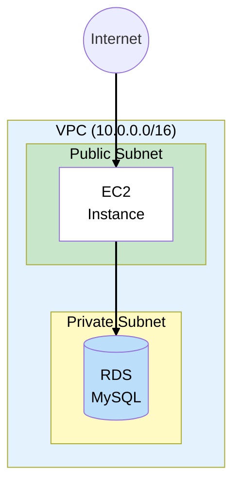

# AWS Architecture Learning Scenarios - Creation Guidelines

## Purpose

Create realistic, evolving business scenarios that teach AWS Solutions Architect concepts through architecture design exercises. Each scenario should reinforce exam concepts through practical decisions and understanding trade-offs.

> **Note:** These scenarios focus on **understanding architecture concepts** - following along with diagrams, reasoning through decisions, and learning the WHY. Actually deploying to AWS is optional and may incur costs.

---

## Core Principles

### 1. Start Simple, Evolve Naturally

```
Day 1 MVP → Growth Pains → Reliability Needs → Scale Demands → Global Reach → Modernization
```

- Begin with the **absolute simplest architecture** that works
- Let complexity emerge from realistic business pressures
- Each evolution should feel like a natural response to a problem

### 2. Focus on the WHY

Every architectural decision should answer:
- **Why this service?** (vs alternatives)
- **Why now?** (business trigger)
- **What problem does it solve?**
- **What trade-offs are we making?**

### 3. Map to SAA Exam Domains

Ensure scenarios cover these exam domains:
1. Design Secure Architectures
2. Design Resilient Architectures
3. Design High-Performing Architectures
4. Design Cost-Optimized Architectures

---

## Scenario Structure

### Folder Structure

```
aws-architecting/
├── SCENARIO-GUIDELINES.md          # This file
├── mermaid-style-guide.md          # Diagram styling reference
└── {scenario-name}/
    ├── docs/
    │   ├── 00-scenario-overview.md
    │   └── phases/
    │       ├── phase-1-*.md
    │       ├── phase-2-*.md
    │       └── ...
    └── diagrams/                    # Optional: generated images
```

### Phase Document Template

Each phase document should include:

```markdown
# Phase N: [Title]

## The Story So Far
[Quick recap of current state]

## Business Trigger
[What happened that requires this change?]
- Customer complaints?
- Outage?
- Growth metrics?
- New feature request?
- Cost concerns?

## Architecture Decision
[What are we building and WHY]

## Key Concepts for SAA Exam
[Exam-relevant knowledge with depth]

### Concept 1
- What it is
- Why it matters
- Common exam scenarios
- Key numbers to remember

## Architecture Diagram
[Mermaid diagram following style guide]

## (Optional) Hands-on Lab
[Console/CLI walkthrough - include cost warnings if applicable]

## What Could Go Wrong?
[Sets up the next phase's trigger]

## Exam Tips
[Quick-reference bullets]
```

---

## Evolution Pattern

### Typical 6-Phase Journey

| Phase | Focus | Key Services | Exam Concepts |
|-------|-------|--------------|---------------|
| 1. MVP Launch | Get online fast | VPC, EC2, Security Groups | Networking basics, compute |
| 2. Database Separation | Data durability | RDS, DB Subnet Groups | Managed services, backups |
| 3. High Availability | Survive failures | Multi-AZ RDS, multiple AZs | HA vs FT, SLAs |
| 4. Auto Scaling | Handle load | ALB, ASG, Launch Templates | Horizontal scaling, health checks |
| 5. Going Global | Performance | CloudFront, Route 53, S3 | CDN, DNS, caching |
| 6. Modernization | Optimize | Lambda, ElastiCache, SQS | Serverless, decoupling |

### Business Triggers Library

Use these realistic triggers to drive evolution:

**Phase 1 → 2** (Database Separation)
- "Database corrupted, no backup!"
- "EC2 instance crashed, lost everything"
- "Need to update app but scared to touch the server"

**Phase 2 → 3** (High Availability)
- "AZ outage took us offline for 4 hours"
- "Customers complaining about downtime"
- "Investor asking about our SLA"

**Phase 3 → 4** (Auto Scaling)
- "Black Friday traffic crashed the site"
- "Paying for idle capacity at night"
- "Manual scaling takes too long"

**Phase 4 → 5** (Global)
- "International customers complaining about slow loads"
- "Image-heavy pages taking 5+ seconds"
- "Expanding to new markets"

**Phase 5 → 6** (Modernization)
- "Monthly AWS bill too high"
- "Want real-time features without managing servers"
- "Need async processing for large uploads"

---

## Scenario Ideas

### E-Commerce (TechBooks ✓)
Online bookstore selling technical books
- Good for: VPC, RDS, ALB, ASG, CloudFront

### SaaS Platform (Potential)
Multi-tenant B2B application
- Good for: Cognito, multi-account, tenant isolation

### Media Processing (Potential)
Video/image processing pipeline
- Good for: S3, Lambda, Step Functions, SQS, MediaConvert

### IoT Dashboard (Potential)
Device telemetry and monitoring
- Good for: IoT Core, Kinesis, DynamoDB, TimeStream

### Healthcare App (Potential)
HIPAA-compliant patient portal
- Good for: Security focus, encryption, compliance, VPC endpoints

### Startup to Enterprise (Potential)
Growing company's internal tools
- Good for: Organizations, Control Tower, multi-account

---

## Diagram Guidelines

See `mermaid-style-guide.md` for detailed styling rules.

### Quick Reference



### Key Rules
1. Use `<br>` for line breaks (never `\n`)
2. Always add `color:#000` for text visibility
3. Add `linkStyle default stroke:#000,stroke-width:2px` for black arrows
4. Use consistent color palette from style guide

---

## Writing Tips

### For Exam Relevance
- Include specific numbers (ports, limits, timeouts)
- Compare similar services (ALB vs NLB, Multi-AZ vs Read Replicas)
- Highlight "gotchas" and common misconceptions
- Add "Exam Tip" callouts for key facts

### For Learning
- Explain concepts before using them
- Use analogies for complex topics
- Show the problem before the solution
- Include "What Could Go Wrong" to build intuition

### For Engagement
- Give the scenario personality (founder's name, company culture)
- Use realistic metrics and timelines
- Include tough decisions with trade-offs
- End phases with cliffhangers

---

## Checklist for New Scenario

- [ ] Unique business domain (not covered by existing scenarios)
- [ ] Clear learning objectives mapped to SAA domains
- [ ] 6-phase evolution planned
- [ ] Business triggers identified for each transition
- [ ] Key services and concepts listed per phase
- [ ] First phase MVP is genuinely simple
- [ ] Final phase includes modern/serverless concepts
- [ ] Diagrams follow style guide
- [ ] Exam tips included throughout
