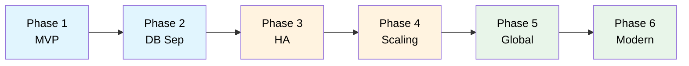
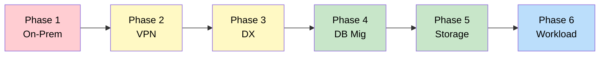
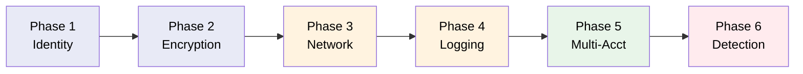
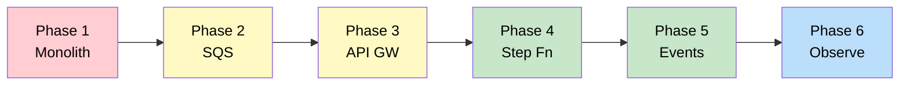
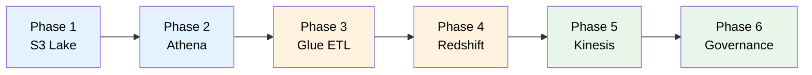

# AWS Architecture Learning Scenarios

A collection of hands-on learning scenarios for AWS Solutions Architect certification preparation.

## Available Scenarios

### [TechBooks: Scale or Fail](scenarios/techbooks/00-overview.md)

Learn AWS architecture through the journey of an online bookstore that evolves from a simple MVP to
a modern, globally-distributed application.

**Covers**: VPC, EC2, RDS, Multi-AZ, Auto Scaling, ALB, CloudFront, Route 53, Lambda, SQS,
ElastiCache

---

### [ShipFast Logistics: Migrate or Die](scenarios/shipfast/00-overview.md)

Learn AWS migration and hybrid architecture through the journey of a logistics company migrating
from an on-premises datacenter to AWS.

**Covers**: Site-to-Site VPN, Direct Connect, DMS, SCT, Storage Gateway, FSx, DataSync, MGN, Snow
Family

---

### [MedVault: Secure by Design](scenarios/medvault/00-overview.md)

Learn AWS security and compliance through the journey of a healthcare startup building a
HIPAA-compliant patient records platform.

**Covers**: IAM, KMS, Secrets Manager, VPC Endpoints, WAF, Shield, CloudTrail, Config,
Organizations, SCPs, GuardDuty, Security Hub, Macie

---

### [EventPro: Tickets Without Crashes](scenarios/eventpro/00-overview.md)

Learn event-driven architecture through the journey of a ticket sales platform that evolves from a
crashing monolith to handling 100K+ concurrent users during flash sales.

**Covers**: SQS, DynamoDB, API Gateway, CloudFront, Step Functions, SNS, EventBridge, X-Ray,
CloudWatch, Lambda

---

### [DataLake Corp: Data at Scale](scenarios/datalake/00-overview.md)

Learn AWS analytics and data services through the journey of a retail analytics company building a
modern cloud data platform from Excel reports to real-time fraud detection.

**Covers**: S3 Data Lake, Athena, Glue, Redshift, Redshift Spectrum, AQUA, Kinesis, Lake Formation,
ElastiCache, Step Functions

