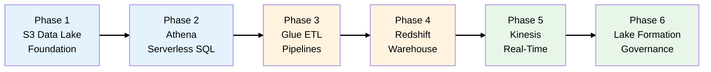

# Data Lake Journey: The DataLake Corp Story

## The Business

You're the lead data engineer at **DataLake Corp**, a retail analytics company that helps e-commerce
businesses understand their customers through data. The company started as a small consulting firm
doing Excel reports, but rapid growth demands a modern cloud data platform.

## Learning Objectives

This evolving scenario teaches you AWS analytics and data services through realistic business
decisions:

- [**Phase 1**: Data Lake Foundation](scenarios/datalake/phases/phase-1-data-lake-foundation.md) (S3
  Data Lake, Storage Classes, Lifecycle)
- [**Phase 2**: Query Without Servers](scenarios/datalake/phases/phase-2-query-without-servers.md)
  (Athena, Glue Catalog)
- [**Phase 3**: ETL Pipelines](scenarios/datalake/phases/phase-3-etl-pipelines.md) (AWS Glue, Step
  Functions)
- [**Phase 4**: Enterprise Warehouse](scenarios/datalake/phases/phase-4-enterprise-warehouse.md)
  (Redshift, Redshift Spectrum, AQUA)
- [**Phase 5**: Real-Time Analytics](scenarios/datalake/phases/phase-5-real-time-analytics.md)
  (Kinesis Streams, Firehose, Analytics)
- [**Phase 6**: Data Governance](scenarios/datalake/phases/phase-6-data-governance.md) (Lake
  Formation, Fine-Grained Access)

## Architecture Evolution Map

## SAA-C03 Exam Coverage

This scenario covers critical analytics topics that appear frequently on the exam:

| Service                        | Exam Weight | Phase |
| ------------------------------ | ----------- | ----- |
| Amazon S3 (Data Lake patterns) | High        | 1-6   |
| Amazon Athena                  | High        | 2, 4  |
| AWS Glue (ETL, Catalog)        | High        | 2, 3  |
| Amazon Redshift / Spectrum     | High        | 4     |
| Amazon Kinesis Family          | High        | 5     |
| AWS Lake Formation             | Medium      | 6     |
| Amazon ElastiCache             | Medium      | 4     |

## How to Use This Guide

Each phase includes:

1. **Business Context** - What's happening at DataLake Corp
2. **Architecture Decision** - What we're building and WHY
3. **Key Concepts** - SAA exam-relevant knowledge
4. **Diagrams** - Visual representation of the architecture
5. **Exam Tips** - Key points for the SAA certification
