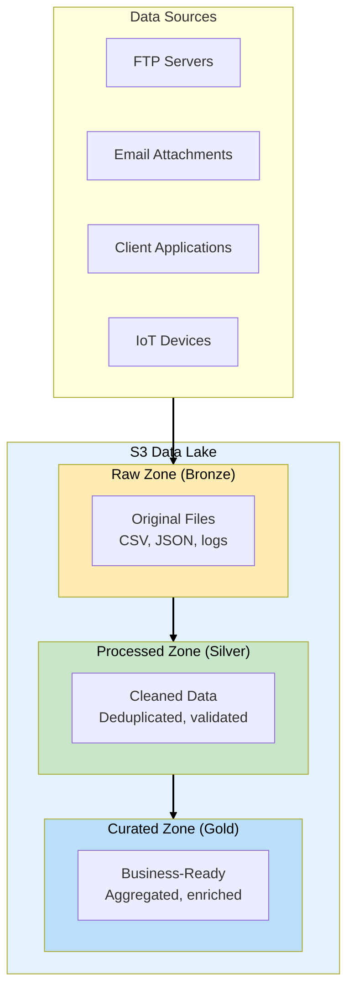
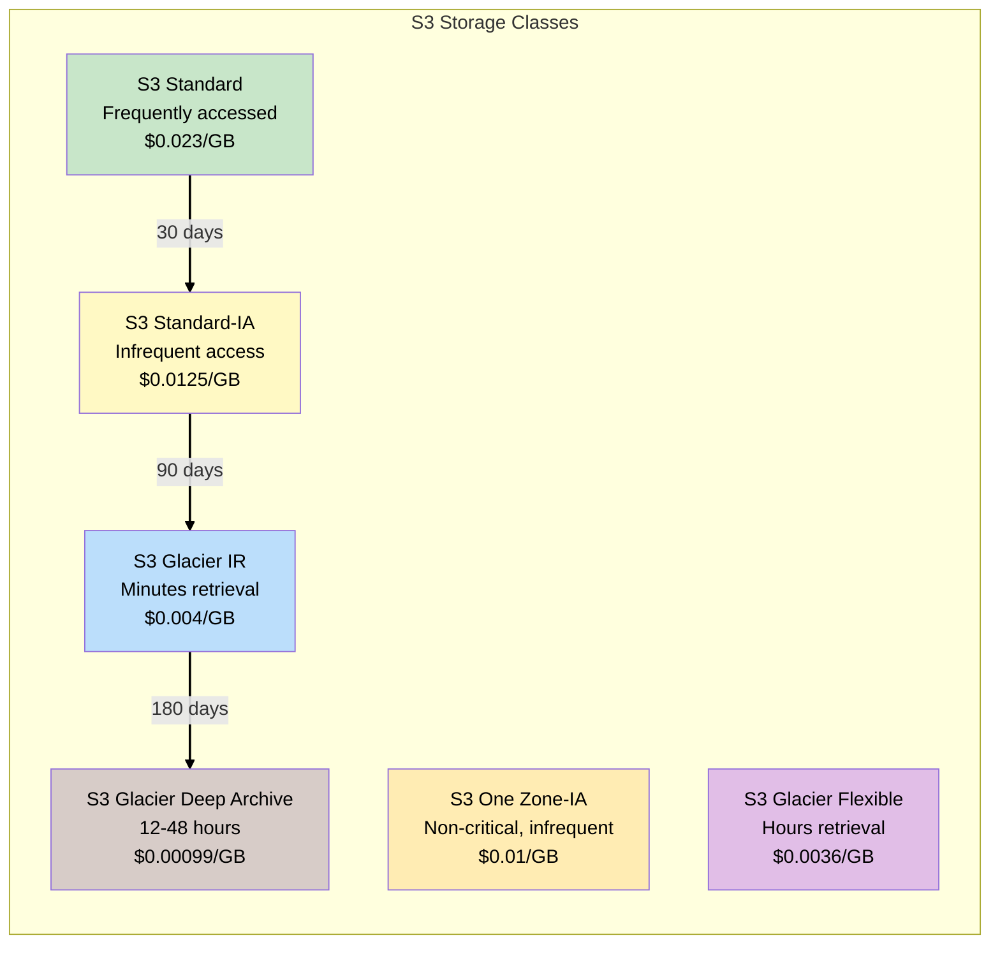
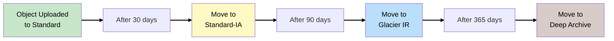
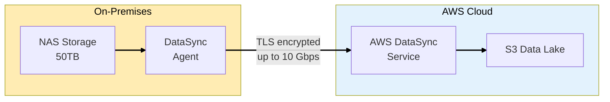
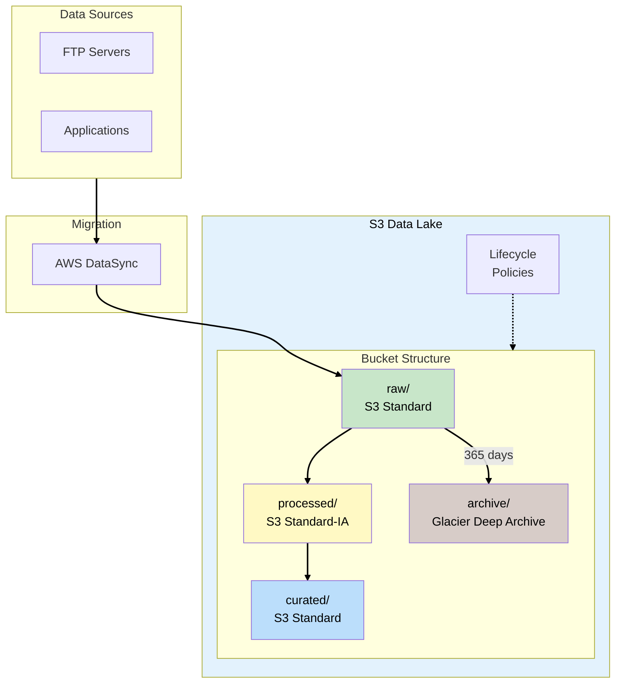

# Phase 1: Data Lake Foundation

## Business Context

**Situation:** DataLake Corp has been collecting client data for 3 years. The data is scattered
across FTP servers, email attachments, shared drives, and analyst laptops. Last month, you lost a
major client because no one could find their historical purchase data for a critical presentation.

**The CEO's mandate:** "We need a single source of truth. Find every piece of data we have and put
it somewhere we can actually use it."

**Requirements:**

- Centralize all client data (CSV, JSON, Parquet files)
- Support petabyte-scale storage
- Cost-effective for rarely accessed historical data
- Secure and compliant with data regulations

---

## Step 1: The Data Lake Architecture

### What is a Data Lake?

A **Data Lake** is a centralized repository that stores all your structured and unstructured data at
any scale. Unlike a data warehouse (which requires schema upfront), a data lake stores raw data
"as-is" and applies schema when reading.



### WHY S3 for Data Lakes?

| Feature         | S3 Advantage                       | Exam Relevance                              |
| --------------- | ---------------------------------- | ------------------------------------------- |
| **Scalability** | Unlimited storage, no provisioning | Common distractor: "provision more storage" |
| **Durability**  | 99.999999999% (11 9s)              | Asked frequently in resilience questions    |
| **Cost**        | Pay only for what you use          | Cost optimization questions                 |
| **Integration** | Native with Athena, Glue, Redshift | Analytics architecture questions            |
| **Security**    | Encryption, IAM, bucket policies   | Security questions                          |

> **SAA Exam Tip:** When you see "data lake" in a question, think S3 first. Other services (Athena,
> Glue, Redshift Spectrum) query the data lake but don't replace S3 as storage.

---

## Step 2: S3 Storage Classes

### The Storage Class Decision

DataLake Corp has 50TB of data:

- 5TB accessed daily (current client reports)
- 15TB accessed monthly (historical analysis)
- 30TB accessed yearly (compliance archives)



### Storage Class Comparison

| Class                    | Use Case                         | Min Duration | Retrieval Time | Exam Trigger                                     |
| ------------------------ | -------------------------------- | ------------ | -------------- | ------------------------------------------------ |
| **Standard**             | Frequently accessed              | None         | Immediate      | "real-time", "frequently accessed"               |
| **Standard-IA**          | Infrequent, but immediate access | 30 days      | Immediate      | "infrequently accessed", "immediate when needed" |
| **One Zone-IA**          | Non-critical, reproducible       | 30 days      | Immediate      | "can be recreated", "single AZ acceptable"       |
| **Glacier Instant**      | Archive with ms access           | 90 days      | Milliseconds   | "archive", "immediate access when needed"        |
| **Glacier Flexible**     | Archive, hours OK                | 90 days      | 1-12 hours     | "archive", "hours acceptable"                    |
| **Glacier Deep Archive** | Long-term compliance             | 180 days     | 12-48 hours    | "7 years retention", "compliance archive"        |

> **SAA Exam Tip:** Questions about "cost-effective storage for infrequently accessed data that can
> be recreated" = **One Zone-IA**. It's 20% cheaper than Standard-IA but single-AZ only.

---

## Step 3: S3 Lifecycle Policies

### Automating Storage Transitions

Instead of manually moving objects between storage classes, we configure lifecycle policies:



### Lifecycle Policy Configuration

```json
{
  "Rules": [
    {
      "ID": "ArchiveOldData",
      "Status": "Enabled",
      "Filter": { "Prefix": "raw/" },
      "Transitions": [
        { "Days": 30, "StorageClass": "STANDARD_IA" },
        { "Days": 90, "StorageClass": "GLACIER_IR" },
        { "Days": 365, "StorageClass": "DEEP_ARCHIVE" }
      ],
      "Expiration": { "Days": 2555 }
    }
  ]
}
```

> **SAA Exam Tip:** Lifecycle policies can transition AND expire objects. "Automatically delete logs
> after 90 days" = lifecycle expiration rule.

---

## Step 4: Data Migration with DataSync

### Moving 50TB to AWS

DataLake Corp needs to move 50TB from on-premises to S3. Options:

| Method                       | Speed             | Use Case                    | Exam Trigger                       |
| ---------------------------- | ----------------- | --------------------------- | ---------------------------------- |
| **AWS DataSync**             | Up to 10 Gbps     | Online, recurring transfers | "migrate", "ongoing sync"          |
| **S3 Transfer Acceleration** | Variable          | Global uploads              | "global users", "upload speed"     |
| **Snow Family**              | Physical shipping | >10TB, limited bandwidth    | "petabytes", "no network", "weeks" |
| **Direct Connect**           | Dedicated line    | Consistent hybrid           | "dedicated", "low latency"         |



### DataSync Features

- **Automatic validation** - Verifies data integrity
- **Bandwidth throttling** - Won't saturate your network
- **Incremental sync** - Only transfers changed files
- **Scheduling** - Automate recurring transfers

> **SAA Exam Tip:** "DataSync file skipped" causes: (1) **file was locked**, (2) **file was modified
> during transfer**. These appear in troubleshooting questions.

---

## Step 5: S3 Bucket Design

### DataLake Corp Bucket Structure

```
datalake-corp-production/
├── raw/                          # Bronze layer
│   ├── sales/
│   │   ├── year=2024/
│   │   │   ├── month=01/
│   │   │   │   └── day=15/
│   │   │   │       └── transactions.json
│   ├── customers/
│   └── products/
├── processed/                    # Silver layer
│   ├── sales_cleaned/
│   └── customers_deduplicated/
├── curated/                      # Gold layer
│   ├── daily_revenue/
│   └── customer_360/
└── archive/                      # Cold storage
    └── compliance/
```

### WHY This Structure?

| Design Decision           | Benefit                             | Exam Relevance             |
| ------------------------- | ----------------------------------- | -------------------------- |
| **Partitioning by date**  | Athena scans less data = lower cost | Cost optimization          |
| **Separate zones**        | Clear data lineage                  | Data governance            |
| **Hive-style partitions** | `year=2024/month=01`                | Glue/Athena auto-discovery |

> **SAA Exam Tip:** Athena charges per TB scanned. Partitioning by date/region can reduce costs by
> 90%+.

---

## Step 6: S3 Security for Data Lakes

### Bucket Policy for Cross-Account Access

DataLake Corp needs to share data with client AWS accounts securely:

```json
{
  "Version": "2012-10-17",
  "Statement": [
    {
      "Sid": "AllowClientAccess",
      "Effect": "Allow",
      "Principal": { "AWS": "arn:aws:iam::CLIENT_ACCOUNT:root" },
      "Action": ["s3:GetObject", "s3:ListBucket"],
      "Resource": [
        "arn:aws:s3:::datalake-corp-production",
        "arn:aws:s3:::datalake-corp-production/curated/client-123/*"
      ],
      "Condition": {
        "Bool": { "aws:SecureTransport": "true" }
      }
    }
  ]
}
```

### S3 Security Comparison

| Mechanism               | Scope                           | Use Case                            |
| ----------------------- | ------------------------------- | ----------------------------------- |
| **Bucket Policy**       | Bucket-level, resource-based    | Cross-account access, public access |
| **IAM Policy**          | User/role-level, identity-based | Internal users, services            |
| **ACL**                 | Object-level (legacy)           | NOT recommended, use policies       |
| **Block Public Access** | Account/bucket-level            | Prevent accidental exposure         |

> **SAA Exam Tip:** "Cross-account S3 access" = bucket policy. "What the user can do" = IAM policy.
> ACLs are legacy - modern answer is bucket policies.

---

## Phase 1 Architecture Summary



---

## Exam Tips Summary

| Topic                  | Key Point                                                |
| ---------------------- | -------------------------------------------------------- |
| **Data Lake Storage**  | S3 is the foundation; other services query it            |
| **Storage Classes**    | Match access patterns to classes for cost optimization   |
| **One Zone-IA**        | 20% cheaper, for reproducible data                       |
| **Lifecycle Policies** | Automate transitions and expiration                      |
| **DataSync**           | Online migration with validation; file locks cause skips |
| **Partitioning**       | Reduces Athena scan costs                                |
| **Cross-Account**      | Use bucket policies, not ACLs                            |

---

## What's Next?

The data lake is built, but the CEO asks: "Great, we have all the data. Now how do I answer 'What
did Client X spend last quarter?' without waiting 2 days?"

**[Continue to Phase 2: Query Without Servers →](phase-2-query-without-servers.md)**
