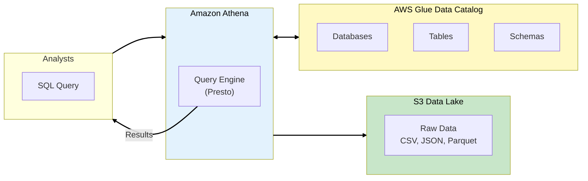
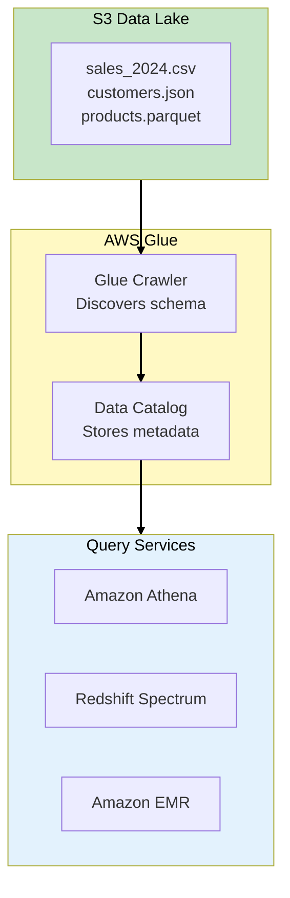
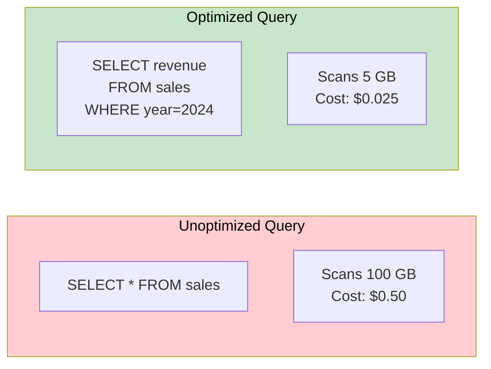
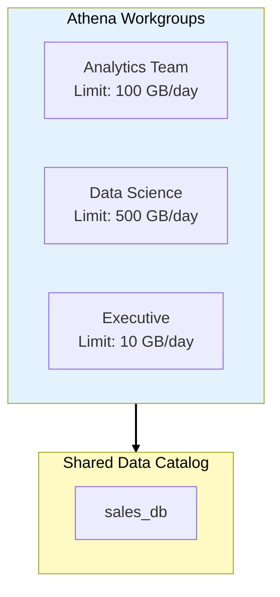
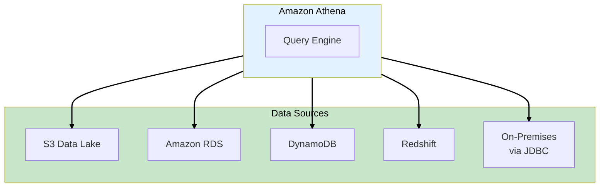
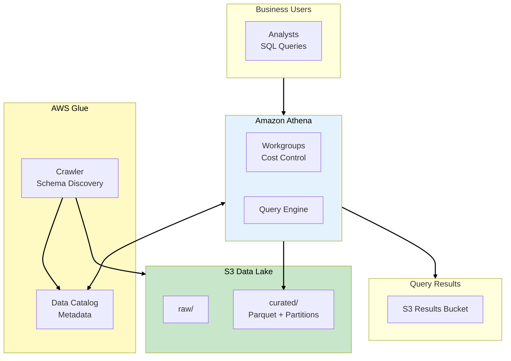

# Phase 2: Query Without Servers

## Business Context

**Situation:** DataLake Corp now has 50TB of client data in S3. The CEO walks in and asks: "How much
did Client X spend last quarter?" The analyst's response: "I'll have the answer in 2 days after I
download and process the CSV files."

**The problem:** Analysts spend more time finding and preparing data than actually analyzing it.

**Requirements:**

- Query data directly in S3 using SQL
- No servers to manage
- Pay only when running queries
- Support ad-hoc analysis by non-technical users

---

## Step 1: Amazon Athena - Serverless SQL

### What is Athena?

**Amazon Athena** is a serverless, interactive query service that lets you analyze data directly in
S3 using standard SQL. There's no infrastructure to set up or manage.



### Athena vs Traditional Data Warehouse

| Aspect             | Athena                      | Traditional DW (e.g., Redshift)  |
| ------------------ | --------------------------- | -------------------------------- |
| **Infrastructure** | Serverless                  | Provisioned clusters             |
| **Pricing**        | $5 per TB scanned           | Hourly instance cost             |
| **Setup Time**     | Minutes                     | Hours/days                       |
| **Best For**       | Ad-hoc queries, exploration | Complex analytics, BI dashboards |
| **Data Location**  | Stays in S3                 | Loaded into warehouse            |

> **SAA Exam Tip:** "Serverless SQL on S3" = Athena. "Data warehouse for complex analytics" =
> Redshift. Both can query S3, but use cases differ.

---

## Step 2: AWS Glue Data Catalog

### The Metadata Layer

Before Athena can query your data, it needs to know the **schema** (column names, data types). The
**AWS Glue Data Catalog** stores this metadata.



### Glue Crawler: Automatic Schema Discovery

A **Glue Crawler** scans your S3 data and automatically:

- Detects file formats (CSV, JSON, Parquet)
- Infers column names and data types
- Discovers partitions (year=2024/month=01)
- Creates/updates tables in the Data Catalog

> **SAA Exam Tip:** "Automatically discover schema" = Glue Crawler. It's the bridge between raw S3
> files and queryable tables.

---

## Step 3: Athena Pricing and Optimization

### Pay Per Query

Athena charges **$5 per TB of data scanned**. This makes optimization critical:



### Cost Optimization Strategies

| Strategy                    | Impact           | How                            |
| --------------------------- | ---------------- | ------------------------------ |
| **Columnar Format**         | 30-90% reduction | Use Parquet/ORC instead of CSV |
| **Partitioning**            | 10-90% reduction | `year=2024/month=01/` folders  |
| **Compression**             | 50-80% reduction | GZIP, Snappy, ZSTD             |
| **SELECT specific columns** | Variable         | Avoid `SELECT *`               |

### Example: Partitioned Table

```sql
CREATE EXTERNAL TABLE sales (
    transaction_id STRING,
    customer_id STRING,
    amount DECIMAL(10,2),
    product_id STRING
)
PARTITIONED BY (year INT, month INT, day INT)
STORED AS PARQUET
LOCATION 's3://datalake-corp/curated/sales/'
```

> **SAA Exam Tip:** "Reduce Athena costs" = (1) Use Parquet/ORC, (2) Partition by date/region, (3)
> Compress data. These appear in cost optimization questions.

---

## Step 4: Athena Workgroups

### Managing Costs and Access

**Athena Workgroups** let you:

- Set data usage limits per team
- Track costs by department
- Enforce query result encryption
- Separate dev/prod environments



> **SAA Exam Tip:** "Control Athena costs per team" = Workgroups with data usage limits.

---

## Step 5: Query Results and Caching

### Where Results Go

Athena stores query results in an S3 bucket you specify:

```
s3://athena-results-datalake-corp/
├── query-results/
│   ├── 2024/01/15/
│   │   ├── query-abc123.csv
│   │   └── query-def456.csv
```

### Query Result Reuse

Athena can reuse cached results for identical queries:

| Setting                   | Behavior                                              |
| ------------------------- | ----------------------------------------------------- |
| **Result Reuse Enabled**  | Skip scan if identical query exists (default: 60 min) |
| **Result Reuse Disabled** | Always scan S3 data                                   |

> **SAA Exam Tip:** "Reduce repeated query costs" = Enable query result reuse in workgroup settings.

---

## Step 6: Athena Federated Query

### Query Beyond S3

Athena can query data sources beyond S3 using **data source connectors**:



### Common Connectors

| Connector           | Use Case                        |
| ------------------- | ------------------------------- |
| **CloudWatch Logs** | Query log data with SQL         |
| **DynamoDB**        | Join NoSQL with data lake       |
| **RDS/Aurora**      | Federate OLTP data              |
| **Redshift**        | Query across warehouse and lake |

> **SAA Exam Tip:** "Query CloudWatch Logs with SQL" = Athena with CloudWatch Logs connector.

---

## Step 7: DataLake Corp Implementation

### Creating the Sales Table

```sql
-- Create database
CREATE DATABASE IF NOT EXISTS datalake_corp;

-- Create partitioned table
CREATE EXTERNAL TABLE datalake_corp.sales (
    transaction_id STRING,
    customer_id STRING,
    customer_name STRING,
    amount DECIMAL(10,2),
    product_id STRING,
    product_name STRING,
    timestamp TIMESTAMP
)
PARTITIONED BY (year INT, month INT)
STORED AS PARQUET
LOCATION 's3://datalake-corp-production/curated/sales/'
TBLPROPERTIES ('parquet.compression'='SNAPPY');

-- Load partitions
MSCK REPAIR TABLE datalake_corp.sales;
```

### Answering the CEO's Question

```sql
-- "How much did Client X spend last quarter?"
SELECT
    customer_name,
    SUM(amount) as total_spend,
    COUNT(*) as transaction_count
FROM datalake_corp.sales
WHERE customer_id = 'client-x-123'
  AND year = 2024
  AND month BETWEEN 10 AND 12
GROUP BY customer_name;
```

**Result:** Query runs in seconds, costs ~$0.01, no infrastructure required.

---

## Phase 2 Architecture Summary



---

## Exam Tips Summary

| Topic                 | Key Point                                                 |
| --------------------- | --------------------------------------------------------- |
| **Athena**            | Serverless SQL on S3, $5/TB scanned                       |
| **Glue Data Catalog** | Metadata store for schemas, shared by Athena/Redshift/EMR |
| **Glue Crawler**      | Auto-discovers schemas from S3 files                      |
| **Cost Optimization** | Parquet + Partitions + Compression = 90%+ savings         |
| **Workgroups**        | Control costs and access per team                         |
| **Federated Query**   | Query RDS, DynamoDB, CloudWatch from Athena               |
| **Result Reuse**      | Cache identical queries to avoid re-scanning              |

---

## What's Next?

Analysts can now query data instantly. But there's a problem: the raw data has quality issues -
missing fields, wrong formats, duplicates. Analysts spend 60% of their time cleaning data.

**[Continue to Phase 3: ETL Pipelines →](phase-3-etl-pipelines.md)**
