# Phase 3: ETL Pipelines

## Business Context

**Situation:** Analysts are querying the data lake with Athena, but they're frustrated. The raw data
has problems:

- Missing customer IDs in 15% of records
- Duplicate transactions from retry logic
- Date formats vary (MM/DD/YYYY vs YYYY-MM-DD)
- JSON nested structures that Athena can't easily query

**The data engineer's complaint:** "I spend 60% of my time writing Python scripts to clean data.
There has to be a better way."

**Requirements:**

- Transform raw data into clean, queryable formats
- Handle batch processing (daily updates)
- Automate the pipeline (no manual scripts)
- Scale with data volume

---

## Step 1: ETL vs ELT

### Understanding the Approaches

| Approach | Process                    | When to Use                                       |
| -------- | -------------------------- | ------------------------------------------------- |
| **ETL**  | Extract → Transform → Load | Transform before loading (traditional DW)         |
| **ELT**  | Extract → Load → Transform | Load first, transform in place (modern data lake) |


> **SAA Exam Tip:** Modern cloud architectures favor **ELT** - load raw data to S3, then transform
> with Glue/Athena. This preserves the original data and allows re-processing.

---

## Step 2: AWS Glue - Serverless ETL

### What is AWS Glue?

**AWS Glue** is a fully managed ETL service that makes it easy to prepare and transform data:


### Glue Components

| Component         | Purpose                          | Exam Relevance                  |
| ----------------- | -------------------------------- | ------------------------------- |
| **Data Catalog**  | Metadata store (tables, schemas) | Shared by Athena, Redshift, EMR |
| **Crawlers**      | Auto-discover schemas            | "Automatically detect schema"   |
| **ETL Jobs**      | Transform data (Spark-based)     | "Transform large datasets"      |
| **Glue Studio**   | Visual ETL builder               | "No-code ETL"                   |
| **DataBrew**      | Visual data preparation          | "Data cleaning without code"    |
| **Job Bookmarks** | Track processed data             | "Incremental processing"        |

---

## Step 3: Glue ETL Jobs

### How Glue Jobs Work

Glue ETL jobs run on **Apache Spark** under the hood. You can write in Python (PySpark) or Scala.

```python
# Example Glue ETL Job
import sys
from awsglue.transforms import *
from awsglue.utils import getResolvedOptions
from pyspark.context import SparkContext
from awsglue.context import GlueContext
from awsglue.job import Job

# Initialize
glueContext = GlueContext(SparkContext.getOrCreate())
spark = glueContext.spark_session

# Read from Data Catalog
raw_data = glueContext.create_dynamic_frame.from_catalog(
    database="datalake_corp",
    table_name="raw_sales"
)

# Transform: Remove duplicates, fix dates
cleaned_data = raw_data.toDF() \
    .dropDuplicates(["transaction_id"]) \
    .withColumn("transaction_date",
                to_date(col("date_string"), "yyyy-MM-dd"))

# Write to S3 as Parquet
cleaned_frame = DynamicFrame.fromDF(cleaned_data, glueContext, "cleaned")
glueContext.write_dynamic_frame.from_options(
    frame=cleaned_frame,
    connection_type="s3",
    connection_options={"path": "s3://datalake-corp/processed/sales/"},
    format="parquet"
)
```

### Glue DPUs (Data Processing Units)

Glue jobs are priced by **DPU-hours**:

| DPU Configuration    | Use Case               | Cost           |
| -------------------- | ---------------------- | -------------- |
| **2 DPUs (minimum)** | Small datasets         | $0.44/DPU-hour |
| **10 DPUs**          | Medium workloads       | Standard       |
| **100+ DPUs**        | Large-scale processing | Auto-scales    |

> **SAA Exam Tip:** "Cost-effective ETL for large datasets" = Glue with appropriate DPU sizing.
> Over-provisioning DPUs wastes money.

---

## Step 4: Glue vs EMR

### When to Use Each

| Criteria         | AWS Glue                      | Amazon EMR               |
| ---------------- | ----------------------------- | ------------------------ |
| **Management**   | Fully managed                 | You manage cluster       |
| **Pricing**      | Per DPU-hour                  | Per instance-hour        |
| **Best For**     | ETL, data catalog integration | Complex ML, custom Spark |
| **Scaling**      | Automatic                     | Manual or auto-scaling   |
| **Startup Time** | ~1 minute                     | ~10-15 minutes           |


> **SAA Exam Tip:** "ETL with Data Catalog" = Glue. "Custom Spark/Hadoop cluster" = EMR. "Serverless
> ETL" = Glue.

---

## Step 5: Job Bookmarks - Incremental Processing

### The Problem

Without bookmarks, a Glue job would reprocess ALL data every run, wasting time and money.

### The Solution

**Job Bookmarks** track what data has been processed:


### Bookmark Configuration

```python
# Enable job bookmark
job.init(args['JOB_NAME'], args)

# At the end of the job
job.commit()  # Updates the bookmark
```

> **SAA Exam Tip:** "Process only new data" = Glue Job Bookmarks. Critical for cost-effective
> incremental ETL.

---

## Step 6: Orchestrating with Step Functions

### Beyond Single Jobs

Complex ETL pipelines have multiple steps that depend on each other:


### Step Functions for ETL

```json
{
  "StartAt": "RunCrawler",
  "States": {
    "RunCrawler": {
      "Type": "Task",
      "Resource": "arn:aws:states:::glue:startCrawler.sync",
      "Parameters": { "Name": "sales-crawler" },
      "Next": "RunETLJob"
    },
    "RunETLJob": {
      "Type": "Task",
      "Resource": "arn:aws:states:::glue:startJobRun.sync",
      "Parameters": { "JobName": "sales-transform" },
      "Next": "NotifySuccess",
      "Catch": [{ "ErrorEquals": ["States.ALL"], "Next": "NotifyFailure" }]
    },
    "NotifySuccess": {
      "Type": "Task",
      "Resource": "arn:aws:states:::sns:publish",
      "Parameters": { "Message": "ETL completed" },
      "End": true
    },
    "NotifyFailure": {
      "Type": "Task",
      "Resource": "arn:aws:states:::sns:publish",
      "Parameters": { "Message": "ETL failed" },
      "End": true
    }
  }
}
```

> **SAA Exam Tip:** "Orchestrate Glue jobs with error handling" = Step Functions. "Simple
> scheduling" = EventBridge.

---

## Step 7: DataLake Corp Pipeline

### The Complete ETL Flow


### Transformation Rules Applied

| Issue                  | Transformation           | Impact                |
| ---------------------- | ------------------------ | --------------------- |
| Missing customer_id    | Fill with "UNKNOWN"      | 15% records fixed     |
| Duplicate transactions | Dedupe by transaction_id | 3% duplicates removed |
| Date format variations | Standardize to ISO 8601  | 100% consistent       |
| Nested JSON            | Flatten to columns       | Queryable in Athena   |

---

## Phase 3 Architecture Summary

```mermaid
flowchart TB
    subgraph Schedule["Trigger"]
        EB["EventBridge<br>Daily at 2 AM"]
    end

    subgraph Orchestration["Step Functions"]
        SF["ETL State Machine"]
    end

    subgraph Glue["AWS Glue"]
        Crawler["Crawler"]
        Job["ETL Job"]
        Catalog["Data Catalog"]
    end

    subgraph S3["S3 Data Lake"]
        Raw["raw/<br>CSV, JSON"]
        Processed["processed/<br>Cleaned"]
        Curated["curated/<br>Parquet"]
    end

    EB --> SF
    SF --> Crawler
    Crawler --> Catalog
    SF --> Job
    Job --> Raw
    Job --> Processed
    Processed --> Curated

    style Glue fill:#fff9c4,color:#000
    style S3 fill:#c8e6c9,color:#000
    linkStyle default stroke:#000,stroke-width:2px
```



---

## Exam Tips Summary

| Topic              | Key Point                                         |
| ------------------ | ------------------------------------------------- |
| **ELT vs ETL**     | Modern = ELT (load to S3, transform with Glue)    |
| **Glue ETL Jobs**  | Serverless Spark-based transformation             |
| **Glue vs EMR**    | Glue = managed ETL, EMR = custom Spark/Hadoop     |
| **Job Bookmarks**  | Track processed data for incremental ETL          |
| **DPUs**           | Glue pricing unit; right-size for cost efficiency |
| **Step Functions** | Orchestrate multi-step ETL with error handling    |
| **Data Quality**   | Glue Data Quality for validation rules            |

---

## What's Next?

The ETL pipeline is running smoothly. But complex BI queries on Athena now take 30+ minutes. The
executive dashboard needs faster performance, and the data science team wants to run machine
learning models on historical data.

**[Continue to Phase 4: Enterprise Warehouse →](phase-4-enterprise-warehouse.md)**
