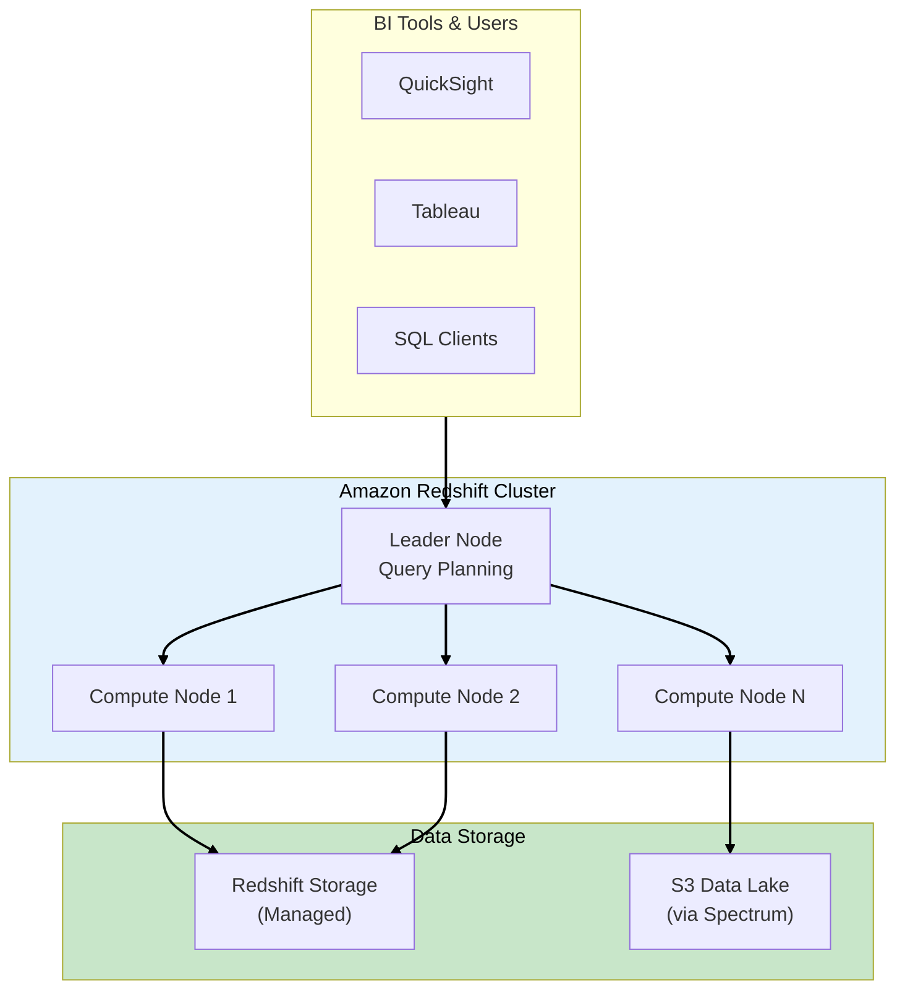
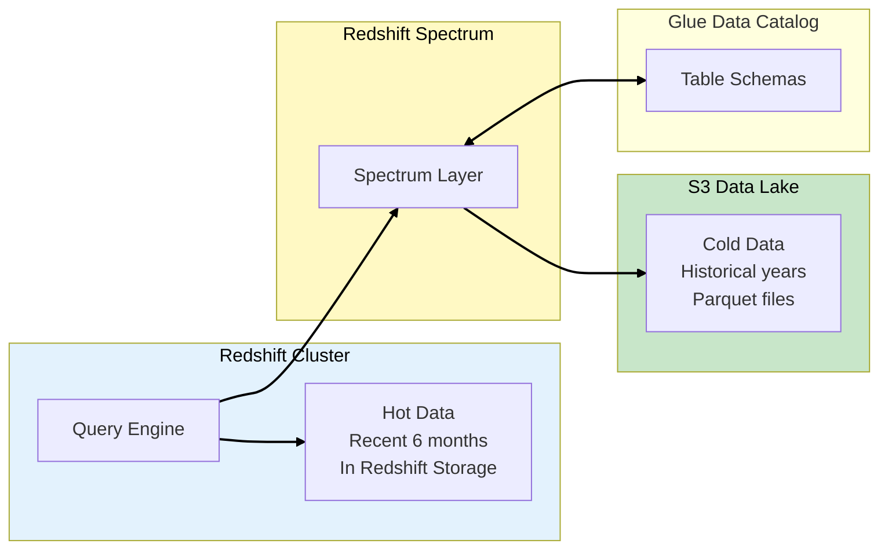
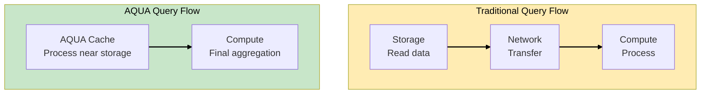
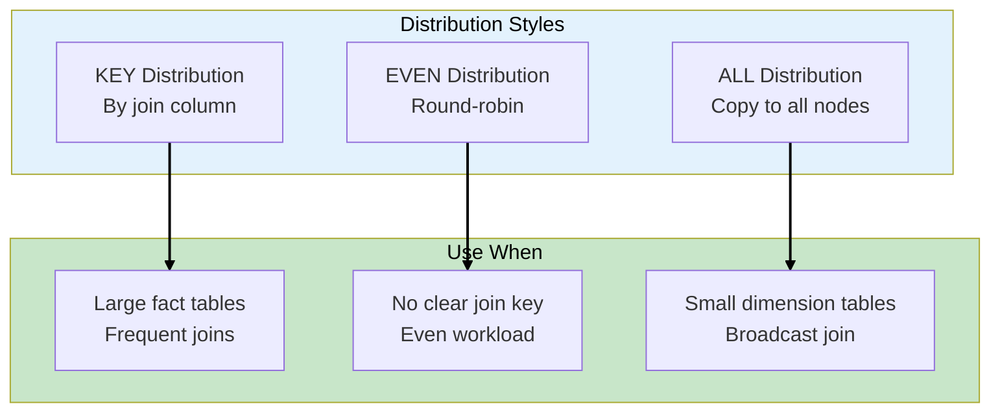
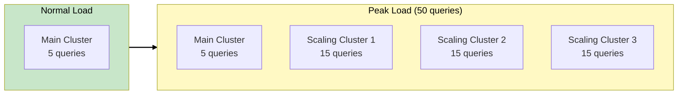
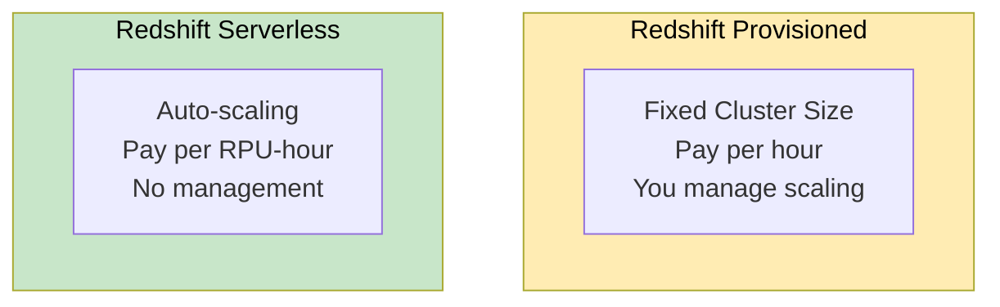
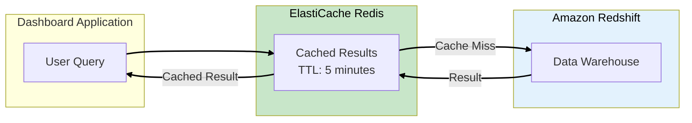
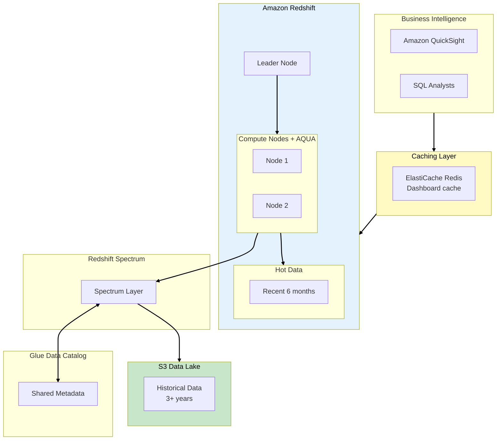

# Phase 4: Enterprise Data Warehouse

## Business Context

**Situation:** DataLake Corp's business is booming. The executive team needs real-time dashboards
showing revenue trends, customer segments, and product performance. The problem:

- Athena queries for complex aggregations take 30+ minutes
- Multiple analysts running concurrent queries cause slowdowns
- The data science team wants to run ML models on 3 years of historical data

**The CFO's demand:** "I need my revenue dashboard to load in under 5 seconds, not 5 minutes."

**Requirements:**

- Sub-second query performance for dashboards
- Support 50+ concurrent BI users
- Query both warehouse data AND S3 data lake
- Cost-effective for predictable workloads

---

## Step 1: Amazon Redshift Overview

### What is Redshift?

**Amazon Redshift** is a fully managed, petabyte-scale data warehouse optimized for analytics
workloads.



### Redshift vs Athena

| Aspect               | Redshift                             | Athena                      |
| -------------------- | ------------------------------------ | --------------------------- |
| **Infrastructure**   | Provisioned/Serverless               | Serverless                  |
| **Pricing**          | Hourly (provisioned) or per-query    | Per TB scanned              |
| **Best For**         | Complex analytics, BI dashboards     | Ad-hoc queries, exploration |
| **Concurrent Users** | High (with concurrency scaling)      | Limited                     |
| **Data Location**    | Loaded into Redshift + S3 (Spectrum) | S3 only                     |
| **Performance**      | Optimized columnar storage           | Depends on data format      |

> **SAA Exam Tip:** "Complex BI queries with many concurrent users" = Redshift. "Ad-hoc queries on
> S3" = Athena. Both can work together!

---

## Step 2: Redshift Spectrum - Query S3 from Redshift

### The Best of Both Worlds

**Redshift Spectrum** lets you query data in S3 directly from Redshift, without loading it:



### Spectrum Use Cases

| Pattern                 | Description                               | Benefit                     |
| ----------------------- | ----------------------------------------- | --------------------------- |
| **Hot/Cold Split**      | Recent data in Redshift, historical in S3 | Lower storage costs         |
| **Data Lake Query**     | Query S3 without ETL                      | Faster time-to-insight      |
| **Federated Analytics** | Join Redshift tables with S3 data         | Single query across sources |

### Creating a Spectrum External Table

```sql
-- Create external schema linked to Glue Catalog
CREATE EXTERNAL SCHEMA spectrum_schema
FROM DATA CATALOG
DATABASE 'datalake_corp'
IAM_ROLE 'arn:aws:iam::123456789012:role/RedshiftSpectrumRole'
REGION 'us-east-1';

-- Query S3 data alongside Redshift data
SELECT
    r.customer_id,
    r.recent_revenue,
    s.historical_revenue
FROM redshift_sales r
JOIN spectrum_schema.historical_sales s
  ON r.customer_id = s.customer_id;
```

> **SAA Exam Tip:** "Query S3 data from Redshift without loading" = **Redshift Spectrum**. It uses
> the same Glue Data Catalog as Athena.

---

## Step 3: AQUA - Advanced Query Accelerator

### Hardware-Accelerated Queries

**AQUA (Advanced Query Accelerator)** is a distributed hardware-accelerated cache that speeds up
Redshift queries up to 10x:



### How AQUA Works

| Aspect            | Without AQUA              | With AQUA            |
| ----------------- | ------------------------- | -------------------- |
| **Data Movement** | All data moves to compute | Filtered data only   |
| **Processing**    | CPU-based                 | Hardware accelerated |
| **Bottleneck**    | Network bandwidth         | Reduced by 10x       |
| **Query Speed**   | Baseline                  | Up to 10x faster     |

> **SAA Exam Tip:** "Redshift query performance bottleneck due to network/CPU" = **AQUA**. It's
> automatic on RA3 node types.

---

## Step 4: Redshift Distribution and Sort Keys

### Optimizing Data Layout

How data is distributed across nodes affects query performance:



### Distribution Styles

| Style    | How It Works                    | Use Case                          |
| -------- | ------------------------------- | --------------------------------- |
| **KEY**  | Rows with same key on same node | Large tables joined on that key   |
| **EVEN** | Round-robin across nodes        | Default, no specific pattern      |
| **ALL**  | Full copy on every node         | Small dimension tables (<2M rows) |
| **AUTO** | Redshift decides                | Let Redshift optimize             |

### Sort Keys

**Sort Keys** determine physical order of data on disk:

```sql
-- Create table with distribution and sort keys
CREATE TABLE sales (
    sale_id BIGINT,
    customer_id INT,
    sale_date DATE,
    amount DECIMAL(10,2)
)
DISTKEY(customer_id)
SORTKEY(sale_date);
```

> **SAA Exam Tip:** "Optimize Redshift join performance" = Use KEY distribution on join columns.
> "Optimize range queries" = Sort by date/time columns.

---

## Step 5: Concurrency Scaling

### Handling Query Spikes

When many users query simultaneously, **Concurrency Scaling** automatically adds cluster capacity:



### Concurrency Scaling Features

| Feature          | Description                                            |
| ---------------- | ------------------------------------------------------ |
| **Automatic**    | Scales up in seconds when queues build                 |
| **Free Credits** | 1 hour of scaling per 24 hours (per main cluster hour) |
| **Cost**         | Only pay for additional compute time                   |
| **No Downtime**  | Seamless for users                                     |

> **SAA Exam Tip:** "Handle variable query load on Redshift" = Enable Concurrency Scaling.
> "Predictable high load" = Resize cluster.

---

## Step 6: Redshift Serverless

### No Cluster Management

**Redshift Serverless** provides the power of Redshift without managing clusters:



### Provisioned vs Serverless

| Aspect         | Provisioned                   | Serverless                        |
| -------------- | ----------------------------- | --------------------------------- |
| **Pricing**    | Hourly (always-on)            | Per RPU-second (usage-based)      |
| **Scaling**    | Manual or scheduled           | Automatic                         |
| **Best For**   | Predictable, steady workloads | Variable, unpredictable workloads |
| **Management** | You size and manage           | AWS handles everything            |

> **SAA Exam Tip:** "Variable analytics workload, minimal management" = Redshift Serverless.
> "Predictable 24/7 workload" = Provisioned.

---

## Step 7: Caching with ElastiCache

### Accelerating Repeated Queries

For dashboard queries that run frequently, add **ElastiCache** in front of Redshift:



### ElastiCache for Analytics

| Use Case              | Pattern                  | Exam Trigger                                 |
| --------------------- | ------------------------ | -------------------------------------------- |
| **Dashboard caching** | Cache aggregated results | "Real-time dashboard", "sub-second response" |
| **Session data**      | Store user sessions      | "Session management", "shopping cart"        |
| **Leaderboards**      | Sorted sets in Redis     | "Real-time rankings", "gaming"               |
| **Rate limiting**     | Token bucket in Redis    | "API throttling"                             |

> **SAA Exam Tip:** "Real-time recommendation engine with low latency" = **ElastiCache for Redis**.
> It provides sub-millisecond response times.

---

## Step 8: DataLake Corp Architecture

### The Complete Warehouse Solution



### Performance Results

| Metric              | Before              | After                |
| ------------------- | ------------------- | -------------------- |
| Dashboard load time | 5 minutes           | 3 seconds            |
| Concurrent users    | 5                   | 50+                  |
| Historical query    | 30 minutes          | 45 seconds           |
| Cost efficiency     | High (Athena scans) | Optimized (hot/cold) |

---

## Exam Tips Summary

| Topic                   | Key Point                                      |
| ----------------------- | ---------------------------------------------- |
| **Redshift**            | MPP data warehouse for complex analytics       |
| **Redshift Spectrum**   | Query S3 from Redshift without loading data    |
| **AQUA**                | Hardware-accelerated cache, 10x faster queries |
| **Distribution Keys**   | KEY for joins, ALL for small tables            |
| **Sort Keys**           | Optimize range queries (date columns)          |
| **Concurrency Scaling** | Auto-scale for query spikes                    |
| **Redshift Serverless** | Usage-based, no cluster management             |
| **ElastiCache**         | Sub-millisecond caching for dashboards         |

---

## What's Next?

The executive dashboards are blazing fast. But a new requirement emerges: a major client wants
**real-time fraud detection**. They can't wait for nightly batch processing - they need alerts
within seconds of suspicious activity.

**[Continue to Phase 5: Real-Time Analytics →](phase-5-real-time-analytics.md)**
