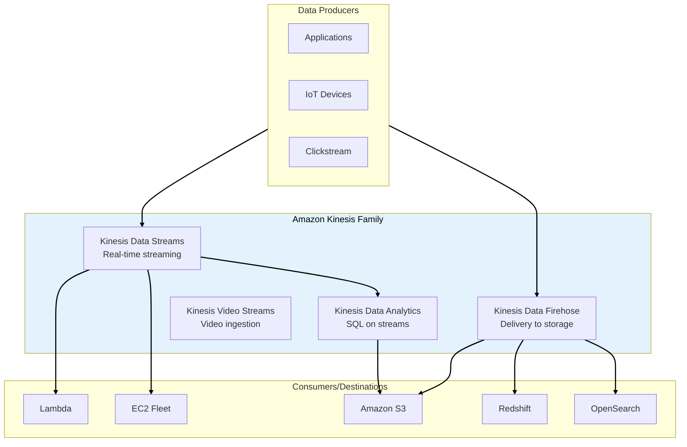
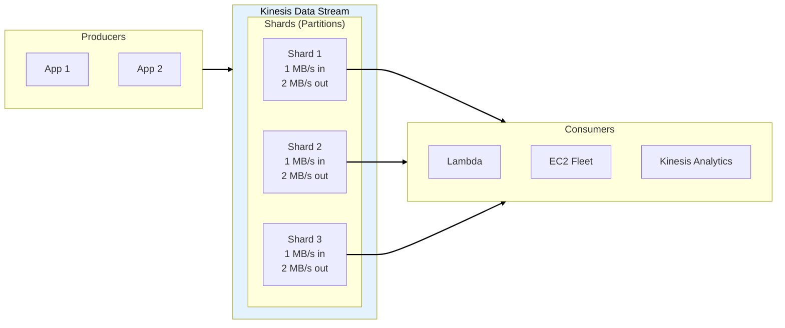
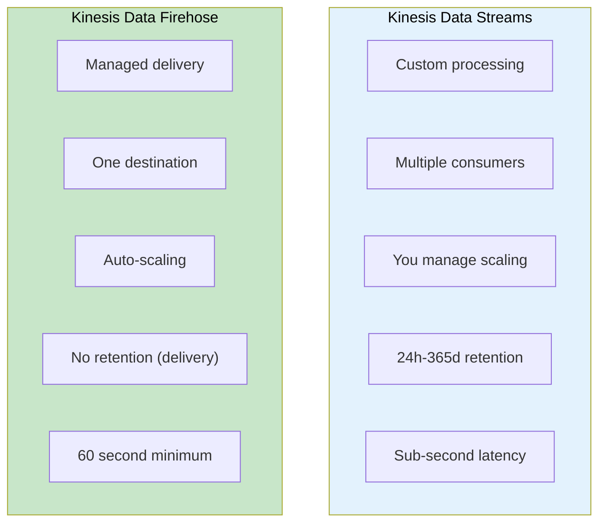
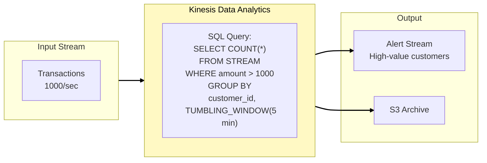
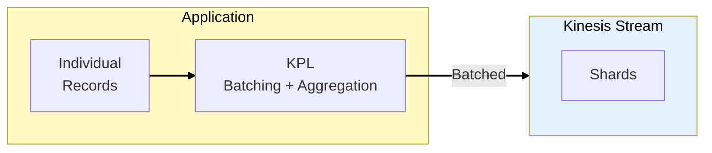
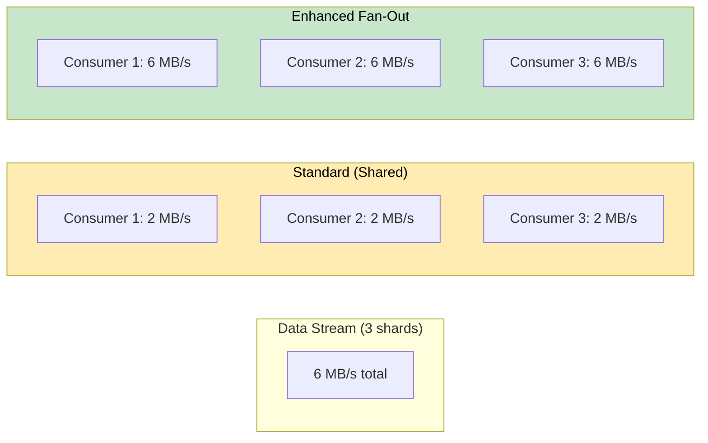
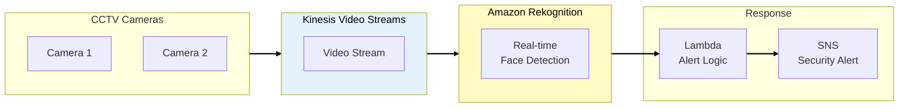
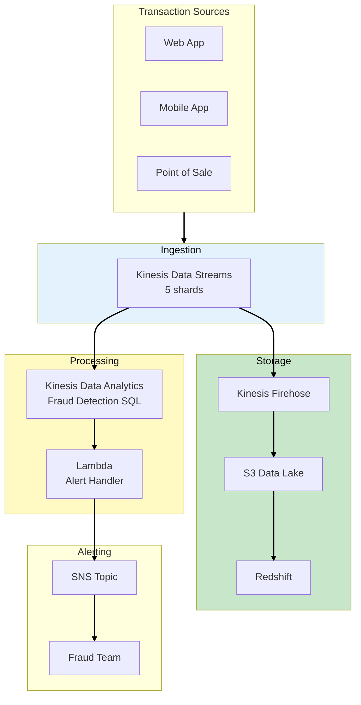
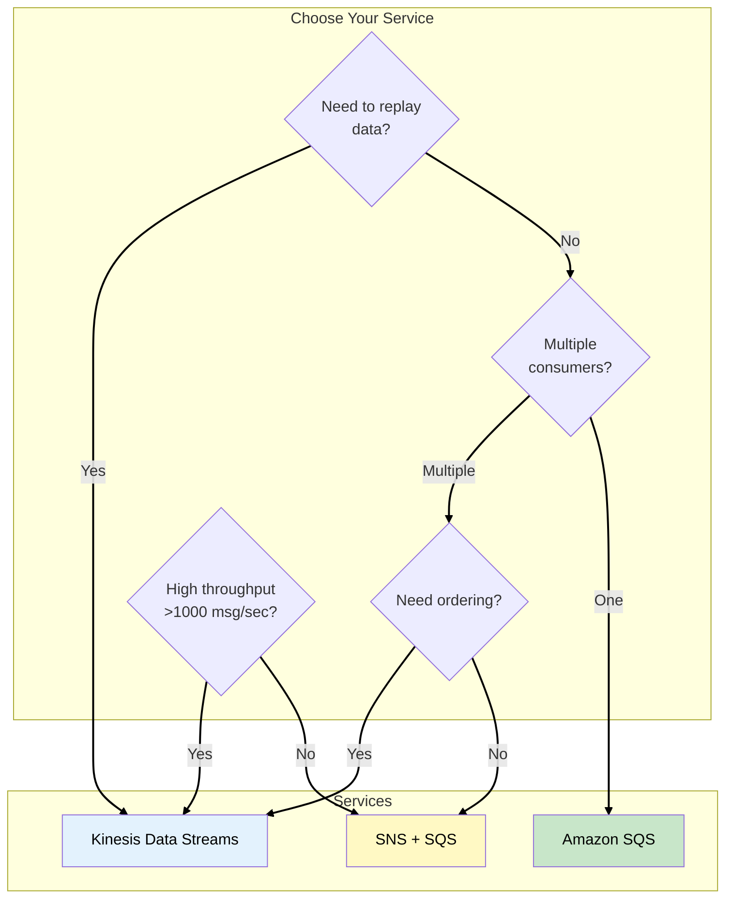

# Phase 5: Real-Time Analytics

## Business Context

**Situation:** DataLake Corp's biggest client, a major e-commerce platform, has a problem: they're
losing $500K/month to fraud. Their current system detects fraudulent transactions 24 hours later -
too late.

**The client's demand:** "We need to detect suspicious transactions within 5 seconds and block them
before they complete."

**Requirements:**

- Ingest thousands of transactions per second
- Process data in real-time (sub-second latency)
- Detect patterns across streaming data
- Store results for historical analysis

---

## Step 1: The Kinesis Family

### Real-Time Data Services

AWS provides a family of services for real-time data streaming:



### Kinesis Service Comparison

| Service            | Purpose                  | Use Case                              | Exam Trigger                      |
| ------------------ | ------------------------ | ------------------------------------- | --------------------------------- |
| **Data Streams**   | Real-time ingestion      | Custom processing, multiple consumers | "real-time", "multiple consumers" |
| **Firehose**       | Delivery to destinations | Load to S3/Redshift/OpenSearch        | "deliver to S3", "no code"        |
| **Data Analytics** | SQL on streams           | Real-time aggregations                | "SQL on streaming data"           |
| **Video Streams**  | Video ingestion          | CCTV, video analysis                  | "video streaming", "media"        |

> **SAA Exam Tip:** "Kinesis Data Streams vs Firehose" is one of the most common exam questions.
> Streams = custom processing. Firehose = managed delivery.

---

## Step 2: Kinesis Data Streams Deep Dive

### How It Works



### Shard Capacity

| Metric               | Limit                                       |
| -------------------- | ------------------------------------------- |
| **Write**            | 1 MB/sec or 1,000 records/sec per shard     |
| **Read**             | 2 MB/sec per shard (shared among consumers) |
| **Enhanced Fan-Out** | 2 MB/sec per consumer per shard             |
| **Retention**        | 24 hours (default) to 365 days              |

### Calculating Shards Needed

```
Required Shards = MAX(
    incoming_data_MB_per_sec / 1,
    incoming_records_per_sec / 1000
)
```

**Example:** 5 MB/sec and 3,000 records/sec → Need 5 shards

> **SAA Exam Tip:** "Calculate number of shards" = Divide by 1 MB/s (write) or 1000 records/s, take
> the maximum.

---

## Step 3: Kinesis Data Streams vs Firehose

### Critical Exam Comparison



### Comparison Table

| Feature          | Data Streams          | Firehose                         |
| ---------------- | --------------------- | -------------------------------- |
| **Latency**      | Real-time (~200ms)    | Near real-time (60s+ buffer)     |
| **Scaling**      | Manual (add shards)   | Automatic                        |
| **Consumers**    | Multiple              | Single destination               |
| **Processing**   | Custom (Lambda, EC2)  | Built-in transforms              |
| **Destinations** | Anything              | S3, Redshift, OpenSearch, Splunk |
| **Retention**    | Up to 365 days        | No retention (passes through)    |
| **Use Case**     | Custom real-time apps | ETL to storage                   |

> **SAA Exam Tip:** "Stream to S3 with minimal management" = **Firehose**. "Multiple consumers
> reading same stream" = **Data Streams**.

---

## Step 4: Kinesis Data Analytics

### SQL on Streaming Data

**Kinesis Data Analytics** lets you write SQL queries on streaming data:



### Windowing Functions

| Window Type  | Description            | Use Case                  |
| ------------ | ---------------------- | ------------------------- |
| **TUMBLING** | Fixed, non-overlapping | Aggregate every 5 minutes |
| **SLIDING**  | Fixed, overlapping     | Moving average            |
| **STAGGER**  | Group by partition key | Per-customer aggregations |

### Example: Fraud Detection Query

```sql
CREATE OR REPLACE STREAM fraud_alerts AS
SELECT
    customer_id,
    COUNT(*) as transaction_count,
    SUM(amount) as total_amount,
    ROWTIME as window_end
FROM transactions_stream
GROUP BY
    customer_id,
    STEP(transactions_stream.ROWTIME BY INTERVAL '5' MINUTE);

-- Alert when > 5 transactions in 5 minutes
CREATE OR REPLACE PUMP fraud_pump AS
INSERT INTO alert_stream
SELECT * FROM fraud_alerts
WHERE transaction_count > 5;
```

> **SAA Exam Tip:** "Real-time SQL analytics on streaming data" = Kinesis Data Analytics. "Fraud
> detection with windowed aggregations" = KDA with tumbling windows.

---

## Step 5: Producer and Consumer Patterns

### Kinesis Producer Library (KPL)

For high-throughput producers:



### Consumer Options

| Consumer                         | Description           | Use Case                       |
| -------------------------------- | --------------------- | ------------------------------ |
| **KCL (Kinesis Client Library)** | Managed checkpointing | Long-running EC2 apps          |
| **Lambda**                       | Serverless processing | Event-driven processing        |
| **Enhanced Fan-Out**             | Dedicated throughput  | Multiple high-volume consumers |
| **Firehose**                     | Delivery to storage   | S3/Redshift loading            |

### Enhanced Fan-Out



> **SAA Exam Tip:** "Multiple consumers need dedicated throughput" = Enhanced Fan-Out. It provides 2
> MB/sec per shard per consumer.

---

## Step 6: Video Streams with Rekognition

### Real-Time Video Analysis

DataLake Corp's client also has CCTV cameras in stores. They want to detect shoplifting in
real-time:



> **SAA Exam Tip:** "Real-time video analysis" = Kinesis Video Streams + Rekognition. NOT Kinesis
> Data Streams (that's for data, not video).

---

## Step 7: DataLake Corp Fraud Detection

### Complete Architecture



### Implementation Results

| Metric            | Before   | After            |
| ----------------- | -------- | ---------------- |
| Detection latency | 24 hours | 5 seconds        |
| Fraud blocked     | 0%       | 85%              |
| Data processed    | Batch    | 5,000 events/sec |
| Storage           | None     | 30-day retention |

---

## Step 8: Kinesis vs SQS vs SNS

### When to Use Each

| Service                  | Pattern           | Use Case                          |
| ------------------------ | ----------------- | --------------------------------- |
| **Kinesis Data Streams** | Streaming         | High-throughput, ordered, replay  |
| **SQS**                  | Queue             | Decoupling, one consumer          |
| **SNS**                  | Pub/Sub           | Fan-out to multiple subscribers   |
| **SNS + SQS**            | Fan-out + Queue   | Multiple consumers with buffering |
| **Kinesis + Firehose**   | Stream + Delivery | Process and store                 |



> **SAA Exam Tip:** "Replay streaming data" = Kinesis (retention). "Decouple services" = SQS.
> "Fan-out to multiple consumers" = SNS. "Analytics on streams" = Kinesis Data Analytics.

---

## Exam Tips Summary

| Topic                | Key Point                                                 |
| -------------------- | --------------------------------------------------------- |
| **Data Streams**     | Real-time ingestion, multiple consumers, manual scaling   |
| **Firehose**         | Managed delivery to S3/Redshift, auto-scaling, 60s buffer |
| **Data Analytics**   | SQL on streams, windowing functions                       |
| **Shards**           | 1 MB/s write, 2 MB/s read per shard                       |
| **Enhanced Fan-Out** | Dedicated 2 MB/s per consumer                             |
| **Video Streams**    | For video/media with Rekognition                          |
| **Kinesis vs SQS**   | Kinesis = streaming/replay, SQS = queuing                 |
| **Producer (KPL)**   | Batching and aggregation for high throughput              |

---

## What's Next?

The real-time fraud detection system is live and saving the client $500K/month. But new challenges
emerge: the company is onboarding healthcare clients who require HIPAA compliance. Different teams
need different levels of access to different datasets.

**[Continue to Phase 6: Data Governance →](phase-6-data-governance.md)**
