# Phase 6: Data Governance

## Business Context

**Situation:** DataLake Corp is onboarding a major healthcare client that requires HIPAA compliance.
The data contains sensitive patient information (PHI) that must be strictly controlled:

- Only authorized analysts can access patient data
- Some columns (SSN, diagnosis) must be hidden from most users
- All data access must be audited for compliance
- Different teams need different data views

**The compliance officer's mandate:** "Show me who accessed what data, when, and prove they were
authorized."

**Requirements:**

- Fine-grained access control (row, column, cell level)
- Centralized permissions management
- Audit trail for all data access
- Cross-account data sharing without copying

---

## Step 1: AWS Lake Formation

### What is Lake Formation?

**AWS Lake Formation** is a service that simplifies building, securing, and managing data lakes. It
provides:


### Lake Formation vs Traditional IAM

| Aspect            | Traditional IAM              | Lake Formation          |
| ----------------- | ---------------------------- | ----------------------- |
| **Granularity**   | Bucket/prefix level          | Column, row, cell level |
| **Management**    | Scattered across services    | Centralized             |
| **Cross-account** | Complex trust relationships  | Built-in sharing        |
| **Audit**         | CloudTrail + manual analysis | Integrated audit logs   |

> **SAA Exam Tip:** "Fine-grained access control at column level" = Lake Formation. IAM can't
> provide column-level permissions on S3 data.

---

## Step 2: Lake Formation Permissions Model

### How Permissions Work


### Permission Hierarchy

```sql
-- Grant database access
GRANT CREATE_TABLE, DESCRIBE ON DATABASE healthcare_db
TO PRINCIPAL 'arn:aws:iam::123456789012:role/DataAnalyst';

-- Grant table access with column restrictions
GRANT SELECT ON TABLE healthcare_db.patients
COLUMNS (patient_id, age, city)  -- Excludes SSN, diagnosis
TO PRINCIPAL 'arn:aws:iam::123456789012:role/DataAnalyst';
```

---

## Step 3: Column-Level Security

### Hiding Sensitive Columns

DataLake Corp's healthcare data has columns with different sensitivity levels:

```mermaid
flowchart TB
    subgraph Table["patients table"]
        C1["patient_id<br>🟢 Public"]
        C2["name<br>🟡 Internal"]
        C3["age<br>🟢 Public"]
        C4["diagnosis<br>🔴 Restricted"]
        C5["ssn<br>🔴 Restricted"]
    end

    subgraph Users["User Access"]
        Analyst["Analyst Role<br>Sees: id, name, age"]
        Doctor["Doctor Role<br>Sees: id, name, age, diagnosis"]
        Admin["Admin Role<br>Sees: ALL"]
    end

    Table --> Users

    style Table fill:#e3f2fd,color:#000
    style Users fill:#c8e6c9,color:#000
    linkStyle default stroke:#000,stroke-width:2px
```



### Configuring Column-Level Security

```json
{
  "Principal": { "DataLakePrincipalIdentifier": "arn:aws:iam::123456789012:role/Analyst" },
  "Resource": {
    "Table": {
      "DatabaseName": "healthcare_db",
      "Name": "patients"
    },
    "ColumnNames": ["patient_id", "name", "age", "city"]
  },
  "Permissions": ["SELECT"]
}
```

> **SAA Exam Tip:** "Different users see different columns" = Lake Formation column-level security.
> This is a key differentiator from IAM.

---

## Step 4: Row-Level Security

### Filtering Rows by User

Different analysts should only see data for their assigned regions:


### Configuring Row-Level Security

```json
{
  "Principal": { "DataLakePrincipalIdentifier": "arn:aws:iam::123456789012:role/USEastAnalyst" },
  "Resource": {
    "Table": {
      "DatabaseName": "healthcare_db",
      "Name": "patients"
    }
  },
  "Permissions": ["SELECT"],
  "RowFilter": {
    "FilterExpression": "region = 'US-East'"
  }
}
```

> **SAA Exam Tip:** "Users can only see rows they're authorized for" = Lake Formation row-level
> security with filter expressions.

---

## Step 5: Cell-Level Security

### The Most Granular Control

**Cell-Level Security** combines column and row filtering:

```mermaid
flowchart TB
    subgraph Table["patients table"]
        subgraph Headers["Columns"]
            H1["id"]
            H2["name"]
            H3["ssn"]
            H4["diagnosis"]
        end
        subgraph Row1["Row 1 (US-East)"]
            D11["1"]
            D12["Alice"]
            D13["XXX-XX-1234"]
            D14["Flu"]
        end
        subgraph Row2["Row 2 (EU)"]
            D21["2"]
            D22["Bob"]
            D23["XXX-XX-5678"]
            D24["Cold"]
        end
    end

    subgraph Access["US-East Analyst View"]
        V1["1"]
        V2["Alice"]
        V3["🚫 Hidden"]
        V4["🚫 Hidden"]
    end

    style Table fill:#e3f2fd,color:#000
    style Access fill:#c8e6c9,color:#000
    linkStyle default stroke:#000,stroke-width:2px
```



**Result:** The analyst sees only:

- Row 1 (US-East region)
- Columns: id, name (not ssn, diagnosis)

---

## Step 6: Cross-Account Data Sharing

### Sharing Without Copying

DataLake Corp needs to share curated data with clients in their own AWS accounts:


### Cross-Account Sharing Steps

1. **Producer account:** Grant permissions to external account
2. **Consumer account:** Create resource link to shared table
3. **Consumer uses Athena/Redshift:** Queries producer's data directly

```json
{
  "Principal": { "DataLakePrincipalIdentifier": "123456789012" },
  "Resource": {
    "Table": {
      "DatabaseName": "curated",
      "Name": "customer_360"
    }
  },
  "Permissions": ["SELECT"],
  "PermissionsWithGrantOption": []
}
```

> **SAA Exam Tip:** "Share data lake tables across accounts without copying" = Lake Formation
> cross-account sharing with resource links.

---

## Step 7: Audit and Compliance

### CloudTrail Integration

Lake Formation logs all data access to CloudTrail:


### What's Logged

| Event                     | Details Captured           |
| ------------------------- | -------------------------- |
| **GetTableObjects**       | Who queried which table    |
| **GrantPermissions**      | Who granted access to whom |
| **RevokePermissions**     | Who revoked access         |
| **CreateDataCellsFilter** | Row/column filter changes  |

### Compliance Query Example

```sql
-- Who accessed patient data in the last 30 days?
SELECT
    userIdentity.arn,
    eventTime,
    requestParameters.databaseName,
    requestParameters.tableName
FROM cloudtrail_logs
WHERE eventName = 'GetTableObjects'
  AND requestParameters.tableName = 'patients'
  AND eventTime > date_add('day', -30, current_date)
ORDER BY eventTime DESC;
```

---

## Step 8: DataLake Corp Governance Architecture

### Complete Governance Solution


### Governance Implementation

| Requirement            | Solution                               |
| ---------------------- | -------------------------------------- |
| Column-level access    | Lake Formation column permissions      |
| Row-level filtering    | Lake Formation data cell filters       |
| Cross-account sharing  | Lake Formation resource links          |
| Audit trail            | CloudTrail + Athena analysis           |
| Centralized management | Lake Formation as single control plane |

---

## Step 9: Tag-Based Access Control

### Simplified Permission Management

Instead of managing permissions per table, use **tags**:

```mermaid
flowchart TB
    subgraph Tags["LF-Tags"]
        T1["classification = public"]
        T2["classification = internal"]
        T3["classification = pii"]
    end

    subgraph Tables["Data Assets"]
        Tab1["revenue_summary<br>🏷️ public"]
        Tab2["customer_list<br>🏷️ internal"]
        Tab3["patient_records<br>🏷️ pii"]
    end

    subgraph Roles["Principals"]
        R1["Public Analyst<br>🔑 public"]
        R2["Internal Analyst<br>🔑 internal, public"]
        R3["Compliance Officer<br>🔑 pii, internal, public"]
    end

    Tags --> Tables
    Tags --> Roles

    style Tags fill:#e3f2fd,color:#000
    style Tables fill:#fff9c4,color:#000
    style Roles fill:#c8e6c9,color:#000
    linkStyle default stroke:#000,stroke-width:2px
```



### Benefits of Tag-Based Access

| Aspect        | Without Tags               | With LF-Tags              |
| ------------- | -------------------------- | ------------------------- |
| **New table** | Grant to each user         | Assign tag, auto-inherits |
| **New user**  | Grant access to each table | Assign tag, auto-inherits |
| **Audit**     | Per-table review           | Per-tag review            |
| **Scale**     | O(users × tables)          | O(tags)                   |

> **SAA Exam Tip:** "Scalable data governance for hundreds of tables" = Lake Formation with LF-Tags
> (tag-based access control).

---

## Exam Tips Summary

| Topic                     | Key Point                                         |
| ------------------------- | ------------------------------------------------- |
| **Lake Formation**        | Central data governance, fine-grained access      |
| **Column-Level Security** | Control which columns users can see               |
| **Row-Level Security**    | Filter rows based on user context                 |
| **Cell-Level Security**   | Combines column + row filtering                   |
| **Cross-Account Sharing** | Resource links, no data copying                   |
| **LF-Tags**               | Scalable tag-based access control                 |
| **Audit**                 | CloudTrail integration for compliance             |
| **vs IAM**                | Lake Formation = data level, IAM = resource level |

---

## Scenario Complete!

Congratulations! You've built a complete enterprise data platform:

| Phase       | What You Built                       |
| ----------- | ------------------------------------ |
| **Phase 1** | S3 Data Lake with lifecycle policies |
| **Phase 2** | Serverless SQL with Athena           |
| **Phase 3** | ETL pipelines with Glue              |
| **Phase 4** | Data warehouse with Redshift         |
| **Phase 5** | Real-time analytics with Kinesis     |
| **Phase 6** | Data governance with Lake Formation  |

### SAA-C03 Topics Covered

- S3 storage classes and lifecycle
- Athena and Glue Data Catalog
- Glue ETL and Job Bookmarks
- Redshift, Spectrum, and AQUA
- Kinesis family (Streams, Firehose, Analytics)
- Lake Formation governance
- ElastiCache for caching
- CloudTrail for audit

**[← Back to DataLake Corp Overview](../00-overview.md)**
