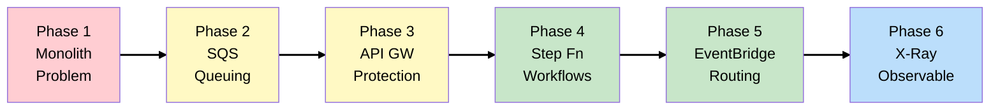

# Tickets Without Crashes: The EventPro Story

## The Business

You're the Lead Architect at **EventPro** - a ticket sales platform for concerts, sporting events,
and theater. The company has grown to 500K users, but faces a critical problem: **flash crowds**.

When 50,000+ fans try to buy tickets simultaneously (like a Taylor Swift concert sale), the system
collapses under the load. This isn't just a technical problem - it's a business crisis.

## The Trigger

> "We sold Taylor Swift tickets last month. 50,000 fans hit 'Buy' at 10:00 AM. Our API crashed in 30
> seconds. We oversold 200 tickets and had to refund furious customers. The CEO is asking why our
> competitors handle this and we can't."
>
> — CTO, post-incident review

## Learning Objectives

This scenario teaches event-driven architecture and asynchronous processing patterns for
high-traffic applications:

- [**Phase 1**: The Crashing Monolith](scenarios/eventpro/phases/phase-1-crashing-monolith.md) -
  Understanding the problem
- [**Phase 2**: SQS Traffic Absorption](scenarios/eventpro/phases/phase-2-sqs-traffic-absorption.md) -
  Queues and decoupling
- [**Phase 3**: API Gateway Protection](scenarios/eventpro/phases/phase-3-api-gateway-protection.md) -
  Rate limiting and caching
- [**Phase 4**: Step Functions Workflows](scenarios/eventpro/phases/phase-4-step-functions-workflows.md) -
  Orchestration and Saga pattern
- [**Phase 5**: EventBridge Routing](scenarios/eventpro/phases/phase-5-eventbridge-routing.md) -
  Event-driven integration
- [**Phase 6**: Event-Driven Observability](scenarios/eventpro/phases/phase-6-observability.md) -
  Tracing and monitoring

## Architecture Evolution Map

## AWS Services Covered

| Phase | Primary Services          | Key Concepts                              |
| ----- | ------------------------- | ----------------------------------------- |
| 1     | -                         | Race conditions, synchronous bottleneck   |
| 2     | SQS, DynamoDB             | Queue decoupling, DLQ, conditional writes |
| 3     | API Gateway, CloudFront   | Throttling, usage plans, caching          |
| 4     | Step Functions, SNS       | Saga pattern, workflow orchestration      |
| 5     | EventBridge               | Event routing, fan-out, scheduling        |
| 6     | X-Ray, CloudWatch, Lambda | Distributed tracing, observability        |

## SAA Exam Domain Mapping

This scenario primarily covers:

- **Domain 2 (Resilient)**: Decoupling, fault tolerance, Saga pattern
- **Domain 3 (High-Performing)**: Traffic absorption, caching, async processing
- **Domain 1 (Secure)**: API protection, rate limiting, DDoS mitigation

## How to Use This Guide

Each phase includes:

1. **Business Context** - What's happening with EventPro
2. **Architecture Decision** - What we're building and WHY
3. **Key Concepts** - SAA exam-relevant knowledge with verified numbers
4. **Diagrams** - Visual representation of the architecture
5. **Cross-References** - Links to related content in other scenarios
6. **Exam Tips** - Key points for the SAA certification
