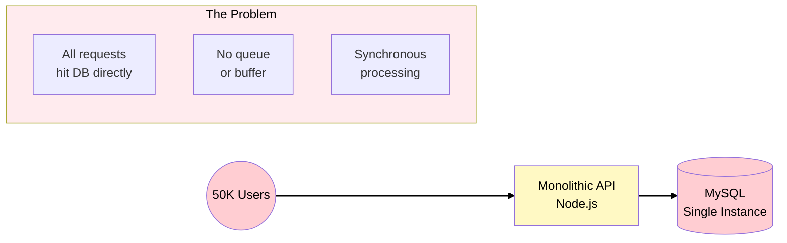
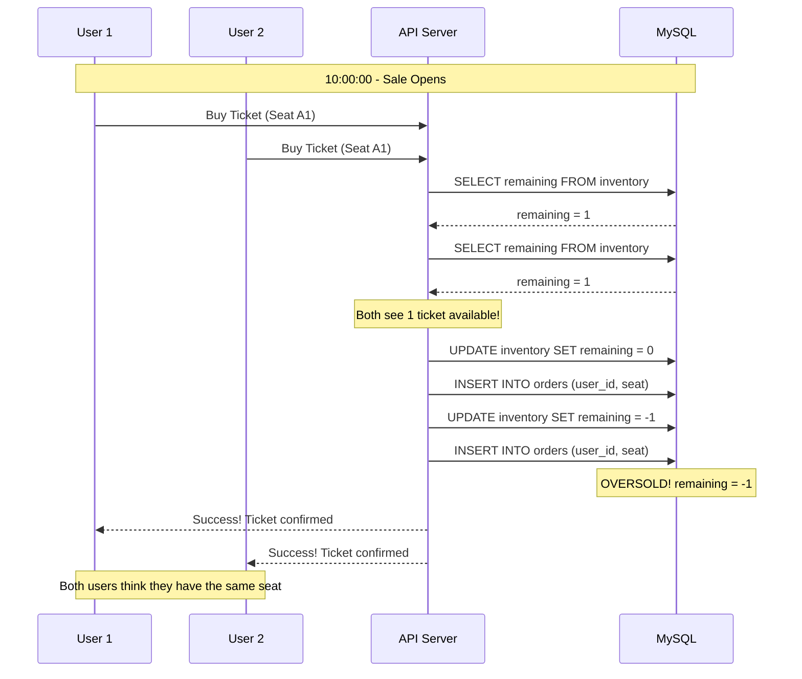
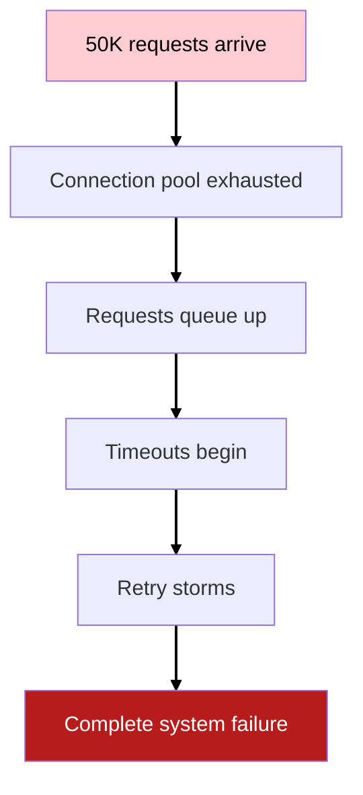
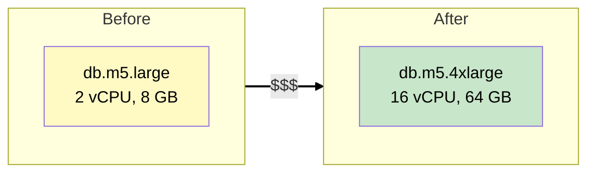
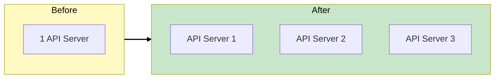

# Phase 1: The Crashing Monolith

## Business Context

**Situation:** EventPro has 500K registered users and handles ~100 events per month. Most days,
traffic is manageable. But during "flash sales" - when popular concert tickets go on sale -
everything breaks.

**The Taylor Swift Incident:**

- 10:00 AM: Ticket sale opens
- 10:00:30: 50,000 concurrent requests hit the API
- 10:00:45: Database connections exhausted
- 10:01:00: API starts returning 500 errors
- 10:02:00: Race conditions cause 200 oversold tickets
- 10:05:00: Manual intervention required

**Business Impact:**

- $50,000 in refunds and compensation
- 2,000+ angry customer support tickets
- Negative social media coverage
- Artist management threatening to use competitors

---

## Current Architecture



### What Happens During a Flash Sale



---

## Understanding the Problems

### Problem 1: Race Conditions

A **race condition** occurs when multiple processes access shared data concurrently, and the final
result depends on the timing of their execution.

**WHY it happens in EventPro:**

```
Time    Thread A              Thread B              Inventory
----    --------              --------              ---------
T1      Read inventory: 1                           1
T2                            Read inventory: 1     1
T3      Check: 1 > 0? Yes                           1
T4                            Check: 1 > 0? Yes     1
T5      Decrement: 1-1=0                            0
T6                            Decrement: 0-1=-1    -1
T7      Commit sale                                 -1
T8                            Commit sale           -1 (OVERSOLD!)
```

> **SAA Exam Tip:** Race conditions are a classic problem in distributed systems. The solution
> involves either pessimistic locking (slow) or optimistic concurrency control (DynamoDB conditional
> writes).

### Problem 2: Database Saturation

MySQL has connection limits. When 50,000 requests arrive simultaneously:

| Resource           | Limit          | What Happens When Exceeded      |
| ------------------ | -------------- | ------------------------------- |
| Max connections    | ~150 (default) | New requests wait or fail       |
| Connection timeout | 10 seconds     | Requests queue, then timeout    |
| Write throughput   | ~5,000 IOPS    | Writes queue, latency increases |

**The cascade failure:**



### Problem 3: No Buffering

Every request goes directly to the database. There's no way to:

- Absorb traffic spikes
- Process requests at a sustainable rate
- Protect the database from overload

**Analogy:** Imagine a stadium with 50,000 fans and only 10 entry gates. Without queuing, there's a
stampede. With orderly queues, everyone gets in safely (just not all at once).

---

## Scaling Approaches: Vertical vs Horizontal

When facing performance problems, there are two fundamental approaches:

**Vertical Scaling (Scale Up):**



- **Pros:** Simple, no code changes
- **Cons:** Expensive, has limits, doesn't fix race conditions

**Horizontal Scaling (Scale Out):**



- **Pros:** No upper limit, more resilient
- **Cons:** Requires stateless design, adds complexity

**WHY horizontal scaling alone doesn't fix EventPro:**

Adding more API servers without queuing just means more servers hammering the database
simultaneously. The race conditions remain, and the database becomes the bottleneck faster.

> **SAA Exam Tip:** "How do you scale a database?" is a common question. For writes, consider: SQS
> to buffer, DynamoDB for high write throughput, or database sharding.

---

## What We Need to Fix

| Problem                 | Root Cause                    | Solution Direction                     |
| ----------------------- | ----------------------------- | -------------------------------------- |
| Race conditions         | Read-then-write without locks | Atomic operations (conditional writes) |
| DB saturation           | Direct connection per request | Queue to buffer and batch              |
| No backpressure         | Synchronous processing        | Async with queue-based load leveling   |
| Single point of failure | One database instance         | Decoupling and multi-region            |

---

## Key SAA Exam Concepts from Phase 1

### Synchronous vs Asynchronous

| Pattern      | How It Works                                 | When to Use                   |
| ------------ | -------------------------------------------- | ----------------------------- |
| Synchronous  | Request waits for response                   | Simple operations, low volume |
| Asynchronous | Request returns immediately, processed later | High volume, spiky traffic    |

**EventPro needs asynchronous** because:

1. Users don't need immediate confirmation (they can wait seconds)
2. Traffic is extremely spiky (10x normal during sales)
3. Processing speed is limited by downstream systems

### Decoupling Components

Tight coupling (current state):

```
API → Database
```

Loose coupling (target state):

```
API → Queue → Workers → Database
```

**Benefits of decoupling:**

- Queue absorbs traffic spikes
- Workers process at sustainable rate
- Database is protected from overload
- Components can scale independently

---

## See Also

> **Related Learning:** For general high-availability patterns and Auto Scaling, see
> [TechBooks Phase 4: Auto Scaling](/scenarios/techbooks/phases/phase-4-auto-scaling.md).

---

## What's Coming in Phase 2?

**Business trigger:** "The CEO says we can't fail again. The next big concert sale is in 2 weeks. We
need a solution NOW."

**Next decisions:**

- Introduce Amazon SQS to buffer requests
- Use DynamoDB with conditional writes for inventory
- Implement Dead Letter Queues for failed messages
- Design for "first-come, first-served" fairness

---

## References

### AWS Documentation

- [Amazon SQS Overview](https://docs.aws.amazon.com/AWSSimpleQueueService/latest/SQSDeveloperGuide/welcome.html)
- [DynamoDB Conditional Writes](https://docs.aws.amazon.com/amazondynamodb/latest/developerguide/Expressions.ConditionExpressions.html)

### Architecture Patterns

- [Queue-Based Load Leveling Pattern](https://docs.aws.amazon.com/prescriptive-guidance/latest/cloud-design-patterns/queue-based-load-leveling.html)
