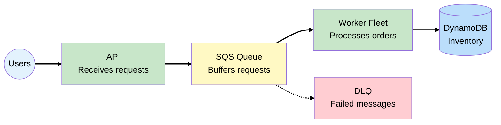
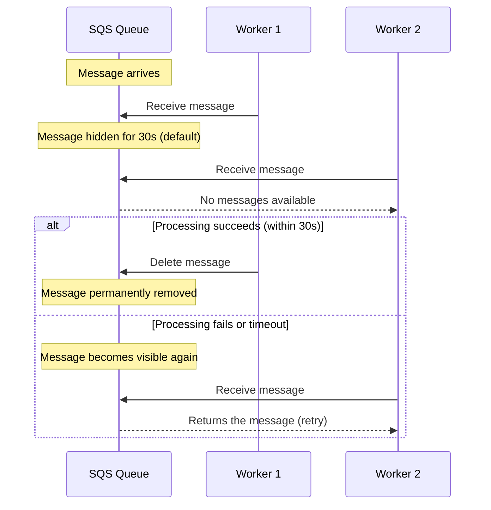
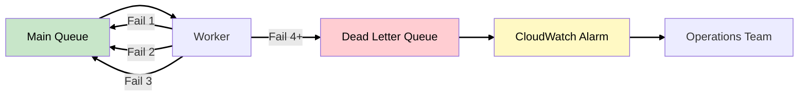
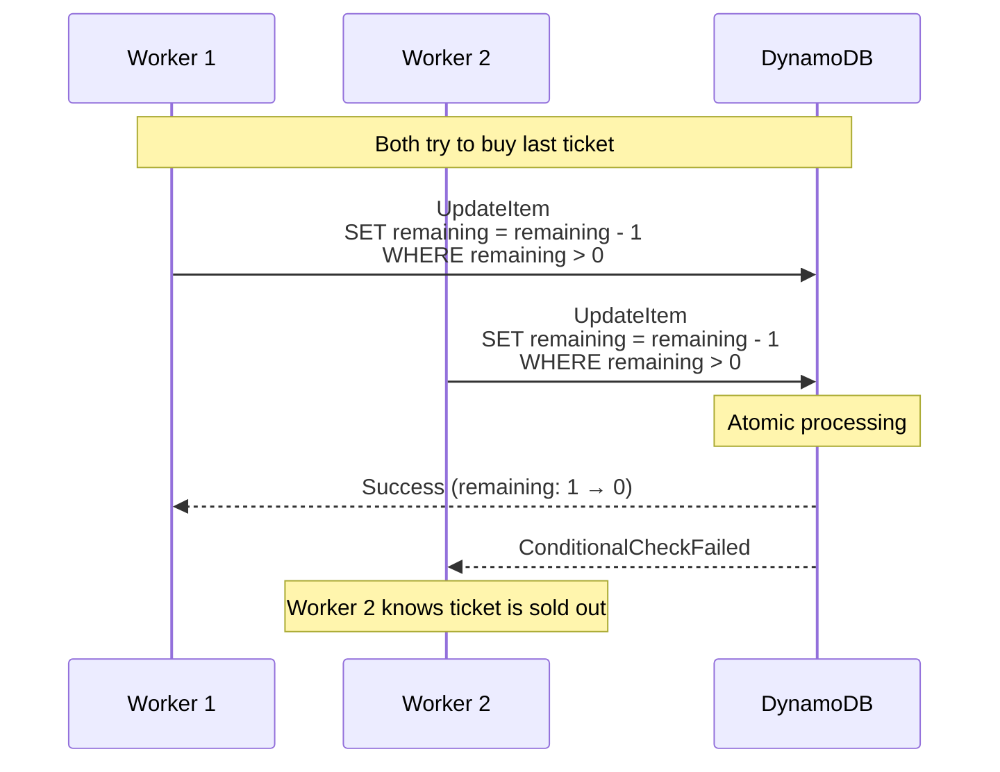
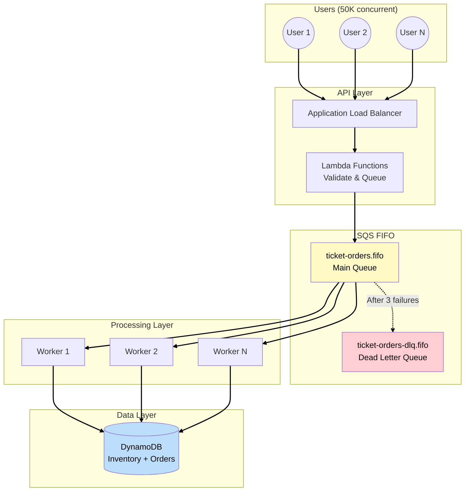

# Phase 2: SQS - Absorbing the Traffic Spike

## Business Context

**Situation:** The CTO has given you 2 weeks to fix the ticket sales system before the next major
concert. The Taylor Swift incident cannot repeat.

**Requirements:**

- Handle 50,000+ concurrent purchase requests
- Guarantee no overselling (zero tolerance)
- Fair processing - first-come, first-served
- Graceful degradation under extreme load

**Your decision:** Introduce a queue to decouple the API from inventory processing, and use DynamoDB
for atomic inventory operations.

---

## The Solution: Queue-Based Load Leveling



**How the flow works:**

1. **User submits purchase** → API validates and queues message (returns immediately)
2. **SQS holds message** → Acts as a buffer, absorbs spike
3. **Worker polls queue** → Processes at sustainable rate
4. **DynamoDB update** → Atomic operation prevents overselling
5. **User notified** → Via email/push notification (async)

---

## Amazon SQS (Simple Queue Service)

### What is SQS?

**SQS** is a fully managed message queue service that enables asynchronous communication between
distributed systems. It acts as a buffer, holding messages until they can be processed.

### SQS Key Numbers for the Exam

These limits appear frequently on the SAA exam. Understanding them helps you choose between SQS and
other services:

| Configuration                 | Default    | Maximum       | Why It Matters                                     |
| ----------------------------- | ---------- | ------------- | -------------------------------------------------- |
| Message retention             | 4 days     | 14 days       | How long unprocessed messages stay in queue        |
| Visibility timeout            | 30 seconds | 12 hours      | How long a message is hidden while being processed |
| Message size                  | -          | 256 KB        | Larger payloads need S3 + pointer                  |
| Long polling wait             | -          | 20 seconds    | Reduces empty responses and API calls              |
| Messages in-flight (Standard) | -          | ~120,000      | Concurrent messages being processed                |
| FIFO throughput               | -          | 3,000 msg/sec | With batching; 300/sec without                     |

> **Source:**
> [SQS Visibility Timeout](https://docs.aws.amazon.com/AWSSimpleQueueService/latest/SQSDeveloperGuide/sqs-visibility-timeout.html),
> [SQS Quotas](https://docs.aws.amazon.com/AWSSimpleQueueService/latest/SQSDeveloperGuide/sqs-quotas.html)

### Standard vs FIFO Queues

When choosing a queue type, consider whether **message ordering** matters for your use case. For
ticket sales, we want first-come-first-served processing, but we also need high throughput. This
comparison helps make that decision:

| Characteristic | Standard Queue                        | FIFO Queue                              |
| -------------- | ------------------------------------- | --------------------------------------- |
| Throughput     | Nearly unlimited                      | 3,000 msg/sec (with batching)           |
| Ordering       | Best-effort (may arrive out of order) | Guaranteed (strict order)               |
| Delivery       | At-least-once (may duplicate)         | Exactly-once (no duplicates)            |
| Use case       | High volume, order not critical       | When order matters (financial, tickets) |

**For EventPro:**

We choose **FIFO queue** because:

- **Fairness:** Users who clicked first should be processed first
- **No duplicates:** Prevents double-charging customers
- **3,000 msg/sec is sufficient:** Our peak is ~1,000 requests/sec

> **SAA Exam Tip:** FIFO queue names must end with `.fifo` suffix. This is a common trick question.

---

## Understanding Visibility Timeout

Visibility timeout is crucial for reliable message processing. It determines how long a message is
hidden from other consumers while being processed.



**WHY this matters for EventPro:**

- If a worker crashes mid-processing, the message isn't lost
- After visibility timeout expires, another worker can retry
- Set timeout > processing time to avoid duplicate processing

> **SAA Exam Tip:** "Messages are being processed twice" usually means visibility timeout is too
> short. Increase it to exceed your processing time.

---

## Dead Letter Queues (DLQ)

A **DLQ (Dead Letter Queue)** is a special queue that receives messages that couldn't be processed
successfully after multiple attempts. It prevents "poison messages" from blocking the queue forever.



**DLQ configuration:**

| Setting          | Recommended Value | Why                                 |
| ---------------- | ----------------- | ----------------------------------- |
| maxReceiveCount  | 3-5               | Retry attempts before moving to DLQ |
| DLQ retention    | 14 days           | Maximum time for investigation      |
| CloudWatch alarm | Messages > 0      | Alert when messages hit DLQ         |

**For EventPro, a message might fail because:**

- Invalid payment information
- Ticket already sold (race condition handled)
- External service timeout
- Bug in processing code

> **SAA Exam Tip:** DLQ must be the same type as the source queue (Standard DLQ for Standard queue,
> FIFO DLQ for FIFO queue).

---

## DynamoDB for Inventory

### WHY DynamoDB Instead of MySQL?

MySQL failed during the Taylor Swift incident because of race conditions and connection limits.
DynamoDB solves both:

| Problem           | MySQL                     | DynamoDB                    |
| ----------------- | ------------------------- | --------------------------- |
| Race conditions   | Requires explicit locking | Conditional writes (atomic) |
| Connection limits | ~150 concurrent           | No connection concept       |
| Write scaling     | Vertical only             | Horizontal (unlimited)      |
| Availability      | Single AZ (standard)      | Multi-AZ by default         |

### Conditional Writes: No More Overselling

DynamoDB **conditional writes** allow you to update an item only if a condition is met. This happens
atomically - no race conditions possible.



**Pseudocode for ticket purchase:**

```python
try:
    table.update_item(
        Key={'event_id': event_id, 'seat_id': seat_id},
        UpdateExpression='SET remaining = remaining - 1, buyer_id = :buyer',
        ConditionExpression='remaining > 0 AND attribute_not_exists(buyer_id)',
        ExpressionAttributeValues={':buyer': user_id}
    )
    return "SUCCESS"
except ConditionalCheckFailedException:
    return "SOLD_OUT"  # Not an error - expected behavior
```

> **SAA Exam Tip:** "How do you prevent overselling inventory?" → DynamoDB conditional writes or SQS
> FIFO with deduplication.

---

## Long Polling vs Short Polling

When workers poll SQS for messages, they can use two strategies. **Long polling** is almost always
preferred:

| Aspect    | Short Polling                    | Long Polling                        |
| --------- | -------------------------------- | ----------------------------------- |
| Behavior  | Returns immediately (even empty) | Waits up to 20 seconds for messages |
| API calls | Many (wasteful when queue empty) | Fewer (cost effective)              |
| Latency   | Higher (must poll frequently)    | Lower (gets message immediately)    |
| Cost      | Higher (more API calls)          | Lower (fewer API calls)             |

**For EventPro:**

- During flash sales: Queue always has messages → doesn't matter
- During normal times: Long polling saves costs and reduces empty responses

> **SAA Exam Tip:** "How do you reduce SQS costs?" → Enable long polling (set
> ReceiveMessageWaitTimeSeconds > 0).

---

## Putting It All Together

### Phase 2 Architecture



### Message Flow

1. **User clicks "Buy Ticket"** → Request hits ALB
2. **Lambda validates request** → Checks user session, event exists
3. **Lambda sends to SQS FIFO** → Returns "Order received, processing..."
4. **Worker receives message** → Long polling from queue
5. **Worker updates DynamoDB** → Conditional write for inventory
6. **Success** → Worker deletes message, triggers notification
7. **Failure** → Message becomes visible again for retry
8. **Repeated failure** → Message moves to DLQ

---

## Key SAA Exam Concepts from Phase 2

### Must-Know Topics

1. **SQS Queue Types**
   - Standard: High throughput, at-least-once, best-effort ordering
   - FIFO: Exactly-once, guaranteed ordering, 3,000 msg/sec

2. **Visibility Timeout**
   - Message hidden while processing
   - Set timeout > processing time
   - Default 30 seconds, max 12 hours

3. **Dead Letter Queues**
   - Catches failed messages after maxReceiveCount
   - Same type as source queue
   - Monitor with CloudWatch alarms

4. **DynamoDB Conditional Writes**
   - Atomic operations prevent race conditions
   - ConditionExpression for inventory management
   - Returns ConditionalCheckFailedException on failure

---

## See Also

> **Related Learning:**
>
> - For another use of SQS for async notifications, see
>   [TechBooks Phase 6: Modernization](/scenarios/techbooks/phases/phase-6-modernization.md)
> - For DynamoDB streams and event-driven patterns, see
>   [Phase 5: EventBridge Routing](phase-5-eventbridge-routing.md)

---

## What's Coming in Phase 3?

**Business trigger:** "SQS worked! We handled the concert sale. But we're seeing DDoS attacks during
sales, and VIP customers complain that bots buy tickets before humans can."

**Next decisions:**

- Add API Gateway with rate limiting
- Implement usage plans for VIP vs standard customers
- Use CloudFront for edge caching and DDoS protection

---

## References

### AWS Documentation

- [SQS Visibility Timeout](https://docs.aws.amazon.com/AWSSimpleQueueService/latest/SQSDeveloperGuide/sqs-visibility-timeout.html)
- [SQS FIFO Queues](https://docs.aws.amazon.com/AWSSimpleQueueService/latest/SQSDeveloperGuide/sqs-fifo-queues.html)
- [SQS Dead Letter Queues](https://docs.aws.amazon.com/AWSSimpleQueueService/latest/SQSDeveloperGuide/sqs-dead-letter-queues.html)
- [SQS Quotas](https://docs.aws.amazon.com/AWSSimpleQueueService/latest/SQSDeveloperGuide/sqs-quotas.html)
- [DynamoDB Conditional Writes](https://docs.aws.amazon.com/amazondynamodb/latest/developerguide/Expressions.ConditionExpressions.html)

### Architecture Patterns

- [Queue-Based Load Leveling](https://docs.aws.amazon.com/prescriptive-guidance/latest/cloud-design-patterns/queue-based-load-leveling.html)
