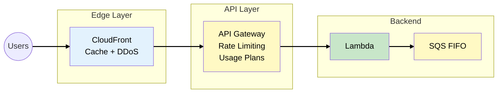
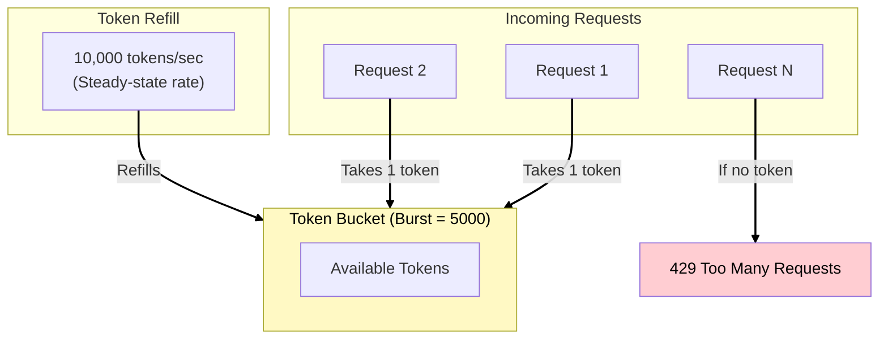
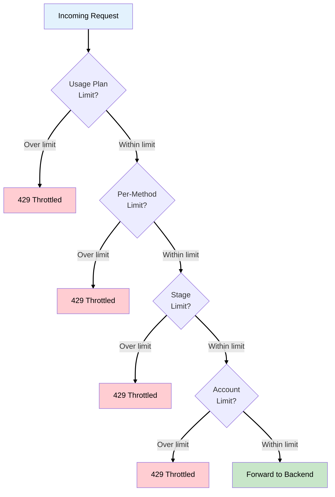
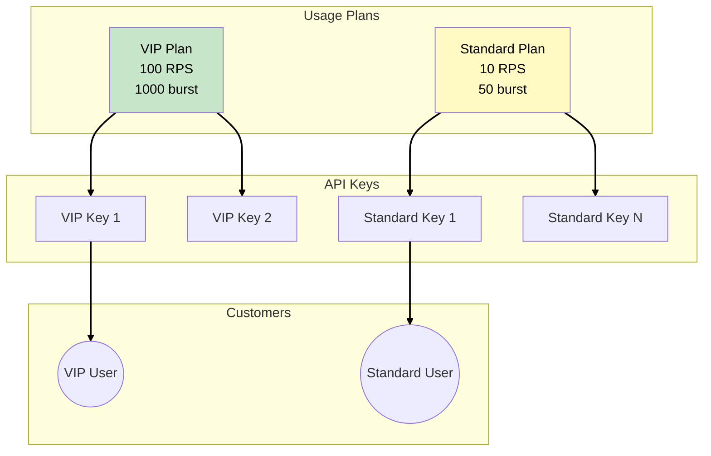
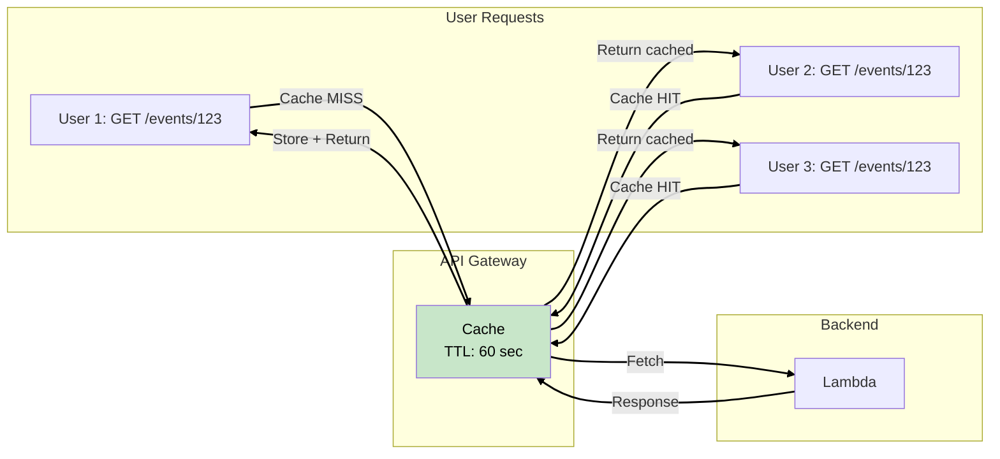
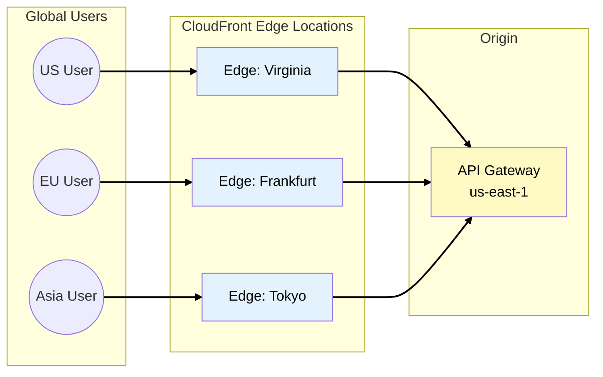
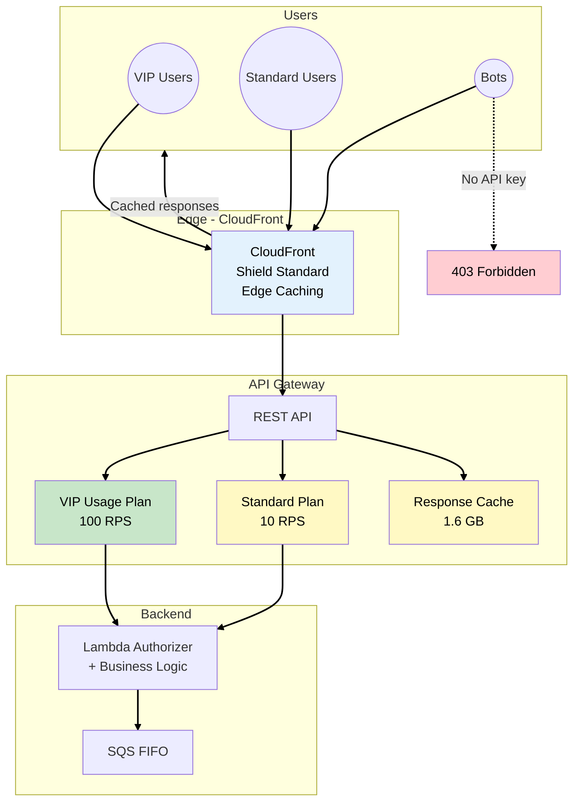

# Phase 3: API Gateway - Rate Limiting and Protection

## Business Context

**Situation:** The SQS implementation from Phase 2 worked beautifully. EventPro handled the Ed
Sheeran concert sale without crashes. But new problems emerged:

**New challenges:**

- **Bots:** Automated scripts buying tickets faster than humans
- **DDoS attacks:** Competitors or scalpers flooding the API during sales
- **VIP complaints:** Premium customers want priority access
- **Cost concerns:** High Lambda invocations during attacks

**Your decision:** Add API Gateway for traffic control and CloudFront for edge protection.

---

## The Solution: API Gateway + CloudFront



---

## Amazon API Gateway

### What is API Gateway?

**API Gateway** is a fully managed service for creating, publishing, and securing APIs at any scale.
It acts as a "front door" for your backend services.

### API Gateway Types

AWS offers three types of API Gateway. Choose based on your use case:

| Type      | Protocol  | Best For                   | Cost Model            |
| --------- | --------- | -------------------------- | --------------------- |
| REST API  | REST      | Full features, usage plans | Per request + data    |
| HTTP API  | REST      | Simple proxy, lower cost   | Per request           |
| WebSocket | WebSocket | Real-time, bidirectional   | Per message + minutes |

**For EventPro:** We use **REST API** because:

- We need **usage plans** for VIP vs standard customers
- We need **throttling** at multiple levels
- We need **caching** for event listings

> **SAA Exam Tip:** HTTP API is up to 70% cheaper than REST API but lacks usage plans, resource
> policies, and caching. Know when to use each.

---

## API Gateway Throttling

### Understanding the Token Bucket Algorithm

API Gateway uses the **token bucket** algorithm for rate limiting. Understanding this is essential
for sizing your API correctly and avoiding rejecting legitimate users:



**How it works:**

1. Bucket starts with burst capacity (e.g., 5,000 tokens)
2. Each request consumes 1 token
3. Tokens refill at steady-state rate (e.g., 10,000/sec)
4. If bucket is empty → 429 error

### Throttling Limits

These are the default limits for API Gateway REST APIs. The hierarchy determines which limit applies
first:

| Limit                    | Default             | Notes                            |
| ------------------------ | ------------------- | -------------------------------- |
| Account-level per region | 10,000 RPS          | Soft limit, can request increase |
| Burst capacity           | 5,000 requests      | Initial bucket size              |
| Per-stage default        | Uses account limits | Can be lower but not higher      |
| Per-method               | Configurable        | Overrides stage defaults         |
| Usage plan (per-client)  | Configurable        | Most specific, highest priority  |

> **Source:**
> [API Gateway Throttling](https://docs.aws.amazon.com/apigateway/latest/developerguide/api-gateway-request-throttling.html)

### Throttling Hierarchy

Understanding the order of throttle evaluation is critical. The most specific limit takes
precedence:



**Order (most specific → least specific):**

1. **Per-client/per-method** (usage plans) - VIP customer limits
2. **Per-method** (stage settings) - `/purchase` vs `/browse` limits
3. **Per-stage** (deployment) - Production vs development
4. **Account-level** per region - AWS-enforced maximum

---

## Usage Plans: VIP vs Standard

### WHY Differentiate Customers?

EventPro has two customer tiers:

- **VIP ($99/year):** Priority access, higher rate limits, dedicated support
- **Standard (free):** Normal access, shared rate limits

Usage plans let you give VIP customers a better experience without affecting standard users.

### Setting Up Usage Plans



### Example Configuration

| Setting    | VIP Plan             | Standard Plan      |
| ---------- | -------------------- | ------------------ |
| Rate limit | 100 requests/sec     | 10 requests/sec    |
| Burst      | 1,000 requests       | 50 requests        |
| Quota      | 100,000 requests/day | 1,000 requests/day |
| API stages | prod                 | prod               |

**For EventPro during flash sales:**

```
VIP user rate: 100 RPS → Can rapidly browse and purchase
Standard user rate: 10 RPS → Sufficient for normal browsing
Bot (no key): Blocked entirely
```

> **SAA Exam Tip:** API keys are for identification and usage tracking, NOT for authentication. Use
> Cognito, IAM, or Lambda authorizers for authentication.

---

## API Gateway Caching

### WHY Cache?

During a ticket sale, thousands of users request the same data:

- Event details (artist, venue, date)
- Seat map (available sections)
- Pricing information

Without caching, each request hits your backend. With caching, repeated requests are served from API
Gateway's cache.

### Cache Configuration



| Setting         | Options                       | EventPro Choice |
| --------------- | ----------------------------- | --------------- |
| Cache size      | 0.5 GB to 237 GB              | 1.6 GB          |
| TTL             | 0 to 3600 seconds             | 60 seconds      |
| Per-key caching | Based on query params/headers | Enabled         |
| Invalidation    | Cache-Control headers         | Admin API       |

> **SAA Exam Tip:** Caching is charged per hour, even with no traffic. Disable caching on endpoints
> that must always return fresh data (like inventory counts).

---

## CloudFront Integration

### WHY CloudFront in Front of API Gateway?

API Gateway is regional. CloudFront adds:

1. **Edge caching:** Serve static responses from 400+ edge locations
2. **DDoS protection:** AWS Shield Standard included
3. **Global acceleration:** Route users to nearest edge
4. **Additional caching layer:** Reduce API Gateway costs



### CloudFront + API Gateway: Caching Strategy

| Content Type      | CloudFront TTL | API Gateway Cache | Why                      |
| ----------------- | -------------- | ----------------- | ------------------------ |
| Event listings    | 300 seconds    | 60 seconds        | Changes rarely           |
| Seat map (static) | 3600 seconds   | 300 seconds       | Changes only on purchase |
| Purchase endpoint | 0 (no cache)   | 0 (no cache)      | Must always be fresh     |
| User profile      | 0 (no cache)   | 0 (no cache)      | Personalized data        |

> **SAA Exam Tip:** "How do you reduce latency for a global API?" → CloudFront in front of regional
> API Gateway.

---

## Phase 3 Complete Architecture



---

## Key SAA Exam Concepts from Phase 3

### Must-Know Topics

1. **API Gateway Types**
   - REST API: Full features, usage plans, caching
   - HTTP API: Cheaper, simpler, no usage plans
   - WebSocket: Real-time bidirectional

2. **Throttling**
   - Token bucket algorithm
   - Hierarchy: Usage plan → Method → Stage → Account
   - Burst capacity vs steady-state rate

3. **Usage Plans & API Keys**
   - API keys identify clients, NOT authenticate
   - Usage plans control rate limits and quotas
   - Associate plans with stages and keys

4. **Caching**
   - Reduces backend calls
   - TTL configurable per method
   - Charged hourly by cache size

5. **CloudFront Integration**
   - Global edge caching
   - DDoS protection (Shield Standard)
   - Custom origin configuration

---

## See Also

> **Related Learning:**
>
> - For WAF and Shield Advanced protection, see
>   [MedVault Phase 3: Network Security](/scenarios/medvault/phases/phase-3-network-security.md)
> - For CloudFront in detail, see
>   [TechBooks Phase 5: Going Global](/scenarios/techbooks/phases/phase-5-going-global.md)

---

## What's Coming in Phase 4?

**Business trigger:** "Premium tickets now require seat selection, payment processing, and email
confirmation. If payment fails after seat selection, we need to release the seat. Our Lambda
functions have complex retry logic that's becoming unmaintainable."

**Next decisions:**

- Implement Step Functions for complex workflows
- Use the Saga pattern for distributed transactions
- Add SNS for confirmation notifications

---

## References

### AWS Documentation

- [API Gateway Throttling](https://docs.aws.amazon.com/apigateway/latest/developerguide/api-gateway-request-throttling.html)
- [API Gateway Usage Plans](https://docs.aws.amazon.com/apigateway/latest/developerguide/api-gateway-api-usage-plans.html)
- [API Gateway Caching](https://docs.aws.amazon.com/apigateway/latest/developerguide/api-gateway-caching.html)
- [CloudFront with API Gateway](https://docs.aws.amazon.com/apigateway/latest/developerguide/api-gateway-integrate-with-cloudfront.html)

### Architecture Patterns

- [Throttling Pattern](https://docs.aws.amazon.com/prescriptive-guidance/latest/cloud-design-patterns/throttling.html)
