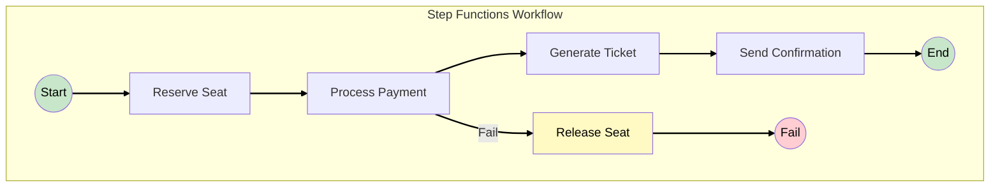
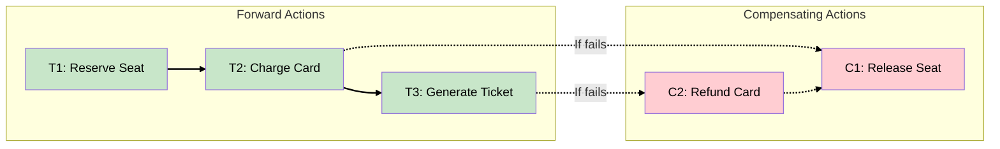
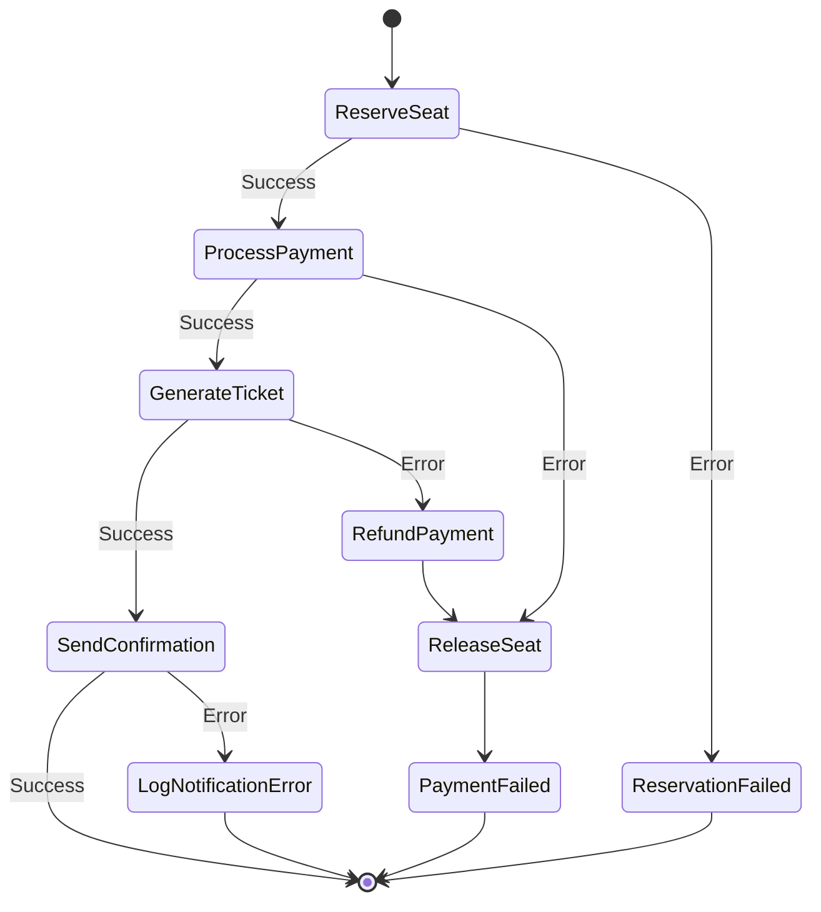
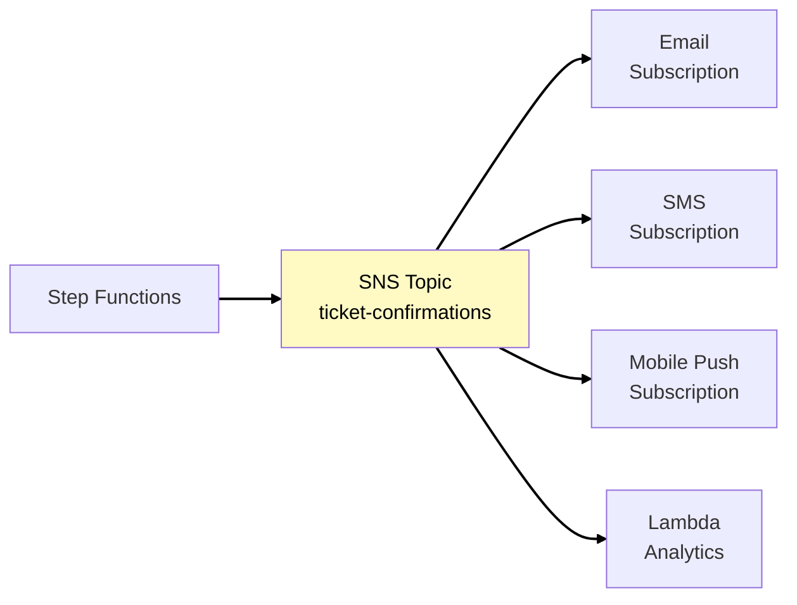
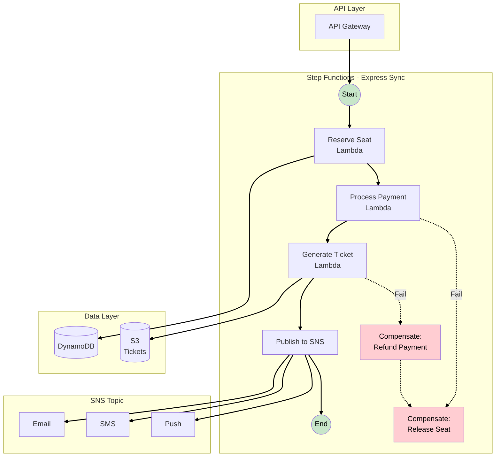

# Phase 4: Step Functions - Complex Workflows

## Business Context

**Situation:** EventPro has expanded to premium ticket sales with seat selection. A premium purchase
now involves multiple steps:

1. Reserve the selected seat (hold for 10 minutes)
2. Process payment
3. Generate ticket
4. Send confirmation email

**The problem:** If payment fails after seat reservation, the seat must be released. Currently,
Lambda functions handle this with nested try-catch blocks and custom retry logic - it's becoming a
maintenance nightmare.

**Your decision:** Use AWS Step Functions to orchestrate the workflow with proper compensation logic
(Saga pattern).

---

## The Problem with Embedded Orchestration

### Current Lambda Code (Simplified)

```javascript
// This is hard to maintain and error-prone
async function purchaseTicket(event) {
  let seatReserved = false;
  let paymentProcessed = false;

  try {
    // Step 1: Reserve seat
    await reserveSeat(event.seatId);
    seatReserved = true;

    // Step 2: Process payment
    await processPayment(event.paymentInfo);
    paymentProcessed = true;

    // Step 3: Generate ticket
    await generateTicket(event);

    // Step 4: Send confirmation
    await sendConfirmation(event.email);

    return { status: "SUCCESS" };
  } catch (error) {
    // Compensation logic - hard to get right!
    if (paymentProcessed) {
      await refundPayment(event.paymentInfo); // What if this fails?
    }
    if (seatReserved) {
      await releaseSeat(event.seatId); // What if this fails?
    }
    throw error;
  }
}
```

**Problems with this approach:**

| Issue                     | Impact                                         |
| ------------------------- | ---------------------------------------------- |
| **Nested error handling** | Complex, error-prone compensation logic        |
| **No visibility**         | Can't see where the workflow failed            |
| **Retry complexity**      | Each step needs different retry policies       |
| **Timeout issues**        | Lambda max 15 min, payment gateway may be slow |
| **Partial failures**      | Hard to recover from crashes mid-workflow      |

---

## AWS Step Functions

### What is Step Functions?

**AWS Step Functions** is a serverless workflow orchestration service. You define your workflow as a
state machine, and Step Functions handles execution, retries, error handling, and compensation.



### Standard vs Express Workflows

Step Functions offers two workflow types. The choice depends on duration, volume, and consistency
requirements. For EventPro's checkout (< 5 minutes, high volume), Express Synchronous is ideal:

| Characteristic    | Standard Workflow       | Express Workflow                             |
| ----------------- | ----------------------- | -------------------------------------------- |
| Max duration      | 1 year                  | 5 minutes                                    |
| Execution model   | Exactly-once            | At-least-once (async) or At-most-once (sync) |
| Pricing           | Per state transition    | Per execution + duration + memory            |
| Execution history | 90 days via API         | CloudWatch Logs only                         |
| Use case          | Long-running, auditable | High-volume, short duration                  |

> **Source:**
> [Choosing Workflow Type](https://docs.aws.amazon.com/step-functions/latest/dg/choosing-workflow-type.html)

**For EventPro ticket checkout:**

- **Duration:** ~30 seconds (well under 5 min)
- **Volume:** Thousands per minute during sales
- **Need:** Synchronous response to user

**Choice:** Express Synchronous Workflow

> **SAA Exam Tip:** "High-volume, short-duration workflow" → Express. "Needs audit trail" or "runs
> for hours/days" → Standard.

---

## The Saga Pattern

### What is the Saga Pattern?

The **Saga pattern** is a way to manage distributed transactions across multiple services. Instead
of a single atomic transaction, you have a sequence of local transactions, each with a compensating
action if a later step fails.



### Orchestration vs Choreography

There are two ways to implement Sagas. Step Functions uses orchestration:

| Aspect          | Orchestration (Step Functions)      | Choreography (Event-Driven)      |
| --------------- | ----------------------------------- | -------------------------------- |
| **Coordinator** | Central orchestrator                | No central coordinator           |
| **Visibility**  | Single place to see workflow        | Events scattered across services |
| **Coupling**    | Services coupled to orchestrator    | Services loosely coupled         |
| **Complexity**  | Logic in one place                  | Logic distributed                |
| **Best for**    | Complex workflows with compensation | Simple event flows               |

**For EventPro checkout:** Orchestration is better because:

- We need guaranteed compensation if payment fails
- We want visibility into where purchases fail
- The workflow has clear sequential dependencies

---

## EventPro Checkout Workflow

### State Machine Definition



### Step-by-Step Flow

**Happy Path:**

1. **Reserve Seat** → Holds seat in DynamoDB with TTL
2. **Process Payment** → Calls Stripe/payment provider
3. **Generate Ticket** → Creates PDF, stores in S3
4. **Send Confirmation** → SNS to email/SMS
5. **Success** → Return confirmation to user

**Payment Failure Path:**

1. **Reserve Seat** → Success
2. **Process Payment** → Card declined
3. **Release Seat** → Compensation: remove reservation
4. **Return error** → User sees "Payment failed"

**Late Failure Path:**

1. **Reserve Seat** → Success
2. **Process Payment** → Success
3. **Generate Ticket** → Fails (S3 issue)
4. **Refund Payment** → Compensation: reverse charge
5. **Release Seat** → Compensation: remove reservation
6. **Return error** → User sees "Error, please retry"

---

## Error Handling in Step Functions

### Retry Configuration

Step Functions can automatically retry failed steps with configurable backoff:

```json
{
  "Retry": [
    {
      "ErrorEquals": ["PaymentGatewayTimeout"],
      "IntervalSeconds": 2,
      "MaxAttempts": 3,
      "BackoffRate": 2.0
    }
  ]
}
```

| Parameter       | Description                         | Example Value     |
| --------------- | ----------------------------------- | ----------------- |
| ErrorEquals     | Error types to catch                | Timeout errors    |
| IntervalSeconds | Wait before first retry             | 2 seconds         |
| MaxAttempts     | Total retry attempts                | 3                 |
| BackoffRate     | Multiplier for each subsequent wait | 2.0 (exponential) |

**Retry timeline example:**

```
Attempt 1: Fails → Wait 2 seconds
Attempt 2: Fails → Wait 4 seconds (2 × 2)
Attempt 3: Fails → Wait 8 seconds (4 × 2)
Attempt 4: Not attempted (MaxAttempts = 3) → Catch block
```

### Catch Configuration

After retries are exhausted, Catch defines what happens next:

```json
{
  "Catch": [
    {
      "ErrorEquals": ["States.ALL"],
      "Next": "CompensationWorkflow",
      "ResultPath": "$.error"
    }
  ]
}
```

> **SAA Exam Tip:** Step Functions error handling: Retry for transient errors, Catch for
> compensation logic.

---

## Amazon SNS for Notifications

### WHY SNS for Confirmations?

When a ticket is purchased, we need to notify the user via multiple channels:

- Email confirmation
- SMS notification (optional)
- Mobile push notification

**Amazon SNS (Simple Notification Service)** enables pub/sub messaging to multiple subscribers from
a single publish action.



### SNS vs SQS

Understanding when to use each is critical for the exam:

| Aspect      | SNS                 | SQS                            |
| ----------- | ------------------- | ------------------------------ |
| Pattern     | Pub/Sub (fan-out)   | Queue (point-to-point)         |
| Delivery    | Push to subscribers | Pull by consumers              |
| Persistence | No (delivered once) | Yes (retained until processed) |
| Use case    | Broadcast to many   | Buffer for workers             |

**For EventPro:**

- **SNS:** Send confirmation to email + SMS + push simultaneously
- **SQS:** Buffer purchase requests for worker processing

> **SAA Exam Tip:** "One message to many consumers" → SNS. "Many producers to single consumer pool"
> → SQS.

---

## Phase 4 Complete Architecture



---

## Key SAA Exam Concepts from Phase 4

### Must-Know Topics

1. **Step Functions Workflow Types**
   - Standard: Long-running (up to 1 year), exactly-once, audit history
   - Express: Short duration (5 min), high volume, at-least/at-most-once

2. **Saga Pattern**
   - Distributed transactions without distributed locks
   - Each step has a compensating action
   - Step Functions is ideal for orchestration-based Sagas

3. **Error Handling**
   - Retry: Automatic retries with exponential backoff
   - Catch: Route to compensation or error handling states
   - ResultPath: Preserve original input while adding error info

4. **SNS Characteristics**
   - Pub/Sub fan-out pattern
   - Push-based delivery
   - Multiple subscription types (email, SMS, Lambda, SQS, HTTP)

5. **SNS + SQS Fan-out**
   - SNS publishes to multiple SQS queues
   - Each queue can have different consumers
   - Common pattern for parallel processing

---

## See Also

> **Related Learning:**
>
> - For event-driven patterns with EventBridge, see
>   [Phase 5: EventBridge Routing](phase-5-eventbridge-routing.md)
> - For SNS fan-out patterns, see
>   [TechBooks Phase 6: Modernization](/scenarios/techbooks/phases/phase-6-modernization.md)

---

## What's Coming in Phase 5?

**Business trigger:** "When a ticket is purchased, we need to: send to print partner, update mobile
app, notify analytics, and schedule marketing emails. Our Step Functions workflow is getting
cluttered with side effects."

**Next decisions:**

- Introduce EventBridge for event routing
- Decouple core workflow from side effects
- Use EventBridge Scheduler for delayed actions

---

## References

### AWS Documentation

- [Step Functions Concepts](https://docs.aws.amazon.com/step-functions/latest/dg/concepts-standard-vs-express.html)
- [Choosing Workflow Type](https://docs.aws.amazon.com/step-functions/latest/dg/choosing-workflow-type.html)
- [Error Handling in Step Functions](https://docs.aws.amazon.com/step-functions/latest/dg/concepts-error-handling.html)
- [Amazon SNS](https://docs.aws.amazon.com/sns/latest/dg/welcome.html)

### Architecture Patterns

- [Saga Pattern - AWS Prescriptive Guidance](https://docs.aws.amazon.com/prescriptive-guidance/latest/modernization-data-persistence/saga-pattern.html)
