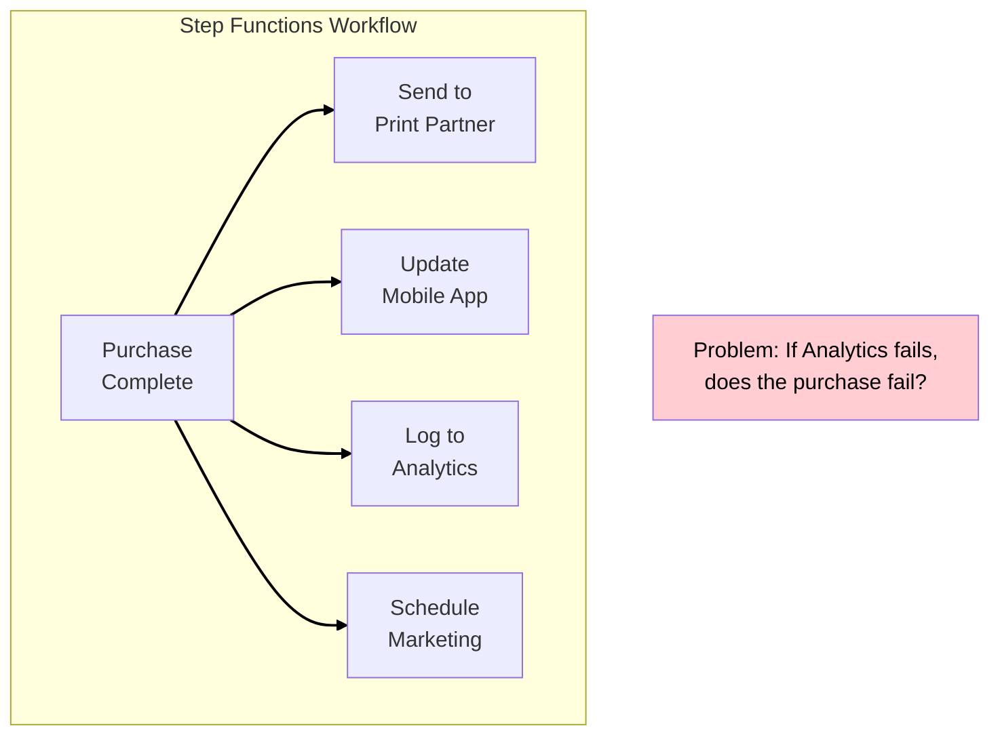
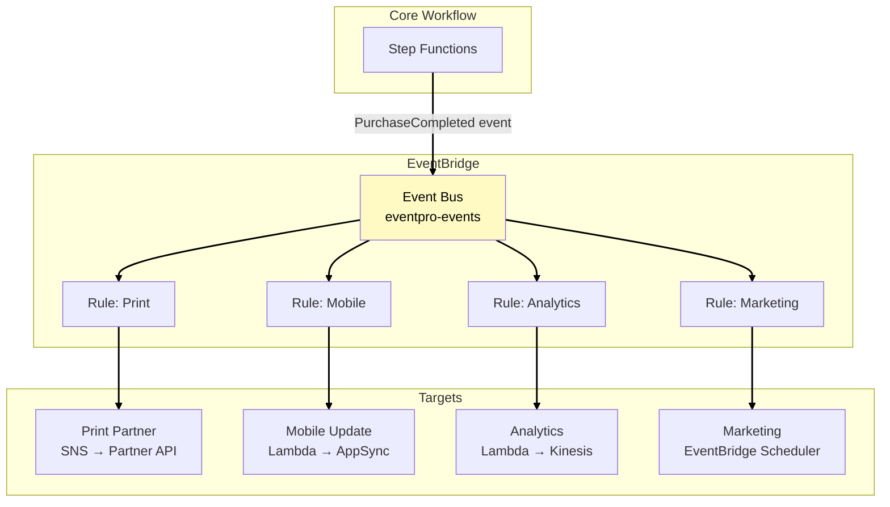
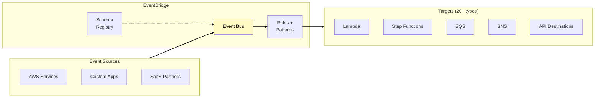
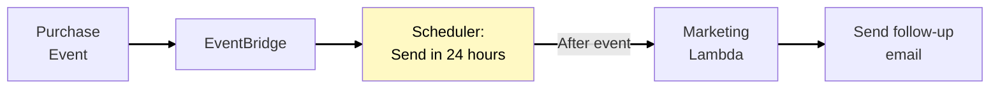
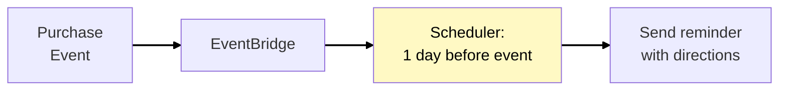
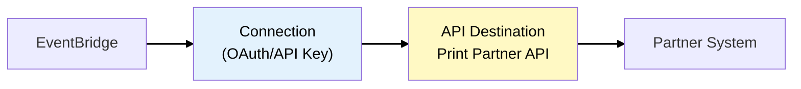
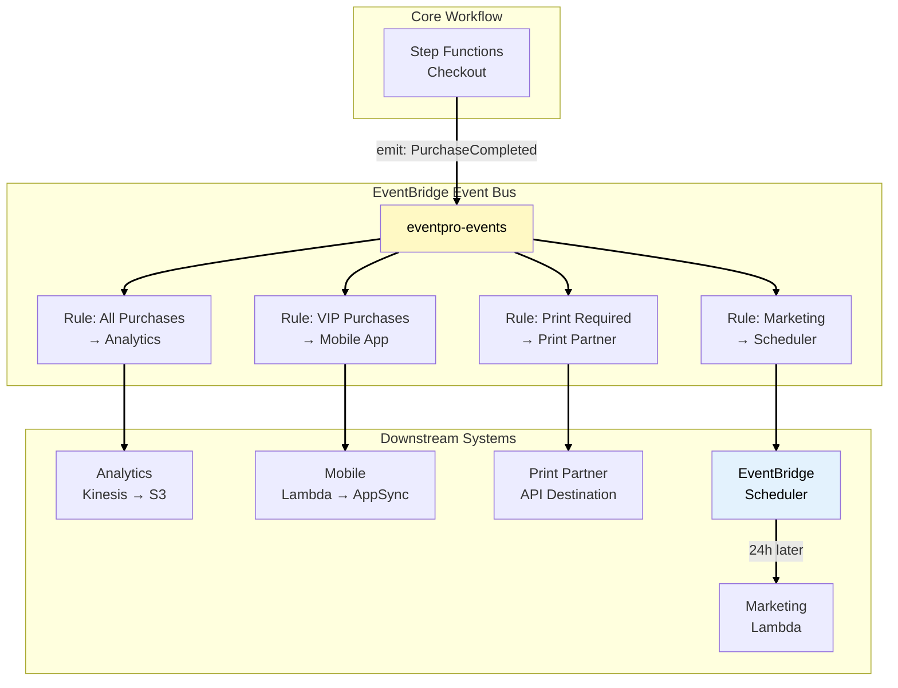

# Phase 5: EventBridge - Event Routing and Integration

## Business Context

**Situation:** EventPro's ticket purchase workflow (Phase 4) is working well. But the Step Functions
workflow is getting bloated with "side effects" - actions that aren't core to the purchase but need
to happen:

- Send ticket to print partner
- Update mobile app with purchase
- Log to analytics system
- Schedule marketing follow-up email (24 hours after event)

**The problem:** Adding these to the Step Functions workflow makes it complex and tightly coupled.
If the analytics Lambda fails, should the purchase fail? No - these are separate concerns.

**Your decision:** Use Amazon EventBridge to route events to downstream consumers, decoupling the
core workflow from side effects.

---

## Before EventBridge: Coupled Architecture



---

## After EventBridge: Decoupled Architecture



**Benefits:**

- Core workflow doesn't know about consumers
- Add/remove consumers without changing workflow
- Each consumer can fail independently
- Different retry policies per consumer

---

## Amazon EventBridge

### What is EventBridge?

**Amazon EventBridge** is a serverless event bus that connects applications using events. It routes
events from sources to targets based on rules you define.

### EventBridge Components



### EventBridge Quotas

Understanding these limits helps you design correctly for high-volume scenarios:

| Resource                | Default Limit    | Notes                        |
| ----------------------- | ---------------- | ---------------------------- |
| Rules per event bus     | 300              | Can request increase         |
| Targets per rule        | 5                | Use fan-out pattern for more |
| Event buses per account | 100              | Per region                   |
| Event size              | 256 KB           | Same as SQS                  |
| Invocations per second  | Varies by target | Lambda: 1M, SQS: unlimited   |

> **Source:**
> [EventBridge Quotas](https://docs.aws.amazon.com/eventbridge/latest/userguide/eb-quotas.html)

---

## EventBridge vs SNS vs SQS

These three services all involve message passing, but serve different purposes. This comparison
helps you choose the right service:

| Characteristic | EventBridge                      | SNS                     | SQS                   |
| -------------- | -------------------------------- | ----------------------- | --------------------- |
| **Pattern**    | Event router                     | Pub/Sub fan-out         | Message queue         |
| **Filtering**  | Content-based rules              | Message attributes only | None (at source)      |
| **Targets**    | 20+ AWS services + HTTP          | Subscribers only        | Consumers only        |
| **Schema**     | Schema discovery & registry      | None                    | None                  |
| **Scheduling** | Built-in (EventBridge Scheduler) | None                    | Delay (up to 15 min)  |
| **Use case**   | Event routing, integration       | Broadcast notifications | Work queue, buffering |

**For EventPro:**

- **EventBridge:** Route purchase events to multiple systems based on content
- **SNS:** Send user notifications (email, SMS)
- **SQS:** Buffer high-volume ticket requests for processing

> **SAA Exam Tip:** "Route events based on content to different targets" → EventBridge. "Simple
> fan-out to subscribers" → SNS. "Buffer and decouple" → SQS.

---

## Event Patterns and Rules

### Anatomy of an EventBridge Event

```json
{
  "version": "0",
  "id": "abc123",
  "detail-type": "PurchaseCompleted",
  "source": "eventpro.tickets",
  "account": "123456789012",
  "time": "2024-01-15T10:30:00Z",
  "region": "us-east-1",
  "detail": {
    "orderId": "ORD-12345",
    "eventId": "EVT-789",
    "userId": "USR-456",
    "ticketType": "VIP",
    "amount": 250.0,
    "venue": "Madison Square Garden"
  }
}
```

### Event Pattern Matching

Rules use patterns to match events. Only matching events trigger the rule's targets.

**Match by source and detail-type:**

```json
{
  "source": ["eventpro.tickets"],
  "detail-type": ["PurchaseCompleted"]
}
```

**Match VIP purchases only:**

```json
{
  "source": ["eventpro.tickets"],
  "detail-type": ["PurchaseCompleted"],
  "detail": {
    "ticketType": ["VIP"]
  }
}
```

**Match high-value purchases (> $100):**

```json
{
  "source": ["eventpro.tickets"],
  "detail-type": ["PurchaseCompleted"],
  "detail": {
    "amount": [{ "numeric": [">", 100] }]
  }
}
```

> **SAA Exam Tip:** EventBridge pattern matching supports prefix, suffix, numeric comparisons,
> exists/not-exists, and OR logic.

---

## EventBridge Scheduler

### What is EventBridge Scheduler?

**EventBridge Scheduler** is a serverless scheduler for one-time or recurring tasks. Unlike
CloudWatch Events scheduled rules, it's designed for high-volume scheduling with millions of
schedules.

### Scheduler vs Scheduled Rules

| Feature               | EventBridge Scheduler        | CloudWatch Scheduled Rules |
| --------------------- | ---------------------------- | -------------------------- |
| Scale                 | Millions of schedules        | ~300 rules per bus         |
| One-time schedules    | Yes                          | No                         |
| Time zones            | Supports all IANA zones      | UTC only                   |
| Flexible time windows | Yes (1-15 min window)        | No                         |
| Use case              | Per-user schedules, one-time | Recurring system tasks     |

### EventPro Use Cases

**Scheduled marketing follow-up:**



**Ticket expiration reminder:**



> **SAA Exam Tip:** "Schedule per-user tasks at scale" → EventBridge Scheduler. "Run batch job every
> night" → CloudWatch scheduled rule or EventBridge scheduled rule.

---

## Integration with External Partners

### API Destinations

EventBridge can call external HTTP endpoints directly, without Lambda:



**For EventPro print partner:**

| Component       | Purpose                           |
| --------------- | --------------------------------- |
| Connection      | Stores OAuth credentials securely |
| API Destination | Defines endpoint URL, rate limits |
| Rule target     | Routes matching events to API     |

**Benefits over Lambda:**

- No code to maintain
- Built-in rate limiting
- Automatic retries
- Credentials managed in Secrets Manager

---

## Phase 5 Complete Architecture



---

## Key SAA Exam Concepts from Phase 5

### Must-Know Topics

1. **EventBridge Components**
   - Event bus: Receives and routes events
   - Rules: Match events using patterns
   - Targets: Destinations for matching events (20+ types)
   - Schema registry: Discover and store event schemas

2. **Event Pattern Matching**
   - Match by source, detail-type, account, region
   - Content filtering on detail fields
   - Numeric comparisons, prefix/suffix matching

3. **EventBridge vs SNS vs SQS**
   - EventBridge: Content-based routing, many targets
   - SNS: Fan-out notifications
   - SQS: Work queue, buffering

4. **EventBridge Scheduler**
   - Millions of one-time or recurring schedules
   - Time zone support
   - Replaces at-scale cron with Lambda

5. **API Destinations**
   - Call external HTTP APIs without Lambda
   - OAuth and API key authentication
   - Built-in rate limiting and retries

---

## See Also

> **Related Learning:**
>
> - For EventBridge with security events (GuardDuty findings), see
>   [MedVault Phase 6: Threat Detection](/scenarios/medvault/phases/phase-6-threat-detection.md)
> - For DynamoDB Streams triggering events, see
>   [TechBooks Phase 6: Modernization](/scenarios/techbooks/phases/phase-6-modernization.md)

---

## What's Coming in Phase 6?

**Business trigger:** "We're handling 100K+ concurrent users! But when something fails, we can't
trace a purchase through all our services. The CEO wants a real-time dashboard showing sales and
system health."

**Next decisions:**

- Implement AWS X-Ray for distributed tracing
- Create CloudWatch dashboards
- Use Lambda Provisioned Concurrency for consistent latency

---

## References

### AWS Documentation

- [EventBridge Concepts](https://docs.aws.amazon.com/eventbridge/latest/userguide/eb-what-is.html)
- [EventBridge Event Patterns](https://docs.aws.amazon.com/eventbridge/latest/userguide/eb-event-patterns.html)
- [EventBridge Targets](https://docs.aws.amazon.com/eventbridge/latest/userguide/eb-targets.html)
- [EventBridge Scheduler](https://docs.aws.amazon.com/scheduler/latest/UserGuide/what-is-scheduler.html)
- [EventBridge API Destinations](https://docs.aws.amazon.com/eventbridge/latest/userguide/eb-api-destinations.html)

### Architecture Patterns

- [Event-Driven Architecture](https://docs.aws.amazon.com/prescriptive-guidance/latest/modernization-integrating-microservices/event-driven.html)
