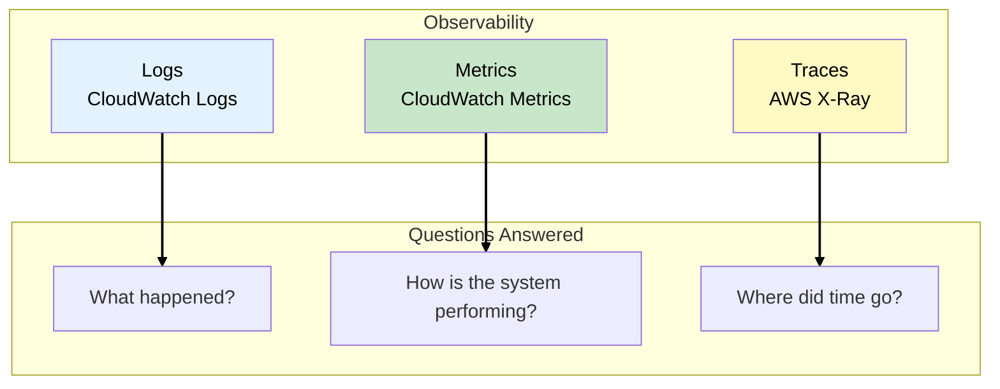
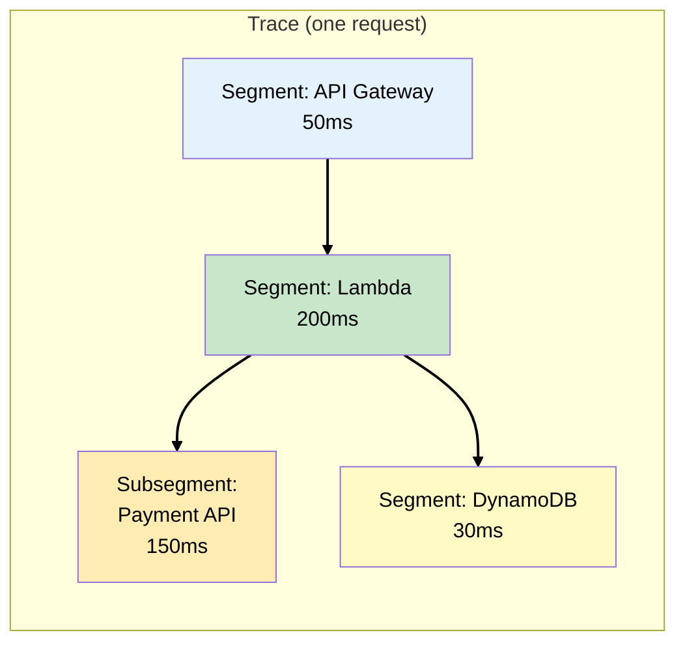
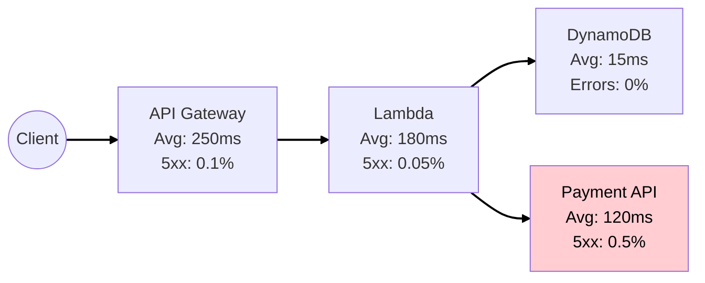
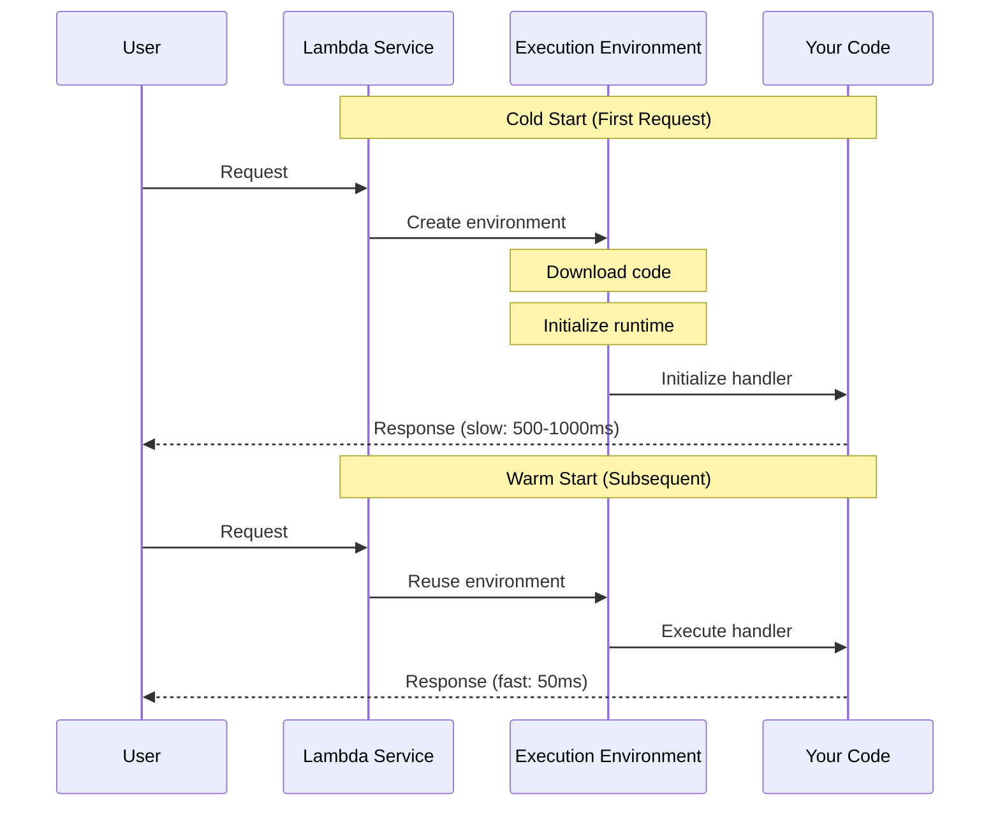
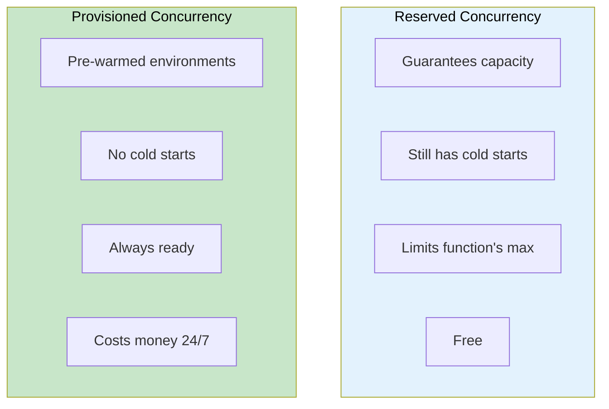
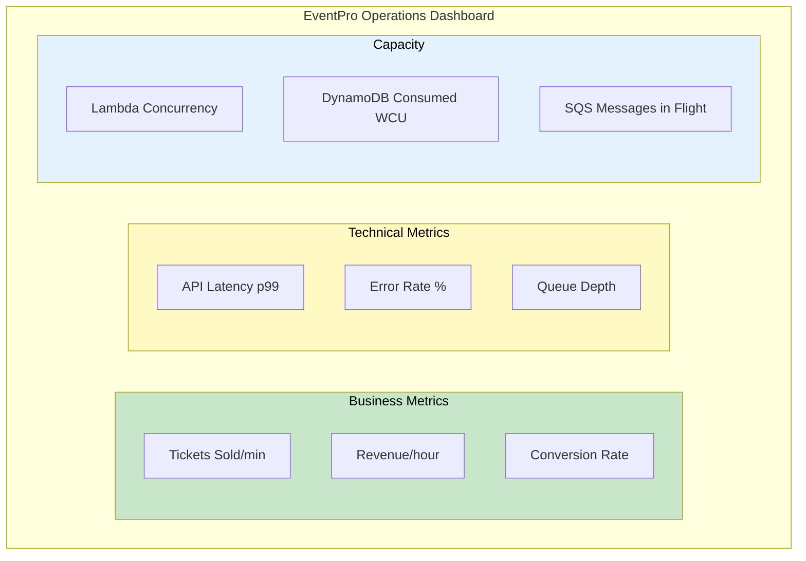
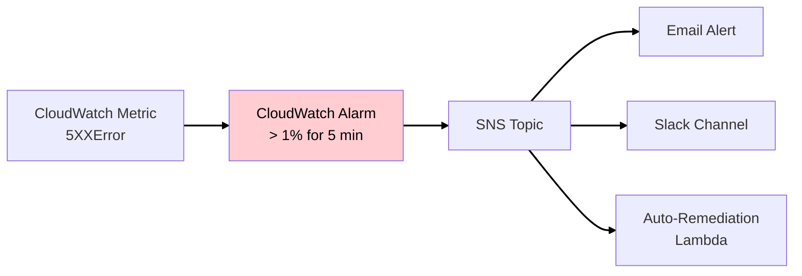
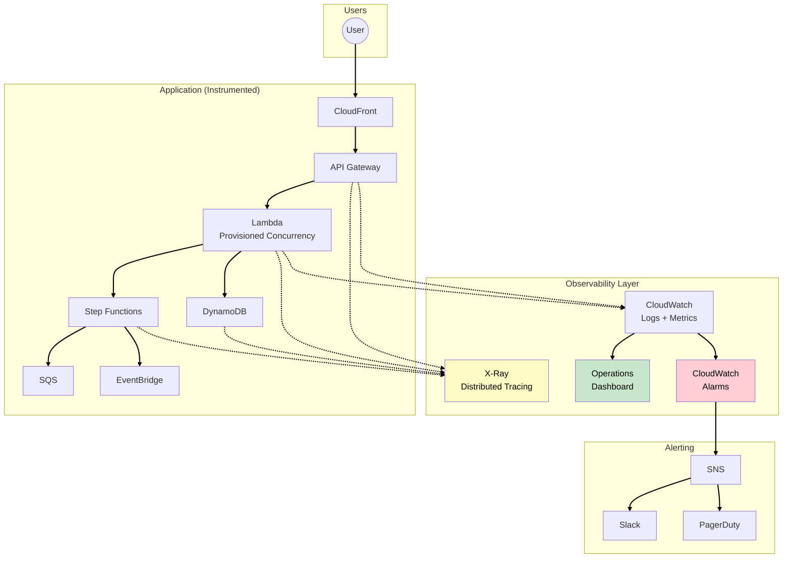
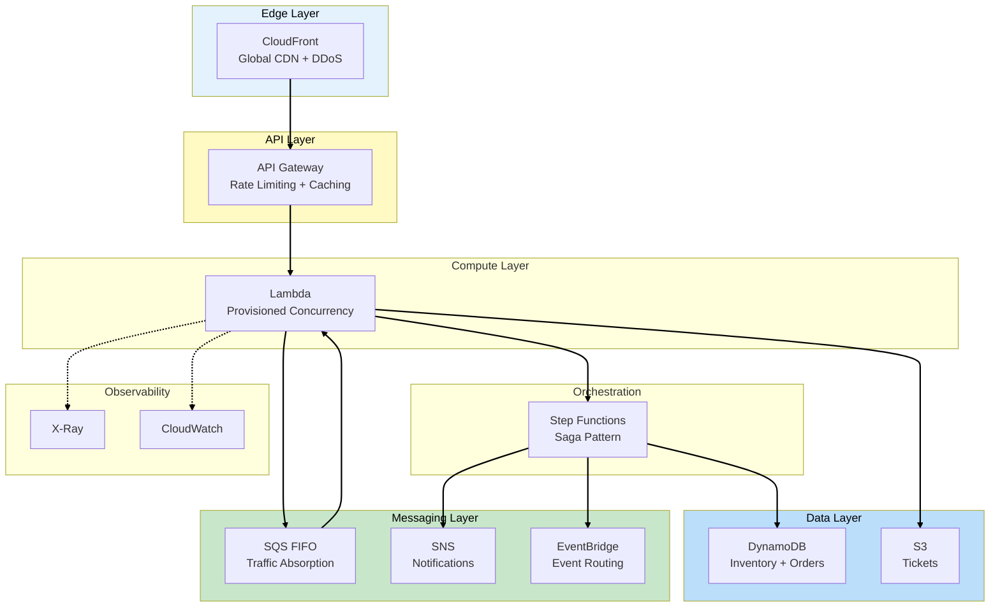

# Phase 6: Event-Driven Observability

## Business Context

**Situation:** EventPro is now handling 100K+ concurrent users during major sales. The architecture
is resilient, but a new challenge has emerged: **visibility**.

**The problems:**

- When a purchase fails, support can't trace what happened
- Cold starts cause latency spikes during sudden traffic surges
- The CEO wants a real-time dashboard showing sales velocity and system health
- Debugging requires checking logs across 10+ services manually

**Your decision:** Implement comprehensive observability with AWS X-Ray for distributed tracing,
CloudWatch for metrics and dashboards, and Lambda Provisioned Concurrency for consistent
performance.

---

## The Three Pillars of Observability



| Pillar  | Tool               | Purpose                               |
| ------- | ------------------ | ------------------------------------- |
| Logs    | CloudWatch Logs    | Detailed event records, debugging     |
| Metrics | CloudWatch Metrics | Quantitative measurements, alerting   |
| Traces  | AWS X-Ray          | Request flow across services, latency |

---

## AWS X-Ray: Distributed Tracing

### What is X-Ray?

**AWS X-Ray** traces requests as they travel through your distributed application. It shows how time
is spent across services, helping you identify bottlenecks and failures.

### X-Ray Concepts



| Concept         | Description                            |
| --------------- | -------------------------------------- |
| **Trace**       | End-to-end journey of a single request |
| **Segment**     | Work done by a single service          |
| **Subsegment**  | Detailed breakdown within a segment    |
| **Annotations** | Indexed key-value pairs for filtering  |
| **Metadata**    | Non-indexed data for context           |

### X-Ray Service Map

X-Ray automatically generates a visual map of your architecture:



**WHY this matters for EventPro:**

- See which service is causing latency
- Identify error rates per service
- Trace a specific failed purchase by order ID

> **SAA Exam Tip:** X-Ray sampling controls what percentage of requests are traced. Default: first
> request each second + 5% of additional requests. Adjust for high-volume applications.

---

## Lambda Performance Optimization

### Understanding Cold Starts

A **cold start** occurs when Lambda creates a new execution environment. This adds latency to the
first request.



### Lambda Concurrency Types

Lambda has three concurrency settings. Understanding the differences is critical for the exam and
for avoiding throttling during flash sales:

| Type                        | Description                                      | Default        |
| --------------------------- | ------------------------------------------------ | -------------- |
| **Account concurrency**     | Total concurrent executions across all functions | 1,000 (soft)   |
| **Reserved concurrency**    | Guaranteed capacity for a specific function      | 0 (unreserved) |
| **Provisioned concurrency** | Pre-initialized environments (no cold start)     | 0              |

### Reserved vs Provisioned Concurrency



**For EventPro:**

- **Reserved:** Set on critical functions to prevent other functions from consuming all capacity
- **Provisioned:** Set on the checkout Lambda during scheduled flash sales

### Lambda Quotas

These limits appear frequently on the SAA exam:

| Limit               | Value                    | Notes                     |
| ------------------- | ------------------------ | ------------------------- |
| Account concurrency | 1,000 (default)          | Soft limit, can increase  |
| Memory              | 128 MB - 10,240 MB       | CPU scales with memory    |
| Timeout             | 15 minutes (900 seconds) | Hard limit                |
| Payload (sync)      | 6 MB request/response    | Use S3 for larger         |
| Payload (async)     | 256 KB event             | Use SQS for larger        |
| /tmp storage        | 512 MB - 10,240 MB       | Ephemeral, per invocation |
| Scaling rate        | 1,000 instances/10 sec   | Per function              |

> **Source:**
> [Lambda Quotas](https://docs.aws.amazon.com/lambda/latest/dg/gettingstarted-limits.html)

> **SAA Exam Tip:** "How do you eliminate Lambda cold starts?" → Provisioned Concurrency. "How do
> you ensure a function always has capacity?" → Reserved Concurrency.

---

## CloudWatch Dashboards

### Building an EventPro Operations Dashboard

A well-designed dashboard shows system health at a glance:



### Key Metrics to Monitor

| Service     | Metric                        | Alert Threshold        |
| ----------- | ----------------------------- | ---------------------- |
| API Gateway | 5XXError                      | > 1% for 5 minutes     |
| API Gateway | Latency (p99)                 | > 3 seconds            |
| Lambda      | ConcurrentExecutions          | > 80% of limit         |
| Lambda      | Errors                        | > 0 for 5 minutes      |
| Lambda      | Duration (p99)                | > 80% of timeout       |
| SQS         | ApproximateNumberOfMessages   | > 10,000 (building up) |
| SQS         | ApproximateAgeOfOldestMessage | > 300 seconds          |
| DynamoDB    | ConsumedWriteCapacityUnits    | > 80% of provisioned   |
| DynamoDB    | ThrottledRequests             | > 0                    |

### CloudWatch Alarms



---

## CloudWatch Logs Insights

### Querying Logs

CloudWatch Logs Insights allows SQL-like queries across log groups:

**Find slow Lambda executions:**

```sql
fields @timestamp, @requestId, @duration
| filter @duration > 1000
| sort @duration desc
| limit 20
```

**Count errors by type:**

```sql
fields @message
| filter @message like /ERROR/
| stats count(*) by errorType
```

**Trace a specific order:**

```sql
fields @timestamp, @message
| filter orderId = "ORD-12345"
| sort @timestamp asc
```

> **SAA Exam Tip:** CloudWatch Logs Insights charges per GB scanned. Use time filters to reduce
> costs.

---

## Phase 6 Complete Architecture



---

## EventPro: Final Architecture Summary

After all 6 phases, EventPro has evolved from a crashing monolith to a resilient, observable,
event-driven architecture:



---

## Key SAA Exam Concepts from Phase 6

### Must-Know Topics

1. **X-Ray Components**
   - Traces, segments, subsegments
   - Annotations (indexed) vs metadata (not indexed)
   - Service map for visualization
   - Sampling to control costs

2. **Lambda Concurrency**
   - Account concurrency: Total across all functions (default 1,000)
   - Reserved: Guarantees capacity, has cold starts
   - Provisioned: Pre-warmed, no cold starts, costs money

3. **Lambda Limits**
   - Timeout: 15 minutes maximum
   - Memory: 128 MB - 10,240 MB
   - Payload sync: 6 MB
   - Scaling: 1,000 instances per 10 seconds

4. **CloudWatch**
   - Metrics: Quantitative data points
   - Logs: Text records
   - Alarms: Threshold-based notifications
   - Dashboards: Visualization

5. **Logs Insights**
   - SQL-like query language
   - Query across log groups
   - Charged per GB scanned

---

## See Also

> **Related Learning:**
>
> - For CloudWatch and CloudTrail in security context, see
>   [MedVault Phase 4: Logging & Monitoring](/scenarios/medvault/phases/phase-4-logging-monitoring.md)
> - For Lambda patterns, see
>   [TechBooks Phase 6: Modernization](/scenarios/techbooks/phases/phase-6-modernization.md)

---

## Scenario Complete!

Congratulations! You've transformed EventPro from a crashing monolith to a scalable, resilient,
event-driven architecture capable of handling 100K+ concurrent users.

### What You've Learned

| Phase | Topic                  | Key Services              |
| ----- | ---------------------- | ------------------------- |
| 1     | Problem identification | -                         |
| 2     | Queue-based decoupling | SQS, DynamoDB             |
| 3     | API protection         | API Gateway, CloudFront   |
| 4     | Workflow orchestration | Step Functions, SNS       |
| 5     | Event routing          | EventBridge, Scheduler    |
| 6     | Observability          | X-Ray, CloudWatch, Lambda |

### SAA Exam Domains Covered

- **Domain 1 (Secure):** API protection, rate limiting, DDoS mitigation
- **Domain 2 (Resilient):** Decoupling, Saga pattern, fault tolerance
- **Domain 3 (High-Performing):** Async processing, caching, provisioned concurrency
- **Domain 4 (Cost-Optimized):** Serverless, on-demand scaling, right-sizing

---

## References

### AWS Documentation

- [Lambda Quotas](https://docs.aws.amazon.com/lambda/latest/dg/gettingstarted-limits.html)
- [Lambda Concurrency](https://docs.aws.amazon.com/lambda/latest/dg/configuration-concurrency.html)
- [Lambda Provisioned Concurrency](https://docs.aws.amazon.com/lambda/latest/dg/provisioned-concurrency.html)
- [X-Ray Concepts](https://docs.aws.amazon.com/xray/latest/devguide/xray-concepts.html)
- [CloudWatch Logs Insights](https://docs.aws.amazon.com/AmazonCloudWatch/latest/logs/AnalyzingLogData.html)

### Architecture Patterns

- [Observability Best Practices](https://docs.aws.amazon.com/prescriptive-guidance/latest/implementing-logging-monitoring-cloudwatch/introduction.html)
