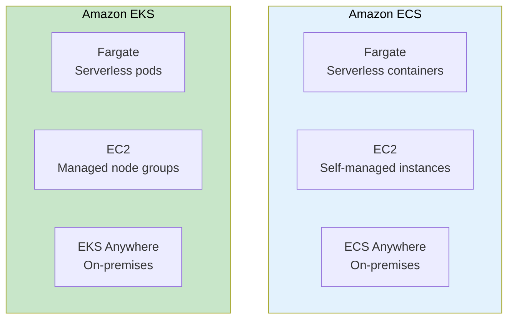
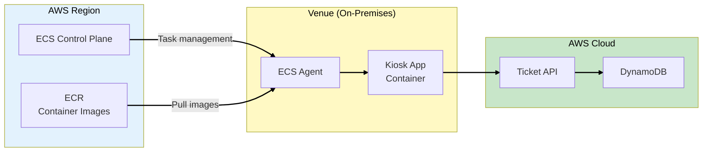
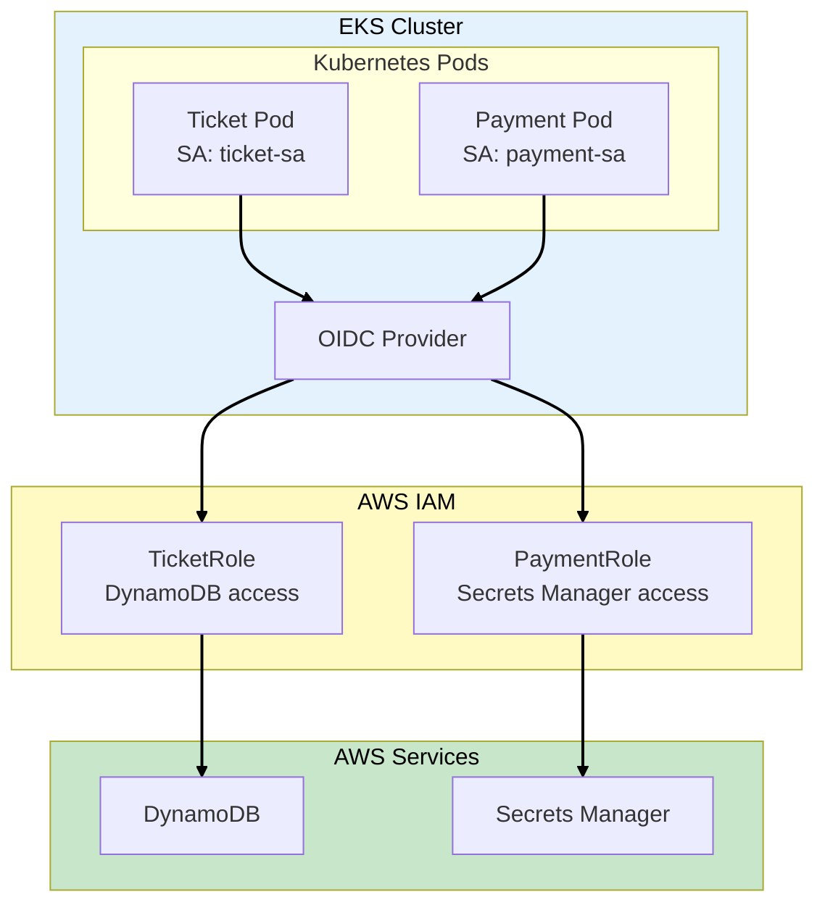
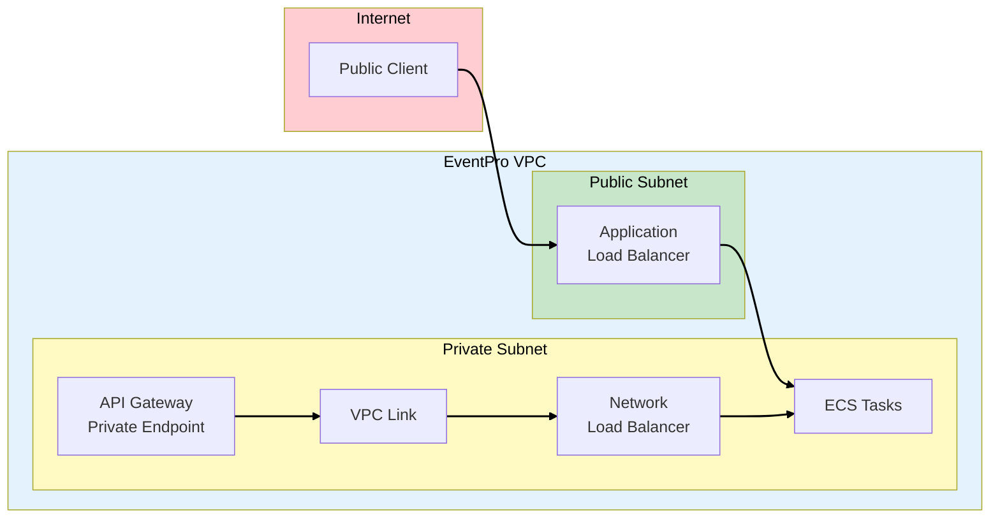
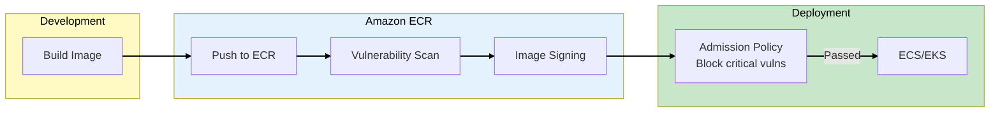
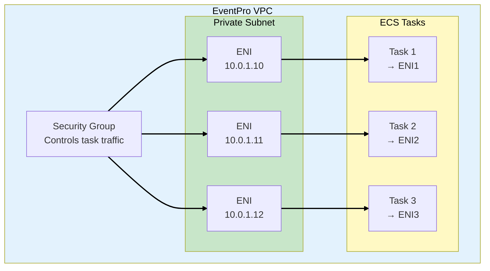
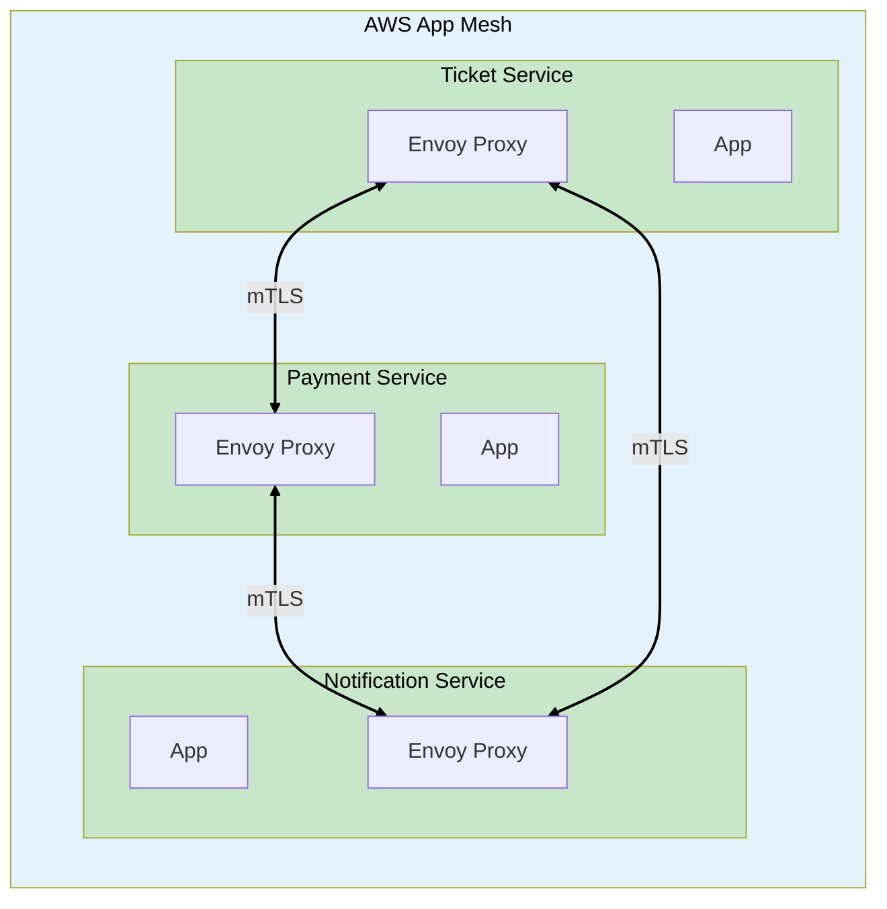
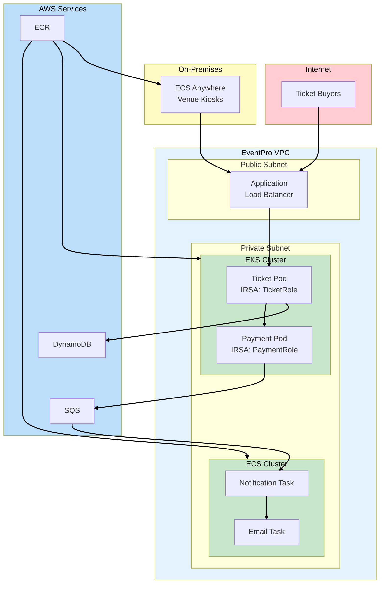

# Phase 7: Container Deployment

## Business Context

**Situation:** EventPro's microservices architecture is working well, but the DevOps team is
struggling. They manage 15 different Lambda functions, each with different runtimes and
dependencies. Deployment takes hours and debugging is painful.

**The DevOps lead's frustration:** "Lambda cold starts are killing our P99 latency. Some functions
need 2GB memory. We're spending more time managing deployment packages than writing code."

**Requirements:**

- Consistent deployment across all microservices
- Reduce cold start latency for critical paths
- Run some workloads on-premises (venue kiosks)
- Secure service-to-service communication
- Private API access for internal services

---

## Step 1: ECS vs EKS Decision

### Container Orchestration Options



### ECS vs EKS Comparison

| Aspect             | ECS                  | EKS                          |
| ------------------ | -------------------- | ---------------------------- |
| **Complexity**     | Simpler, AWS-native  | Complex, Kubernetes standard |
| **Portability**    | AWS-only             | Multi-cloud, on-prem         |
| **Learning curve** | Lower                | Higher                       |
| **Ecosystem**      | AWS integrations     | Kubernetes ecosystem         |
| **Cost**           | No control plane fee | $0.10/hour per cluster       |
| **Best for**       | AWS-first teams      | K8s expertise, multi-cloud   |

> **SAA Exam Tip:** "Simple container orchestration on AWS" = ECS. "Kubernetes with portability" =
> EKS. "Serverless containers" = Fargate (works with both).

---

## Step 2: ECS Anywhere

### Run ECS On-Premises

EventPro's venue kiosks run locally but need the same deployment model:



### ECS Anywhere Features

| Feature              | Description                         |
| -------------------- | ----------------------------------- |
| **Same APIs**        | Use ECS APIs for on-prem and cloud  |
| **SSM integration**  | Systems Manager for connectivity    |
| **Task definitions** | Same task defs work everywhere      |
| **ECR integration**  | Pull images from ECR                |
| **Pricing**          | $0.01025/hour per external instance |

### Registration Process

```bash
# Generate activation key in AWS
aws ssm create-activation \
    --iam-role ECSAnywhereRole \
    --registration-limit 10

# On the external instance
curl -o ecs-anywhere-install.sh \
    https://amazon-ecs-agent.s3.amazonaws.com/ecs-anywhere-install.sh
sudo bash ecs-anywhere-install.sh \
    --region us-east-1 \
    --cluster eventpro-kiosks \
    --activation-id $ACTIVATION_ID \
    --activation-code $ACTIVATION_CODE
```

> **SAA Exam Tip:** "Run containers on-premises with ECS management" = ECS Anywhere. "Kubernetes
> on-premises" = EKS Anywhere. "AWS infrastructure on-premises" = Outposts.

---

## Step 3: EKS and IRSA

### IAM Roles for Service Accounts

**IRSA (IAM Roles for Service Accounts)** provides fine-grained IAM permissions to Kubernetes pods:



### Why IRSA Over Node Roles

| Approach                 | Scope            | Security        |
| ------------------------ | ---------------- | --------------- |
| **EC2 Instance Profile** | All pods on node | Over-privileged |
| **IRSA**                 | Individual pods  | Least privilege |

### Configuring IRSA

```yaml
# Service Account with IAM role annotation
apiVersion: v1
kind: ServiceAccount
metadata:
  name: ticket-service
  annotations:
    eks.amazonaws.com/role-arn: arn:aws:iam::123456789012:role/TicketServiceRole

---
# Pod using the service account
apiVersion: apps/v1
kind: Deployment
metadata:
  name: ticket-service
spec:
  template:
    spec:
      serviceAccountName: ticket-service
      containers:
        - name: ticket-app
          image: 123456789012.dkr.ecr.us-east-1.amazonaws.com/ticket-service:v1
```

> **SAA Exam Tip:** "Fine-grained IAM for Kubernetes pods" = IRSA. "All pods share same IAM role" =
> Instance profile (avoid for security).

---

## Step 4: API Gateway Private Integration

### VPC-Private APIs

EventPro's internal services should not be exposed to the internet:



### Private API Gateway Types

| Type                           | Access              | Use Case               |
| ------------------------------ | ------------------- | ---------------------- |
| **Regional + Resource Policy** | IP/VPC restrictions | Limited public access  |
| **Private**                    | VPC endpoints only  | Internal microservices |

### VPC Link Configuration

```yaml
# Create VPC Link for private integration
Resources:
  VPCLink:
    Type: AWS::ApiGatewayV2::VpcLink
    Properties:
      Name: eventpro-internal
      SubnetIds:
        - !Ref PrivateSubnet1
        - !Ref PrivateSubnet2
      SecurityGroupIds:
        - !Ref VPCLinkSecurityGroup

  InternalAPI:
    Type: AWS::ApiGatewayV2::Api
    Properties:
      Name: eventpro-internal-api
      ProtocolType: HTTP

  Integration:
    Type: AWS::ApiGatewayV2::Integration
    Properties:
      ApiId: !Ref InternalAPI
      IntegrationType: HTTP_PROXY
      IntegrationUri: !Ref ALBListener
      IntegrationMethod: ANY
      ConnectionType: VPC_LINK
      ConnectionId: !Ref VPCLink
```

> **SAA Exam Tip:** "API Gateway to private resources" = VPC Link. "Private API accessible only from
> VPC" = Private API with VPC endpoint.

---

## Step 5: Container Security Best Practices

### ECR Image Scanning



### Security Features

| Feature               | Service         | Description                 |
| --------------------- | --------------- | --------------------------- |
| **Image scanning**    | ECR             | CVE vulnerability detection |
| **Image signing**     | Signer          | Cryptographic signature     |
| **Secrets injection** | Secrets Manager | Inject secrets at runtime   |
| **Task IAM roles**    | ECS/EKS         | Per-task IAM permissions    |
| **Network policies**  | EKS             | Pod-to-pod traffic control  |

> **SAA Exam Tip:** "Scan container images for vulnerabilities" = ECR image scanning. "Prevent
> unsigned images" = Container image signing with admission policies.

---

## Step 6: ECS Task Networking

### awsvpc Network Mode



### Network Mode Comparison

| Mode       | IP Address        | Security Group | Use Case             |
| ---------- | ----------------- | -------------- | -------------------- |
| **awsvpc** | Own ENI, own IP   | Per-task       | **Recommended**      |
| **bridge** | Host port mapping | Host-level     | Legacy EC2           |
| **host**   | Host network      | Host-level     | Performance-critical |
| **none**   | No networking     | N/A            | Batch jobs           |

> **SAA Exam Tip:** "ECS task with its own security group" = awsvpc network mode. Fargate REQUIRES
> awsvpc mode.

---

## Step 7: Service Mesh with App Mesh

### Microservices Communication

For complex service-to-service communication, use **AWS App Mesh**:



### App Mesh Features

| Feature                | Description                      |
| ---------------------- | -------------------------------- |
| **Traffic control**    | Routing rules, retries, timeouts |
| **Observability**      | Metrics, logs, traces via X-Ray  |
| **Security**           | mTLS between services            |
| **Canary deployments** | Weighted routing for rollouts    |

> **SAA Exam Tip:** "Service mesh for microservices on AWS" = App Mesh. "mTLS between containers" =
> App Mesh with Envoy.

---

## Step 8: EventPro Container Architecture

### Complete Solution



### Architecture Decisions

| Component           | Choice           | Reason                      |
| ------------------- | ---------------- | --------------------------- |
| **Core APIs**       | EKS with Fargate | Team has K8s expertise      |
| **Background jobs** | ECS with Fargate | Simpler for async tasks     |
| **Venue kiosks**    | ECS Anywhere     | Consistent deployment model |
| **IAM**             | IRSA             | Least privilege per pod     |
| **Networking**      | awsvpc           | Per-task security groups    |

---

## Exam Tips Summary

| Topic            | Key Point                                             |
| ---------------- | ----------------------------------------------------- |
| **ECS vs EKS**   | ECS = simpler, AWS-native; EKS = Kubernetes, portable |
| **Fargate**      | Serverless containers, works with ECS and EKS         |
| **ECS Anywhere** | Run ECS on-premises, same APIs and task definitions   |
| **EKS Anywhere** | Kubernetes on-premises with EKS management            |
| **IRSA**         | Fine-grained IAM for individual Kubernetes pods       |
| **VPC Link**     | API Gateway to private VPC resources                  |
| **Private API**  | API Gateway accessible only from VPC                  |
| **awsvpc mode**  | Each task gets its own ENI and security group         |
| **App Mesh**     | Service mesh for mTLS and traffic control             |
| **ECR scanning** | Container image vulnerability detection               |

---

**[← Back to EventPro Overview](../00-overview.md)**
