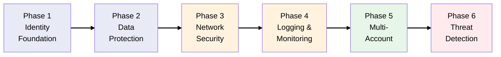

# Secure by Design: The MedVault Story

## The Business

You're the founding Security Architect at **MedVault** - a healthcare startup building a patient
records platform. Before writing a single line of application code, the founders made a commitment:
**security first**.

The CISO (who is also a co-founder) has a mandate: achieve HIPAA compliance and SOC 2 Type II
certification within 12 months.

## The Challenge

Healthcare data is among the most regulated in the world. MedVault must:

- **Protect patient data** at rest, in transit, and in use
- **Control access** with fine-grained permissions
- **Prove compliance** to auditors with comprehensive logs
- **Detect threats** before they become breaches
- **Scale securely** as the platform grows

This scenario teaches the AWS security services that appear on **30% of the SAA exam** - the single
largest domain.

## Learning Objectives

This evolving scenario teaches AWS security and compliance concepts through realistic business
decisions:

- [**Phase 1**: Identity Foundation](scenarios/medvault/phases/phase-1-identity-foundation.md) (IAM,
  Identity Center, Federation)
- [**Phase 2**: Data Protection](scenarios/medvault/phases/phase-2-data-protection.md) (KMS, Secrets
  Manager, Encryption)
- [**Phase 3**: Network Security](scenarios/medvault/phases/phase-3-network-security.md) (VPC
  Endpoints, WAF, Shield)
- [**Phase 4**: Logging & Monitoring](scenarios/medvault/phases/phase-4-logging-monitoring.md)
  (CloudTrail, Config, CloudWatch)
- [**Phase 5**: Multi-Account Strategy](scenarios/medvault/phases/phase-5-multi-account.md)
  (Organizations, SCPs, Control Tower)
- [**Phase 6**: Threat Detection](scenarios/medvault/phases/phase-6-threat-detection.md) (GuardDuty,
  Security Hub, Macie)

## Security Journey Map

**Legend**: Purple = Identity & Data | Orange = Network & Audit | Green = Governance | Red =
Detection

## HIPAA on AWS - The Foundation

MedVault must comply with HIPAA (Health Insurance Portability and Accountability Act). Key
requirements:

| HIPAA Requirement     | AWS Implementation   |
| --------------------- | -------------------- |
| Access controls       | IAM, Identity Center |
| Audit controls        | CloudTrail, Config   |
| Integrity controls    | KMS, S3 versioning   |
| Transmission security | TLS, VPC endpoints   |
| Encryption            | KMS, SSE             |

> **Note**: AWS provides a Business Associate Agreement (BAA) that covers many services for HIPAA
> workloads.

## How This Differs from Other Scenarios

| Aspect               | TechBooks              | ShipFast              | MedVault                  |
| -------------------- | ---------------------- | --------------------- | ------------------------- |
| Starting point       | Greenfield MVP         | On-prem migration     | Security-first greenfield |
| Primary focus        | Scaling & availability | Migration & hybrid    | Security & compliance     |
| Key services         | EC2, RDS, ALB          | VPN, DX, DMS          | IAM, KMS, GuardDuty       |
| Architecture pattern | Build then secure      | Migrate then optimize | Secure then build         |

## SAA Exam Domain Focus

This scenario specifically targets **Domain 1: Design Secure Architectures (30%)**:

| Sub-domain                                   | Phases        |
| -------------------------------------------- | ------------- |
| Design secure access to AWS resources        | Phase 1, 5    |
| Design secure workloads and applications     | Phase 2, 3    |
| Determine appropriate data security controls | Phase 2, 4, 6 |

## How to Use This Guide

Each phase includes:

1. **Business Context** - What's happening at MedVault
2. **Architecture Decision** - What we're building and WHY
3. **Key Concepts** - SAA exam-relevant knowledge
4. **Diagrams** - Visual representation of security architecture
5. **Exam Tips** - Security-specific certification points
