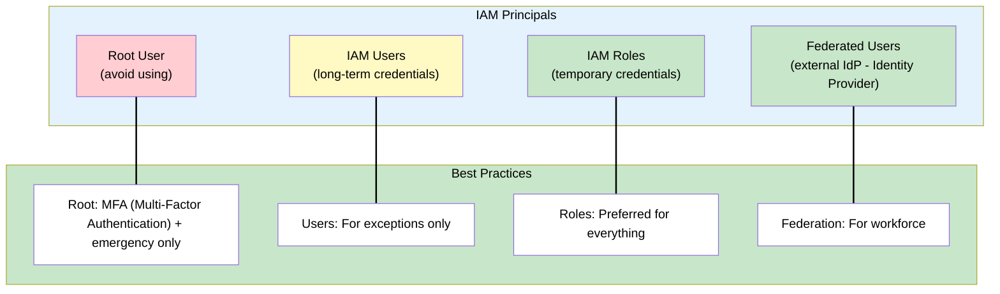
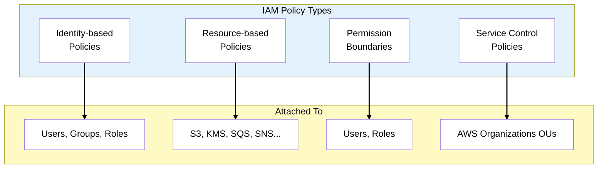
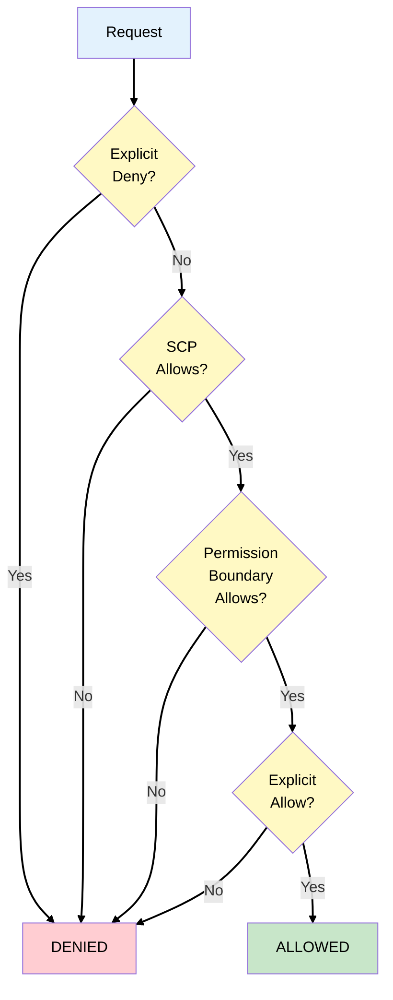
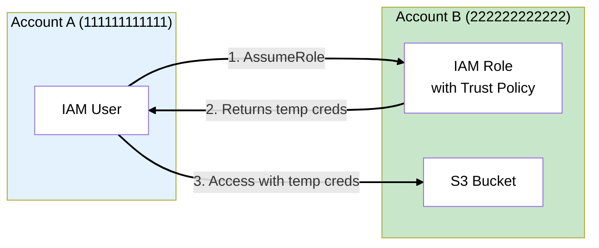
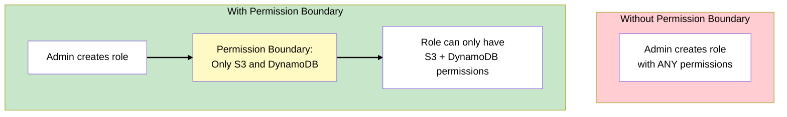
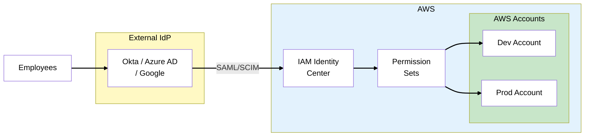
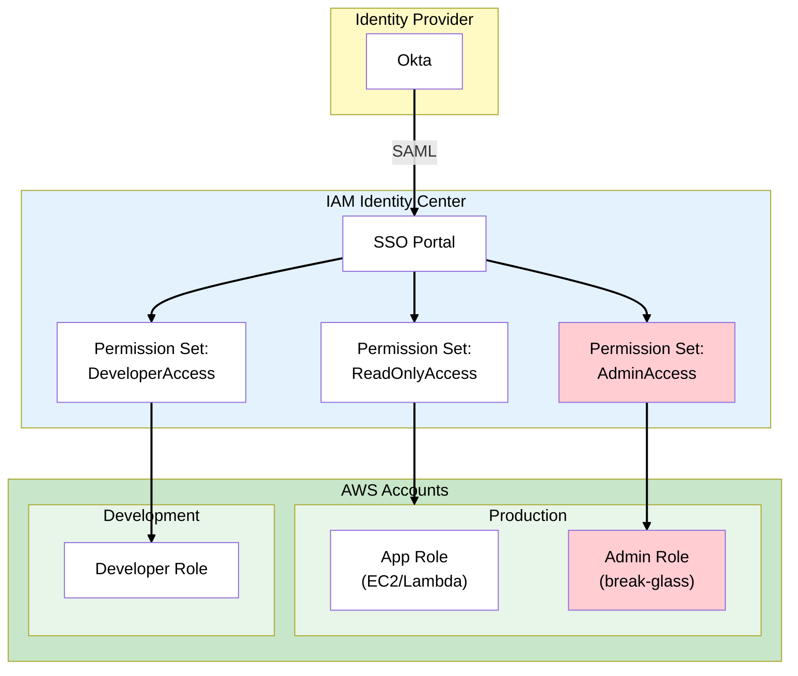

# Phase 1: Identity Foundation

## The Story So Far

MedVault has just been founded. Before building any application features, the security-conscious
founders want to establish a rock-solid identity and access management foundation. They've hired you
as their first Security Architect.

## Business Trigger

The CISO (also a co-founder) sets the expectation in your first meeting:

> "We're handling patient health data. One misconfigured permission could mean a data breach,
> regulatory fines, and the end of our company. I want IAM locked down before we deploy anything."

The compliance consultant adds:

> "HIPAA requires that we implement access controls that restrict access to patient data to only
> those who need it. That means documented, auditable permissions - not just 'admin access for
> everyone.'"

## Architecture Decision

**Decision**: Implement a comprehensive IAM strategy based on least privilege, with clear separation
between human users, application workloads, and external partners.

### Identity Types at MedVault

Different types of identities require different IAM (Identity and Access Management) solutions.
Human users should use SSO (Single Sign-On) for convenience, while applications should use IAM roles
for temporary credentials:

| Identity Type      | Example            | AWS Solution                      |
| ------------------ | ------------------ | --------------------------------- |
| Employees (humans) | Developers, admins | IAM Identity Center (SSO)         |
| Applications       | Backend services   | IAM roles for EC2/Lambda          |
| External partners  | Insurance APIs     | IAM roles with external ID        |
| Customers          | Patients, doctors  | Amazon Cognito (not covered here) |

## Key Concepts for SAA Exam

### IAM Principals



> **Exam Tip**: IAM roles are almost always the correct answer. They provide temporary credentials
> and work with EC2, Lambda, ECS, and cross-account access.

### Policy Types



### Identity-Based vs Resource-Based Policies

Understanding the difference between these policy types is critical for the SAA exam. Identity-based
policies define what an identity can do, while resource-based policies define who can access a
resource:

| Feature       | Identity-Based                   | Resource-Based                  |
| ------------- | -------------------------------- | ------------------------------- |
| Attached to   | Users, groups, roles             | AWS resources                   |
| Principal     | Implicit (the attached identity) | Explicit (must specify)         |
| Cross-account | Requires role assumption         | Can grant direct access         |
| Services      | All services                     | S3, KMS, SQS, SNS, Lambda, etc. |

**Example - Identity-Based Policy**:

```json
{
  "Version": "2012-10-17",
  "Statement": [
    {
      "Effect": "Allow",
      "Action": "s3:GetObject",
      "Resource": "arn:aws:s3:::medvault-patient-data/*"
    }
  ]
}
```

**Example - Resource-Based Policy (S3 Bucket Policy)**:

```json
{
  "Version": "2012-10-17",
  "Statement": [
    {
      "Effect": "Allow",
      "Principal": { "AWS": "arn:aws:iam::111122223333:role/AppRole" },
      "Action": "s3:GetObject",
      "Resource": "arn:aws:s3:::medvault-patient-data/*"
    }
  ]
}
```

### Policy Evaluation Logic



> **Exam Tip**: The golden rule: **Explicit DENY always wins**. If any policy denies, access is
> denied regardless of other allows.

### IAM Roles Deep Dive

#### Trust Policy (Who Can Assume)

```json
{
  "Version": "2012-10-17",
  "Statement": [
    {
      "Effect": "Allow",
      "Principal": { "Service": "ec2.amazonaws.com" },
      "Action": "sts:AssumeRole"
    }
  ]
}
```

#### Permission Policy (What They Can Do)

```json
{
  "Version": "2012-10-17",
  "Statement": [
    {
      "Effect": "Allow",
      "Action": ["s3:GetObject", "s3:PutObject"],
      "Resource": "arn:aws:s3:::medvault-patient-data/*"
    }
  ]
}
```

### Cross-Account Access



**Trust Policy for Cross-Account**:

```json
{
  "Version": "2012-10-17",
  "Statement": [
    {
      "Effect": "Allow",
      "Principal": { "AWS": "arn:aws:iam::111111111111:root" },
      "Action": "sts:AssumeRole",
      "Condition": {
        "StringEquals": { "sts:ExternalId": "MedVaultPartner123" }
      }
    }
  ]
}
```

> **Exam Tip**: **External ID** prevents the "confused deputy" problem when granting access to third
> parties.

### Permission Boundaries

Limits the **maximum permissions** a role/user can have:



> **Exam Tip**: Permission boundaries are used to delegate administration safely. Even if someone
> has `iam:CreateRole`, the boundary limits what permissions they can grant.

### IAM Identity Center (SSO)



**Key concepts**:

- **Permission Sets**: Collections of policies assigned to users/groups
- **SAML 2.0**: Protocol for SSO federation (Security Assertion Markup Language)
- **SCIM**: Automatic user/group provisioning (System for Cross-domain Identity Management)
- **Multi-account access**: Single sign-on to multiple AWS accounts

### IAM Access Analyzer

IAM Access Analyzer continuously monitors your resources to identify unintended external access. It
helps maintain least-privilege by detecting resources shared outside your account or organization:

| Finding Type | Example                                    |
| ------------ | ------------------------------------------ |
| S3 bucket    | Public bucket or cross-account access      |
| IAM role     | Trust policy allows external principal     |
| KMS key      | Key policy grants external access          |
| Lambda       | Resource policy allows external invocation |

> **Exam Tip**: Access Analyzer helps identify unintended access. It's a compliance tool, not a
> runtime blocker.

## MedVault IAM Architecture



### MedVault IAM Decisions

These decisions reflect security best practices for healthcare applications. Each choice prioritizes
temporary credentials, auditability, and least privilege:

| Decision           | Choice                | Rationale                            |
| ------------------ | --------------------- | ------------------------------------ |
| Human access       | IAM Identity Center   | SSO with existing Okta, no IAM users |
| Application access | IAM roles             | Temp credentials, no access keys     |
| Admin access       | Break-glass role      | MFA required, CloudTrail logged      |
| Developer access   | Permission boundaries | Can create roles, but limited scope  |

## What Could Go Wrong?

The IAM foundation is solid. Developers authenticate via Okta, applications use roles. But the
compliance consultant raises a concern:

> "Great work on access control. But HIPAA also requires encryption of patient data at rest and in
> transit. How are you handling that?"

Time to implement data protection.

## Exam Tips

- **Roles over users** - Roles with temporary credentials are preferred
- **Explicit deny wins** - Any deny in any policy = access denied
- **Trust policy + permission policy** - Both needed for role to work
- **External ID for third parties** - Prevents confused deputy attack
- **Permission boundaries for delegation** - Limit what admins can create
- **Identity Center for workforce** - Replaces IAM users for employees
- **Access Analyzer** - Finds unintended external access
- **Resource-based policies allow cross-account** - Without assuming a role

## See Also

> **Related Learning:** For IAM roles in practice with EC2 Auto Scaling Groups and Launch Templates,
> see [TechBooks Phase 4: Auto Scaling](/scenarios/techbooks/phases/phase-4-auto-scaling.md).

## SAA Exam Concepts

### Must-Know for This Phase

| Concept               | Key Points                                                  |
| --------------------- | ----------------------------------------------------------- |
| IAM Roles             | Temporary credentials, trust + permission policies          |
| Policy Evaluation     | Explicit deny wins, then SCP → boundary → allow             |
| Cross-Account         | AssumeRole with trust policy, external ID for third parties |
| Permission Boundaries | Maximum permissions, for delegation                         |
| Identity Center       | SSO for workforce, permission sets, SAML federation         |
| Access Analyzer       | Finds external access, resource-based findings              |
