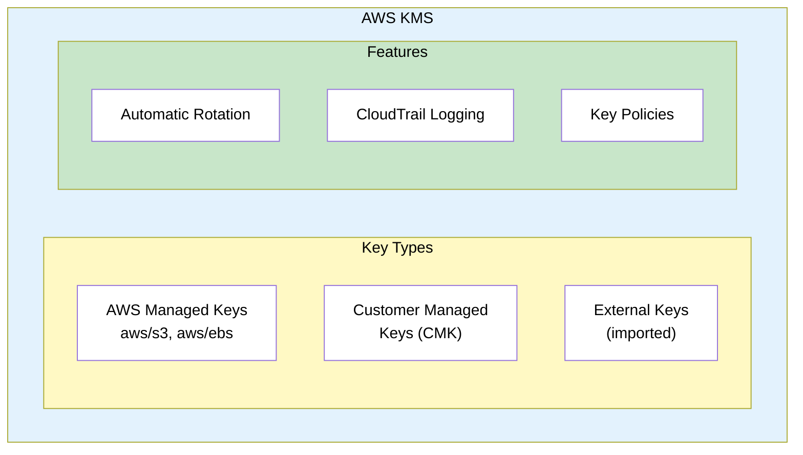
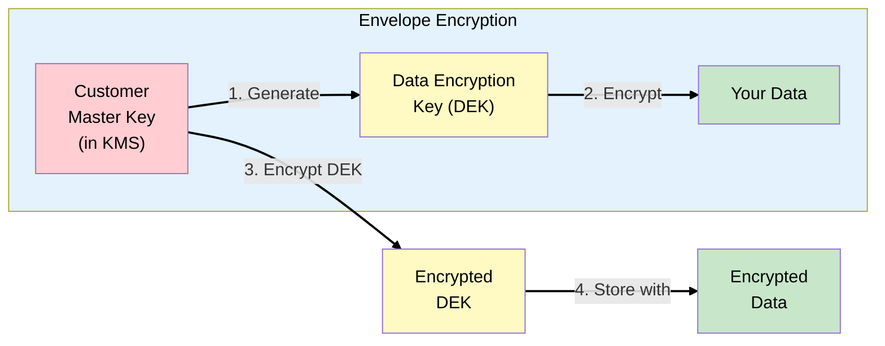
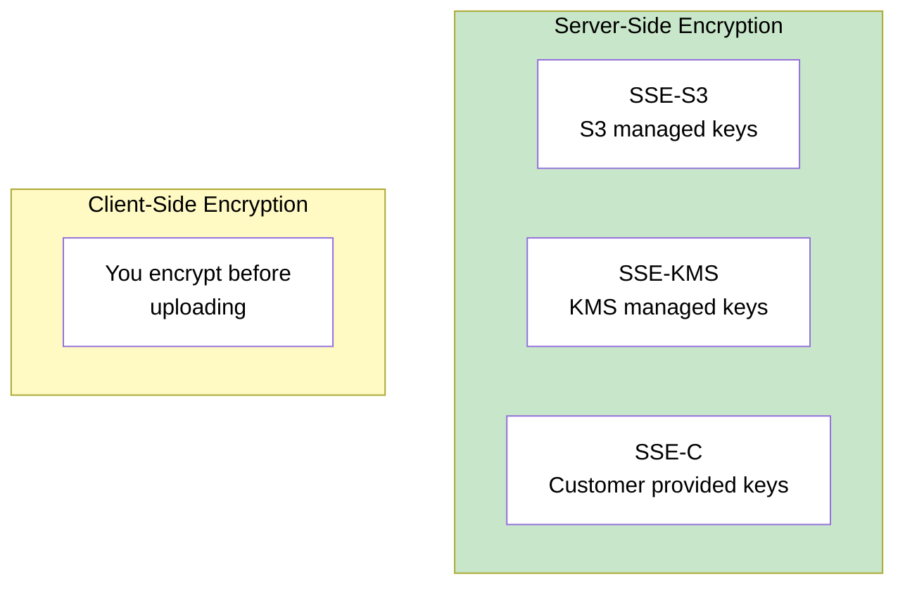
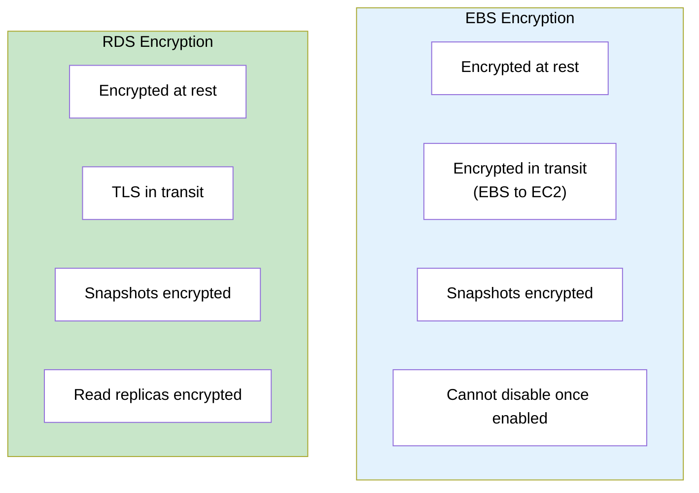
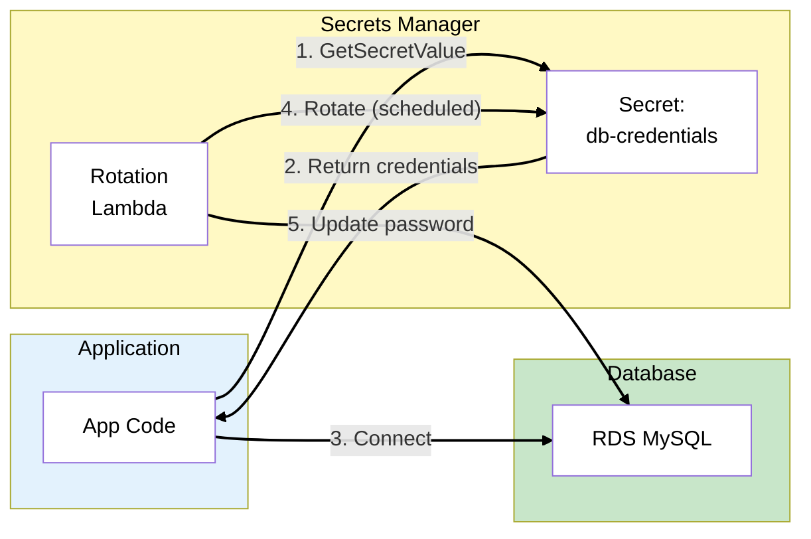
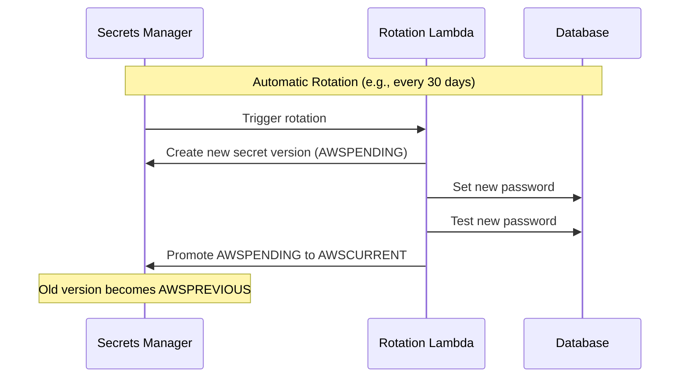
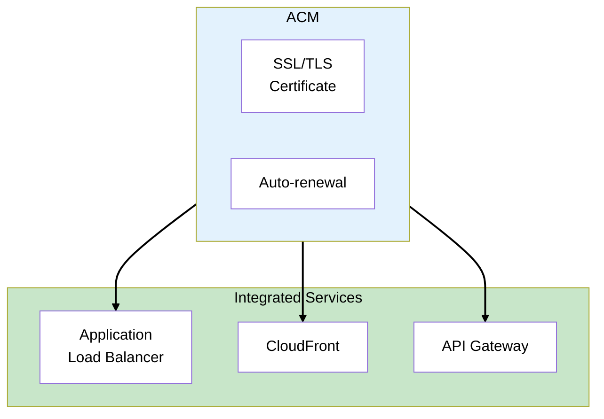
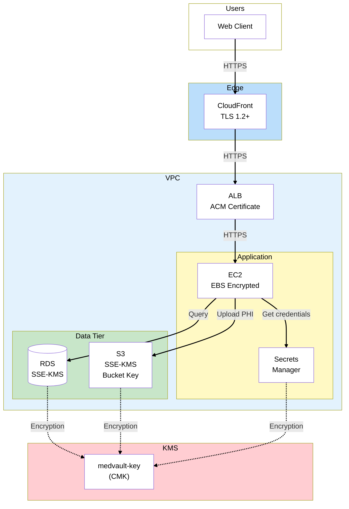

# Phase 2: Data Protection

## The Story So Far

MedVault has established a solid IAM foundation. Employees authenticate via Okta through IAM
Identity Center, applications use IAM roles with temporary credentials, and permission boundaries
prevent privilege escalation.

## Business Trigger

The compliance consultant reviews your IAM setup and moves to the next item:

> "HIPAA requires encryption of Protected Health Information (PHI) at rest and in transit. Show me
> your encryption strategy."

The CTO adds technical requirements:

> "We also need to manage database credentials securely. No hardcoded passwords in code or config
> files. And those credentials need to rotate automatically."

## Architecture Decision

**Decision**: Implement comprehensive encryption using AWS KMS, store secrets in AWS Secrets Manager
with automatic rotation, and enforce TLS for all data in transit.

### Data Protection Layers

| Layer             | Protection     | AWS Service                 |
| ----------------- | -------------- | --------------------------- |
| At rest (storage) | Encryption     | KMS + S3/EBS/RDS encryption |
| In transit        | TLS/SSL        | ACM, ALB, CloudFront        |
| Secrets           | Secure storage | Secrets Manager             |
| Keys              | Management     | KMS                         |

## Key Concepts for SAA Exam

### AWS KMS (Key Management Service)



### KMS Key Types Comparison

| Key Type                | Management | Rotation           | Cost                 | Use Case            |
| ----------------------- | ---------- | ------------------ | -------------------- | ------------------- |
| **AWS Managed**         | AWS        | Automatic (yearly) | Free\*               | Default encryption  |
| **Customer Managed**    | You        | Optional (yearly)  | $1/month + API calls | Compliance, control |
| **External (imported)** | You        | Manual             | $1/month + API calls | Key sovereignty     |

> **Exam Tip**: Customer managed keys give you control over the key policy, deletion, and rotation.
> Use them when compliance requires it.

### Envelope Encryption

KMS uses envelope encryption for efficiency:



**Why envelope encryption?**

- CMK never leaves KMS (FIPS 140-2 validated)
- Only small DEK is encrypted by CMK (fast)
- Large data encrypted locally by DEK (efficient)

> **Exam Tip**: The CMK encrypts the data key, not the data itself. This is more efficient and
> secure.

### KMS Key Policies

Key policies are resource-based policies for KMS keys:

```json
{
  "Version": "2012-10-17",
  "Statement": [
    {
      "Sid": "Enable IAM policies",
      "Effect": "Allow",
      "Principal": { "AWS": "arn:aws:iam::111122223333:root" },
      "Action": "kms:*",
      "Resource": "*"
    },
    {
      "Sid": "Allow use by app role",
      "Effect": "Allow",
      "Principal": { "AWS": "arn:aws:iam::111122223333:role/AppRole" },
      "Action": ["kms:Encrypt", "kms:Decrypt", "kms:GenerateDataKey"],
      "Resource": "*"
    }
  ]
}
```

> **Exam Tip**: Unlike other resources, KMS keys **require** a key policy. Without one, no one can
> use the key.

### S3 Encryption Options



| Option          | Key Management           | Audit Trail         | Use Case          |
| --------------- | ------------------------ | ------------------- | ----------------- |
| **SSE-S3**      | S3 manages               | Limited             | Default, simple   |
| **SSE-KMS**     | You/KMS manage           | Full CloudTrail     | Compliance, audit |
| **SSE-C**       | You provide each request | Your responsibility | Key sovereignty   |
| **Client-side** | You manage entirely      | Your responsibility | Zero-trust        |

> **Exam Tip**: SSE-KMS provides audit trail via CloudTrail. SSE-S3 does not log individual object
> access.

### Default Encryption

Enable default encryption on S3 buckets:

```json
{
  "Rules": [
    {
      "ApplyServerSideEncryptionByDefault": {
        "SSEAlgorithm": "aws:kms",
        "KMSMasterKeyID": "arn:aws:kms:us-east-1:111122223333:key/..."
      },
      "BucketKeyEnabled": true
    }
  ]
}
```

> **Exam Tip**: **Bucket Keys** reduce KMS API calls (and costs) by using a bucket-level key derived
> from your KMS key.

### EBS and RDS Encryption



**Important limitations**:

- Cannot encrypt an existing unencrypted EBS volume (must snapshot and create new)
- Cannot encrypt an existing unencrypted RDS instance (must snapshot and restore)
- Encrypted snapshots can only be copied to encrypted destinations

> **Exam Tip**: To encrypt an unencrypted RDS database: snapshot → copy snapshot with encryption →
> restore from encrypted snapshot.

### AWS Secrets Manager



### Secrets Manager vs Parameter Store

| Feature          | Secrets Manager                | Parameter Store                     |
| ---------------- | ------------------------------ | ----------------------------------- |
| **Rotation**     | Built-in, automatic            | Manual (you build it)               |
| **Cost**         | $0.40/secret/month             | Free tier, then $0.05/param         |
| **Cross-region** | Native replication             | Manual                              |
| **Best for**     | Database credentials, API keys | Config values, non-rotating secrets |

> **Exam Tip**: Secrets Manager = automatic rotation. Parameter Store = cheaper, no built-in
> rotation.

### Secrets Manager Rotation



### ACM (AWS Certificate Manager)



**Key points**:

- **Free** public certificates
- Auto-renewal for ACM-issued certs
- Cannot be downloaded (use on AWS services only)
- For EC2, use imported certificates

> **Exam Tip**: ACM certificates are **regional** except for CloudFront (must be in us-east-1).

## MedVault Data Protection Architecture



### MedVault Encryption Decisions

| Data                  | Encryption      | Key Type         | Rationale                |
| --------------------- | --------------- | ---------------- | ------------------------ |
| S3 (PHI documents)    | SSE-KMS         | Customer managed | Audit trail, key control |
| RDS (patient records) | RDS encryption  | Customer managed | Compliance               |
| EBS (app servers)     | EBS encryption  | AWS managed      | Less sensitive           |
| Secrets               | Secrets Manager | AWS managed      | Rotation more important  |
| In transit            | TLS 1.2+        | ACM              | Standard                 |

## What Could Go Wrong?

Data is now encrypted at rest and in transit. Secrets are managed securely with automatic rotation.
But the security auditor has another question:

> "I see you're using S3 and other AWS services. Are those API calls going over the public internet?
> For HIPAA, we'd prefer all traffic stays within AWS."

Time to implement network security controls.

## Exam Tips

- **CMK for compliance** - Customer managed keys when you need audit/control
- **Envelope encryption** - CMK encrypts data key, data key encrypts data
- **SSE-KMS for S3 audit** - CloudTrail logs KMS usage
- **Bucket Keys reduce cost** - Fewer KMS API calls
- **Cannot decrypt unencrypted** - Must copy with encryption
- **Secrets Manager for rotation** - Built-in, automatic
- **Parameter Store is cheaper** - But no automatic rotation
- **ACM is regional** - Except CloudFront (us-east-1 only)

## SAA Exam Concepts

### Must-Know for This Phase

| Concept             | Key Points                                                         |
| ------------------- | ------------------------------------------------------------------ |
| KMS Key Types       | AWS managed (free), Customer managed ($1/mo), External             |
| Envelope Encryption | CMK → Data Key → Data                                              |
| S3 Encryption       | SSE-S3, SSE-KMS (audit trail), SSE-C, Client-side                  |
| Bucket Keys         | Reduce KMS API calls and cost                                      |
| EBS/RDS Encryption  | Cannot enable on existing, must snapshot/restore                   |
| Secrets Manager     | Auto-rotation, $0.40/secret/month, cross-region                    |
| Parameter Store     | Cheaper, no auto-rotation, good for config                         |
| ACM                 | Free public certs, auto-renewal, regional (CloudFront = us-east-1) |
