# Phase 3: Network Security

## The Story So Far

MedVault has strong IAM controls and comprehensive encryption. Patient data is encrypted at rest
with KMS and in transit with TLS. Database credentials rotate automatically via Secrets Manager.

## Business Trigger

During a security review, the network engineer raises a concern:

> "I traced the network path for our S3 uploads. Even though we're using HTTPS, the traffic goes out
> our NAT Gateway, over the internet, and back into AWS. That's adding latency and costs - plus it's
> technically traversing the public internet."

The compliance consultant adds:

> "Some of our healthcare clients require that PHI never traverses the public internet, even
> encrypted. Can we keep all AWS API traffic within the AWS network?"

The CISO also wants protection at the edge:

> "We're exposing APIs to third-party healthcare systems. We need DDoS protection and the ability to
> block malicious requests."

## Architecture Decision

**Decision**: Implement VPC endpoints for private AWS API access, deploy AWS WAF for application
protection, and enable AWS Shield for DDoS mitigation.

## Key Concepts for SAA Exam

### VPC Endpoints

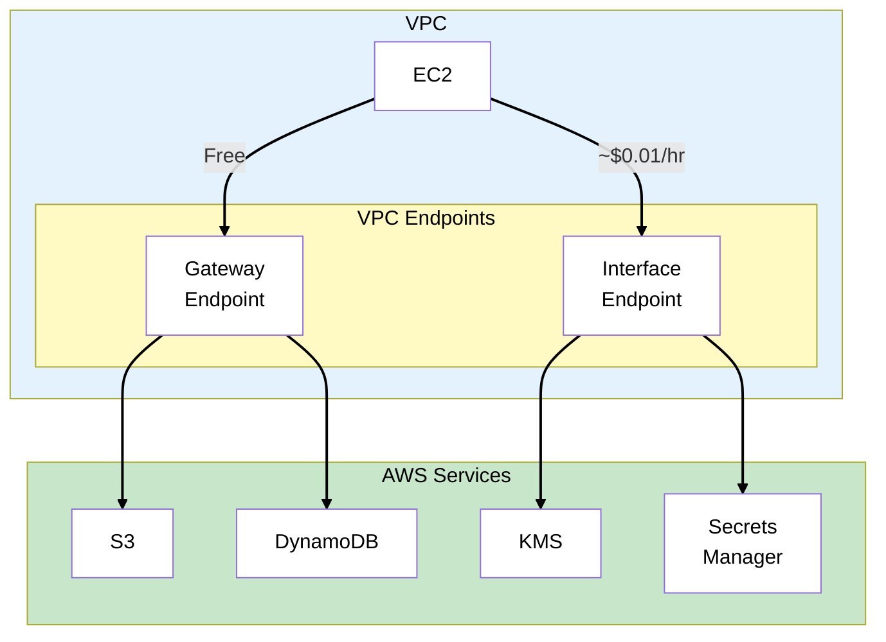

### Gateway vs Interface Endpoints

| Feature            | Gateway Endpoint  | Interface Endpoint                  |
| ------------------ | ----------------- | ----------------------------------- |
| **Services**       | S3, DynamoDB only | 100+ services                       |
| **Cost**           | Free              | ~$0.01/hr + data                    |
| **Implementation** | Route table entry | ENI in subnet                       |
| **DNS**            | Uses S3/DDB DNS   | Private DNS                         |
| **Security**       | Endpoint policies | Security groups + endpoint policies |
| **HA**             | Automatic         | Deploy in multiple AZs              |

> **Exam Tip**: Gateway endpoints are **free** and only work for S3 and DynamoDB. Everything else
> uses interface endpoints.

### Gateway Endpoint Deep Dive

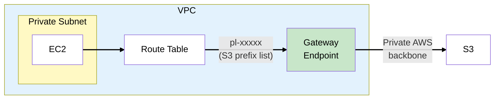

**Gateway Endpoint Policy** (restrict to specific bucket):

```json
{
  "Statement": [
    {
      "Effect": "Allow",
      "Principal": "*",
      "Action": ["s3:GetObject", "s3:PutObject"],
      "Resource": "arn:aws:s3:::medvault-patient-data/*"
    }
  ]
}
```

### Interface Endpoint Deep Dive

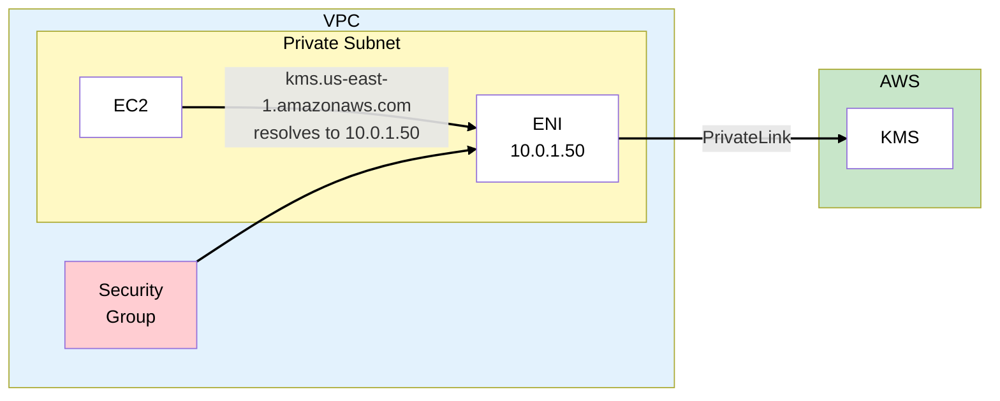

**Key points**:

- Creates an ENI in your subnet with a private IP
- Enable **Private DNS** to auto-resolve AWS service DNS
- Apply security groups to control access
- Deploy in multiple AZs for HA

> **Exam Tip**: Interface endpoints use **PrivateLink** technology. The terms are sometimes used
> interchangeably.

### AWS PrivateLink

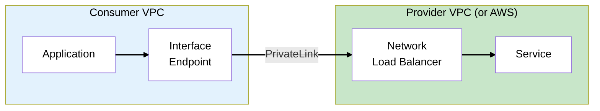

**Use cases**:

- Access AWS services privately
- Expose your services to other VPCs/accounts
- SaaS provider connectivity

### Security Groups vs NACLs

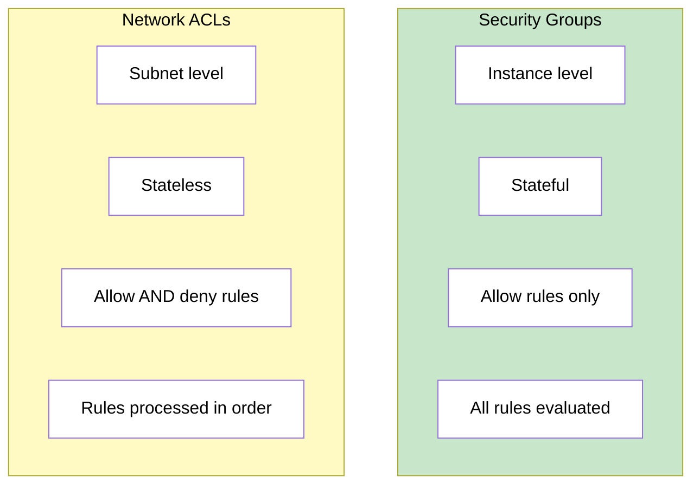

| Feature    | Security Groups                     | NACLs                         |
| ---------- | ----------------------------------- | ----------------------------- |
| Level      | Instance (ENI)                      | Subnet                        |
| State      | Stateful (return traffic automatic) | Stateless (must allow return) |
| Rules      | Allow only                          | Allow AND deny                |
| Evaluation | All rules                           | Lowest number first           |
| Default    | Deny all inbound                    | Allow all                     |

> **Exam Tip**: Security groups are **stateful** - if you allow inbound, outbound return traffic is
> automatic. NACLs are **stateless** - you must allow both directions.

### AWS WAF (Web Application Firewall)

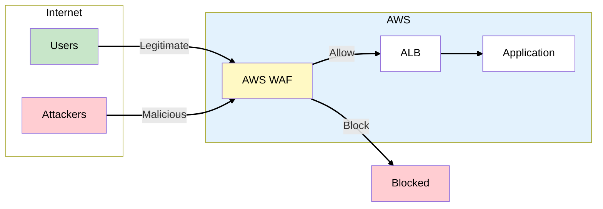

### WAF Components

| Component         | Description                                                 |
| ----------------- | ----------------------------------------------------------- |
| **Web ACL**       | Container for rules, attached to ALB/CloudFront/API Gateway |
| **Rules**         | Conditions to match (IP, string, regex, rate)               |
| **Rule Groups**   | Reusable collections of rules                               |
| **Managed Rules** | Pre-built rules from AWS and partners                       |

### WAF Rule Types

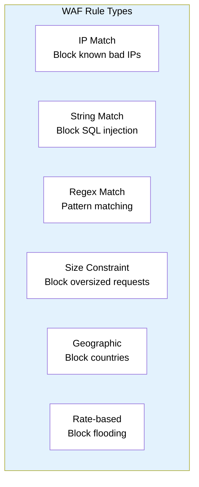

### AWS Managed Rules

Pre-configured rule groups:

| Rule Group              | Protection                   |
| ----------------------- | ---------------------------- |
| **Core Rule Set (CRS)** | OWASP Top 10                 |
| **SQL Database**        | SQL injection                |
| **Known Bad Inputs**    | Common attack patterns       |
| **IP Reputation**       | Known malicious IPs          |
| **Bot Control**         | Bot detection and management |

> **Exam Tip**: Managed rules are the fastest way to protect against common attacks. You can combine
> them with custom rules.

### WAF Rule Evaluation

Rules are evaluated in priority order:

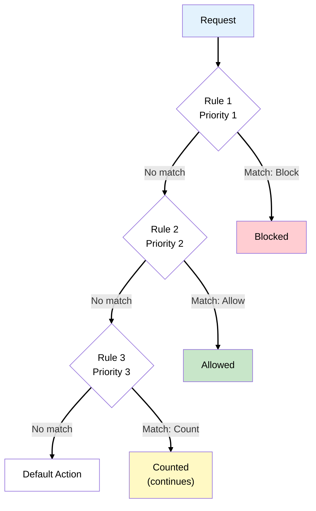

> **Exam Tip**: **Count** action is useful for testing rules before blocking.

### AWS Shield

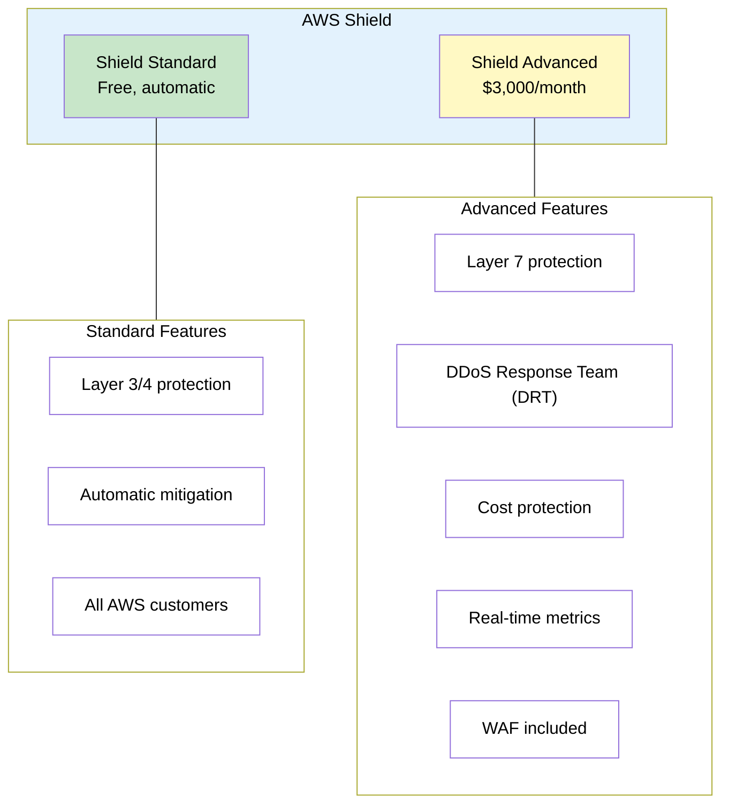

### Shield Standard vs Advanced

| Feature                | Standard | Advanced                  |
| ---------------------- | -------- | ------------------------- |
| Cost                   | Free     | $3,000/month + data       |
| Layer 3/4 protection   | Yes      | Yes                       |
| Layer 7 protection     | No       | Yes                       |
| DDoS Response Team     | No       | Yes (24/7)                |
| Cost protection        | No       | Yes (refunds for scaling) |
| WAF included           | No       | Yes                       |
| Health-based detection | No       | Yes                       |

> **Exam Tip**: Shield Standard is automatic and free. Shield Advanced is for critical applications
> needing 24/7 DDoS support and cost protection.

### AWS Network Firewall

For VPC-level traffic inspection:

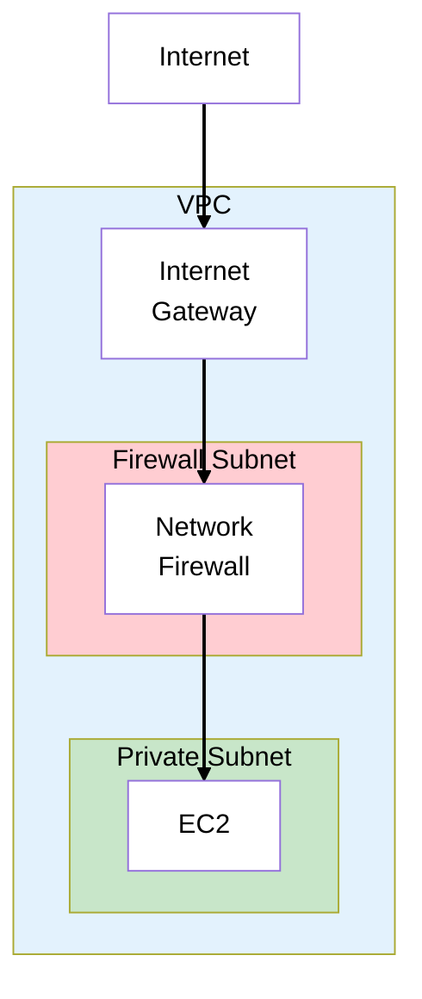

**Capabilities**:

- Stateful inspection
- Domain filtering
- IPS (Intrusion Prevention)
- Custom Suricata rules

> **Exam Tip**: Network Firewall is for VPC-level inspection. WAF is for HTTP/HTTPS application
> layer.

## MedVault Network Security Architecture

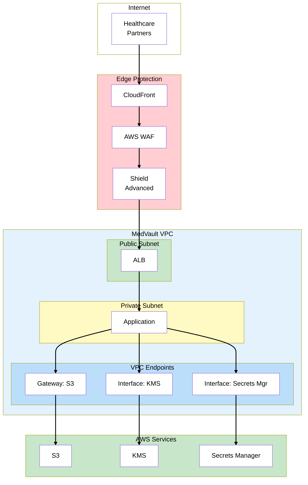

### MedVault Security Decisions

| Requirement         | Solution            | Rationale                      |
| ------------------- | ------------------- | ------------------------------ |
| S3 traffic private  | Gateway endpoint    | Free, no internet              |
| KMS/Secrets private | Interface endpoints | PrivateLink, PHI stays private |
| DDoS protection     | Shield Advanced     | Healthcare = critical          |
| Application attacks | WAF + managed rules | OWASP protection               |
| Edge security       | CloudFront + WAF    | Global edge, WAF integration   |

## What Could Go Wrong?

Network security is locked down. All AWS API traffic stays within AWS via VPC endpoints. WAF
protects against application attacks. But the compliance auditor needs more:

> "Great progress. Now I need to see audit logs. Can you prove who accessed what, when, and from
> where? HIPAA requires audit controls."

Time to implement logging and monitoring.

## Exam Tips

- **Gateway = S3/DynamoDB only, free** - Interface = everything else, costs money
- **PrivateLink = Interface endpoints** - Same technology
- **Security groups are stateful** - Return traffic automatic
- **NACLs are stateless** - Must allow both directions
- **WAF attaches to ALB/CloudFront/API Gateway** - Not EC2 directly
- **Shield Standard is free and automatic** - Everyone has it
- **Shield Advanced for DRT and cost protection** - $3K/month
- **Network Firewall for VPC inspection** - Domain filtering, IPS

## See Also

> **Related Learning:** For VPC fundamentals including CIDR planning, subnets, and Security Groups
> basics, see [TechBooks Phase 1: MVP Launch](/scenarios/techbooks/phases/phase-1-mvp-launch.md).

## SAA Exam Concepts

### Must-Know for This Phase

| Concept             | Key Points                                    |
| ------------------- | --------------------------------------------- |
| Gateway Endpoints   | S3, DynamoDB only, free, route table entry    |
| Interface Endpoints | 100+ services, ENI in subnet, security groups |
| PrivateLink         | Technology behind interface endpoints         |
| Security Groups     | Stateful, instance level, allow only          |
| NACLs               | Stateless, subnet level, allow + deny         |
| WAF                 | Web ACL, rules, managed rules, ALB/CF/APIGW   |
| Shield Standard     | Free, L3/L4, automatic                        |
| Shield Advanced     | $3K/mo, L7, DRT, cost protection              |
