# Phase 4: Logging & Monitoring

## The Story So Far

MedVault has a robust security foundation: IAM with least privilege, encryption with KMS, and
network security with VPC endpoints and WAF. But the compliance team needs proof that controls are
working.

## Business Trigger

The HIPAA auditor arrives for a mock assessment:

> "Show me who accessed patient record #12345 in the last 30 days. I need to see the user,
> timestamp, source IP, and what action they performed."

The compliance consultant adds:

> "We also need to prove that all S3 buckets are encrypted and all security groups don't allow
> unrestricted access. Can you demonstrate continuous compliance monitoring?"

## Architecture Decision

**Decision**: Implement comprehensive logging with CloudTrail for API (Application Programming
Interface) activity, AWS Config for compliance monitoring, and CloudWatch for metrics and alerting.

### Logging Strategy

Each logging requirement maps to a specific AWS service. Understanding which service answers which
question is critical for the exam - CloudTrail tracks activity, Config tracks state, and CloudWatch
handles metrics and application logs:

| Requirement                 | AWS Service     |
| --------------------------- | --------------- |
| API activity (who did what) | CloudTrail      |
| Resource compliance         | AWS Config      |
| Application logs            | CloudWatch Logs |
| Metrics and alerts          | CloudWatch      |
| Automated response          | EventBridge     |

## Key Concepts for SAA Exam

### AWS CloudTrail

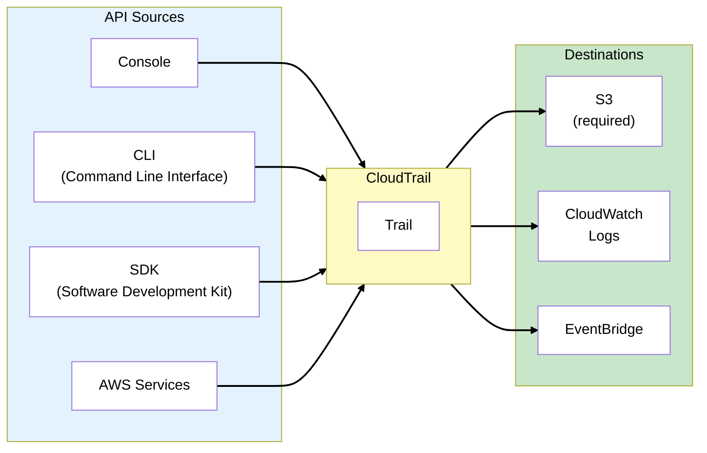

### CloudTrail Event Types

CloudTrail categorizes events by their scope and impact. Management events are logged by default
because they represent control plane operations. Data events (data plane) generate high volume and
cost extra, so enable them selectively:

| Event Type            | What's Logged                                                | Default | Cost           |
| --------------------- | ------------------------------------------------------------ | ------- | -------------- |
| **Management Events** | API calls that manage resources (CreateBucket, RunInstances) | Yes     | Free (90 days) |
| **Data Events**       | Data operations (S3 GetObject, Lambda Invoke)                | No      | Extra cost     |
| **Insights Events**   | Unusual API activity                                         | No      | Extra cost     |

> **Exam Tip**: Management events are logged by default and retained for 90 days in Event History.
> For longer retention or data events, create a trail to S3.

### Management vs Data Events

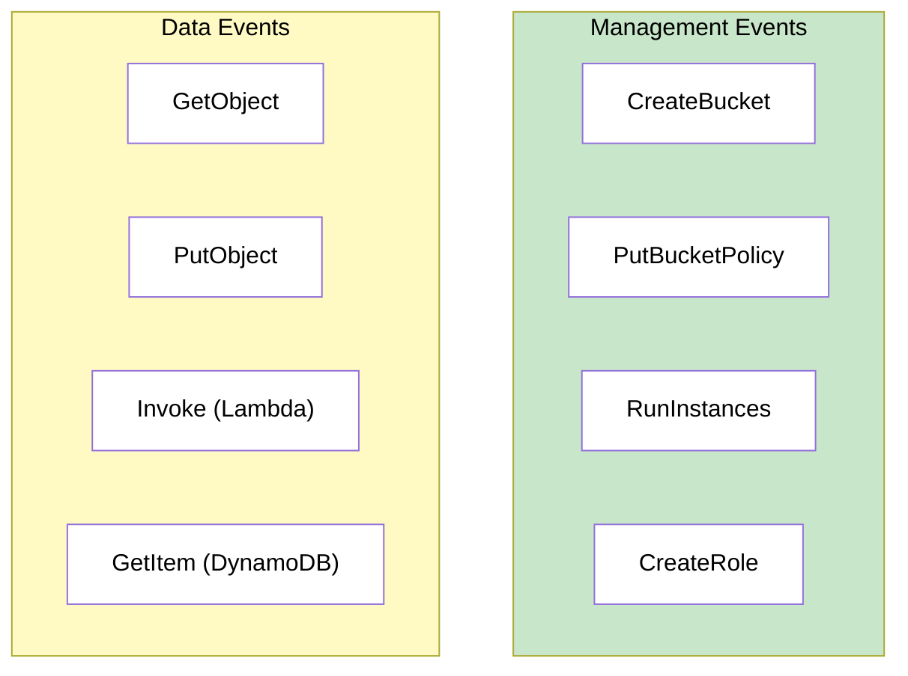

> **Exam Tip**: Data events are high-volume and cost money. Enable selectively (e.g., specific S3
> buckets with PHI).

### CloudTrail Log Integrity

Validate that logs haven't been tampered with:

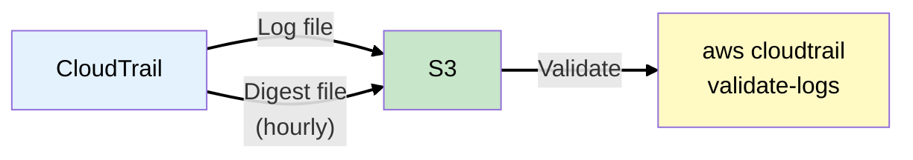

**Digest files**:

- Created hourly with hash of all log files
- Signed with AWS private key
- Allows detection of tampering or deletion

> **Exam Tip**: Log file validation ensures integrity - critical for compliance and forensics.

### Organization Trail

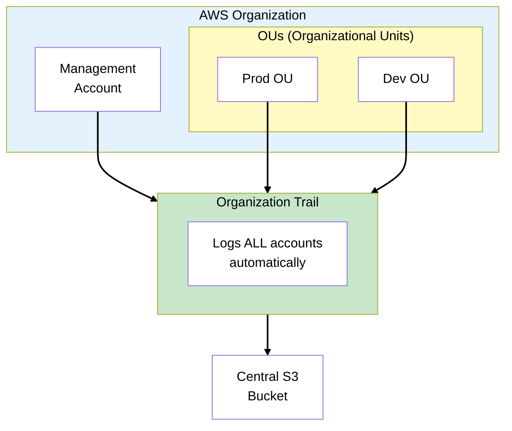

> **Exam Tip**: Organization trails automatically log all member accounts. Great for centralized
> security monitoring.

### AWS Config

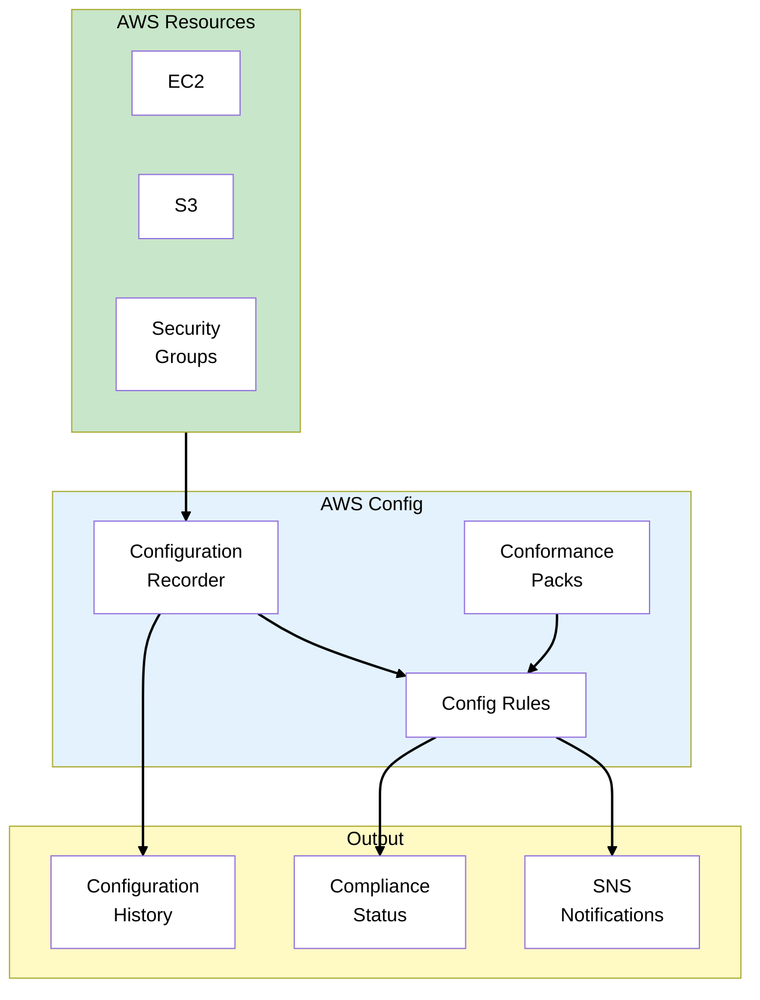

### CloudTrail vs Config

These two services complement each other but answer different questions. CloudTrail is verb-focused
(what happened?), while Config is noun-focused (what exists?). For compliance, you typically need
both:

| Feature               | CloudTrail                | AWS Config                   |
| --------------------- | ------------------------- | ---------------------------- |
| **Question answered** | Who did what, when?       | What's the current state?    |
| **Focus**             | API activity (events)     | Resource configuration       |
| **Use case**          | Security investigation    | Compliance monitoring        |
| **Example**           | "Who deleted the bucket?" | "Are all buckets encrypted?" |

> **Exam Tip**: CloudTrail = API activity (verb-focused). Config = resource state (noun-focused).

### Config Rules

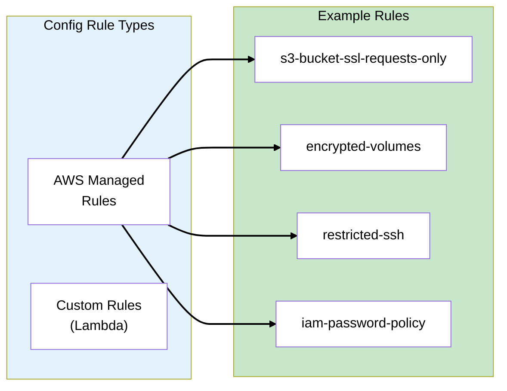

**Trigger types**:

- **Configuration changes**: Evaluate when resource changes
- **Periodic**: Evaluate on schedule (1hr, 3hr, 6hr, 12hr, 24hr)

### Conformance Packs

Conformance packs bundle multiple Config rules into a single deployment, aligned to specific
compliance frameworks. Instead of configuring 50+ individual rules, deploy one pack that covers your
regulatory requirements:

| Pack                                       | Use Case         |
| ------------------------------------------ | ---------------- |
| **Operational Best Practices for HIPAA**   | Healthcare       |
| **CIS AWS Foundations Benchmark**          | General security |
| **Operational Best Practices for PCI-DSS** | Payment card     |
| **NIST 800-53**                            | Government       |

> **Abbreviations**: CIS = Center for Internet Security, PCI-DSS = Payment Card Industry Data
> Security Standard, NIST = National Institute of Standards and Technology

> **Exam Tip**: Conformance packs simplify compliance - one deployment covers many rules.

### Remediation

Automatically fix non-compliant resources:

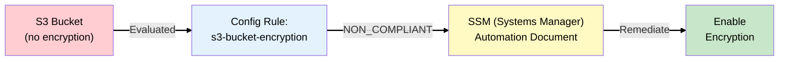

### CloudWatch Logs

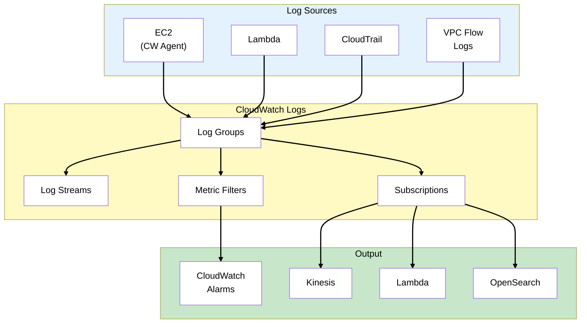

### Metric Filters

Extract metrics from logs:

```
# Filter pattern for failed console logins
{ $.eventName = "ConsoleLogin" && $.errorMessage = "Failed authentication" }
```

> **Exam Tip**: Metric filters convert log data into CloudWatch metrics for alarming.

### CloudWatch Alarms

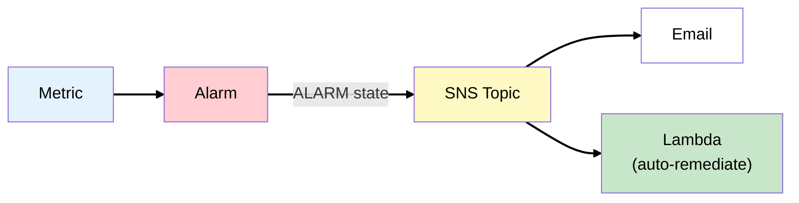

**Alarm states**: OK → ALARM → INSUFFICIENT_DATA

### EventBridge (CloudWatch Events)

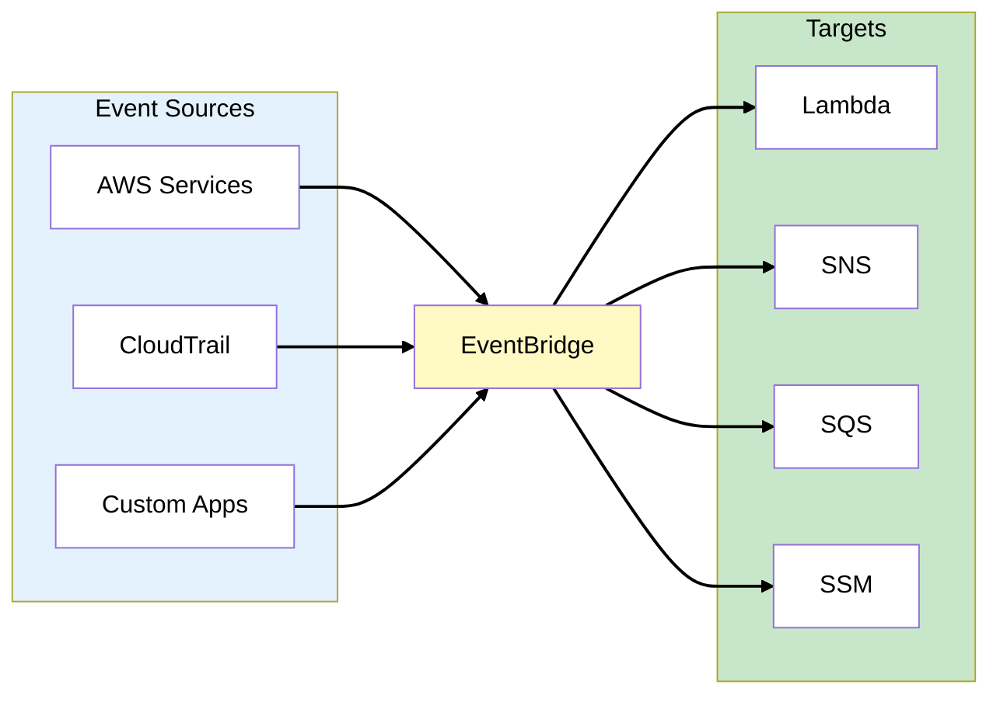

**Example: Alert on root login**:

```json
{
  "source": ["aws.signin"],
  "detail-type": ["AWS Console Sign In via CloudTrail"],
  "detail": {
    "userIdentity": {
      "type": ["Root"]
    }
  }
}
```

## MedVault Logging Architecture

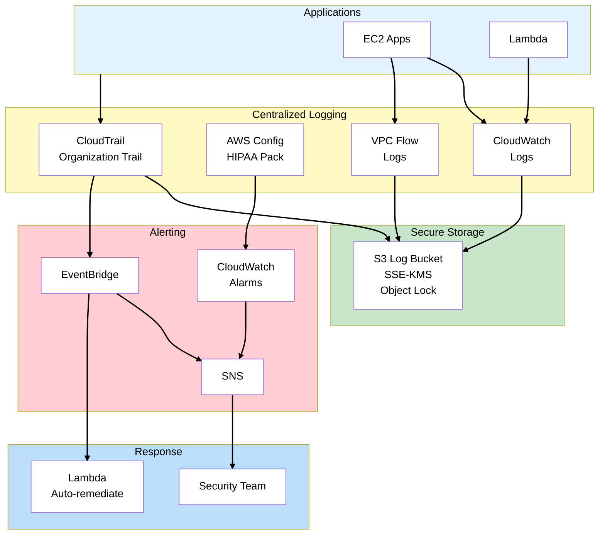

### MedVault Logging Decisions

Each logging requirement has a specific configuration tailored to HIPAA compliance. Note that data
events are enabled only for the PHI bucket (not all S3 buckets) to control costs while maintaining
compliance:

| Requirement           | Solution    | Configuration                            |
| --------------------- | ----------- | ---------------------------------------- |
| API audit trail       | CloudTrail  | Management + Data events (S3 PHI bucket) |
| Log integrity         | CloudTrail  | Log file validation enabled              |
| Compliance monitoring | Config      | HIPAA conformance pack                   |
| Real-time alerts      | EventBridge | Root login, policy changes               |
| Log retention         | S3          | 7 years, Object Lock                     |
| Log protection        | KMS         | Customer managed key                     |

### Security Alerts Configured

| Event                      | Response                 |
| -------------------------- | ------------------------ |
| Root account login         | Page security team       |
| IAM policy change          | Alert + auto-review      |
| S3 public access           | Auto-remediate (block)   |
| Security group 0.0.0.0/0   | Auto-remediate (remove)  |
| KMS key deletion scheduled | Alert + require approval |

## What Could Go Wrong?

Logging is comprehensive. The auditor can now trace any access to patient data. But as MedVault
prepares to scale:

> "You're running everything in one account. What happens when you have 50 developers? How do you
> prevent someone in dev from accidentally accessing production patient data?"

Time for multi-account strategy.

## Exam Tips

- **CloudTrail = who did what** - API activity logging
- **Config = what's the state** - Resource compliance
- **Management events free 90 days** - Data events cost extra
- **Organization trail for all accounts** - Central logging
- **Log file validation for integrity** - Digest files
- **Conformance packs for compliance** - HIPAA, PCI, CIS
- **Config can auto-remediate** - SSM Automation documents
- **EventBridge for real-time** - Trigger Lambda/SNS on events

## SAA Exam Concepts

### Must-Know for This Phase

| Concept            | Key Points                                            |
| ------------------ | ----------------------------------------------------- |
| CloudTrail         | Management vs Data events, 90-day free, trails to S3  |
| Log Integrity      | Digest files, validation, tamper detection            |
| Organization Trail | All accounts, central bucket                          |
| Config             | Resource state, rules, conformance packs, remediation |
| Config Rules       | AWS managed, custom (Lambda), triggers                |
| CloudWatch Logs    | Log groups/streams, metric filters, subscriptions     |
| EventBridge        | Event patterns, targets, real-time response           |
