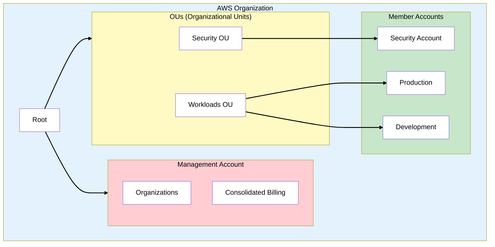
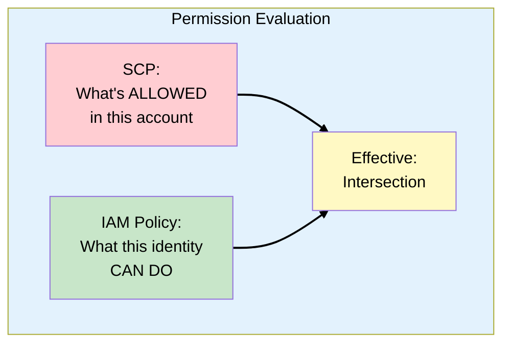
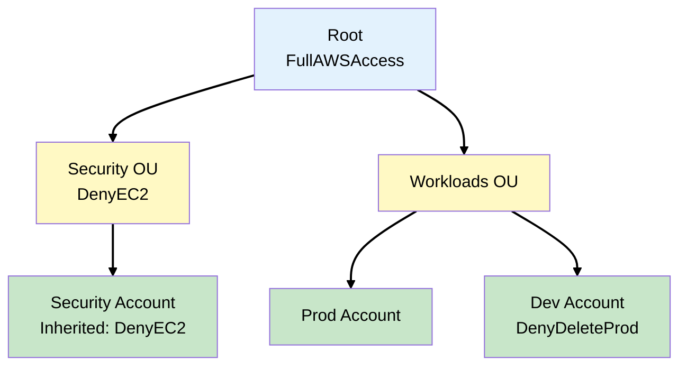
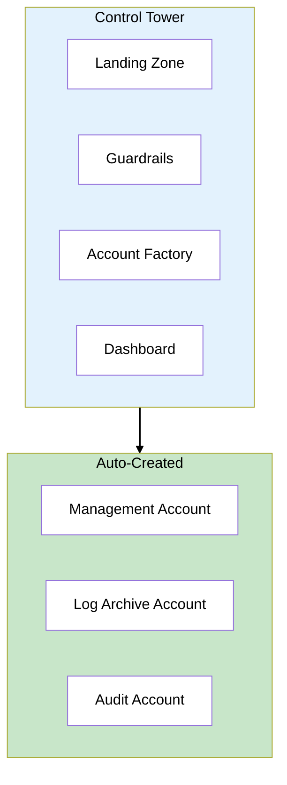
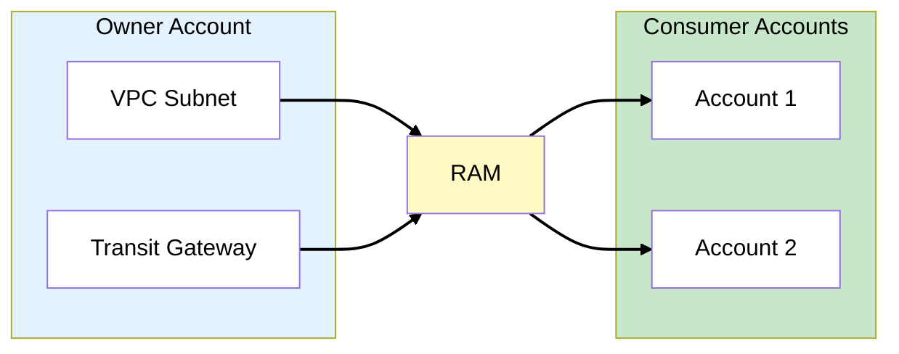
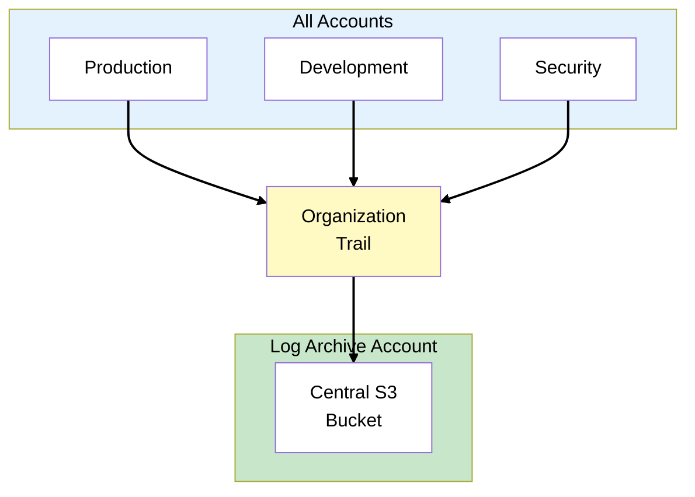
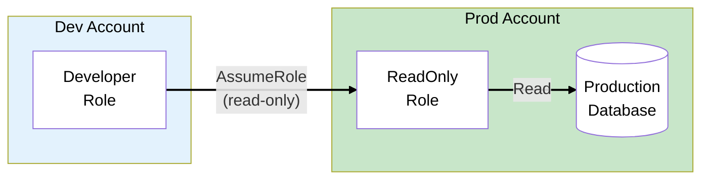
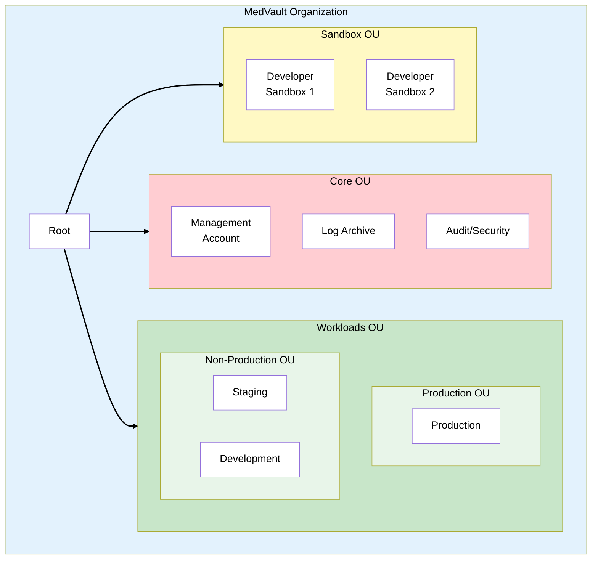

# Phase 5: Multi-Account Strategy

## The Story So Far

MedVault has comprehensive security controls: IAM, encryption, network security, and logging. The
platform is nearing launch, and the team is growing from 5 to 50 engineers.

## Business Trigger

The VP of Engineering raises concerns:

> "We have developers, QA engineers, and DevOps all working in the same AWS account. Last week, a
> junior developer accidentally deleted a DynamoDB table. In production. How do we prevent this as
> we scale?"

The CISO adds:

> "I also need environment isolation. Dev should never touch prod data. And if a developer's
> credentials are compromised, the blast radius should be limited to non-production."

## Architecture Decision

**Decision**: Implement a multi-account strategy using AWS Organizations with SCPs (Service Control
Policies) for guardrails, managed through AWS Control Tower.

### Why Multi-Account?

Multi-account architecture is a best practice for enterprise workloads. The key benefit is blast
radius reduction - a mistake in one account can't affect others. This table compares the trade-offs:

| Single Account            | Multi-Account              |
| ------------------------- | -------------------------- |
| Blast radius = everything | Blast radius = one account |
| Hard to separate billing  | Clear cost attribution     |
| Permission complexity     | Simple, scoped permissions |
| Compliance challenges     | Environment isolation      |

## Key Concepts for SAA Exam

### AWS Organizations



### Organization Components

Understanding these components is essential for designing multi-account architectures. The hierarchy
flows from Root → OUs → Accounts, with SCPs applied at any level:

| Component                        | Description                                      |
| -------------------------------- | ------------------------------------------------ |
| **Root**                         | Top of the OU hierarchy                          |
| **Organizational Unit (OU)**     | Container for accounts, can be nested            |
| **Management Account**           | Creates org, manages billing (formerly "master") |
| **Member Account**               | Regular accounts in the organization             |
| **SCP (Service Control Policy)** | Permission guardrails for OUs/accounts           |

> **Exam Tip**: Management account should be used only for organization management, not workloads.

### Service Control Policies (SCPs)



### SCP Key Points

- SCPs are **allow lists** or **deny lists** (not grants)
- Don't grant permissions - only **limit** what IAM can grant
- Apply to entire account (all principals except management account)
- Management account is **never affected** by SCPs
- Inherited down the OU hierarchy

> **Exam Tip**: SCPs don't affect the management account. This is why workloads shouldn't run there.

### SCP Inheritance



**Effective permissions** = All SCPs in path must allow + IAM must allow

### Common SCP Patterns

**Deny leaving organization**:

```json
{
  "Version": "2012-10-17",
  "Statement": [
    {
      "Effect": "Deny",
      "Action": "organizations:LeaveOrganization",
      "Resource": "*"
    }
  ]
}
```

**Deny disabling CloudTrail**:

```json
{
  "Version": "2012-10-17",
  "Statement": [
    {
      "Effect": "Deny",
      "Action": ["cloudtrail:StopLogging", "cloudtrail:DeleteTrail"],
      "Resource": "*"
    }
  ]
}
```

**Restrict regions**:

```json
{
  "Version": "2012-10-17",
  "Statement": [
    {
      "Effect": "Deny",
      "NotAction": ["iam:*", "organizations:*", "support:*"],
      "Resource": "*",
      "Condition": {
        "StringNotEquals": {
          "aws:RequestedRegion": ["us-east-1", "us-west-2"]
        }
      }
    }
  ]
}
```

> **Exam Tip**: Region restriction SCPs are common exam questions. Note the use of `NotAction` to
> allow global services.

### AWS Control Tower



### Control Tower Components

Control Tower automates the setup of a secure multi-account environment. Instead of manually
configuring Organizations, SCPs, and accounts, Control Tower provides these building blocks:

| Component           | Description                              |
| ------------------- | ---------------------------------------- |
| **Landing Zone**    | Pre-configured multi-account environment |
| **Guardrails**      | Pre-built SCPs and Config rules          |
| **Account Factory** | Automated account provisioning           |
| **Dashboard**       | Compliance visibility                    |

### Guardrail Types

Guardrails enforce governance at different stages. Preventive guardrails stop actions before they
happen, detective guardrails identify drift after the fact, and proactive guardrails validate
infrastructure-as-code before deployment:

| Type           | Implementation             | Enforcement                      |
| -------------- | -------------------------- | -------------------------------- |
| **Preventive** | SCP                        | Blocks non-compliant actions     |
| **Detective**  | Config rules               | Alerts on non-compliance         |
| **Proactive**  | CFN (CloudFormation) hooks | Blocks non-compliant deployments |

> **Exam Tip**: Preventive = SCP (blocks). Detective = Config (alerts). Know the difference.

### Control Tower Accounts

Control Tower automatically creates these foundational accounts. Each serves a specific purpose in
the security architecture. The management account should never run workloads:

| Account         | Purpose                                 |
| --------------- | --------------------------------------- |
| **Management**  | Organization management (no workloads!) |
| **Log Archive** | Centralized CloudTrail and Config logs  |
| **Audit**       | Security tools, cross-account access    |

### AWS RAM (Resource Access Manager)

Share resources across accounts without copying them:



**Shareable resources**:

- VPC subnets
- Transit Gateway
- Route 53 Resolver rules
- License Manager configurations
- Aurora DB clusters

> **Exam Tip**: RAM enables sharing without copying. The resource stays in the owner account.

### Centralized Logging Architecture



### Cross-Account Access Patterns



## MedVault Multi-Account Architecture



### MedVault SCPs

SCPs are applied at different levels based on the security requirements of each OU. Root-level SCPs
apply to all accounts, while OU-specific SCPs target particular environments:

| OU         | SCP                   | Purpose                |
| ---------- | --------------------- | ---------------------- |
| Root       | DenyLeaveOrg          | Prevent account escape |
| Root       | RequireCloudTrail     | Maintain audit trail   |
| Production | DenyDeleteData        | Protect PHI            |
| Production | RequireEncryption     | HIPAA compliance       |
| Sandbox    | RestrictRegions       | Cost control           |
| Sandbox    | DenyExpensiveServices | Budget limits          |

### MedVault Account Strategy

Each account has a clear purpose and access pattern. This separation ensures that developers can
experiment in sandboxes without risking production PHI (Protected Health Information):

| Account     | Purpose             | Access                |
| ----------- | ------------------- | --------------------- |
| Management  | Org admin, billing  | Org admins only       |
| Log Archive | Centralized logs    | Security team (read)  |
| Audit       | Security tools      | Security team         |
| Production  | PHI, patient data   | Limited, audited      |
| Staging     | Integration testing | QA team               |
| Development | Feature development | Dev team              |
| Sandboxes   | Experimentation     | Individual developers |

## What Could Go Wrong?

The multi-account setup is complete. Developers can't accidentally access production. SCPs enforce
security guardrails. But the CISO asks:

> "We've built strong preventive controls. But what if something still gets through? How do we
> detect if someone is trying to breach our systems or if there's unusual activity?"

Time for threat detection.

## Exam Tips

- **Management account not affected by SCPs** - Keep workloads out of it
- **SCPs limit, don't grant** - Still need IAM permissions
- **Effective = SCP intersection with IAM** - Both must allow
- **Control Tower = Landing Zone + Guardrails** - Automated multi-account
- **Preventive = SCP, Detective = Config** - Know the difference
- **RAM for sharing** - Subnets, Transit Gateway, Aurora
- **Organization Trail** - All accounts, central bucket

## SAA Exam Concepts

### Must-Know for This Phase

| Concept            | Key Points                                                       |
| ------------------ | ---------------------------------------------------------------- |
| Organizations      | Root, OUs, management account, member accounts                   |
| SCPs               | Limit permissions, don't grant, inherited down                   |
| SCP Evaluation     | Effective = SCP allows AND IAM allows                            |
| Management Account | Not affected by SCPs, don't run workloads                        |
| Control Tower      | Landing zone, guardrails, account factory                        |
| Guardrails         | Preventive (SCP), Detective (Config), Proactive (CloudFormation) |
| RAM                | Share resources across accounts without copying                  |
