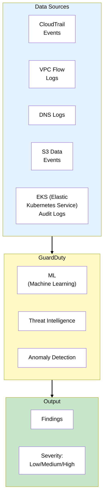
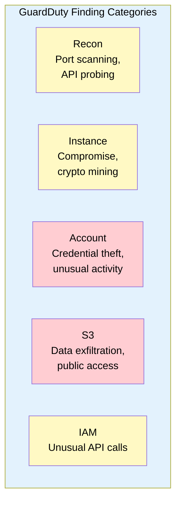
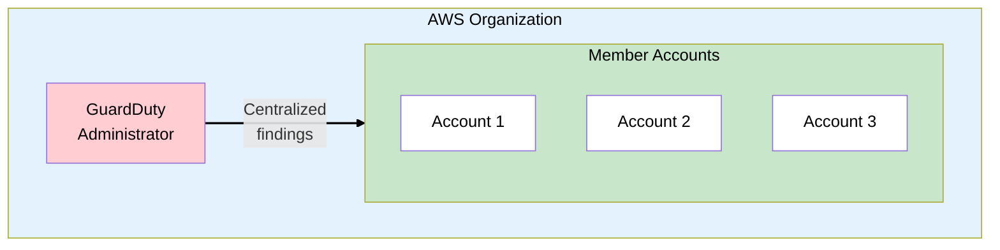
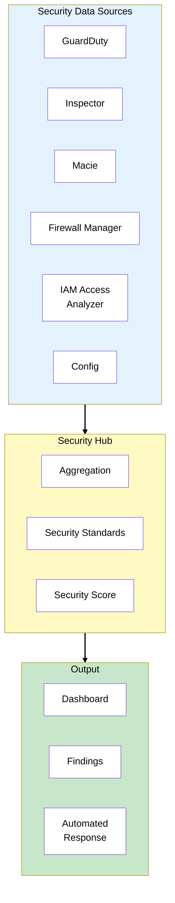
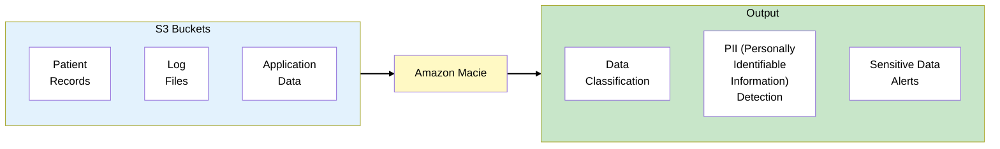
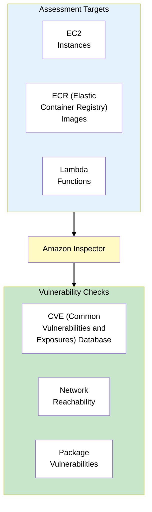
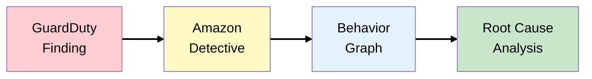
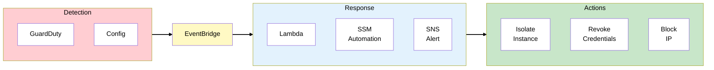
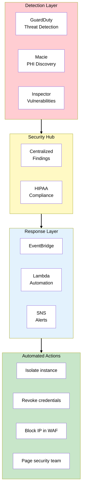
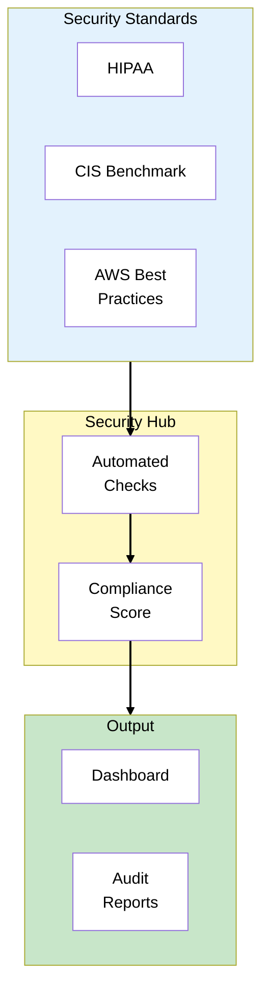

# Phase 6: Threat Detection & Response

## The Story So Far

MedVault has a mature security posture: strong IAM, encryption, network security, comprehensive
logging, and multi-account isolation. The platform is now serving thousands of healthcare providers.
But security is an ongoing battle.

## Business Trigger

The CISO receives a concerning report from a peer at another healthcare company:

> "We just had a breach. Attackers compromised developer credentials and exfiltrated patient data
> over three weeks before we noticed. They used our own APIs against us."

The board wants assurance:

> "How would we know if someone was trying to breach MedVault? What automated detection and response
> capabilities do we have?"

## Architecture Decision

**Decision**: Deploy AWS security services for continuous threat detection (GuardDuty), centralized
security visibility (Security Hub), data classification (Macie), and automated response
capabilities.

### Defense in Depth

Security requires multiple layers working together. Prevention stops attacks, detection identifies
breaches, response contains damage, and recovery restores operations. MedVault now completes the
detection and response layers:

| Layer      | Control                                  | Phase  |
| ---------- | ---------------------------------------- | ------ |
| Prevention | IAM, encryption, network                 | 1-3    |
| Detection  | CloudTrail, Config, GuardDuty            | 4, 6   |
| Response   | Automated remediation, incident response | 6      |
| Recovery   | Backup, DR (Disaster Recovery)           | Future |

## Key Concepts for SAA Exam

### Amazon GuardDuty



### GuardDuty Features

GuardDuty uses multiple detection methods to identify threats. It combines threat intelligence feeds
with ML (Machine Learning) anomaly detection to catch both known and novel attacks:

| Feature                  | Description                                           |
| ------------------------ | ----------------------------------------------------- |
| **Threat Intelligence**  | Known malicious IPs, domains                          |
| **ML Anomaly Detection** | Unusual API calls, data access                        |
| **VPC Flow Analysis**    | Port scanning, C2 (Command and Control) communication |
| **DNS Analysis**         | DNS exfiltration, crypto mining                       |

> **Exam Tip**: GuardDuty analyzes CloudTrail, VPC Flow Logs, and DNS automatically. You don't need
> to enable these separately for GuardDuty.

### GuardDuty Finding Types



**Example findings**:

- `Recon:EC2/PortProbeUnprotectedPort` - Someone scanning your ports
- `UnauthorizedAccess:IAMUser/ConsoleLoginSuccess.B` - Successful login from unusual location
- `Exfiltration:S3/ObjectRead.Unusual` - Unusual S3 data access pattern

### GuardDuty Organization Integration



> **Exam Tip**: Designate a delegated administrator account to manage GuardDuty across all
> organization accounts.

### AWS Security Hub



### Security Hub Standards

Security Hub runs automated compliance checks against industry standards. Each standard includes
dozens of controls that are continuously evaluated. Choose standards based on your compliance
requirements:

| Standard                                     | Focus                 |
| -------------------------------------------- | --------------------- |
| **AWS Foundational Security Best Practices** | AWS-specific security |
| **CIS AWS Foundations Benchmark**            | Industry standard     |
| **PCI DSS**                                  | Payment card security |
| **NIST 800-53**                              | Government security   |

> **Abbreviations**: CIS = Center for Internet Security, PCI DSS = Payment Card Industry Data
> Security Standard, NIST = National Institute of Standards and Technology

> **Exam Tip**: Security Hub provides a unified view of security findings AND runs compliance checks
> against standards.

### Amazon Macie



### Macie Capabilities

Macie automates sensitive data discovery in S3. For healthcare organizations like MedVault, it can
identify PHI (Protected Health Information) that may have been stored in the wrong location:

| Capability                   | Description                        |
| ---------------------------- | ---------------------------------- |
| **Sensitive Data Discovery** | Scans S3 for PII, PHI, credentials |
| **Data Classification**      | Categorizes data types             |
| **Bucket Inventory**         | S3 security posture                |
| **Policy Findings**          | Public buckets, unencrypted data   |

**Detected data types**:

- Personal: Names, addresses, SSN, passport
- Financial: Credit cards, bank accounts
- Healthcare: PHI, medical records
- Credentials: API keys, passwords

> **Exam Tip**: Macie is specifically for **S3 data classification**. It uses ML to find sensitive
> data.

### Amazon Inspector



### Security Service Comparison

These four services work together but serve distinct purposes. This comparison helps you choose the
right service for each security question on the exam:

| Service          | What It Does             | Analyzes                  |
| ---------------- | ------------------------ | ------------------------- |
| **GuardDuty**    | Threat detection         | CloudTrail, VPC Flow, DNS |
| **Inspector**    | Vulnerability scanning   | EC2, ECR, Lambda          |
| **Macie**        | Data classification      | S3 contents               |
| **Security Hub** | Aggregation + compliance | All of the above          |

> **Exam Tip**: GuardDuty = threats (who's attacking). Inspector = vulnerabilities (what's
> exploitable). Macie = sensitive data (where's the PII).

### Amazon Detective

For security investigations:



> **Exam Tip**: Detective helps **investigate** findings from GuardDuty. It's for post-incident
> analysis.

### Automated Response



**Example: Auto-isolate compromised instance**:

```json
{
  "source": ["aws.guardduty"],
  "detail-type": ["GuardDuty Finding"],
  "detail": {
    "severity": [{ "numeric": [">=", 7] }],
    "type": [{ "prefix": "UnauthorizedAccess:EC2" }]
  }
}
```

## MedVault Threat Detection Architecture



### MedVault Security Automation

Each security finding type maps to a specific automated response. High-severity threats trigger
immediate containment actions, while lower-severity findings create tickets for human review:

| Trigger                                | Automated Response                |
| -------------------------------------- | --------------------------------- |
| GuardDuty: EC2 compromise (high)       | Isolate instance (security group) |
| GuardDuty: IAM credential exfiltration | Disable access key                |
| GuardDuty: S3 exfiltration             | Block IP in WAF                   |
| Macie: PHI in wrong bucket             | Move to correct bucket, alert     |
| Inspector: Critical CVE                | Create patch ticket               |
| Config: Public S3 bucket               | Auto-remediate (block public)     |

### Compliance Reporting

With Security Hub, MedVault can generate compliance reports:



## Congratulations!

You've completed the MedVault security journey. You now understand the AWS security services that
comprise **30% of the SAA exam**:

- **Identity & Access**: IAM, Identity Center, Organizations
- **Data Protection**: KMS, Secrets Manager, encryption options
- **Network Security**: VPC endpoints, WAF, Shield
- **Logging & Monitoring**: CloudTrail, Config, CloudWatch
- **Multi-Account**: Organizations, SCPs, Control Tower
- **Threat Detection**: GuardDuty, Security Hub, Macie, Inspector

### Key Exam Takeaways

1. **IAM roles over users** - Temporary credentials preferred
2. **Encryption with KMS** - CMK for compliance, SSE-KMS for audit
3. **VPC endpoints** - Gateway (S3/DynamoDB free), Interface (everything else)
4. **CloudTrail vs Config** - Activity vs state
5. **SCPs limit, don't grant** - Management account unaffected
6. **GuardDuty for threats** - Inspector for vulnerabilities, Macie for data

## Exam Tips

- **GuardDuty = threat detection** - Uses CloudTrail, VPC Flow, DNS
- **Inspector = vulnerability scanning** - EC2, ECR, Lambda
- **Macie = S3 data classification** - Finds PII, PHI
- **Security Hub = aggregation** - Unified view + compliance standards
- **Detective = investigation** - Post-incident analysis
- **All can integrate with EventBridge** - For automated response

## SAA Exam Concepts

### Must-Know for This Phase

| Concept            | Key Points                                                |
| ------------------ | --------------------------------------------------------- |
| GuardDuty          | Threat detection, CloudTrail/VPC Flow/DNS, ML-based       |
| Inspector          | Vulnerability scanning, EC2/ECR/Lambda, CVE database      |
| Macie              | S3 data classification, PII/PHI detection                 |
| Security Hub       | Aggregates findings, compliance standards, security score |
| Detective          | Investigation, behavior graphs, root cause                |
| Automated Response | EventBridge + Lambda for remediation                      |
