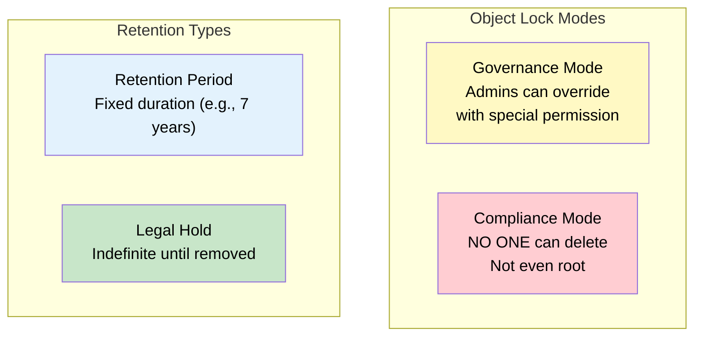
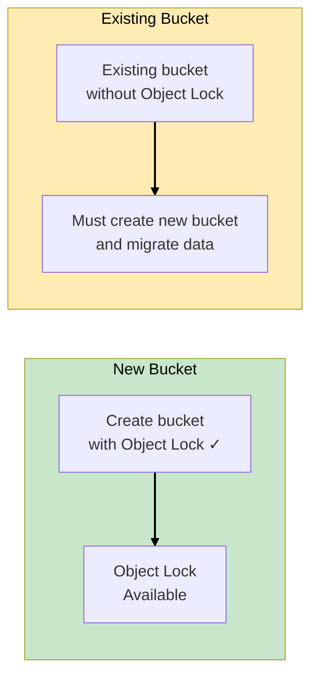
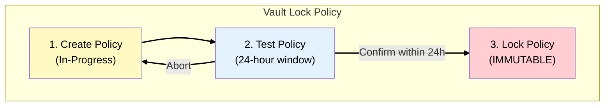
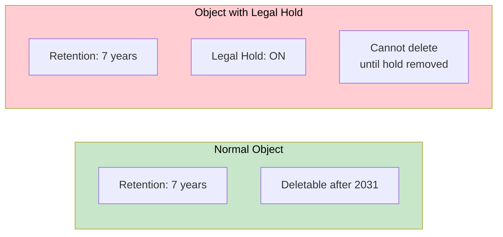
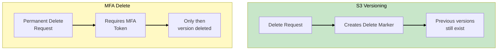
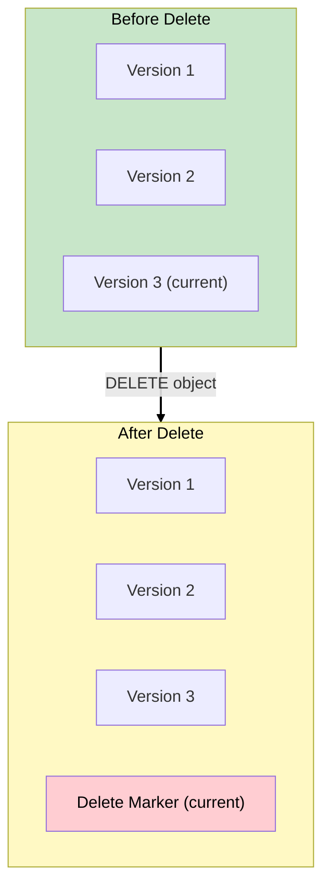
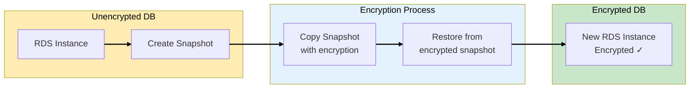
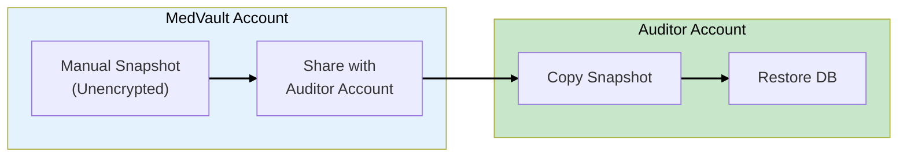
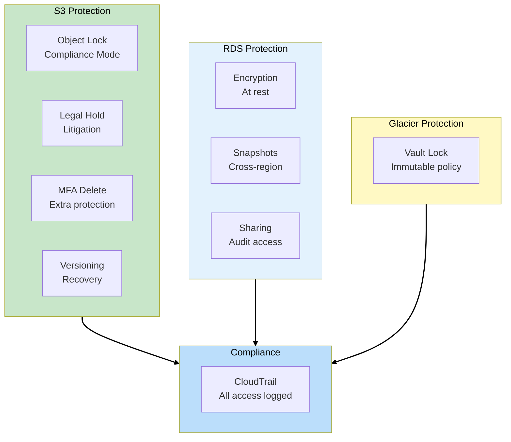

# Phase 7: Data Immutability

## Business Context

**Situation:** MedVault is undergoing a HIPAA audit. The auditor asks: "How do you guarantee that
patient records cannot be deleted or modified, even by administrators, for the required 7-year
retention period?"

**The compliance officer's concern:** "We had an incident where an employee accidentally deleted 6
months of records. We recovered from backup, but the auditor wants proof this can't happen again."

**Requirements:**

- Prevent deletion of critical records for 7 years
- Protect against accidental AND malicious deletion
- Enable legal holds for litigation
- Encrypt all database backups
- Share audit snapshots with external auditors

---

## Step 1: S3 Object Lock Overview

### WORM Storage on S3

**S3 Object Lock** provides Write Once Read Many (WORM) protection:



### Object Lock Modes

| Mode           | Who Can Delete                            | Use Case                     |
| -------------- | ----------------------------------------- | ---------------------------- |
| **Governance** | Users with `s3:BypassGovernanceRetention` | Testing, soft protection     |
| **Compliance** | NO ONE (not even AWS)                     | Regulatory compliance, HIPAA |

### Retention Types

| Type                 | Duration           | Use Case                  |
| -------------------- | ------------------ | ------------------------- |
| **Retention Period** | Fixed (days/years) | "Keep for 7 years"        |
| **Legal Hold**       | Indefinite         | Litigation, investigation |

> **SAA Exam Tip:** "Prevent deletion for regulatory compliance, even by root" = **Compliance
> mode**. "Protect but allow admin override" = **Governance mode**.

---

## Step 2: Enabling Object Lock

### Requirements

Object Lock must be enabled when creating the bucket:



### Creating a Compliant Bucket

```bash
# Create bucket with Object Lock enabled
aws s3api create-bucket \
    --bucket medvault-patient-records \
    --object-lock-enabled-for-bucket \
    --region us-east-1

# Set default retention
aws s3api put-object-lock-configuration \
    --bucket medvault-patient-records \
    --object-lock-configuration '{
        "ObjectLockEnabled": "Enabled",
        "Rule": {
            "DefaultRetention": {
                "Mode": "COMPLIANCE",
                "Years": 7
            }
        }
    }'
```

> **SAA Exam Tip:** Object Lock requires **versioning** to be enabled. You cannot enable Object Lock
> on an existing bucket - you must create a new bucket.

---

## Step 3: S3 Glacier Vault Lock

### For Archival Compliance

**Vault Lock** provides WORM protection for S3 Glacier archives:



### Vault Lock Process

1. **Initiate Lock** - Creates policy in "InProgress" state
2. **24-Hour Window** - Test and validate the policy
3. **Complete Lock** - Policy becomes immutable forever

```json
{
  "Version": "2012-10-17",
  "Statement": [
    {
      "Sid": "DenyDeleteForCompliance",
      "Effect": "Deny",
      "Principal": "*",
      "Action": "glacier:DeleteArchive",
      "Resource": "arn:aws:glacier:us-east-1:123456789012:vaults/medvault-archives",
      "Condition": {
        "NumericLessThan": {
          "glacier:ArchiveAgeInDays": "2555"
        }
      }
    }
  ]
}
```

> **SAA Exam Tip:** "Vault Lock policy" is for **Glacier Vault** (immutable after locking). "Object
> Lock" is for **S3 buckets** (per-object retention).

---

## Step 4: Legal Hold

### Indefinite Protection

**Legal Hold** protects objects indefinitely until explicitly removed:



### Managing Legal Holds

```bash
# Apply legal hold
aws s3api put-object-legal-hold \
    --bucket medvault-patient-records \
    --key patient-123/records.pdf \
    --legal-hold Status=ON

# Remove legal hold (requires s3:PutObjectLegalHold permission)
aws s3api put-object-legal-hold \
    --bucket medvault-patient-records \
    --key patient-123/records.pdf \
    --legal-hold Status=OFF
```

### Legal Hold vs Retention Period

| Aspect          | Retention Period     | Legal Hold                |
| --------------- | -------------------- | ------------------------- |
| **Duration**    | Fixed (days/years)   | Indefinite                |
| **Expiration**  | Automatic            | Manual removal            |
| **Use Case**    | Regulatory retention | Litigation, investigation |
| **Can Coexist** | Yes                  | Yes                       |

> **SAA Exam Tip:** "Protect data indefinitely during litigation" = **Legal Hold**. "Fixed 7-year
> retention" = **Retention Period**. Both can be applied together.

---

## Step 5: S3 Versioning and MFA Delete

### Defense in Depth

Even without Object Lock, you can protect against accidental deletion:



### Enabling MFA Delete

```bash
# Must use root credentials to enable MFA Delete
aws s3api put-bucket-versioning \
    --bucket medvault-patient-records \
    --versioning-configuration '{
        "Status": "Enabled",
        "MFADelete": "Enabled"
    }' \
    --mfa "arn:aws:iam::123456789012:mfa/root-mfa-device 123456"
```

### Protection Layers

| Layer                        | Protects Against              | Recovery             |
| ---------------------------- | ----------------------------- | -------------------- |
| **Versioning**               | Accidental delete             | Restore from version |
| **MFA Delete**               | Unauthorized permanent delete | Requires MFA token   |
| **Object Lock (Governance)** | Most deletions                | Admin can override   |
| **Object Lock (Compliance)** | ALL deletions                 | No recovery possible |

> **SAA Exam Tip:** "Reduce risk of accidental deletion" = Enable **versioning** + **MFA Delete** +
> restrict delete permissions via IAM.

---

## Step 6: S3 Delete Markers

### Understanding Delete Behavior

When you delete a versioned object, S3 creates a **delete marker**:



### Restoring Deleted Objects

```bash
# List versions including delete markers
aws s3api list-object-versions \
    --bucket medvault-patient-records \
    --prefix patient-123/

# Remove delete marker to restore
aws s3api delete-object \
    --bucket medvault-patient-records \
    --key patient-123/records.pdf \
    --version-id "delete-marker-version-id"
```

> **SAA Exam Tip:** "Restore accidentally deleted object in versioned bucket" = **Delete the delete
> marker**. The previous version becomes current again.

---

## Step 7: RDS Encryption and Snapshots

### Encrypting Unencrypted Databases

MedVault's production database was created without encryption. To encrypt it:



### Encryption Steps

```bash
# 1. Create snapshot of unencrypted DB
aws rds create-db-snapshot \
    --db-instance-identifier medvault-prod \
    --db-snapshot-identifier medvault-unencrypted-snap

# 2. Copy snapshot with encryption
aws rds copy-db-snapshot \
    --source-db-snapshot-identifier medvault-unencrypted-snap \
    --target-db-snapshot-identifier medvault-encrypted-snap \
    --kms-key-id alias/medvault-rds-key

# 3. Restore from encrypted snapshot
aws rds restore-db-instance-from-db-snapshot \
    --db-instance-identifier medvault-prod-encrypted \
    --db-snapshot-identifier medvault-encrypted-snap
```

> **SAA Exam Tip:** "Encrypt an existing unencrypted RDS database" = Create snapshot → Copy with
> encryption → Restore. You CANNOT enable encryption on an existing instance directly.

---

## Step 8: Cross-Account Snapshot Sharing

### Sharing with Auditors

MedVault needs to share database snapshots with an external audit firm:



### Sharing Process

```bash
# In MedVault account: Share snapshot
aws rds modify-db-snapshot-attribute \
    --db-snapshot-identifier medvault-audit-snap \
    --attribute-name restore \
    --values-to-add 987654321098  # Auditor's AWS account ID
```

### Sharing Rules

| Snapshot Type            | Can Share?         | Notes                           |
| ------------------------ | ------------------ | ------------------------------- |
| **Manual (unencrypted)** | ✅ Yes             | Auditor must copy, then restore |
| **Manual (encrypted)**   | ✅ Yes             | Must also share KMS key         |
| **Automated**            | ❌ No              | Copy to manual first            |
| **Public**               | ❌ Not recommended | Security risk                   |

> **SAA Exam Tip:** "Share RDS snapshot with another account" = Share **manual** snapshot privately.
> Recipient must **copy** the snapshot before restoring (cannot restore directly from shared
> snapshot).

---

## Phase 7 Architecture Summary



---

## Exam Tips Summary

| Topic                        | Key Point                                        |
| ---------------------------- | ------------------------------------------------ |
| **Object Lock - Governance** | Admins can override with special permission      |
| **Object Lock - Compliance** | NO ONE can delete, not even root                 |
| **Retention Period**         | Fixed duration (days/years)                      |
| **Legal Hold**               | Indefinite until manually removed                |
| **Vault Lock**               | Immutable policy for Glacier vaults              |
| **MFA Delete**               | Requires MFA to permanently delete versions      |
| **Delete Marker**            | Delete marker hides object; remove it to restore |
| **RDS Encryption**           | Snapshot → Copy with encryption → Restore        |
| **Snapshot Sharing**         | Manual only; recipient must copy before restore  |

---

**[← Back to MedVault Overview](../00-overview.md)**
