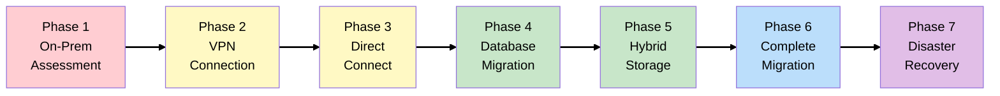

# Migrate or Die: The ShipFast Logistics Story

## The Business

You're the newly hired Cloud Architect at **ShipFast Logistics** - a regional logistics company that
has been running its own datacenter for 15 years. They manage package tracking, warehouse inventory,
and delivery routing for hundreds of business customers.

The CTO has a mandate: modernize infrastructure without disrupting 24/7 operations.

## The Challenge

Unlike a greenfield project, ShipFast can't just "start fresh" in the cloud. They have:

- **Legacy applications** that thousands of warehouse workers depend on daily
- **Massive data volumes** that can't be moved overnight
- **Compliance requirements** that demand careful planning
- **Zero tolerance for downtime** during peak shipping seasons

This is the reality most enterprises face - and exactly what the SAA exam tests heavily.

## Learning Objectives

This evolving scenario teaches AWS migration and hybrid architecture concepts through realistic
business decisions:

- [**Phase 1**: On-Premises Baseline](scenarios/shipfast/phases/phase-1-on-premises-baseline.md)
  (Assessment, 7 Rs of Migration)
- [**Phase 2**: First Cloud Connection](scenarios/shipfast/phases/phase-2-vpn-connection.md)
  (Site-to-Site VPN)
- [**Phase 3**: Dedicated Connectivity](scenarios/shipfast/phases/phase-3-direct-connect.md) (Direct
  Connect, VIFs)
- [**Phase 4**: Database Migration](scenarios/shipfast/phases/phase-4-database-migration.md) (DMS,
  SCT, RDS/Aurora)
- [**Phase 5**: Hybrid Storage](scenarios/shipfast/phases/phase-5-hybrid-storage.md) (Storage
  Gateway, FSx, S3)
- [**Phase 6**: Complete Migration](scenarios/shipfast/phases/phase-6-workload-migration.md) (MGN,
  Snow Family)
- [**Phase 7**: Disaster Recovery](scenarios/shipfast/phases/phase-7-disaster-recovery.md) (EBS
  Snapshots, Aurora Global, AWS Backup)

## Migration Journey Map

**Legend**: Red = On-prem | Yellow = Hybrid connectivity | Green = Data migration | Blue = Workload
migration | Purple = Disaster Recovery

## Current State: The Datacenter

ShipFast's on-premises infrastructure includes:

| Component    | Technology                  | Details                                |
| ------------ | --------------------------- | -------------------------------------- |
| Application  | .NET on Windows Server 2016 | 4 app servers behind F5 load balancer  |
| Database     | SQL Server 2019 Enterprise  | 2TB, primary + standby                 |
| File Storage | NetApp NAS                  | 50TB shipping documents, labels, PODs  |
| Networking   | Cisco routers/switches      | Site-to-site VPNs to 12 warehouses     |
| Backup       | Veeam                       | Daily backups to tape, off-site weekly |

## How This Differs from TechBooks

| Aspect               | TechBooks                 | ShipFast                       |
| -------------------- | ------------------------- | ------------------------------ |
| Starting point       | Greenfield (cloud-native) | Brownfield (on-prem migration) |
| Primary focus        | Scaling & availability    | Migration & hybrid             |
| Key services         | EC2, RDS, ALB, CloudFront | VPN, DX, DMS, Storage Gateway  |
| Architecture pattern | Build up from simple      | Migrate piece by piece         |

## How to Use This Guide

Each phase includes:

1. **Business Context** - What's happening at ShipFast
2. **Architecture Decision** - What we're building and WHY
3. **Key Concepts** - SAA exam-relevant knowledge
4. **Diagrams** - Visual representation of hybrid architecture
5. **Exam Tips** - Migration-specific certification points
