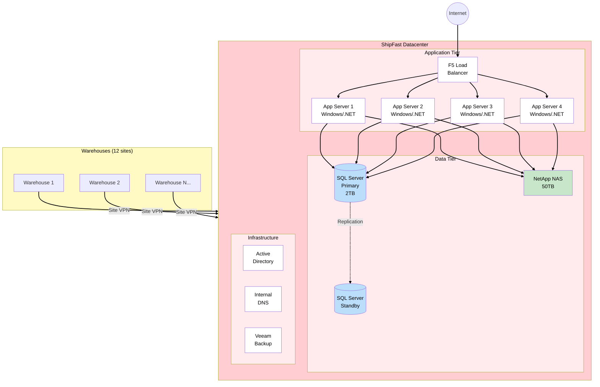
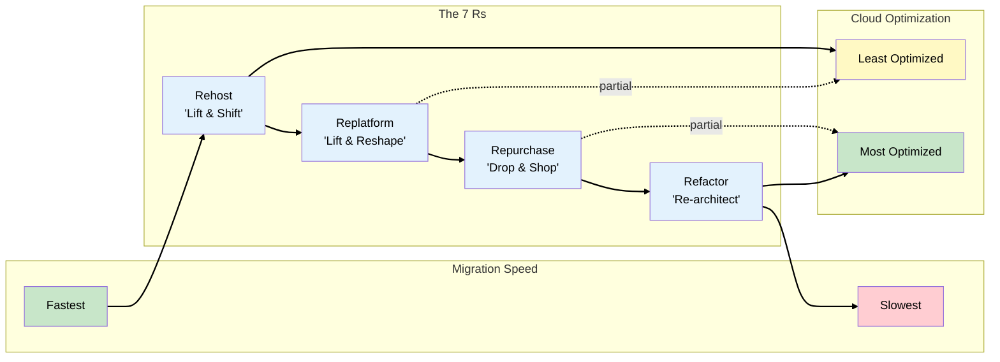
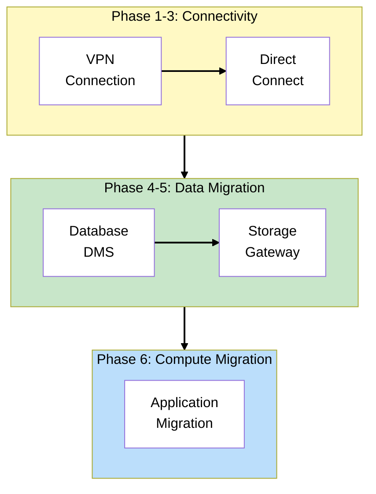

# Phase 1: On-Premises Baseline

## The Story So Far

ShipFast Logistics has been running its own datacenter for 15 years. The infrastructure works, but
cracks are showing. The CTO has asked you - the new Cloud Architect - to assess the situation and
develop a migration strategy.

## Business Trigger

The CFO drops by your desk with concerning news:

> "Our datacenter lease is up in 18 months. Renewing costs $2M, plus we need $500K in hardware
> refresh. The board wants to know: can we move to the cloud instead?"

You also hear from Operations:

> "Last month's power outage took us down for 6 hours. We don't have a real DR (Disaster Recovery)
> site - just tape backups stored off-site. If this building floods, we're done."

## Current Architecture

## The Migration Assessment

Before jumping to solutions, you need to assess the current state. AWS provides tools for this:

### AWS Application Discovery Service

Collects configuration and usage data from on-premises servers:

- **Agentless discovery** - Uses VMware vCenter to collect VM inventory
- **Agent-based discovery** - Installs agents for deeper data (processes, connections, performance)
- Feeds into **AWS Migration Hub** for tracking

### AWS Migration Evaluator (formerly TSO Logic)

Analyzes on-premises workloads and provides:

- Right-sizing recommendations
- Cost projections for AWS
- Business case for migration

## Key Concepts for SAA Exam

### The 7 Rs of Migration

This framework appears constantly on the SAA exam. Know each strategy and when to use it:

| Strategy       | Description                              | When to Use                       | ShipFast Example          |
| -------------- | ---------------------------------------- | --------------------------------- | ------------------------- |
| **Rehost**     | "Lift and shift" - move as-is to EC2     | Quick migration, minimal changes  | App servers to EC2        |
| **Replatform** | "Lift and reshape" - minor optimizations | Easy wins without rewriting       | SQL Server to RDS         |
| **Repurchase** | Replace with SaaS                        | Commodity workloads               | Move to Salesforce        |
| **Refactor**   | Re-architect for cloud-native            | Strategic apps needing scale      | Future: containerize apps |
| **Relocate**   | Move to AWS with minimal changes         | VMware workloads, rapid migration | VMware Cloud on AWS       |
| **Retire**     | Decommission                             | Unused or redundant systems       | Legacy reporting server   |
| **Retain**     | Keep on-premises                         | Compliance, latency, or not ready | (none for ShipFast)       |

### Migration Strategies Comparison

### ShipFast Migration Decisions

After assessment, here's the proposed strategy for each component:

| Component        | Strategy                 | Rationale                                 |
| ---------------- | ------------------------ | ----------------------------------------- |
| App Servers      | **Rehost** (Phase 6)     | Quick win, minimal risk, optimize later   |
| SQL Server       | **Replatform** (Phase 4) | Move to RDS, reduce licensing costs       |
| File Storage     | **Replatform** (Phase 5) | Storage Gateway + S3, keep NFS/SMB access |
| Active Directory | **Retain then Extend**   | AWS Managed AD later                      |
| Backup           | **Repurchase** (Phase 5) | Replace Veeam with AWS Backup             |

## Architecture Decision

**Decision**: Hybrid-first approach with phased migration

We won't do a "big bang" migration. Instead:

1. **Connect first** - Establish VPN, then Direct Connect
2. **Migrate data** - Database and files (highest risk, do early)
3. **Migrate compute** - Applications last (can always fall back)

### Why Hybrid First?

| Approach          | Pros                        | Cons                       |
| ----------------- | --------------------------- | -------------------------- |
| **Big Bang**      | Single cutover, clean break | High risk, long planning   |
| **Phased/Hybrid** | Lower risk, incremental     | Complexity of running both |

For 24/7 operations like ShipFast, phased migration is almost always the right answer.

## Migration Phases Overview

## What Could Go Wrong?

You present the migration plan to leadership. The CTO asks:

> "This all sounds great on paper, but how do we actually connect our datacenter to AWS? We can't
> just migrate data over the public internet - it's too slow and not secure enough for our shipping
> data."

Good question. That's exactly what we'll solve in Phase 2.

## Exam Tips

- **7 Rs appear frequently** - Know the difference between Rehost (no changes), Replatform (minor
  changes), and Relocate (VMware Cloud on AWS)
- **Migration Hub** - Central place to track migration progress across tools
- **Application Discovery Service** - Two modes: agentless (VMware) and agent-based (deeper data)
- **Hybrid is usually the answer** - SAA rarely asks about big-bang migrations
- **Assess before migrating** - Questions often test whether you'd assess first or just start
  migrating

## SAA Exam Concepts

### Must-Know for This Phase

| Concept               | Key Points                                                          |
| --------------------- | ------------------------------------------------------------------- |
| 7 Rs of Migration     | Rehost, Replatform, Repurchase, Refactor, Relocate, Retire, Retain  |
| AWS Migration Hub     | Centralized tracking, integrates with discovery tools               |
| Application Discovery | Agentless (vCenter) vs Agent-based (installed on servers)           |
| Migration Evaluator   | Business case, TCO (Total Cost of Ownership) analysis, right-sizing |

---

## References

Official AWS documentation used to validate this content:

### Migration Strategies

- [About the Migration Strategies](https://docs.aws.amazon.com/prescriptive-guidance/latest/large-migration-guide/migration-strategies.html) -
  The 7 Rs: Rehost, Replatform, Repurchase, Refactor, Relocate, Retire, Retain

### AWS Application Discovery Service

- [What is AWS Application Discovery Service?](https://docs.aws.amazon.com/application-discovery/latest/userguide/what-is-appdiscovery.html) -
  Agentless discovery (VMware vCenter), agent-based discovery, and Migration Hub integration

### AWS Migration Hub

- [AWS Migration Hub Dashboard](https://docs.aws.amazon.com/application-discovery/latest/userguide/dashboard.html) -
  Centralized tracking and migration status visualization
