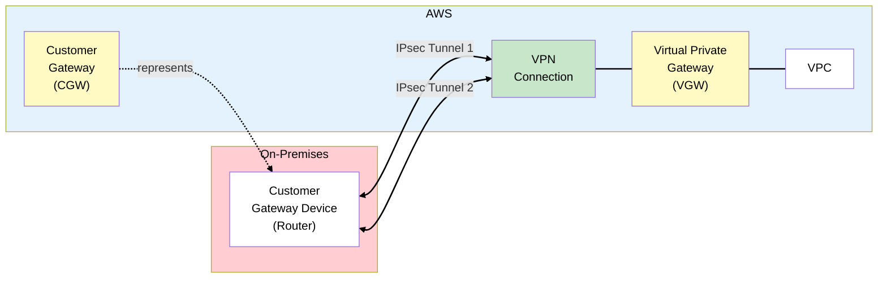
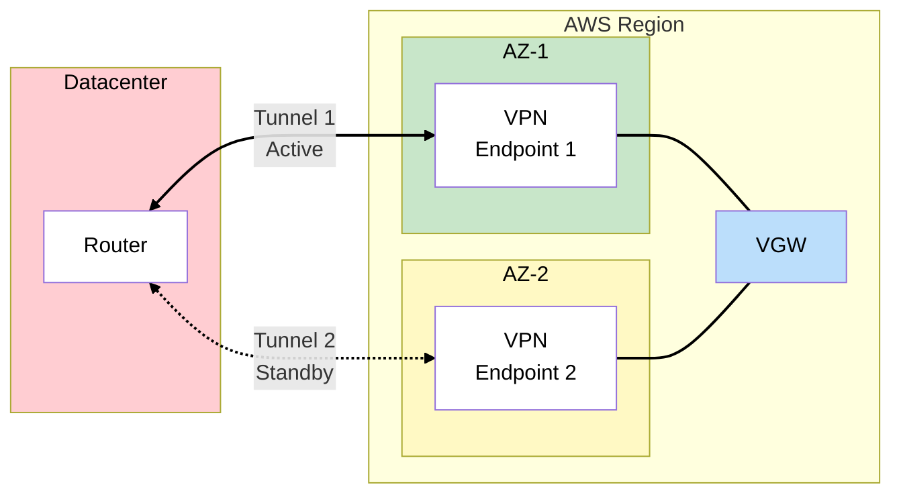
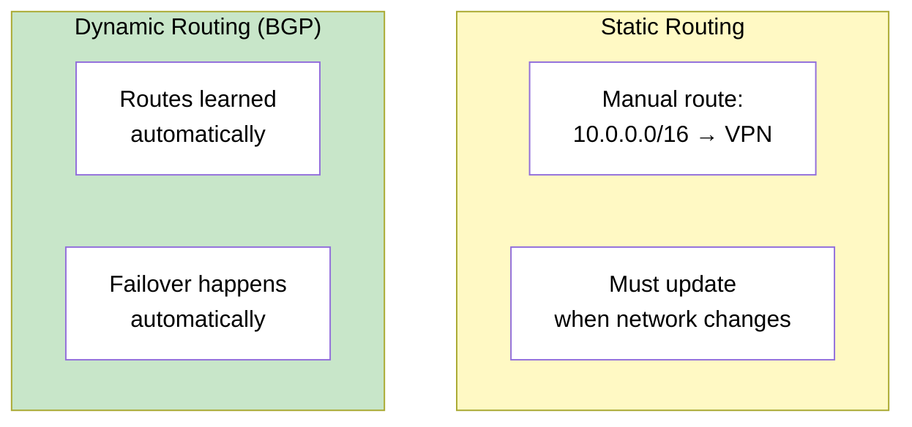
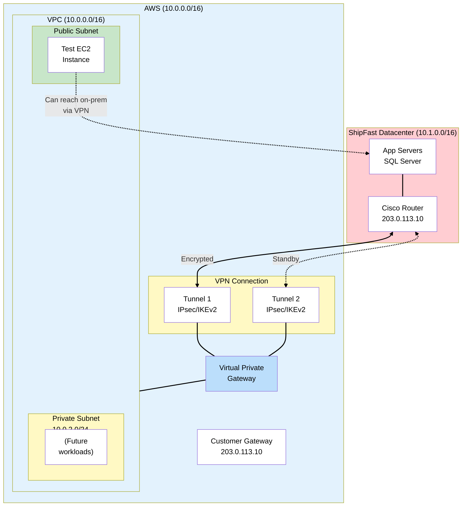

# Phase 2: First Cloud Connection - Site-to-Site VPN

## The Story So Far

ShipFast has assessed their infrastructure and decided on a phased, hybrid-first migration. The 6 Rs
analysis identified which workloads to rehost, replatform, and retain. Now it's time to connect the
datacenter to AWS.

## Business Trigger

The DevOps lead comes to you with an idea:

> "Before we commit to a full migration, can we spin up a test environment in AWS? We want to try
> deploying our app there, but it needs to talk to our on-prem database during testing."

The CTO agrees:

> "I like this approach. Start small, prove it works, then scale up. But security is
> non-negotiable - no shipping data goes over the public internet unencrypted."

## Architecture Decision

**Decision**: Establish a Site-to-Site VPN connection between the datacenter and a new AWS VPC.

### Why VPN First?

| Option               | Setup Time      | Cost       | Bandwidth       | Best For             |
| -------------------- | --------------- | ---------- | --------------- | -------------------- |
| **Site-to-Site VPN** | Hours           | ~$36/month | Up to 1.25 Gbps | Testing, backup link |
| **Direct Connect**   | Weeks to months | $$$+       | 1-400 Gbps      | Production workloads |

VPN is perfect for our "prove it works" phase. We can always add Direct Connect later for production
traffic.

## Key Concepts for SAA Exam

### Site-to-Site VPN Components



### Component Breakdown

| Component                         | What It Is                                    | Where It Lives        |
| --------------------------------- | --------------------------------------------- | --------------------- |
| **Customer Gateway (CGW)**        | AWS resource representing your on-prem router | AWS (logical)         |
| **Customer Gateway Device**       | Physical router/firewall in your datacenter   | On-premises           |
| **Virtual Private Gateway (VGW)** | VPN concentrator on AWS side                  | AWS (attached to VPC) |
| **VPN Connection**                | The encrypted tunnel configuration            | AWS                   |

### Two Tunnels for Redundancy

Every AWS VPN connection includes **two IPsec tunnels** to different endpoints:



> **Exam Tip**: AWS automatically provisions two tunnels in different AZs. You should configure your
> router to use both for redundancy.

### VPN Bandwidth and Limits

| Metric                             | Limit          |
| ---------------------------------- | -------------- |
| Bandwidth per tunnel               | **~1.25 Gbps** |
| Packets per second                 | ~140,000       |
| Maximum tunnels per VPN connection | 2              |
| VPN connections per VGW            | 10             |

> **Exam Tip**: If you need more than 1.25 Gbps, you can use multiple VPN connections with ECMP
> (Equal-Cost Multi-Path) routing via Transit Gateway.

### Routing Options

#### Static Routing

- You manually define which CIDR blocks are reachable
- Simpler setup, but requires manual updates
- Good for simple networks

#### Dynamic Routing (BGP)

- Routes exchanged automatically via Border Gateway Protocol
- Supports automatic failover
- Required for Transit Gateway
- **Preferred for production**



## ShipFast VPN Architecture



### VPN Setup Steps (Conceptual)

1. **Create Customer Gateway** - Register your on-prem router's public IP and BGP ASN
2. **Create Virtual Private Gateway** - Attach to your VPC
3. **Create VPN Connection** - Links CGW to VGW, generates tunnel configurations
4. **Download Configuration** - AWS provides config for your specific router model
5. **Configure On-Prem Router** - Apply the IPsec/BGP configuration
6. **Update Route Tables** - Add routes to VPC route table pointing to VGW

### Security Groups and NACLs

Your test EC2 instance needs to allow traffic from the on-prem network:

```
Security Group - Inbound Rules:
- Type: Custom TCP, Port: 1433, Source: 10.1.0.0/16 (on-prem CIDR)
- Type: SSH, Port: 22, Source: 10.1.0.0/16

Route Table:
- 10.1.0.0/16 → vgw-xxxxxx (Virtual Private Gateway)
```

## VPN vs Direct Connect Comparison

| Feature        | Site-to-Site VPN               | Direct Connect                    |
| -------------- | ------------------------------ | --------------------------------- |
| **Connection** | Over public internet           | Dedicated private fiber           |
| **Encryption** | IPsec (encrypted by default)   | Not encrypted (add MACsec or VPN) |
| **Bandwidth**  | Up to 1.25 Gbps/tunnel         | 1, 10, 100, or 400 Gbps           |
| **Latency**    | Variable (internet-dependent)  | Consistent, lower                 |
| **Setup time** | Minutes to hours               | Weeks to months                   |
| **Cost**       | ~$0.05/hr + data transfer      | Port fee + data transfer          |
| **Use case**   | Backup, testing, low-bandwidth | Production, high-bandwidth        |

## What Could Go Wrong?

The test environment works great. Developers can deploy to AWS and connect back to the on-prem
database. But after a week of testing, the network team reports:

> "The VPN connection keeps dropping during peak hours. Latency spikes to 200ms and we're seeing
> packet loss. The internet link is just too congested."

For production migration, you'll need something more reliable. Time for Direct Connect.

## Exam Tips

- **Two tunnels always** - AWS VPN connections always include 2 tunnels for HA
- **VPN over internet** - Site-to-Site VPN uses the public internet (encrypted with IPsec)
- **BGP for production** - Dynamic routing with BGP is preferred over static
- **VGW attaches to VPC** - One VGW per VPC (or use Transit Gateway for multiple VPCs)
- **CGW is logical** - Customer Gateway is an AWS resource that represents your physical router
- **~1.25 Gbps limit** - Know this number for the exam
- **VPN as backup to DX** - Common pattern: Direct Connect primary, VPN failover

## SAA Exam Concepts

### Must-Know for This Phase

| Concept                       | Key Points                                                  |
| ----------------------------- | ----------------------------------------------------------- |
| Customer Gateway (CGW)        | AWS resource representing on-prem router, needs public IP   |
| Virtual Private Gateway (VGW) | VPN endpoint attached to VPC, one per VPC                   |
| VPN Connection                | Two IPsec tunnels, ~1.25 Gbps each, encrypted               |
| BGP vs Static                 | BGP preferred for auto-failover and route propagation       |
| Route Propagation             | Enable on VPC route table to learn VPN routes automatically |

---

## References

Official AWS documentation used to validate this content:

### Site-to-Site VPN

- [What is AWS Site-to-Site VPN?](https://docs.aws.amazon.com/vpn/latest/s2svpn/VPC_VPN.html) - VPN
  concepts, two tunnels per connection for high availability
- [Site-to-Site VPN Quotas](https://docs.aws.amazon.com/vpn/latest/s2svpn/vpn-limits.html) -
  Bandwidth (1.25 Gbps per tunnel), 140,000 PPS, 10 VPN connections per VGW
- [Transit Gateway + Site-to-Site VPN](https://docs.aws.amazon.com/whitepapers/latest/aws-vpc-connectivity-options/aws-transit-gateway-vpn.html) -
  ECMP for higher bandwidth, BGP required for ECMP

### Direct Connect

- [Dedicated Direct Connect Connections](https://docs.aws.amazon.com/directconnect/latest/UserGuide/dedicated_connection.html) -
  Port speeds: 1 Gbps, 10 Gbps, 100 Gbps, 400 Gbps
