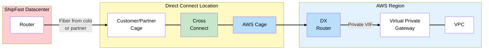
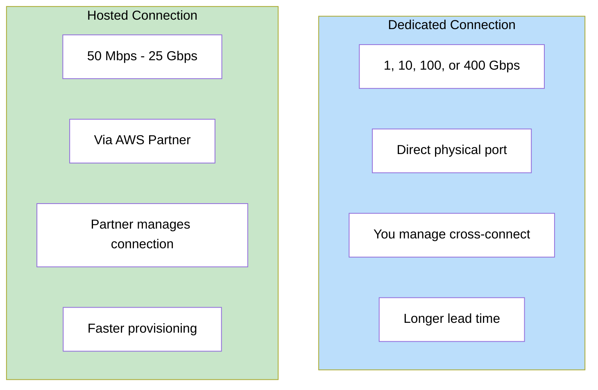
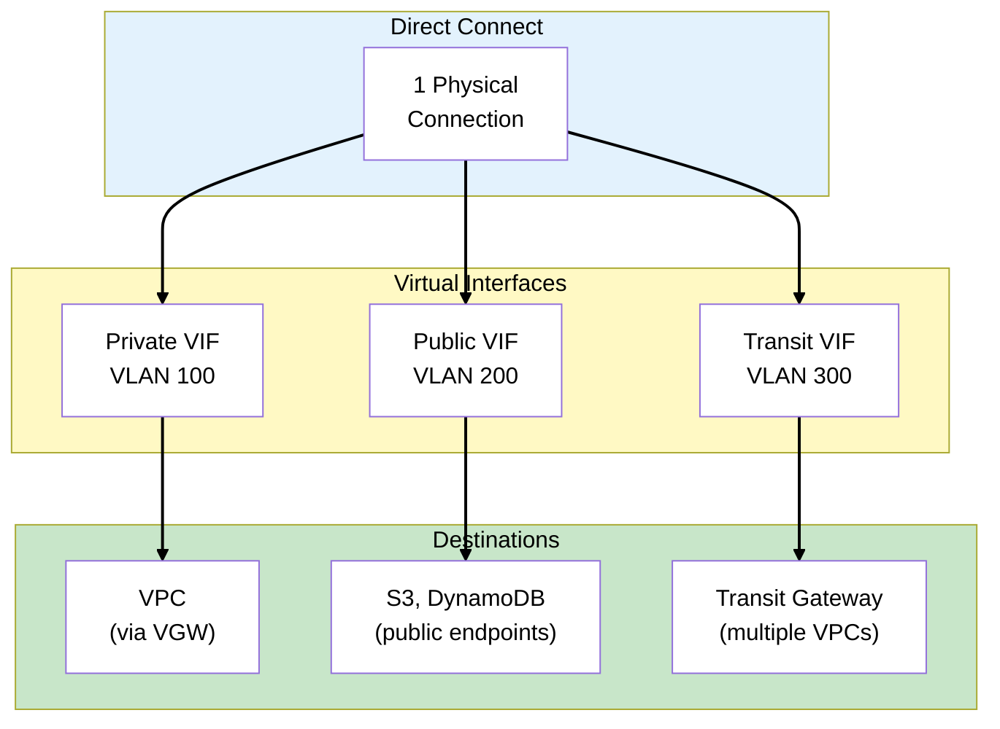
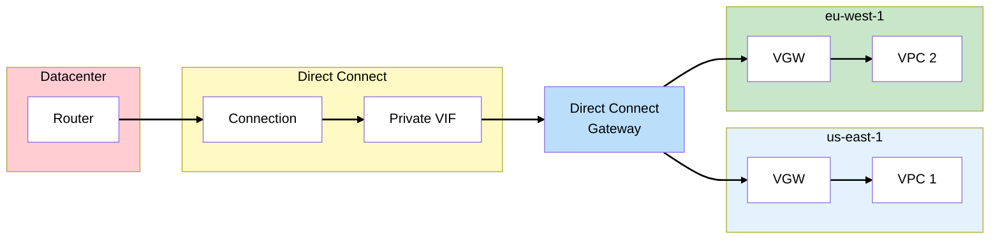
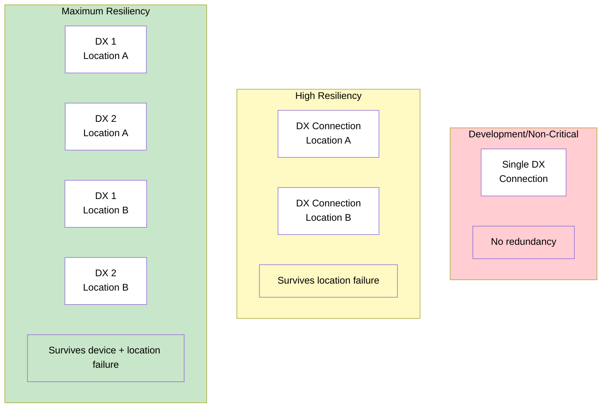
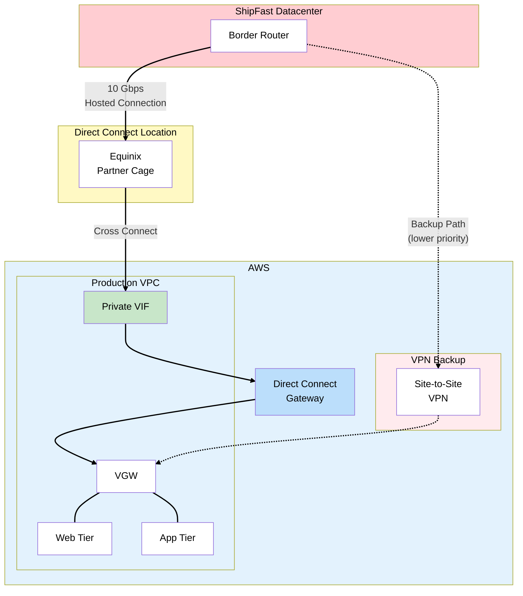
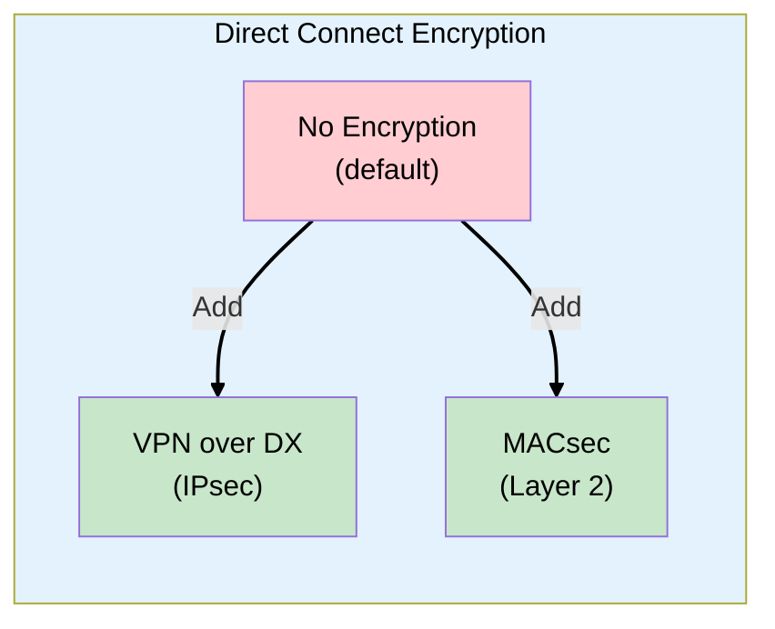

# Phase 3: Dedicated Connectivity - Direct Connect

## The Story So Far

ShipFast established a Site-to-Site VPN connection to AWS. Testing was successful, but performance
issues emerged during peak hours. The VPN's reliance on the public internet causes inconsistent
latency and occasional packet loss.

## Business Trigger

The Operations Director calls an emergency meeting:

> "Our real-time tracking system needs sub-50ms latency to work properly. The VPN averages 80ms with
> spikes to 200ms. Drivers are seeing stale data and customers are complaining about inaccurate
> ETAs."

The network engineer adds:

> "We're also maxing out the VPN at 1.25 Gbps during database backups. Once we start migrating 50TB
> of files, we'll be saturated for days."

The CFO does the math:

> "Transferring 50TB over the internet at $0.09/GB is $4,500. Plus the bandwidth costs. Direct
> Connect might actually save us money."

## Architecture Decision

**Decision**: Establish AWS Direct Connect for production workloads, keeping VPN as backup.

### Why Direct Connect?

| Requirement                 | VPN                  | Direct Connect        |
| --------------------------- | -------------------- | --------------------- |
| Consistent latency          | No (internet varies) | Yes (dedicated fiber) |
| 10+ Gbps bandwidth          | No (1.25 Gbps limit) | Yes (up to 400 Gbps)  |
| Reduced data transfer costs | No                   | Yes (~50% cheaper)    |
| SLA-backed connection       | No                   | Yes                   |

## Key Concepts for SAA Exam

### How Direct Connect Works



### Direct Connect Components

| Component                   | Description                                            |
| --------------------------- | ------------------------------------------------------ |
| **Direct Connect Location** | Physical facility where AWS has presence (colocation)  |
| **Connection**              | Physical port on AWS router (1, 10, or 100 Gbps)       |
| **Cross-Connect**           | Cable linking your cage to AWS cage in the DX location |
| **Virtual Interface (VIF)** | Logical connection over the physical port              |
| **Direct Connect Gateway**  | Enables connections to multiple VPCs/regions           |

### Connection Types

#### Dedicated Connection

- Physical port directly from AWS
- Speeds: **1 Gbps, 10 Gbps, 100 Gbps, or 400 Gbps**
- You manage the cross-connect
- Lead time: weeks to months

#### Hosted Connection

- Through an AWS Partner
- Speeds: **50 Mbps to 25 Gbps**
- Partner manages the cross-connect
- Lead time: days to weeks
- Good when you don't have datacenter in a DX location



> **Exam Tip**: Dedicated = 1/10/100/400 Gbps. Hosted = flexible speeds from 50 Mbps to 25 Gbps.

### Virtual Interfaces (VIFs)

You can create multiple VIFs over a single physical connection:

| VIF Type        | Purpose                                   | Connects To                                       |
| --------------- | ----------------------------------------- | ------------------------------------------------- |
| **Private VIF** | Access VPC resources                      | Virtual Private Gateway or Direct Connect Gateway |
| **Public VIF**  | Access AWS public services (S3, DynamoDB) | AWS public endpoints                              |
| **Transit VIF** | Access multiple VPCs via Transit Gateway  | Transit Gateway                                   |



### Direct Connect Gateway

Allows a single Direct Connect to reach multiple VPCs across regions:



> **Exam Tip**: Direct Connect Gateway enables multi-region access without needing a DX connection
> in each region.

### Link Aggregation Groups (LAG)

Bundle multiple connections for higher bandwidth and redundancy:

- Combine up to **4 connections** of the same speed
- All connections must terminate at the same DX location
- Uses LACP (Link Aggregation Control Protocol)
- Example: 4 x 10 Gbps = 40 Gbps aggregate

### Resilience Patterns



## ShipFast Direct Connect Architecture



### ShipFast's Choices

| Decision               | Choice           | Rationale                                            |
| ---------------------- | ---------------- | ---------------------------------------------------- |
| Connection Type        | Hosted (10 Gbps) | No presence in DX location, partner handles physical |
| VIF Type               | Private VIF      | Access VPC resources, not public AWS services        |
| Redundancy             | DX + VPN backup  | VPN provides failover during DX maintenance          |
| Direct Connect Gateway | Yes              | Future multi-region expansion                        |

### VPN as Backup to Direct Connect

Using BGP, you can configure automatic failover:

```
Route Priority:
1. Direct Connect path (BGP AS-path shorter, preferred)
2. VPN path (BGP AS-path longer, backup only)

If DX fails → BGP routes via VPN automatically
```

> **Exam Tip**: This DX + VPN backup pattern is extremely common in SAA questions.

## Direct Connect vs VPN - Cost Comparison

For ShipFast's 50TB file migration:

| Cost Factor              | VPN                 | Direct Connect           |
| ------------------------ | ------------------- | ------------------------ |
| Data transfer (50TB out) | $4,500 @ $0.09/GB   | $900 @ $0.02/GB          |
| Connection cost          | $36/month           | ~$500/month (hosted 10G) |
| Time to transfer         | 4+ days @ 1.25 Gbps | 12 hours @ 10 Gbps       |

Direct Connect pays for itself in the first migration.

## Encryption Considerations

> **Important**: Direct Connect is **NOT encrypted by default**.

Options for encryption:

1. **VPN over Direct Connect** - IPsec tunnel over private VIF
2. **MACsec** - Layer 2 encryption (10 Gbps and 100 Gbps dedicated only)
3. **Application-level encryption** - TLS/HTTPS for data in transit



## What Could Go Wrong?

Direct Connect is up and running. Latency dropped from 80ms to 15ms. The network team is happy.

But now the database team is getting impatient:

> "We've been running SQL Server in the datacenter for 10 years. The license renewal is next month
> and it's $150,000. Can we move the database to AWS before then?"

Time for database migration.

## Exam Tips

- **Not encrypted by default** - Direct Connect uses private connection but no encryption
- **1/10/100/400 Gbps for dedicated** - Know these speeds
- **Hosted for sub-1 Gbps** - Or when you're not in a DX location
- **Private VIF for VPC access** - Most common VIF type
- **Public VIF for public services** - S3, DynamoDB over DX instead of internet
- **Transit VIF for Transit Gateway** - Connects to TGW for multiple VPCs
- **DX Gateway for multi-region** - One DX connection, multiple regions
- **DX + VPN backup** - Very common pattern, know the BGP priority concept
- **Lead time is weeks/months** - Unlike VPN which is hours

## SAA Exam Concepts

### Must-Know for This Phase

| Concept                | Key Points                                                  |
| ---------------------- | ----------------------------------------------------------- |
| Connection Types       | Dedicated (1/10/100/400 Gbps) vs Hosted (50 Mbps - 25 Gbps) |
| VIF Types              | Private (VPC), Public (AWS services), Transit (TGW)         |
| Direct Connect Gateway | Multi-region/multi-VPC over single DX                       |
| LAG                    | Up to 4 connections, same speed, same location              |
| Resilience             | High = 2 locations, Maximum = 2 connections per location    |
| Encryption             | Not default - use VPN over DX or MACsec                     |

---

## References

Official AWS documentation used to validate this content:

### Direct Connect Connections

- [Dedicated Direct Connect Connections](https://docs.aws.amazon.com/directconnect/latest/UserGuide/dedicated_connection.html) -
  Port speeds: 1 Gbps, 10 Gbps, 100 Gbps, 400 Gbps
- [Hosted Direct Connect Connections](https://docs.aws.amazon.com/directconnect/latest/UserGuide/hosted_connection.html) -
  Port speeds: 50 Mbps to 25 Gbps via AWS Partners
- [Link Aggregation Groups (LAGs)](https://docs.aws.amazon.com/directconnect/latest/UserGuide/lags.html) -
  Aggregate up to 4 connections (1/10 Gbps) or 2 connections (100 Gbps)

### Virtual Interfaces

- [Direct Connect Virtual Interfaces](https://docs.aws.amazon.com/directconnect/latest/UserGuide/WorkingWithVirtualInterfaces.html) -
  Private, Public, and Transit VIF types

### Security

- [MAC Security in Direct Connect](https://docs.aws.amazon.com/directconnect/latest/UserGuide/MACsec.html) -
  Layer 2 encryption for dedicated connections
