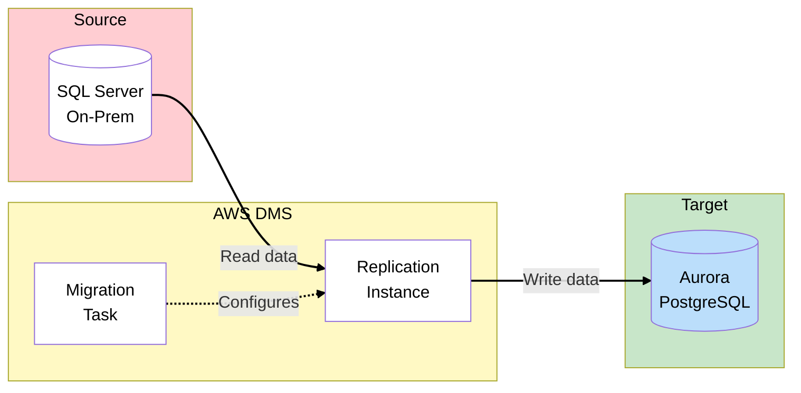
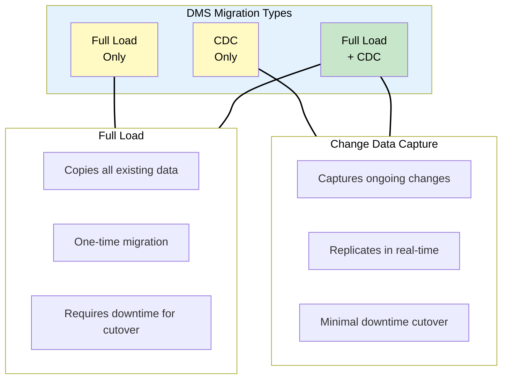
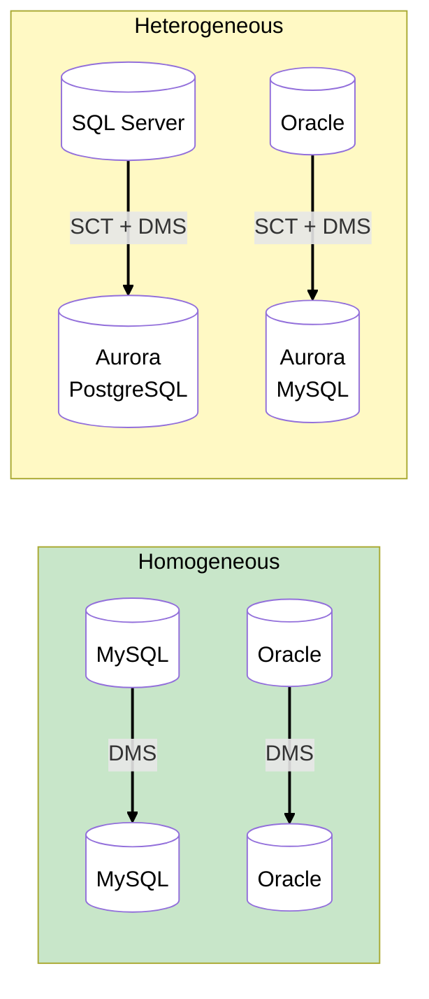
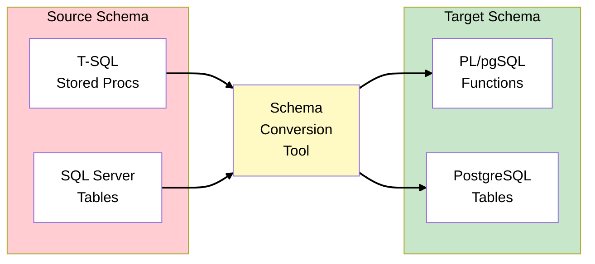
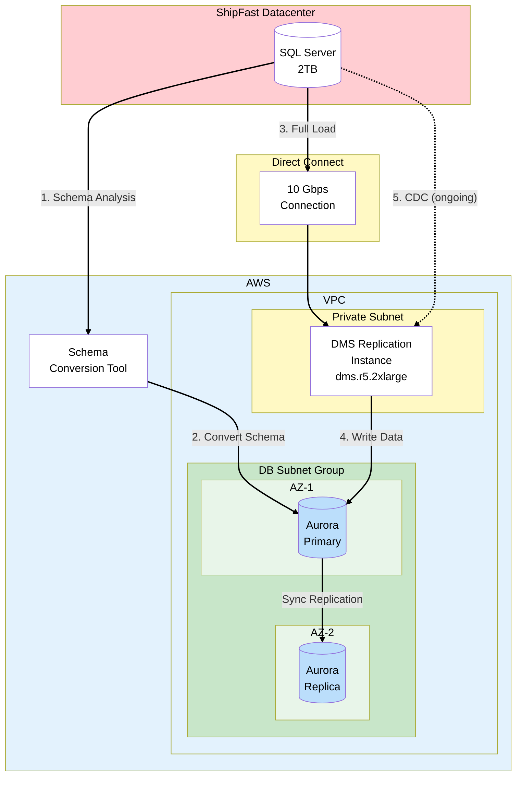
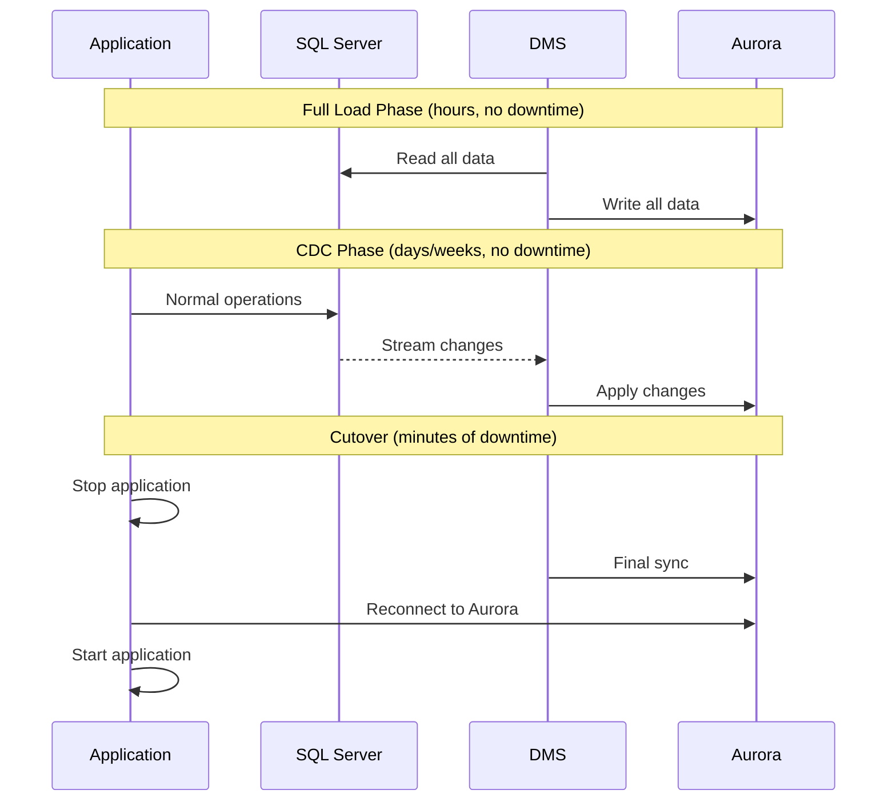
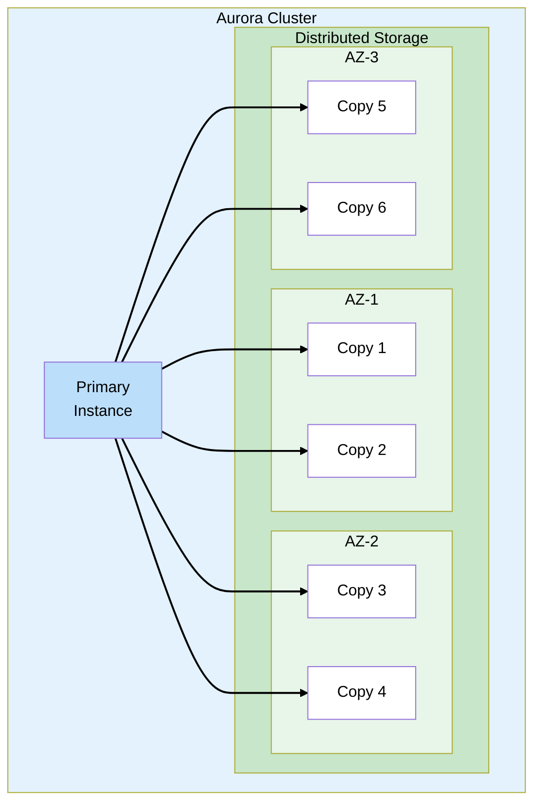
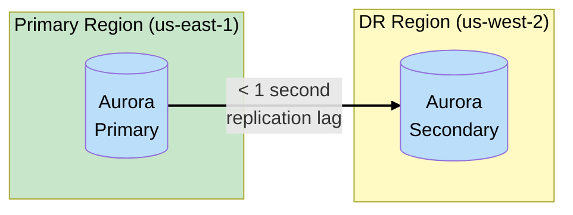

# Phase 4: Database Migration

## The Story So Far

ShipFast has reliable hybrid connectivity: Direct Connect for production traffic with VPN backup.
Latency is now sub-20ms. The infrastructure team is ready to start migrating workloads - starting
with the most critical one: the database.

## Business Trigger

The CFO sends an urgent email:

> "SQL Server Enterprise license renewal is in 30 days. Cost: $150,000. If we're moving to AWS
> anyway, can we avoid this renewal?"

The DBA adds context:

> "Our SQL Server has 2TB of data. We also want proper disaster recovery - our current standby just
> does log shipping and has a 1-hour RPO. One datacenter flood and we lose an hour of shipments."

## Architecture Decision

**Decision**: Migrate SQL Server to Amazon Aurora PostgreSQL using AWS Database Migration Service
(DMS).

### Why Aurora PostgreSQL?

| Option                | Cost             | Performance | Management                |
| --------------------- | ---------------- | ----------- | ------------------------- |
| RDS SQL Server        | $$$$ (licensing) | Good        | AWS managed               |
| RDS PostgreSQL        | $$               | Good        | AWS managed               |
| **Aurora PostgreSQL** | $$               | Excellent   | AWS managed, auto-scaling |
| EC2 + SQL Server      | $$$$ (licensing) | Variable    | Self-managed              |

Aurora eliminates SQL Server licensing and provides:

- Up to 3x the throughput of standard PostgreSQL
- Auto-scaling storage (up to 128 TiB)
- 6-way replication across 3 AZs
- Global Database for cross-region DR

> **Trade-off**: Heterogeneous migration (SQL Server → PostgreSQL) requires application code changes
> and schema conversion. More effort, but $150K/year savings.

## Key Concepts for SAA Exam

### AWS Database Migration Service (DMS)

### DMS Components

| Component                | Purpose                                    |
| ------------------------ | ------------------------------------------ |
| **Source Endpoint**      | Connection details for source database     |
| **Target Endpoint**      | Connection details for target database     |
| **Replication Instance** | EC2 instance that runs the migration tasks |
| **Migration Task**       | Defines what to migrate and how            |

### Migration Types

| Type                | When to Use                                  | Downtime                |
| ------------------- | -------------------------------------------- | ----------------------- |
| **Full Load**       | One-time migration, can afford downtime      | Hours (during copy)     |
| **CDC only**        | Already have initial data, need ongoing sync | Minimal                 |
| **Full Load + CDC** | Zero-downtime migration                      | Minutes (final cutover) |

> **Exam Tip**: Full Load + CDC is the most common pattern for production migrations with minimal
> downtime.

### Homogeneous vs Heterogeneous

| Type              | Definition                                  | Tools Needed |
| ----------------- | ------------------------------------------- | ------------ |
| **Homogeneous**   | Same database engine (MySQL → MySQL)        | DMS only     |
| **Heterogeneous** | Different engines (SQL Server → PostgreSQL) | SCT + DMS    |

### AWS Schema Conversion Tool (SCT)

For heterogeneous migrations, SCT converts:

- Database schema (tables, views, indexes)
- Stored procedures and functions
- Application SQL code

SCT provides an **Assessment Report** showing:

- What converts automatically (typically 80-95%)
- What requires manual intervention
- Estimated effort for migration

### Replication Instance Sizing

| Factor               | Consideration                       |
| -------------------- | ----------------------------------- |
| Source database size | Larger = more memory needed         |
| Number of tables     | More tables = more parallel threads |
| Transaction rate     | High CDC rate = faster instance     |
| LOB data             | Large objects need more memory      |

> **Exam Tip**: Replication instance runs in a VPC. It needs connectivity to both source (on-prem)
> and target (AWS).

## ShipFast Database Migration

### Migration Steps

1. **Run SCT Assessment**
   - Analyze SQL Server schema
   - Review conversion report
   - Identify manual fixes needed (stored procedures with T-SQL specifics)

2. **Convert Schema**
   - SCT converts tables, indexes, views automatically
   - Manually convert complex stored procedures
   - Apply to Aurora PostgreSQL

3. **Set Up DMS**
   - Create replication instance in private subnet
   - Create source endpoint (SQL Server with VPN/DX connectivity)
   - Create target endpoint (Aurora PostgreSQL)

4. **Run Full Load**
   - Initial bulk copy of 2TB (~3 hours over 10 Gbps DX)
   - Tables loaded in parallel

5. **Enable CDC**
   - Ongoing replication of changes
   - Applications continue using SQL Server
   - Aurora stays in sync

6. **Cutover**
   - Stop applications
   - Wait for CDC to catch up (minutes)
   - Update connection strings to Aurora
   - Restart applications

### Minimal Downtime Migration Pattern

## Aurora Features for ShipFast

### Multi-AZ by Default

Aurora automatically replicates to 6 storage nodes across 3 AZs:

### Aurora vs RDS Multi-AZ

| Feature       | RDS Multi-AZ           | Aurora                    |
| ------------- | ---------------------- | ------------------------- |
| Replication   | Synchronous to standby | 6-way to shared storage   |
| Failover time | 60-120 seconds         | ~30 seconds               |
| Read replicas | Separate from Multi-AZ | Same storage, up to 15    |
| Storage       | EBS volumes            | Distributed, auto-scaling |

> **Exam Tip**: Aurora uses shared storage architecture, not EBS. This is why it's faster and more
> durable.

### Aurora Global Database

For cross-region DR (future consideration for ShipFast):

- RPO: < 1 second
- RTO: < 1 minute (with planned failover)

## What Could Go Wrong?

The database migration is complete. Aurora is running smoothly, SQL Server licensing is cancelled
($150K saved!). But now the storage team has a problem:

> "Great, the database is migrated. But we still have 50TB of shipping documents on the NAS. Users
> access them via SMB shares. We can't just shut that down - drivers need those proof-of-delivery
> documents 24/7."

Time to tackle hybrid storage.

## Exam Tips

- **DMS for data, SCT for schema** - Know which tool does what
- **Full Load + CDC for minimal downtime** - Most common production pattern
- **Homogeneous = same engine** - Uses DMS only
- **Heterogeneous = different engines** - Requires SCT first
- **Replication instance in VPC** - Needs connectivity to both source and target
- **Aurora storage is shared** - 6 copies across 3 AZs, auto-scaling
- **Aurora failover ~30 seconds** - Faster than RDS Multi-AZ (60-120s)
- **Aurora Global Database for cross-region** - < 1 second replication

## SAA Exam Concepts

### Must-Know for This Phase

| Concept         | Key Points                                                         |
| --------------- | ------------------------------------------------------------------ |
| DMS             | Replication instance, source/target endpoints, migration tasks     |
| SCT             | Schema conversion for heterogeneous migrations, assessment reports |
| Migration Types | Full Load, CDC, Full Load + CDC                                    |
| Homogeneous     | Same engine, DMS only                                              |
| Heterogeneous   | Different engines, SCT + DMS                                       |
| Aurora          | 6-way replication, shared storage, up to 15 read replicas          |
| Aurora Global   | Cross-region, < 1 second lag, fast DR                              |

---

## See Also

> **Related Learning:** For RDS fundamentals and Multi-AZ high availability patterns, see
> [TechBooks Phase 2: Database Separation](/scenarios/techbooks/phases/phase-2-database-separation.md)
> and [Phase 3: High Availability](/scenarios/techbooks/phases/phase-3-high-availability.md).

---

## References

Official AWS documentation used to validate this content:

### AWS Database Migration Service

- [What is AWS DMS?](https://docs.aws.amazon.com/dms/latest/userguide/Welcome.html) - Replication
  instances, source/target endpoints, migration tasks
- [DMS Migration Types](https://docs.aws.amazon.com/dms/latest/userguide/CHAP_Task.CDC.html) - Full
  load, CDC, and Full load + CDC options

### AWS Schema Conversion Tool

- [What is AWS SCT?](https://docs.aws.amazon.com/SchemaConversionTool/latest/userguide/CHAP_Welcome.html) -
  Schema conversion for heterogeneous database migrations

### Amazon Aurora

- [What is Amazon Aurora?](https://docs.aws.amazon.com/AmazonRDS/latest/AuroraUserGuide/CHAP_AuroraOverview.html) -
  Up to 5x MySQL throughput, up to 3x PostgreSQL throughput, 128 TiB storage
- [Amazon Aurora Storage](https://docs.aws.amazon.com/AmazonRDS/latest/AuroraUserGuide/Aurora.Overview.StorageReliability.html) -
  6-way replication across 3 AZs, shared distributed storage
- [Aurora Global Database](https://docs.aws.amazon.com/AmazonRDS/latest/AuroraUserGuide/aurora-global-database.html) -
  Cross-region replication with sub-second lag
