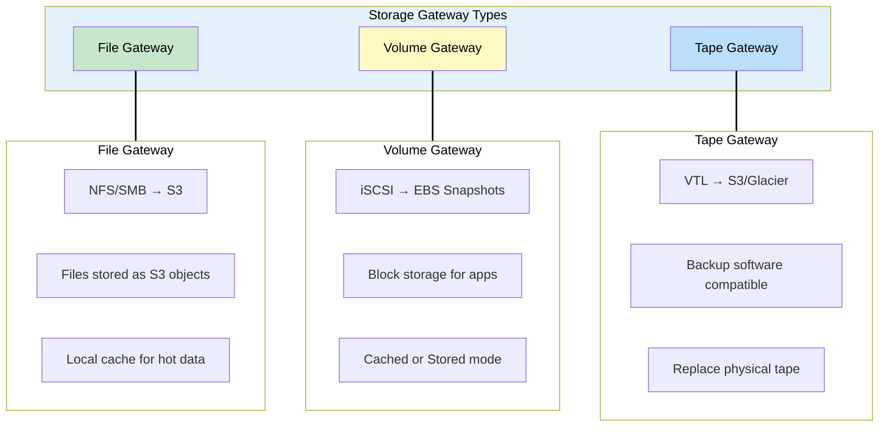
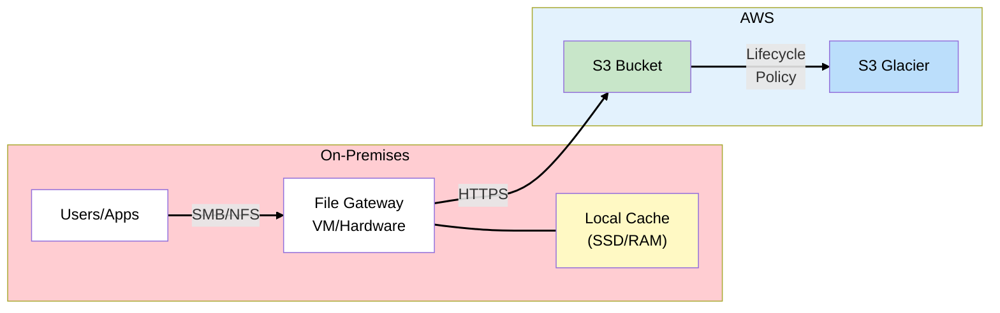
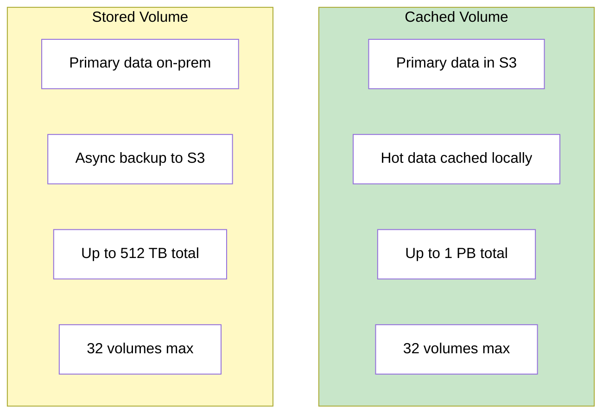
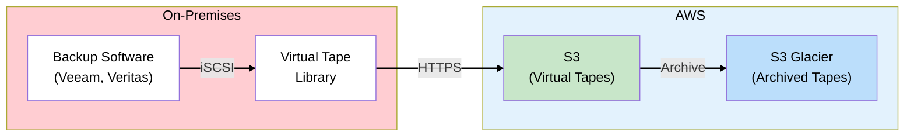
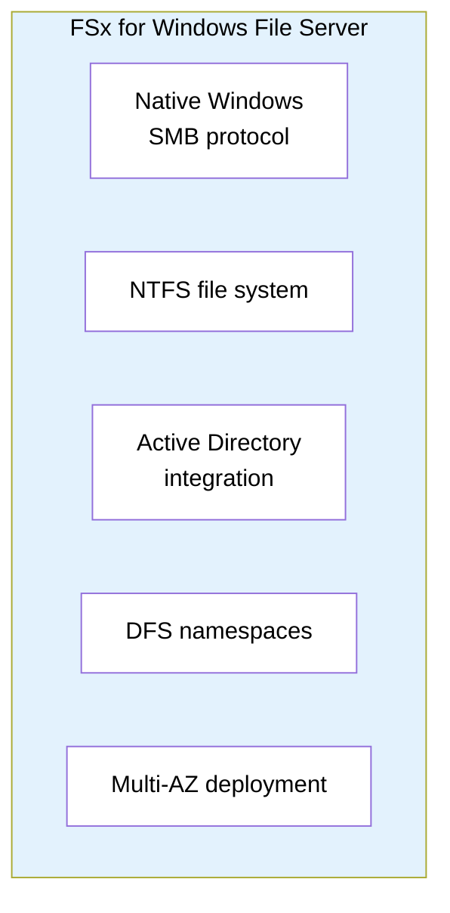
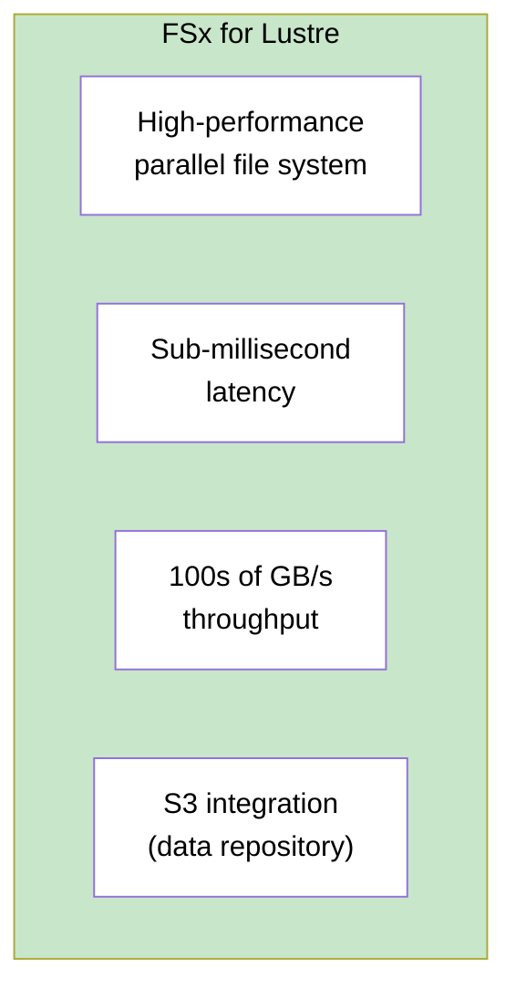
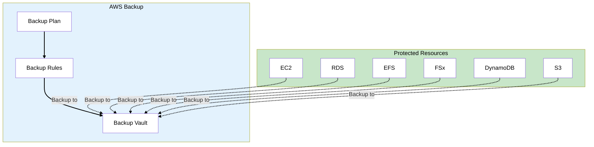
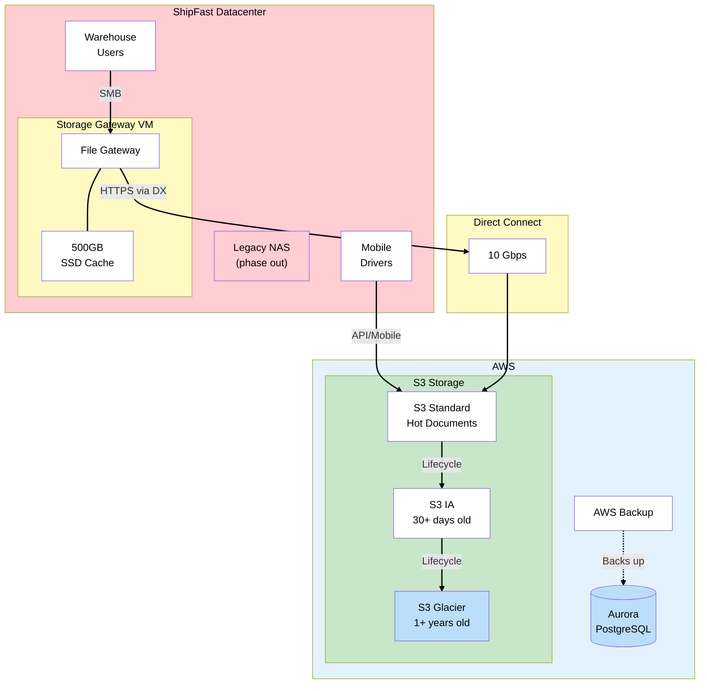
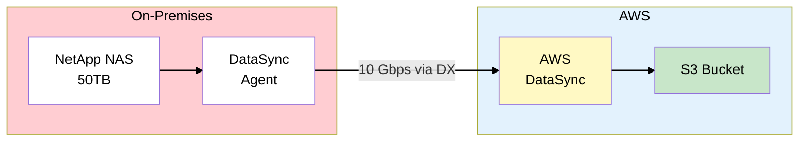

# Phase 5: Hybrid Storage

## The Story So Far

ShipFast successfully migrated their SQL Server database to Aurora PostgreSQL, saving $150K in
licensing. Direct Connect provides reliable, high-bandwidth connectivity. But there's still 50TB of
file storage sitting in the datacenter.

## Business Trigger

The storage admin sends an alarming ticket:

> "NAS is at 92% capacity. We add about 2TB of shipping documents per month. At this rate, we'll be
> full in 60 days. A new shelf costs $80,000."

The Operations Director adds:

> "Drivers access proof-of-delivery documents via mapped network drives (SMB shares). If we change
> how they access files, we'll need to retrain 500 drivers and update all our mobile apps."

The compliance officer chimes in:

> "Shipping documents must be retained for 7 years. Our current backup system can't handle that
> volume reliably."

## Architecture Decision

**Decision**: Deploy AWS Storage Gateway (File Gateway mode) to extend on-premises storage to S3,
while maintaining SMB access for users.

### Why Storage Gateway?

| Requirement                 | Solution                            |
| --------------------------- | ----------------------------------- |
| Users need SMB shares       | File Gateway presents S3 as SMB/NFS |
| Need unlimited capacity     | S3 scales infinitely                |
| Fast access to recent files | Local cache on gateway              |
| 7-year retention            | S3 lifecycle policies to Glacier    |

## Key Concepts for SAA Exam

### AWS Storage Gateway Types



### Detailed Comparison

| Gateway Type                | Protocol    | Backend           | Use Case                          |
| --------------------------- | ----------- | ----------------- | --------------------------------- |
| **File Gateway**            | NFS, SMB    | S3                | File shares, user directories     |
| **Volume Gateway (Cached)** | iSCSI       | S3 + local cache  | Frequently accessed block data    |
| **Volume Gateway (Stored)** | iSCSI       | Local + S3 backup | Full dataset on-prem, DR to cloud |
| **Tape Gateway**            | iSCSI (VTL) | S3, S3 Glacier    | Backup/archive, replace tape      |

### File Gateway Deep Dive



**How it works**:

1. User saves file via SMB share
2. File stored in local cache
3. Gateway uploads to S3 asynchronously
4. User reads file - served from cache if available
5. Cache miss - gateway fetches from S3

> **Exam Tip**: Files are stored as S3 objects with 1:1 mapping. Metadata preserved via S3 object
> metadata.

### File Gateway Deployment Options

| Option                 | Where      | Best For                    |
| ---------------------- | ---------- | --------------------------- |
| **VMware ESXi**        | On-prem VM | Existing virtualization     |
| **Hyper-V**            | On-prem VM | Windows environments        |
| **EC2**                | AWS        | Cloud-to-cloud or DR        |
| **Hardware Appliance** | Physical   | No virtualization available |

### Volume Gateway Modes



> **Exam Tip**: Cached mode = data in cloud, cache locally. Stored mode = data locally, backup to
> cloud. Know the difference!

### Tape Gateway

Replaces physical tape infrastructure:



Backup software sees virtual tapes, not cloud storage.

## Amazon FSx Options

For workloads that need true file system features (not just object storage):

### FSx for Windows File Server



**Use when**: Windows applications need SMB, AD integration, or Windows-specific features.

### FSx for Lustre



**Use when**: HPC, ML training, video processing - workloads needing extreme throughput.

### FSx Comparison

| Feature        | FSx Windows        | FSx Lustre      | FSx NetApp ONTAP | FSx OpenZFS     |
| -------------- | ------------------ | --------------- | ---------------- | --------------- |
| Protocol       | SMB                | Lustre          | NFS, SMB, iSCSI  | NFS             |
| Use case       | Enterprise Windows | HPC/ML          | Multi-protocol   | Linux workloads |
| AD integration | Yes                | No              | Yes              | No              |
| S3 integration | No                 | Yes (data repo) | No               | No              |

> **Exam Tip**: FSx for Windows = SMB + AD. FSx for Lustre = HPC + S3 integration.

## AWS Backup

Centralized backup management across AWS services:



### Backup Features

| Feature                  | Description                                |
| ------------------------ | ------------------------------------------ |
| **Backup Plans**         | Automated schedules and retention policies |
| **Backup Vault**         | Encrypted container for recovery points    |
| **Cross-region copy**    | DR to another region                       |
| **Cross-account backup** | Protect against account compromise         |
| **Vault Lock**           | WORM compliance (immutable backups)        |

## ShipFast Hybrid Storage Architecture



### ShipFast Storage Strategy

| Data Type            | Solution                   | Retention         |
| -------------------- | -------------------------- | ----------------- |
| Active shipping docs | File Gateway → S3 Standard | 30 days hot       |
| Older documents      | S3 lifecycle → S3 IA       | 30 days - 1 year  |
| Archived documents   | S3 lifecycle → Glacier     | 1-7 years         |
| Database backups     | AWS Backup                 | Daily for 30 days |

### S3 Lifecycle Policy

```json
{
  "Rules": [
    {
      "ID": "Shipping-Docs-Lifecycle",
      "Status": "Enabled",
      "Transitions": [
        {
          "Days": 30,
          "StorageClass": "STANDARD_IA"
        },
        {
          "Days": 365,
          "StorageClass": "GLACIER"
        }
      ],
      "Expiration": {
        "Days": 2555
      }
    }
  ]
}
```

### Cost Comparison

| Storage         | On-Prem NAS          | S3 + File Gateway        |
| --------------- | -------------------- | ------------------------ |
| 50TB capacity   | $80,000 upfront      | ~$1,150/month            |
| 7 years archive | Tape + offsite       | S3 Glacier: $0.004/GB    |
| Scaling         | Buy more shelves     | Automatic                |
| DR              | Manual tape rotation | Cross-region replication |

## DataSync for Initial Migration

To move the existing 50TB from NAS to S3:



**DataSync vs Storage Gateway**: | Feature | DataSync | Storage Gateway |
|---------|----------|-----------------| | Purpose | Migration, sync | Hybrid access | | Direction |
One-time or scheduled | Continuous | | Protocol | Agent-based | SMB/NFS | | Best for | Moving data |
Ongoing hybrid |

> **Exam Tip**: Use DataSync for migration, Storage Gateway for ongoing hybrid access.

## What Could Go Wrong?

File Gateway is deployed and working. Users access files via SMB just like before. The 50TB
migration completed via DataSync in under 2 days. The NAS is being decommissioned.

But the CTO looks at the calendar:

> "Our datacenter lease ends in 6 months. Database is migrated. Storage is migrated. But we still
> have 4 application servers running .NET in that datacenter. How do we move those?"

Time for the final migration.

## Exam Tips

- **File Gateway for SMB/NFS** - Maps to S3 objects, local cache for hot data
- **Volume Gateway Cached** - Primary data in S3, cache locally
- **Volume Gateway Stored** - Primary data local, async backup to S3
- **Tape Gateway** - Replace physical tape with VTL → S3/Glacier
- **FSx Windows for SMB + AD** - True Windows file server, not S3 object storage
- **FSx Lustre for HPC** - High-throughput, S3 data repository integration
- **DataSync for migration** - One-time or scheduled sync, not for ongoing access
- **AWS Backup** - Centralized, cross-region, cross-account, Vault Lock for compliance

## SAA Exam Concepts

### Must-Know for This Phase

| Concept        | Key Points                                           |
| -------------- | ---------------------------------------------------- |
| File Gateway   | SMB/NFS → S3, local cache, files as objects          |
| Volume Gateway | Cached (S3 primary) vs Stored (local primary)        |
| Tape Gateway   | VTL for backup software, S3/Glacier backend          |
| FSx Windows    | Native SMB, AD integration, Multi-AZ                 |
| FSx Lustre     | HPC, S3 integration, sub-ms latency                  |
| DataSync       | Migration and sync, agent-based, encrypted           |
| AWS Backup     | Centralized, cross-region, cross-account, Vault Lock |

---

## References

Official AWS documentation used to validate this content:

### AWS Storage Gateway

- [What is AWS Storage Gateway?](https://docs.aws.amazon.com/filegateway/latest/files3/WhatIsStorageGateway.html) -
  File, Volume, and Tape Gateway types
- [Volume Gateway](https://docs.aws.amazon.com/storagegateway/latest/vgw/WhatIsStorageGateway.html) -
  Cached mode (up to 1 PB), Stored mode (up to 512 TB), 32 volumes maximum

### Amazon FSx

- [Amazon FSx for Windows File Server](https://docs.aws.amazon.com/fsx/latest/WindowsGuide/what-is.html) -
  Native SMB, Active Directory integration, Multi-AZ
- [Amazon FSx for Lustre](https://docs.aws.amazon.com/fsx/latest/LustreGuide/what-is.html) -
  High-performance parallel file system, S3 data repository integration

### AWS DataSync

- [What is AWS DataSync?](https://docs.aws.amazon.com/datasync/latest/userguide/what-is-datasync.html) -
  Online data transfer service for migrations and scheduled syncs

### AWS Backup

- [What is AWS Backup?](https://docs.aws.amazon.com/aws-backup/latest/devguide/whatisbackup.html) -
  Centralized backup management, cross-region/cross-account copy, Vault Lock
