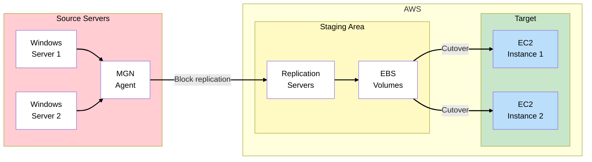
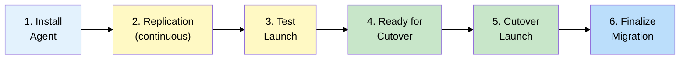
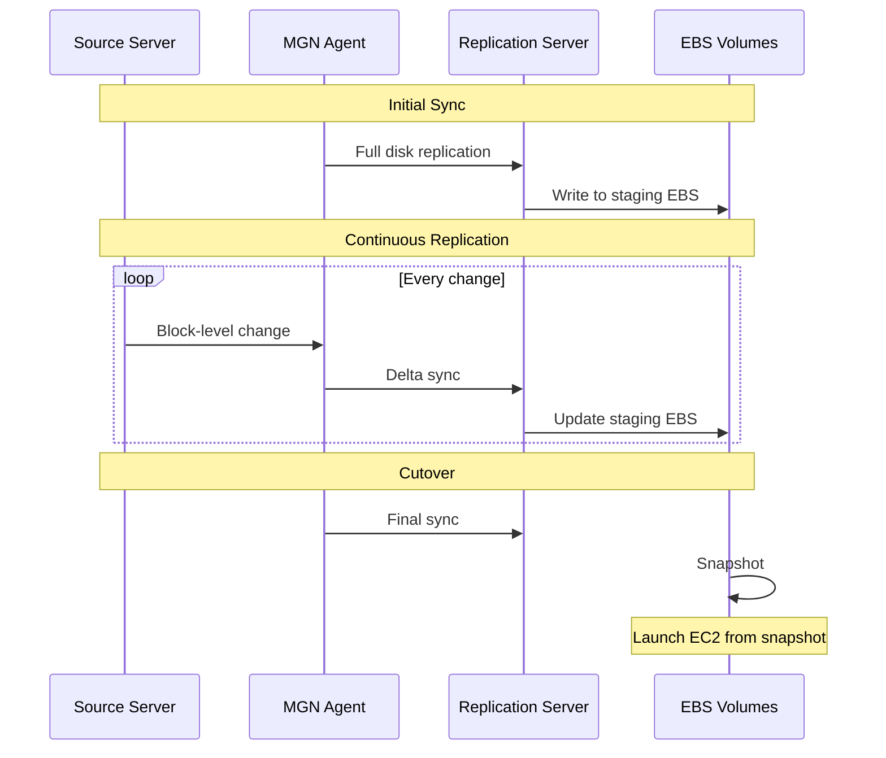
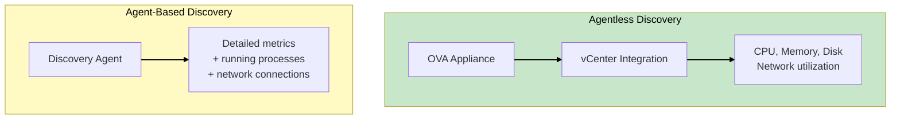
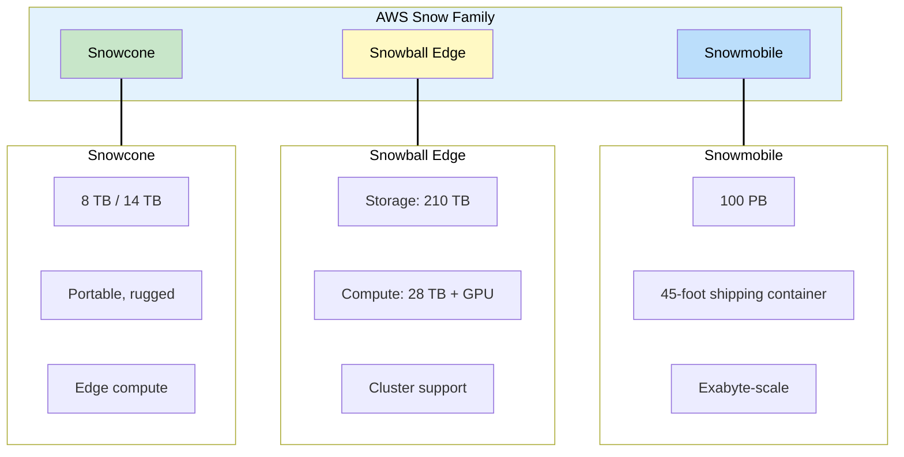
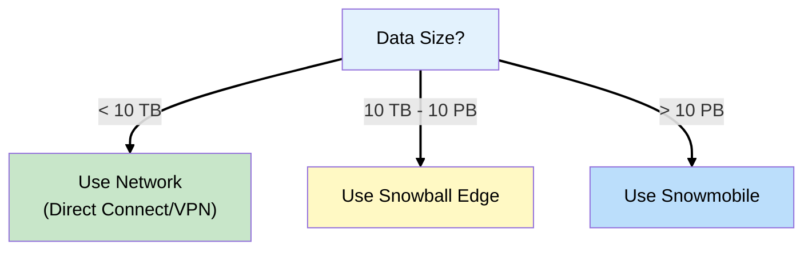
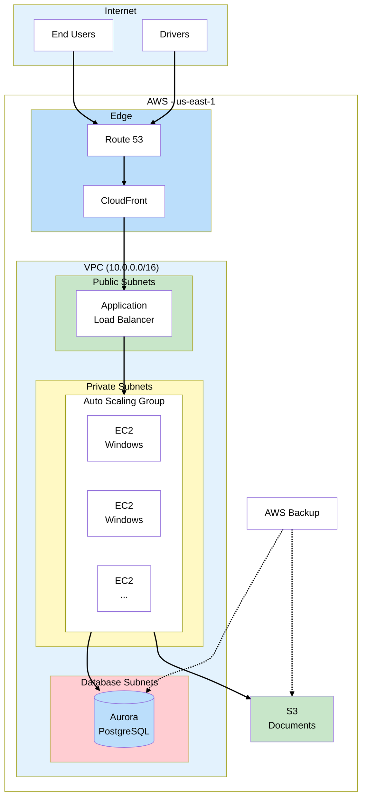
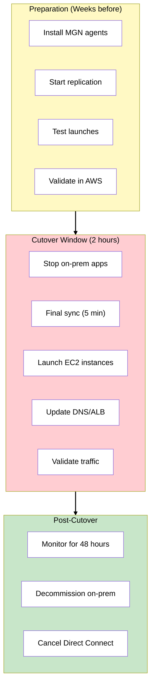
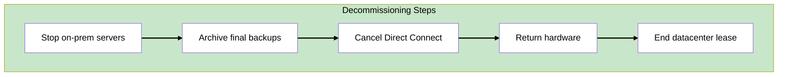

# Phase 6: Complete Workload Migration

## The Story So Far

ShipFast's hybrid infrastructure is fully operational:

- Direct Connect provides reliable 10 Gbps connectivity
- Database migrated to Aurora PostgreSQL (saving $150K/year)
- File storage migrated to S3 via Storage Gateway
- VPN remains as backup connectivity

But the datacenter lease ends in 6 months. It's time to migrate the application servers.

## Business Trigger

The CFO calls a final migration planning meeting:

> "The landlord offered us a 2-month extension, but that's it. After that, we're paying double rent.
> We need those application servers out of the datacenter."

The .NET development lead is nervous:

> "We've been running on Windows Server 2016 for years. The app has never run on anything else. Can
> we really just move it to AWS?"

The CTO wants assurance:

> "We cannot afford downtime during peak shipping season. How do we migrate without disrupting
> operations?"

## Architecture Decision

**Decision**: Use AWS Application Migration Service (MGN) to lift-and-shift the Windows application
servers to EC2, with minimal downtime cutover.

### Why MGN?

MGN (Application Migration Service) is AWS's recommended tool for lift-and-shift migrations. It
continuously replicates servers at the block level, allowing you to test the migration before
cutting over with minimal downtime:

| Requirement          | MGN Capability          |
| -------------------- | ----------------------- |
| Minimal code changes | Rehost (lift-and-shift) |
| Continuous sync      | Block-level replication |
| Test before cutover  | Launch test instances   |
| Quick cutover        | Minutes, not hours      |

## Key Concepts for SAA Exam

### AWS Application Migration Service (MGN)

### MGN Migration Lifecycle

### MGN Components

MGN uses several components to orchestrate the migration. The agent runs on source servers,
replication servers handle incoming data, and EBS (Elastic Block Store) volumes store the replicated
disk data until cutover:

| Component               | Description                                                       |
| ----------------------- | ----------------------------------------------------------------- |
| **Agent**               | Installed on source servers, performs block-level replication     |
| **Replication Server**  | EC2 instances in staging subnet, receives data from agents        |
| **Staging Area**        | Subnet where replication servers and EBS volumes reside           |
| **Launch Template**     | EC2 configuration for target instances                            |
| **Post-launch actions** | Scripts to run after launch (install software, configure network) |

### How Replication Works

> **Exam Tip**: MGN uses block-level replication, not file-level. This means it captures everything,
> including boot sectors and OS.

### Test vs Cutover Launch

MGN provides two types of launches. Understanding the difference is critical - test launches let you
validate the migration without impacting production, while cutover launches are the actual migration
event:

| Action             | Purpose                  | Source Impact                |
| ------------------ | ------------------------ | ---------------------------- |
| **Test Launch**    | Validate migration works | None - source keeps running  |
| **Cutover Launch** | Production migration     | Stop source after final sync |

**Always test first!** Launch test instances, verify application works, terminate, then proceed with
cutover.

### MGN vs Server Migration Service (SMS)

AWS previously offered SMS (Server Migration Service) for migrations, but MGN has replaced it as the
recommended solution. If you see SMS on the exam, know that it's deprecated and MGN is the current
answer:

| Feature     | MGN                      | SMS (Legacy)              |
| ----------- | ------------------------ | ------------------------- |
| Replication | Block-level, continuous  | Snapshot-based, scheduled |
| Downtime    | Minutes                  | Hours                     |
| Agent       | Required                 | VMware connector          |
| Platforms   | Physical, Virtual, Cloud | VMware, Hyper-V, Azure    |
| Status      | Current, recommended     | Deprecated                |

> **Exam Tip**: MGN is the recommended service. SMS is legacy and being phased out.

## AWS Application Discovery Service

Before migrating, you need to understand what you're migrating. **Application Discovery Service**
collects detailed information about your on-premises servers.

### Discovery Methods

### Agentless vs Agent-Based Discovery

| Aspect                 | Agentless                  | Agent-Based                         |
| ---------------------- | -------------------------- | ----------------------------------- |
| **Best for**           | VMware environments        | Physical servers, detailed analysis |
| **Installation**       | OVA appliance in vCenter   | Agent on each server                |
| **Metrics**            | CPU, memory, disk, network | All above + processes, connections  |
| **Dependency mapping** | Limited                    | Full application dependencies       |
| **Effort**             | Lower (one appliance)      | Higher (agent per server)           |

### When to Use Which

| Scenario                            | Recommended Discovery                       |
| ----------------------------------- | ------------------------------------------- |
| VMware vCenter environment          | **Agentless** (simpler, sufficient metrics) |
| Physical servers                    | **Agent-based** (only option)               |
| Need application dependency mapping | **Agent-based** (captures connections)      |
| Quick assessment, limited time      | **Agentless** (faster deployment)           |

> **Exam Tip:** "VMware vCenter environment" + "assess resource utilization for EC2 sizing" =
> **Agentless discovery** with Application Discovery Service. Agent-based is only needed for
> physical servers or detailed dependency analysis.

## AWS Snow Family

For very large data migrations where network transfer isn't practical:

### Snow Family Selection

Choosing the right Snow device depends on your data volume and compute requirements. The capacity
ranges from portable Snowcone (8-14 TB) to massive Snowmobile (100 PB - Petabytes):

| Device                    | Capacity      | Use Case                                                   |
| ------------------------- | ------------- | ---------------------------------------------------------- |
| **Snowcone**              | 8-14 TB       | Edge locations, IoT (Internet of Things), small migrations |
| **Snowball Edge Storage** | 210 TB        | Data migration, edge storage                               |
| **Snowball Edge Compute** | 28 TB + vCPUs | Edge compute + storage (vCPUs = virtual CPUs)              |
| **Snowmobile**            | 100 PB        | Datacenter migrations, massive datasets                    |

### When to Use Snow vs Network

**Rule of thumb**: If transfer takes more than a week over your network, consider Snow.

This table shows approximate transfer times at different network speeds. Compare these to Snowball
shipping time (typically 1-2 weeks round-trip) to decide which approach is faster for your data
volume:

| Data Size | 100 Mbps | 1 Gbps  | 10 Gbps  |
| --------- | -------- | ------- | -------- |
| 10 TB     | 12 days  | 1 day   | 3 hours  |
| 50 TB     | 60 days  | 6 days  | 14 hours |
| 100 TB    | 120 days | 12 days | 28 hours |

> **Exam Tip**: Know the breakpoints. Snowball is faster than network transfer for most enterprise
> migrations.

### Snow Family Features

Beyond storage, Snow devices offer compute capabilities and security features. All devices encrypt
data, and Snowball Edge supports clustering multiple devices together for larger workloads. AWS
OpsHub provides a GUI (Graphical User Interface) for managing Snow devices:

| Feature    | Snowcone      | Snowball Edge                    | Snowmobile |
| ---------- | ------------- | -------------------------------- | ---------- |
| Compute    | Yes (2 vCPUs) | Yes (40-104 vCPUs, optional GPU) | No         |
| Encryption | Yes (256-bit) | Yes (256-bit)                    | Yes        |
| Clustering | No            | Yes (5-10 devices)               | N/A        |
| AWS OpsHub | Yes           | Yes                              | N/A        |

## ShipFast Final Architecture

### Migration Cutover Plan

### Cutover Checklist

1. **Pre-cutover**
   - [ ] All servers replicating successfully
   - [ ] Test launches validated
   - [ ] DNS TTL (Time to Live) lowered (5 minutes)
   - [ ] Rollback plan documented

2. **Cutover**
   - [ ] Notify users of maintenance window
   - [ ] Stop application services on-prem
   - [ ] Wait for final sync (verify in MGN console)
   - [ ] Launch cutover instances
   - [ ] Update ALB (Application Load Balancer) target group / Route 53 records
   - [ ] Verify application health

3. **Post-cutover**
   - [ ] Monitor for 48-72 hours
   - [ ] Keep on-prem servers powered on (rollback ready)
   - [ ] Finalize migration in MGN (stops replication)
   - [ ] Schedule datacenter decommissioning

## Post-Migration: Decommissioning

### Direct Connect Decommissioning

1. Verify all traffic uses AWS (no more hybrid)
2. Delete Virtual Interfaces
3. Delete Direct Connect Gateway associations
4. Cancel Direct Connect connection
5. Notify colocation provider to remove cross-connect

> **Note**: Keep VPN active for 30 days after DX cancellation as safety net.

## ShipFast Migration Summary

```mermaid
flowchart LR
    subgraph Before["Before Migration"]
        B1["$2M datacenter lease"]
        B2["$150K SQL licensing"]
        B3["$80K storage expansion"]
        B4["6-hour RPO/RTO"]
    end

    subgraph After["After Migration"]
        A1["~$15K/month AWS"]
        A2["Aurora included"]
        A3["S3 unlimited scale"]
        A4["< 1 hour RPO/RTO"]
    end

    Before -->|"18 months"| After

    style Before fill:#ffcdd2,color:#000
    style After fill:#c8e6c9,color:#000
    style B1 fill:#fff,color:#000
    style B2 fill:#fff,color:#000
    style B3 fill:#fff,color:#000
    style B4 fill:#fff,color:#000
    style A1 fill:#fff,color:#000
    style A2 fill:#fff,color:#000
    style A3 fill:#fff,color:#000
    style A4 fill:#fff,color:#000
    linkStyle default stroke:#000,stroke-width:2px
```

The migration transformed ShipFast from a capital-intensive on-premises operation to a scalable
cloud infrastructure. RPO (Recovery Point Objective) measures potential data loss, while RTO
(Recovery Time Objective) measures downtime - both improved dramatically:

| Metric                     | Before                    | After                      |
| -------------------------- | ------------------------- | -------------------------- |
| Annual infrastructure cost | ~$500K                    | ~$180K                     |
| Disaster recovery          | 6-hour RPO, uncertain RTO | < 1 hour RPO, < 1 hour RTO |
| Scaling                    | Buy hardware (weeks)      | Auto Scaling (minutes)     |
| Geographic reach           | Single datacenter         | Global (CloudFront)        |

## Exam Tips

- **MGN for lift-and-shift** - Block-level replication, minimal downtime
- **Test before cutover** - Always launch test instances first
- **MGN replaces SMS** - SMS is deprecated, MGN is the answer
- **Snowball for large data** - If network transfer > 1 week, consider Snow
- **Snowcone is smallest** - 8-14 TB, portable, edge compute
- **Snowball Edge** - 210 TB storage optimized or 28 TB compute optimized
- **Snowmobile for exabyte** - 100 PB, literal shipping container
- **Post-launch actions** - Scripts to configure instances after migration

## SAA Exam Concepts

### Must-Know for This Phase

| Concept         | Key Points                                                 |
| --------------- | ---------------------------------------------------------- |
| MGN             | Block-level replication, continuous sync, minimal downtime |
| MGN Lifecycle   | Agent → Replication → Test → Cutover → Finalize            |
| Test Launch     | Validates migration without affecting source               |
| Cutover Launch  | Production migration, stop source after                    |
| Snowcone        | 8-14 TB, portable, edge compute                            |
| Snowball Edge   | 210 TB storage, or 28 TB + compute                         |
| Snowmobile      | 100 PB, shipping container                                 |
| Network vs Snow | > 1 week transfer time = consider Snow                     |

## Congratulations!

You've completed the ShipFast Logistics migration journey. You now understand:

- **Hybrid connectivity** (VPN, Direct Connect)
- **Database migration** (DMS, SCT)
- **Hybrid storage** (Storage Gateway, FSx)
- **Workload migration** (MGN, Snow Family)

These concepts are heavily tested on the SAA exam. The key is understanding not just WHAT each
service does, but WHEN to use it and WHY.

### Next Steps for SAA Prep

1. Review the 7 Rs of Migration (Phase 1)
2. Understand VPN vs Direct Connect trade-offs (Phases 2-3)
3. Know DMS vs SCT usage (Phase 4)
4. Memorize Storage Gateway types (Phase 5)
5. Know Snow family selection criteria (Phase 6)

---

## References

Official AWS documentation used to validate this content:

### AWS Application Migration Service (MGN)

- [What is AWS MGN?](https://docs.aws.amazon.com/mgn/latest/ug/what-is-application-migration-service.html) -
  Block-level replication, minimal downtime lift-and-shift migrations
- [MGN Lifecycle](https://docs.aws.amazon.com/mgn/latest/ug/mgn-lifecycle.html) - Agent
  installation, replication, test/cutover launch, finalization

### AWS Snow Family

- [AWS Snowcone](https://docs.aws.amazon.com/snowball/latest/snowcone-guide/snowcone-what-is-snowcone.html) -
  8 TB HDD or 14 TB SSD, portable edge compute device
- [AWS Snowball Edge](https://docs.aws.amazon.com/snowball/latest/developer-guide/whatisedge.html) -
  Storage Optimized (210 TB), Compute Optimized (28 TB with vCPUs and optional GPU)
- [AWS Snowmobile](https://docs.aws.amazon.com/snowball/latest/developer-guide/whatissnowmobile.html) -
  100 PB capacity for exabyte-scale data migrations
