# Phase 7: Disaster Recovery

## Business Context

**Situation:** ShipFast's migration to AWS is nearly complete. The CFO asks: "What happens if
us-east-1 goes down? Last year, a regional outage cost our competitor $2M in lost shipments."

**The CTO's concern:** "We have backups, but I don't actually know how long it would take to
recover. The board wants a documented DR plan with tested RTOs."

**Requirements:**

- Recovery Time Objective (RTO): 4 hours for critical systems
- Recovery Point Objective (RPO): 1 hour for transactional data
- Cross-region backup for all critical data
- Automated failover where possible
- Annual DR testing without production impact

---

## Step 1: DR Strategy Options

### The DR Spectrum

AWS offers multiple DR strategies with different cost/recovery tradeoffs:

```mermaid
flowchart LR
    subgraph Strategies["DR Strategies (Cost → Recovery Speed)"]
        B["Backup & Restore<br>💰 Lowest cost<br>⏱️ Hours RTO"]
        P["Pilot Light<br>💰💰 Low cost<br>⏱️ 10s min RTO"]
        W["Warm Standby<br>💰💰💰 Medium<br>⏱️ Minutes RTO"]
        H["Hot Standby<br>💰💰💰💰 Highest<br>⏱️ Seconds RTO"]
    end

    B --> P --> W --> H

    style B fill:#c8e6c9,color:#000
    style P fill:#fff9c4,color:#000
    style W fill:#ffecb3,color:#000
    style H fill:#ffcdd2,color:#000
    linkStyle default stroke:#000,stroke-width:2px
```



### Strategy Comparison

| Strategy             | RTO       | RPO       | Cost | ShipFast Use Case  |
| -------------------- | --------- | --------- | ---- | ------------------ |
| **Backup & Restore** | Hours     | Hours     | $    | Archive data       |
| **Pilot Light**      | 10-30 min | Minutes   | $$   | Non-critical apps  |
| **Warm Standby**     | Minutes   | Minutes   | $$$  | **Core tracking**  |
| **Hot Standby**      | Seconds   | Near-zero | $$$$ | Payment processing |

> **SAA Exam Tip:** Match DR strategy to RTO/RPO requirements. "4-hour RTO" = Backup & Restore or
> Pilot Light. "Minutes RTO" = Warm Standby. "Seconds RTO" = Multi-site Active/Active.

---

## Step 2: EBS Snapshot Management

### Cross-Region Backup

ShipFast's EC2 instances use EBS volumes. To protect against regional failure:


### Automated Snapshot with Data Lifecycle Manager

```json
{
  "PolicyType": "EBS_SNAPSHOT_MANAGEMENT",
  "ResourceTypes": ["VOLUME"],
  "TargetTags": [{ "Key": "Backup", "Value": "Daily" }],
  "Schedules": [
    {
      "Name": "DailySnapshots",
      "CreateRule": { "Interval": 24, "IntervalUnit": "HOURS" },
      "RetainRule": { "Count": 7 },
      "CrossRegionCopyRules": [
        {
          "TargetRegion": "us-west-2",
          "Encrypted": true,
          "CopyTags": true,
          "RetainRule": { "Interval": 30, "IntervalUnit": "DAYS" }
        }
      ]
    }
  ]
}
```

### EBS Snapshot Key Concepts

| Feature                   | Description                        | Exam Trigger                         |
| ------------------------- | ---------------------------------- | ------------------------------------ |
| **Incremental**           | Only changed blocks stored         | "Cost-efficient backup"              |
| **Cross-region copy**     | Disaster recovery                  | "Protect against regional failure"   |
| **Fast Snapshot Restore** | Pre-warm for immediate performance | "Eliminate latency on first access"  |
| **Archive tier**          | 75% cheaper for long-term          | "Rarely accessed, 90+ day retention" |

> **SAA Exam Tip:** "EBS snapshot archive tier" = 75% cost reduction, but 24-72 hour restore time.
> Use for compliance/audit data, NOT disaster recovery.

---

## Step 3: EBS Snapshots Archive

### Long-Term Retention

ShipFast must retain shipping records for 7 years. EBS Snapshots Archive reduces costs:


### Archive Tier Details

| Aspect              | Standard       | Archive                     |
| ------------------- | -------------- | --------------------------- |
| **Storage cost**    | $0.05/GB-month | $0.0125/GB-month (75% less) |
| **Restore time**    | Immediate      | 24-72 hours                 |
| **Minimum storage** | None           | 90 days                     |
| **Use case**        | Active DR      | Compliance, audit           |

> **SAA Exam Tip:** "Long-term EBS snapshot retention with cost optimization" = Archive tier. "Fast
> DR recovery" = Standard tier with Fast Snapshot Restore.

---

## Step 4: Aurora Global Database

### Multi-Region Database

ShipFast's Aurora PostgreSQL database needs cross-region replication:


### Aurora Global Database Features

| Feature              | Description                     | Exam Trigger                   |
| -------------------- | ------------------------------- | ------------------------------ |
| **Replication lag**  | < 1 second typical              | "Low RPO cross-region"         |
| **Failover**         | Promote secondary in < 1 minute | "Fast RTO"                     |
| **Read scaling**     | Local reads in secondary region | "Low latency for global users" |
| **Write forwarding** | Secondary can forward writes    | "Single write endpoint"        |

### Managed Planned Failover vs Unplanned

| Type                   | When                    | Data Loss         | Recovery              |
| ---------------------- | ----------------------- | ----------------- | --------------------- |
| **Managed Planned**    | Maintenance, DR testing | Zero              | Controlled switchover |
| **Unplanned (Detach)** | Primary region down     | Minimal (seconds) | Emergency promotion   |

> **SAA Exam Tip:** "Cross-region database with sub-second RPO" = Aurora Global Database.
> "Cross-region read replicas" = Standard Aurora replicas (not Global Database).

---

## Step 5: Aurora Auto-Repair

### Self-Healing Storage

Aurora automatically repairs corrupted data:

```mermaid
flowchart LR
    subgraph Aurora["Aurora Storage"]
        subgraph Copies["6 Copies Across 3 AZs"]
            C1["Copy 1 ✓"]
            C2["Copy 2 ✓"]
            C3["Copy 3 ✗"]
            C4["Copy 4 ✓"]
            C5["Copy 5 ✓"]
            C6["Copy 6 ✓"]
        end
        Repair["Auto-Repair<br>Recreates Copy 3<br>from healthy copies"]
    end

    C3 --> Repair
    Repair --> C3

    style Aurora fill:#e3f2fd,color:#000
    style C3 fill:#ffcdd2,color:#000
    style Repair fill:#c8e6c9,color:#000
    linkStyle default stroke:#000,stroke-width:2px
```



### Aurora Resilience Features

| Feature               | Description                             |
| --------------------- | --------------------------------------- |
| **6-way replication** | Data replicated 6 times across 3 AZs    |
| **Quorum writes**     | 4/6 copies for write success            |
| **Quorum reads**      | 3/6 copies for read success             |
| **Auto-repair**       | Corrupted blocks automatically restored |
| **Continuous backup** | Automatic backup to S3                  |

> **SAA Exam Tip:** "Aurora survives losing 2 copies" for writes, "survives losing 3 copies" for
> reads. This is built-in - no configuration needed.

---

## Step 6: Storage Gateway for DR

### Stored Volumes for Local DR

ShipFast warehouses need local data access even if AWS connectivity fails:


### Storage Gateway Volume Types

| Type               | Data Location             | Use Case                    | Exam Trigger                              |
| ------------------ | ------------------------- | --------------------------- | ----------------------------------------- |
| **Stored Volumes** | On-premises (full)        | Low-latency local access    | "Local access with cloud backup"          |
| **Cached Volumes** | AWS (full), local (cache) | Large datasets, cloud-first | "Frequently accessed data cached locally" |

### Stored vs Cached Comparison

| Aspect                | Stored Volumes   | Cached Volumes       |
| --------------------- | ---------------- | -------------------- |
| **Primary storage**   | On-premises      | AWS                  |
| **Latency**           | Local disk speed | Depends on cache hit |
| **Max volume size**   | 16 TB            | 32 TB                |
| **Offline access**    | Full dataset     | Only cached data     |
| **Disaster recovery** | Snapshots in AWS | Data already in AWS  |

> **SAA Exam Tip:** "Local access with cloud backup" = Stored Volumes. "Extend on-prem storage to
> cloud" = Cached Volumes. "Migrate to S3" = File Gateway.

---

## Step 7: AWS Outposts for Hybrid DR

### AWS in Your Datacenter

For ultra-low latency or data residency requirements:


### Outposts Options

| Option              | Form Factor   | Use Case                     |
| ------------------- | ------------- | ---------------------------- |
| **Outposts Rack**   | Full 42U rack | Large-scale hybrid           |
| **Outposts Server** | 1U/2U server  | Edge locations, small spaces |

### When to Use Outposts

| Requirement                           | Solution            |
| ------------------------------------- | ------------------- |
| Low-latency local processing          | Outposts            |
| Data residency (can't leave premises) | Outposts            |
| AWS APIs on-premises                  | Outposts            |
| Simple backup to cloud                | Storage Gateway     |
| Extend VPC on-premises                | Outposts (same VPC) |

> **SAA Exam Tip:** "AWS services on-premises with same APIs" = Outposts. "Low-latency connection to
> AWS" = Direct Connect. "Backup on-premises to cloud" = Storage Gateway.

---

## Step 8: DR Testing with AWS Backup

### Centralized Backup Management

**AWS Backup** provides a single console for all backup operations:


### AWS Backup Features

| Feature               | Description                | Exam Trigger                         |
| --------------------- | -------------------------- | ------------------------------------ |
| **Backup Plans**      | Scheduled, policy-based    | "Centralized backup policy"          |
| **Cross-region copy** | Automated DR replication   | "Disaster recovery"                  |
| **Vault Lock**        | WORM compliance            | "Immutable backups"                  |
| **Cross-account**     | Backup to separate account | "Protect against account compromise" |

> **SAA Exam Tip:** "Centralized backup across multiple AWS services" = AWS Backup. "Backup
> individual EC2" = EBS snapshots. "Backup on-premises" = AWS Backup + Storage Gateway.

---

## Phase 7 Architecture Summary


---

## Exam Tips Summary

| Topic                      | Key Point                                                  |
| -------------------------- | ---------------------------------------------------------- |
| **DR Strategies**          | Backup/Restore < Pilot Light < Warm Standby < Hot Standby  |
| **EBS Snapshots**          | Incremental, cross-region copy, archive tier (75% cheaper) |
| **Fast Snapshot Restore**  | Eliminates first-access latency penalty                    |
| **Aurora Global Database** | < 1 second replication, < 1 minute failover                |
| **Aurora Auto-Repair**     | 6 copies, self-healing, survives 2 failures for writes     |
| **Stored Volumes**         | Full data on-prem, async backup to AWS                     |
| **Cached Volumes**         | Data in AWS, frequently accessed cached locally            |
| **Outposts**               | AWS services on-premises, same APIs                        |
| **AWS Backup**             | Centralized backup across services, cross-region copy      |

---

**[← Back to ShipFast Overview](../00-overview.md)**
