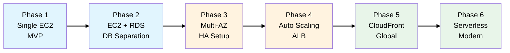

# Scale or Fail: The TechBooks Story

## The Business

You're the founding engineer at **TechBooks** - an online bookstore for technical and programming
books. The founder just secured seed funding and needs to launch fast.

## Learning Objectives

This evolving scenario will teach you AWS Solutions Architect concepts through realistic business
decisions:

- [**Phase 1**: MVP Launch](./phases/phase-1-mvp-launch.md) (VPC, EC2, Security Groups)
- [**Phase 2**: First Growth Pains](./phases/phase-2-database-separation.md) (RDS, DB separation,
  backups)
- [**Phase 3**: Going Multi-AZ](./phases/phase-3-high-availability.md) (High Availability, failover)
- [**Phase 4**: Scaling for Success](./phases/phase-4-auto-scaling.md) (ALB, Auto Scaling Groups)
- [**Phase 5**: Going Global](./phases/phase-5-going-global.md) (CloudFront, Route 53, S3)
- [**Phase 6**: Modernization](./phases/phase-6-modernization.md) (Lambda, SQS, ElastiCache)

## Architecture Evolution Map

## How to Use This Guide

Each phase includes:

1. **Business Context** - What's happening with TechBooks
2. **Architecture Decision** - What we're building and WHY
3. **Key Concepts** - SAA exam-relevant knowledge
4. **Diagrams** - Visual representation of the architecture
5. **Exam Tips** - Key points for the SAA certification
