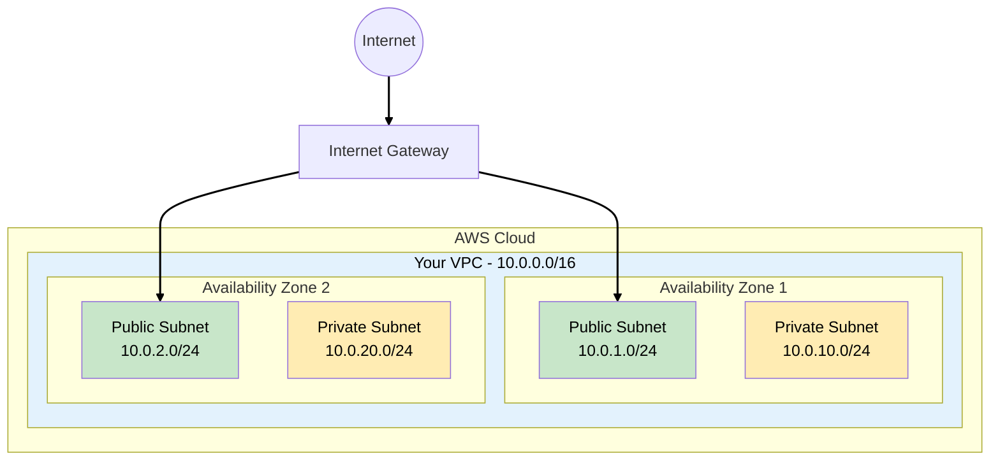
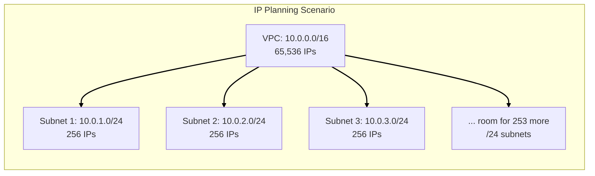
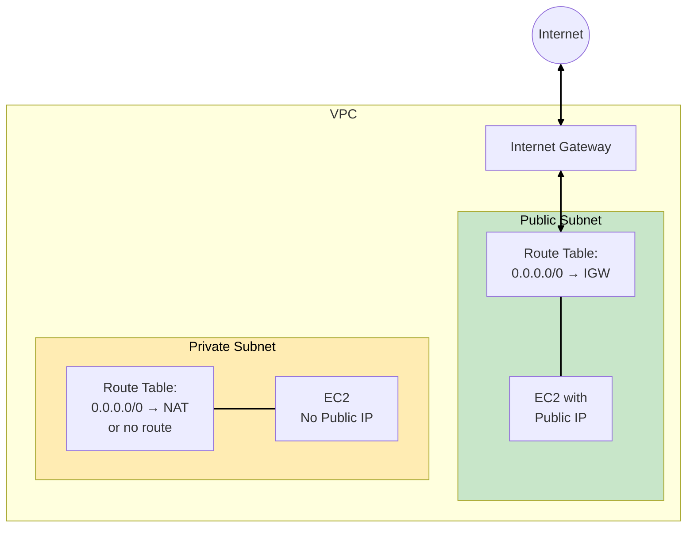
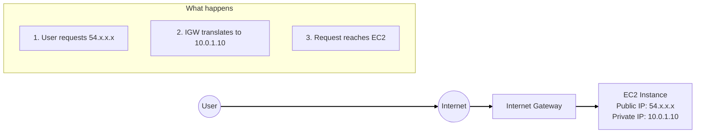
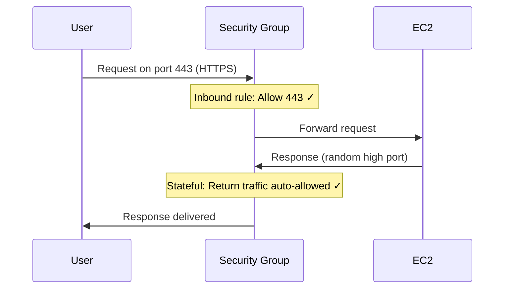
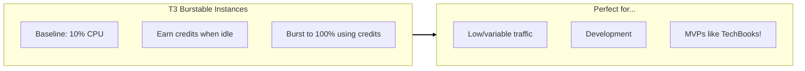
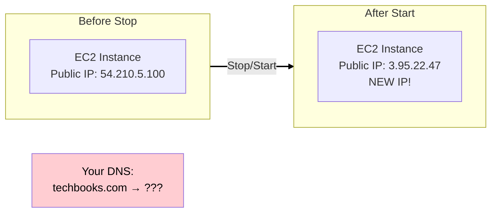
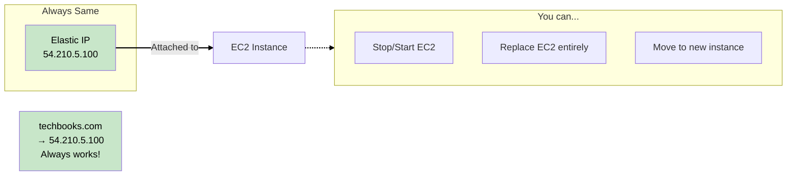
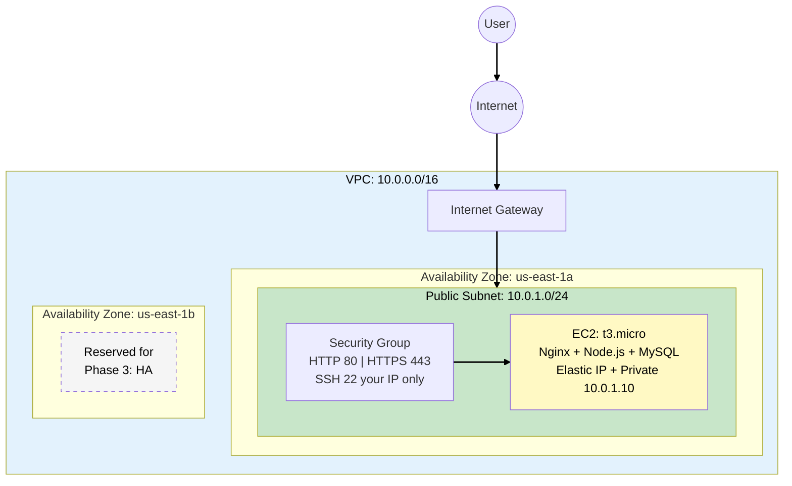

# Phase 1: MVP Launch

## Business Context

**Situation:** TechBooks just got seed funding. The founder needs a working website in 2 weeks to
demo to investors.

**Requirements:**

- Simple website: browse books, place orders
- Admin panel for inventory management
- Budget: ~$50/month
- Expected traffic: ~100 visitors/day

**Your decision:** Ship fast with the simplest architecture that works.

---

## Step 1: The Network Foundation (VPC)

### What is a VPC?

A **Virtual Private Cloud (VPC)** is your isolated network within AWS. Think of it as your own
private data center in the cloud.



### WHY Custom VPC Instead of Default VPC?

AWS provides a default VPC in every region, but understanding when to use a custom VPC is essential
for production workloads and the exam:

| Aspect                   | Default VPC            | Custom VPC                     | WHY It Matters                                                  |
| ------------------------ | ---------------------- | ------------------------------ | --------------------------------------------------------------- |
| **CIDR Block**           | Fixed 172.31.0.0/16    | You choose (e.g., 10.0.0.0/16) | Avoid IP conflicts when connecting to on-premises or other VPCs |
| **Subnets**              | One per AZ, all public | You design public/private      | Security: databases shouldn't be public                         |
| **Learning**             | Hides complexity       | Forces understanding           | You'll need this knowledge for the exam and real jobs           |
| **Production readiness** | Not recommended        | Industry standard              | Default VPC is for quick demos only                             |

> **SAA Exam Tip:** Questions often test whether you understand that resources in private subnets
> can't be accessed directly from the internet - this is a security best practice.

---

## Step 2: CIDR Blocks - IP Address Planning

### What is CIDR?

**CIDR (Classless Inter-Domain Routing)** defines your IP address range using notation like
`10.0.0.0/16`.

The number after `/` tells you how many IP addresses you get. This table shows common CIDR sizes
you'll encounter on the exam:

| CIDR | IP Addresses | Use Case                     |
| ---- | ------------ | ---------------------------- |
| /16  | 65,536       | Large VPC (AWS max for VPC)  |
| /20  | 4,096        | Medium subnet                |
| /24  | 256          | Small subnet (common choice) |
| /28  | 16           | Minimum for AWS subnet       |

### WHY Does This Matter?



**Key insight:** AWS reserves 5 IPs per subnet:

- `.0` - Network address
- `.1` - VPC router
- `.2` - DNS server
- `.3` - Reserved for future use
- `.255` - Broadcast (not supported but reserved)

So a `/24` subnet gives you **251 usable IPs**, not 256.

> **SAA Exam Tip:** You'll be asked to calculate available IPs. Always subtract 5 from the total.

### Our TechBooks VPC Design

For Phase 1, we'll keep it simple but plan for growth:

| Component             | CIDR         | Purpose                       |
| --------------------- | ------------ | ----------------------------- |
| VPC                   | 10.0.0.0/16  | Room to grow                  |
| Public Subnet (AZ-a)  | 10.0.1.0/24  | Web servers, bastion hosts    |
| Public Subnet (AZ-b)  | 10.0.2.0/24  | Future HA (High Availability) |
| Private Subnet (AZ-a) | 10.0.10.0/24 | Databases (future)            |
| Private Subnet (AZ-b) | 10.0.20.0/24 | Future HA                     |

> **Note:** AZ = Availability Zone (isolated data centers within a region).

**WHY this design?**

- `/16` VPC = plenty of room for future subnets
- Separate ranges for public (1-9) and private (10-99) = easy to remember
- Two AZs planned = ready for high availability in Phase 3

---

## Step 3: Public vs Private Subnets

### The Key Difference

A subnet is **public** or **private** based on its **route table**, not a checkbox.



### WHY This Matters

| Subnet Type | Route to Internet       | Use Case                   | Security Level  |
| ----------- | ----------------------- | -------------------------- | --------------- |
| **Public**  | Via Internet Gateway    | Web servers, bastion hosts | Lower (exposed) |
| **Private** | Via NAT Gateway or none | Databases, app servers     | Higher (hidden) |

> **SAA Exam Tip:** "How do you make a subnet public?" Answer: Add a route to an Internet Gateway in
> its route table + assign public IPs to instances.

---

## Step 4: Internet Gateway (IGW)

### What is it?

An **Internet Gateway** is a horizontally scaled, redundant, highly available VPC component that
allows communication between your VPC and the internet.

### WHY Do You Need It?

Without an IGW, nothing in your VPC can reach the internet (and vice versa).

**Key characteristics:**

- One IGW per VPC (hard limit)
- AWS manages it - no bandwidth constraints
- No availability risk - it's highly available by design
- Free to create - you pay for data transfer



> **SAA Exam Tip:** IGW performs NAT (Network Address Translation) for instances with public IPs. It
> translates between public and private IPs.

---

## Step 5: Security Groups

### What Are They?

**Security Groups** are virtual firewalls that control inbound and outbound traffic at the
**instance level**.

### Key Characteristics (Exam Favorites!)

| Feature              | Security Group Behavior                         |
| -------------------- | ----------------------------------------------- |
| **State**            | Stateful - return traffic automatically allowed |
| **Default inbound**  | Deny all                                        |
| **Default outbound** | Allow all                                       |
| **Rules**            | Allow only (no deny rules)                      |
| **Scope**            | Instance level                                  |

### WHY Stateful Matters



If security groups were **stateless** (like NACLs - Network Access Control Lists), you'd need to
explicitly allow the response traffic on ephemeral ports (1024-65535).

### Our TechBooks Security Group

For Phase 1, our EC2 needs:

**Inbound Rules:**

| Type  | Port | Source     | WHY                      |
| ----- | ---- | ---------- | ------------------------ |
| HTTP  | 80   | 0.0.0.0/0  | Web traffic              |
| HTTPS | 443  | 0.0.0.0/0  | Secure web traffic       |
| SSH   | 22   | YOUR_IP/32 | Admin access (restrict!) |

**Outbound Rules:**

| Type | Port | Destination | WHY                |
| ---- | ---- | ----------- | ------------------ |
| All  | All  | 0.0.0.0/0   | Updates, API calls |

> **SAA Exam Tip:** Never allow SSH from 0.0.0.0/0 in production. This is a common "what's wrong
> with this architecture?" question.

---

## Step 6: EC2 Instance

### Choosing the Right Instance

For our MVP:

| Decision          | Choice            | WHY                                                                            |
| ----------------- | ----------------- | ------------------------------------------------------------------------------ |
| **Instance Type** | t3.micro          | Free tier eligible, burstable, enough for 100 users/day                        |
| **AMI**           | Amazon Linux 2023 | AMI (Amazon Machine Image) - Free, optimized for AWS, long-term support        |
| **Storage**       | 20GB gp3          | gp3 (General Purpose SSD) is cheaper than gp2 with better baseline performance |

### Instance Types Decoded

```
t3.micro
│  │  │
│  │  └── Size: micro (smallest)
│  └───── Generation: 3rd gen (newer = better price/performance)
└──────── Family: T = burstable (good for variable workloads)
```

**Common families for SAA exam:**

- **T** (t3, t3a): Burstable, general purpose, cost-effective
- **M** (m5, m6i): General purpose, balanced
- **C** (c5, c6i): Compute optimized
- **R** (r5, r6i): Memory optimized
- **I/D**: Storage optimized

### WHY t3.micro for MVP?



> **SAA Exam Tip:** T instances can have "unlimited" mode (default for t3) - they can burst beyond
> credits but you pay for extra usage.

### WHY Elastic IP Instead of Auto-Assigned Public IP?

When you launch an EC2 instance, you can get a public IP two ways. Understanding the difference is
crucial for designing stable architectures:

| Feature          | Auto-Assigned Public IP  | Elastic IP (EIP)           |
| ---------------- | ------------------------ | -------------------------- |
| **Persistence**  | Changes on stop/start    | Stays the same forever     |
| **Cost**         | ~$3.60/month ($0.005/hr) | ~$3.60/month ($0.005/hr)   |
| **DNS**          | Changes with IP          | Can stay consistent        |
| **Reassignment** | Not possible             | Can move between instances |

> **Note (Feb 2024 Change):** AWS now charges $0.005/hour for ALL public IPv4 addresses, whether
> auto-assigned or Elastic IP, attached or not. This was a significant pricing change to encourage
> IPv6 adoption.

**The Problem with Auto-Assigned IPs:**



**WHY This Matters for TechBooks:**

1. **DNS Records** - If you point `techbooks.com` to your EC2's IP and restart the instance, your
   site breaks
2. **API Integrations** - Payment processors, shipping APIs that whitelist your IP would need
   updating
3. **SSL Certificates** - Some configurations tie to specific IPs
4. **Customer Bookmarks** - Anyone who bookmarked the IP directly loses access

**WHY Elastic IP for MVP:**



**Cost (as of Feb 2024):**

| Scenario                                       | Cost                     |
| ---------------------------------------------- | ------------------------ |
| Any public IPv4 address (EIP or auto-assigned) | ~$3.60/month ($0.005/hr) |
| EIP **not** attached to any instance           | ~$3.60/month ($0.005/hr) |
| EIP attached to stopped instance               | ~$3.60/month ($0.005/hr) |

**Free Tier Exception:** For accounts in their first 12 months, the Free Tier includes **750
hours/month of in-use public IPv4 addresses** for EC2. This covers approximately one public IP
running 24/7. Usage beyond 750 hours is charged at $0.005/hr.

> **SAA Exam Tip:** AWS charges for ALL public IPv4 addresses to discourage IPv4 usage and encourage
> IPv6 adoption. Common exam questions: "How do you reduce costs?" → Release unused EIPs, use
> private IPs with NAT Gateway, or adopt IPv6.

**When NOT to use Elastic IP:**

- Behind a Load Balancer (the Load Balancer has its own DNS name)
- Using Route 53 with health checks (can auto-failover)
- Auto Scaling groups (instances are disposable)

For our Phase 1 single-instance MVP, Elastic IP is the right choice. In Phase 4, when we add a Load
Balancer, we'll remove it.

---

## Phase 1 Complete Architecture



---

## See Also

> **Related Learning:** For a security-focused approach to VPC design with VPC endpoints,
> PrivateLink, and defense in depth, see
> [MedVault Phase 3: Network Security](/scenarios/medvault/phases/phase-3-network-security.md).

---

## Key SAA Exam Concepts from Phase 1

### Must-Know Topics

1. **VPC Fundamentals**
   - VPC is region-scoped
   - Subnets are AZ-scoped
   - One IGW per VPC

2. **CIDR Calculations**
   - /16 = 65,536 IPs
   - /24 = 256 IPs (251 usable in AWS)
   - Always subtract 5 for AWS reserved

3. **Public vs Private**
   - Public subnet = route to IGW
   - Private subnet = no direct internet route

4. **Security Groups**
   - Stateful
   - Allow rules only
   - Instance level

5. **EC2 Basics**
   - Instance types and families
   - T instances are burstable
   - gp3 > gp2 for most cases

---

## What's Coming in Phase 2?

**Business trigger:** TechBooks is getting 500 visitors/day! The single MySQL database on EC2 is
showing strain, and you're nervous about losing data.

**Next decisions:**

- Separate the database to RDS
- Implement automated backups
- Move database to private subnet

---

## Hands-On Challenge

Before moving to Phase 2, try building this in AWS:

1. Create a custom VPC with CIDR 10.0.0.0/16
2. Create public subnet 10.0.1.0/24 in your preferred AZ
3. Create and attach an Internet Gateway
4. Create a route table with route to IGW
5. Launch a t3.micro EC2 with the security group rules above
6. SSH into your instance and install Nginx

**Verification:** You should be able to see the Nginx welcome page from your browser.

---

## References

Official AWS documentation used to validate this content:

### VPC & Networking

- [What is Amazon VPC?](https://docs.aws.amazon.com/vpc/latest/userguide/what-is-amazon-vpc.html)
- [Subnet CIDR blocks](https://docs.aws.amazon.com/vpc/latest/userguide/subnet-sizing.html) -
  Reserved IPs per subnet
- [Internet Gateway](https://docs.aws.amazon.com/vpc/latest/userguide/VPC_Internet_Gateway.html) -
  IGW characteristics and NAT behavior
- [Amazon VPC Quotas](https://docs.aws.amazon.com/vpc/latest/userguide/amazon-vpc-limits.html) - One
  IGW per VPC limit
- [Infrastructure Security - Compare Security Groups and Network ACLs](https://docs.aws.amazon.com/vpc/latest/userguide/infrastructure-security.html)

### Security

- [Security Groups](https://docs.aws.amazon.com/vpc/latest/userguide/vpc-security-groups.html)
- [Network ACLs](https://docs.aws.amazon.com/vpc/latest/userguide/vpc-network-acls.html) - Stateless
  behavior

### EC2 & Compute

- [Burstable Performance Instances](https://docs.aws.amazon.com/AWSEC2/latest/UserGuide/burstable-credits-baseline-concepts.html) -
  CPU credits and unlimited mode
- [EC2 Free Tier Usage](https://docs.aws.amazon.com/AWSEC2/latest/UserGuide/ec2-free-tier-usage.html) -
  t3.micro eligibility
- [EBS General Purpose SSD Volumes](https://docs.aws.amazon.com/ebs/latest/userguide/general-purpose.html) -
  gp3 vs gp2 comparison

### Pricing

- [AWS Public IPv4 Address Charge (Feb 2024)](https://aws.amazon.com/blogs/aws/new-aws-public-ipv4-address-charge-public-ip-insights/)
- [AWS Free Tier - 750 hours Public IPv4](https://aws.amazon.com/about-aws/whats-new/2024/02/aws-free-tier-750-hours-free-public-ipv4-addresses/)
- [Elastic IP Address Concepts](https://docs.aws.amazon.com/vpc/latest/userguide/vpc-eip-overview.html)
