# Phase 3: High Availability

## Business Context

**Situation:** TechBooks got featured on a popular tech podcast! Traffic spiked to 5,000
visitors/day overnight. The founder is ecstatic, but you're terrified.

**Problems keeping you up at night:**

- What if the database server fails? Single point of failure!
- What if the entire data center has an issue?
- Customers are complaining about occasional slowdowns
- The founder asks: "What's our uptime guarantee?"

**The founder's question:** "Can we promise 99.9% uptime? Our competitors do."

**Your decision:** Implement high availability for the database layer first (it's the hardest to
recover).

---

## Step 1: Understanding Availability Zones (Deep Dive)

### What is an Availability Zone?

An **Availability Zone (AZ)** is one or more discrete data centers with redundant power, networking,
and connectivity within an AWS Region.

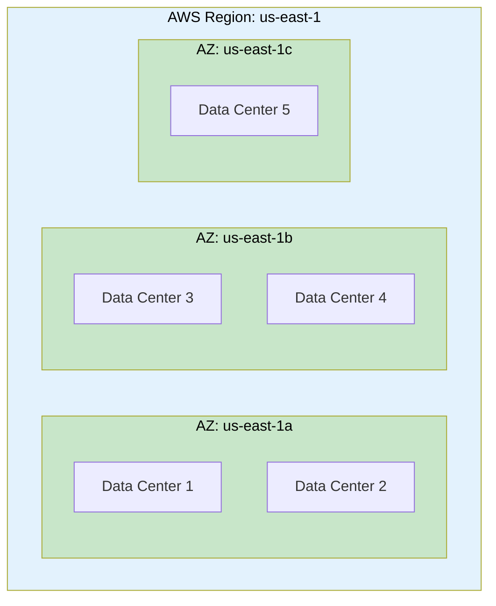

### Key Characteristics

| Property                       | Description                                 | WHY It Matters                              |
| ------------------------------ | ------------------------------------------- | ------------------------------------------- |
| **Physical separation**        | AZs are miles apart                         | Natural disaster in one won't affect others |
| **Independent infrastructure** | Separate power, cooling, networking         | Infrastructure failure is isolated          |
| **High-speed connection**      | Low-latency links between AZs               | Synchronous replication is possible         |
| **Same region**                | All AZs in a region share regional services | S3, IAM, Route 53 work across AZs           |

### WHY AZs Are the Foundation of HA

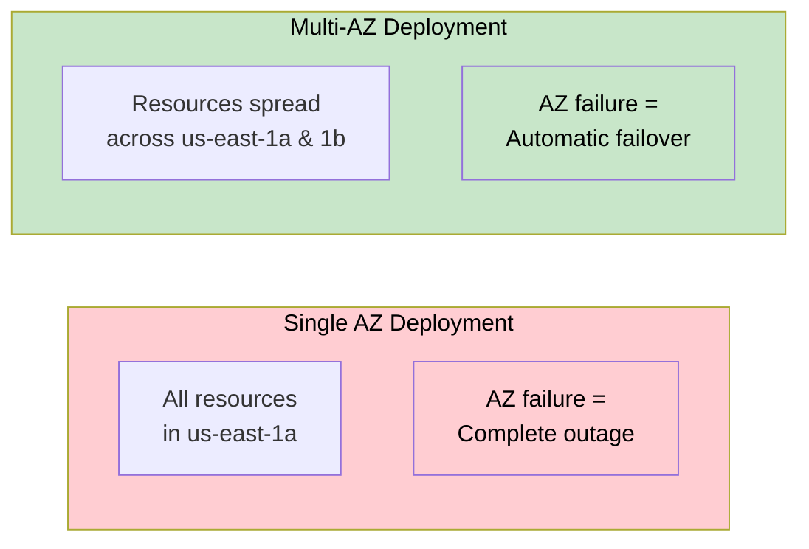

> **SAA Exam Tip:** "Design for failure" is an AWS best practice. Multi-AZ deployments survive AZ
> failures. Questions about high availability almost always involve multiple AZs.

---

## Step 2: High Availability vs Fault Tolerance

### Understanding the Difference

These terms are often confused, but they mean different things:

| Concept                    | Definition                                | Downtime                      | Example                                        |
| -------------------------- | ----------------------------------------- | ----------------------------- | ---------------------------------------------- |
| **High Availability (HA)** | System recovers quickly from failure      | Brief interruption acceptable | RDS Multi-AZ (failover in ~60 seconds)         |
| **Fault Tolerance (FT)**   | System continues without any interruption | Zero downtime                 | Multiple active instances behind load balancer |

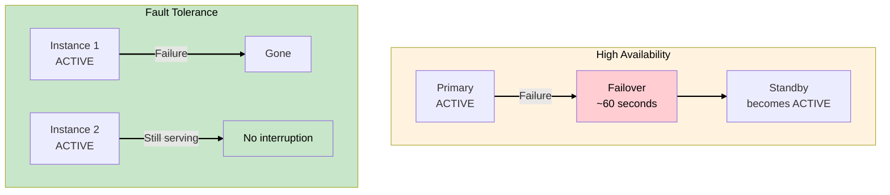

### What TechBooks Needs

| Layer        | Current (Phase 2)   | Phase 3 Goal           | Type              |
| ------------ | ------------------- | ---------------------- | ----------------- |
| **Database** | Single RDS instance | RDS Multi-AZ           | High Availability |
| **Web/App**  | Single EC2          | Still single (Phase 4) | Not yet addressed |

**WHY database first?**

- Database is stateful - hardest to recover
- Data loss is catastrophic (orders, customers)
- EC2 is stateless - easier to replace (coming in Phase 4)

---

## Step 3: RDS Multi-AZ

### What is RDS Multi-AZ?

RDS Multi-AZ creates a **synchronous standby replica** in a different Availability Zone. AWS handles
all replication and failover automatically.

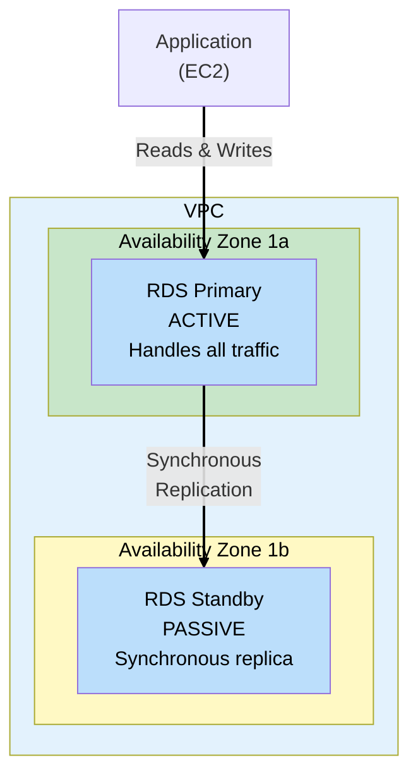

### WHY Synchronous Replication?

| Replication Type | How It Works                                    | Data Loss Risk     | Use Case      |
| ---------------- | ----------------------------------------------- | ------------------ | ------------- |
| **Synchronous**  | Write confirmed only after both copies saved    | Zero (RPO = 0)     | Multi-AZ (HA) |
| **Asynchronous** | Write confirmed immediately, replica catches up | Possible (RPO > 0) | Read Replicas |

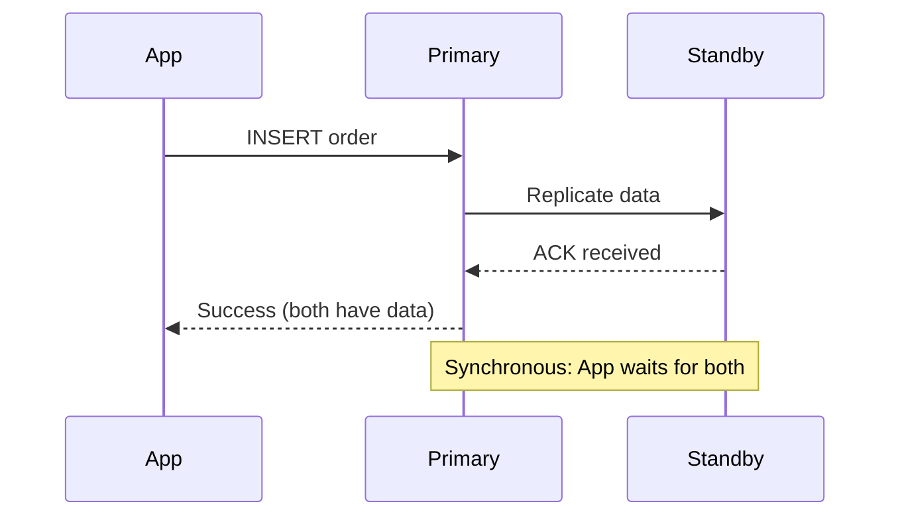

**WHY this matters for TechBooks:**

- Customer places order → committed to BOTH instances
- Primary fails → Standby has ALL data
- Zero data loss guaranteed

### Automatic Failover

When does failover happen?

| Trigger                  | What Happens                                       |
| ------------------------ | -------------------------------------------------- |
| Primary instance failure | Automatic failover to standby                      |
| AZ failure               | Automatic failover to standby                      |
| Primary maintenance      | Automatic failover (planned)                       |
| Manual failover          | You trigger via console/CLI (reboot with failover) |

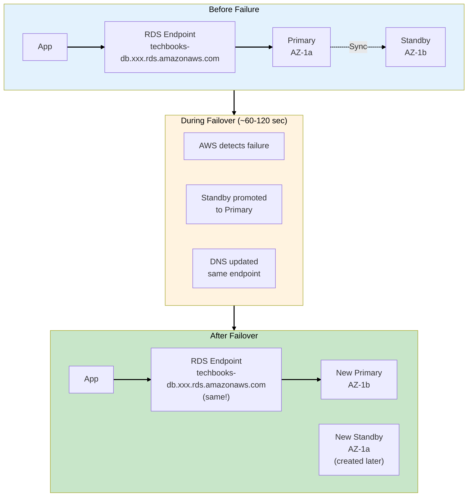

**Key insight:** Your application connection string doesn't change! The RDS endpoint is a DNS name
that AWS updates to point to the new primary.

> **SAA Exam Tip:** Multi-AZ failover is automatic and requires no application changes. The DNS
> endpoint stays the same. Failover typically takes 60-120 seconds.

---

## Step 4: Multi-AZ vs Read Replicas

This is a **critical distinction** for the SAA exam!

### Comparison

| Feature                  | Multi-AZ                | Read Replica                   |
| ------------------------ | ----------------------- | ------------------------------ |
| **Purpose**              | High availability       | Read scalability               |
| **Replication**          | Synchronous             | Asynchronous                   |
| **Readable?**            | No (standby is passive) | Yes (handles read queries)     |
| **Failover**             | Automatic               | Manual (promote to standalone) |
| **Cross-region**         | No (same region)        | Yes (can be in another region) |
| **Cost**                 | ~2x (standby instance)  | Per replica instance           |
| **Data loss on failure** | Zero (RPO = 0)          | Possible (replication lag)     |

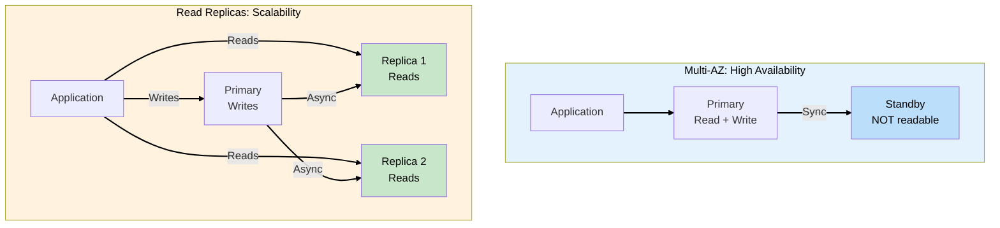

### WHY TechBooks Needs Multi-AZ First (Not Read Replicas)

| Our Problem                          | Solution                              |
| ------------------------------------ | ------------------------------------- |
| Database could fail and we lose data | Multi-AZ (synchronous = no data loss) |
| Single AZ could have outage          | Multi-AZ (standby in different AZ)    |
| Need automatic recovery              | Multi-AZ (automatic failover)         |

Read Replicas solve a **different problem** (read scalability) - we'll consider them later if read
traffic becomes a bottleneck.

> **SAA Exam Tip:** "Database needs high availability with automatic failover" → Multi-AZ. "Database
> needs to handle more read traffic" → Read Replicas. You can use BOTH together.

---

## Step 5: Understanding Uptime and SLAs

### The "Nines" of Availability

| Availability      | Downtime/Year | Downtime/Month | Downtime/Week |
| ----------------- | ------------- | -------------- | ------------- |
| 99% (two 9s)      | 3.65 days     | 7.2 hours      | 1.68 hours    |
| 99.9% (three 9s)  | 8.76 hours    | 43.8 minutes   | 10.1 minutes  |
| 99.95%            | 4.38 hours    | 21.9 minutes   | 5 minutes     |
| 99.99% (four 9s)  | 52.6 minutes  | 4.38 minutes   | 1 minute      |
| 99.999% (five 9s) | 5.26 minutes  | 26.3 seconds   | 6 seconds     |

### AWS RDS SLA

AWS offers **99.95% availability** for Multi-AZ RDS deployments.

**What this means:**

- Up to ~22 minutes downtime per month allowed
- Failover time (~60-120 sec) fits within this SLA
- Single-AZ has no SLA guarantee

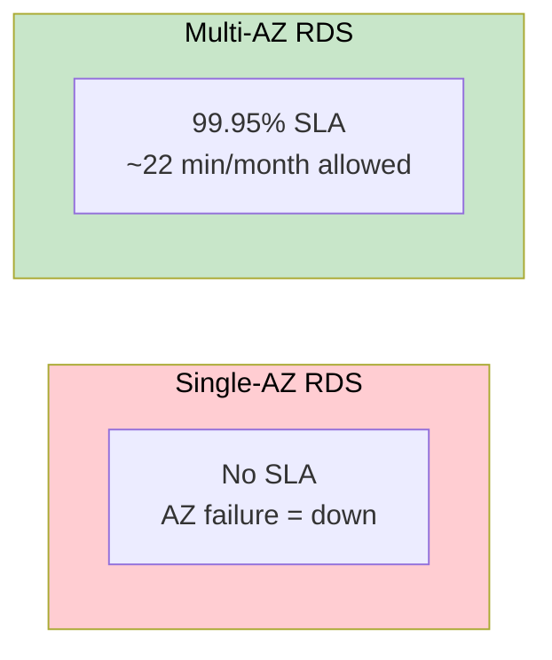

### Can TechBooks Promise 99.9%?

To achieve 99.9% overall, **every component** needs to meet that bar:

| Component | Phase 2            | Phase 3            | Phase 4 (future)   |
| --------- | ------------------ | ------------------ | ------------------ |
| Database  | Single-AZ (no SLA) | Multi-AZ (99.95%)  | Multi-AZ           |
| Web/App   | Single EC2 (no HA) | Single EC2 (no HA) | Auto Scaling + ALB |
| Overall   | No guarantee       | ~99.95% DB only    | ~99.99% possible   |

**Honest answer to founder:** "After Phase 3, our database is highly available. But we need Phase 4
(redundant web tier) before we can truly promise 99.9%."

> **SAA Exam Tip:** Overall availability is the product of component availabilities. A 99.9%
> database with a 99% web tier = ~98.9% overall.

---

## Step 6: Enabling Multi-AZ for TechBooks RDS

### What Changes

**Before (Single-AZ):**

- 1 RDS instance in us-east-1a
- No standby
- Cost: ~$12/month (db.t3.micro)

**After (Multi-AZ):**

- 1 Primary in us-east-1a
- 1 Standby in us-east-1b (automatic)
- Cost: ~$24/month (roughly 2x)

### The Process

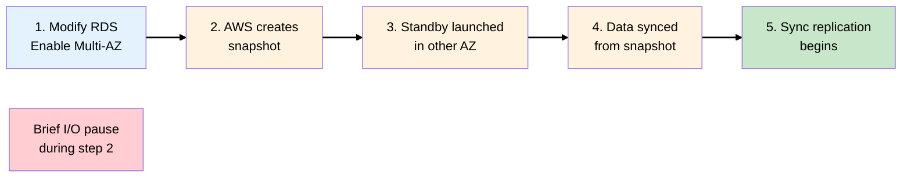

**Important:** Enabling Multi-AZ on existing instance causes brief I/O suspension. Schedule during
low-traffic period.

### Configuration

| Setting             | Value                | WHY                         |
| ------------------- | -------------------- | --------------------------- |
| Multi-AZ deployment | Yes                  | High availability           |
| DB Subnet Group     | techbooks-db-subnets | Must have subnets in 2+ AZs |
| Backup retention    | 7 days               | Point-in-time recovery      |
| Maintenance window  | Sun 03:00-04:00      | Low traffic period          |

---

## Step 7: Testing Failover

### WHY Test Failover?

- Verify your application handles reconnection gracefully
- Measure actual failover time
- Build confidence before a real failure

### How to Test

```bash
# Force a failover via CLI
aws rds reboot-db-instance \
    --db-instance-identifier techbooks-db \
    --force-failover
```

### What to Observe

| Metric           | Expected       | Action if Different          |
| ---------------- | -------------- | ---------------------------- |
| Failover time    | 60-120 seconds | Check instance size, network |
| App reconnection | Automatic      | Add connection retry logic   |
| Data integrity   | No loss        | Verify recent transactions   |

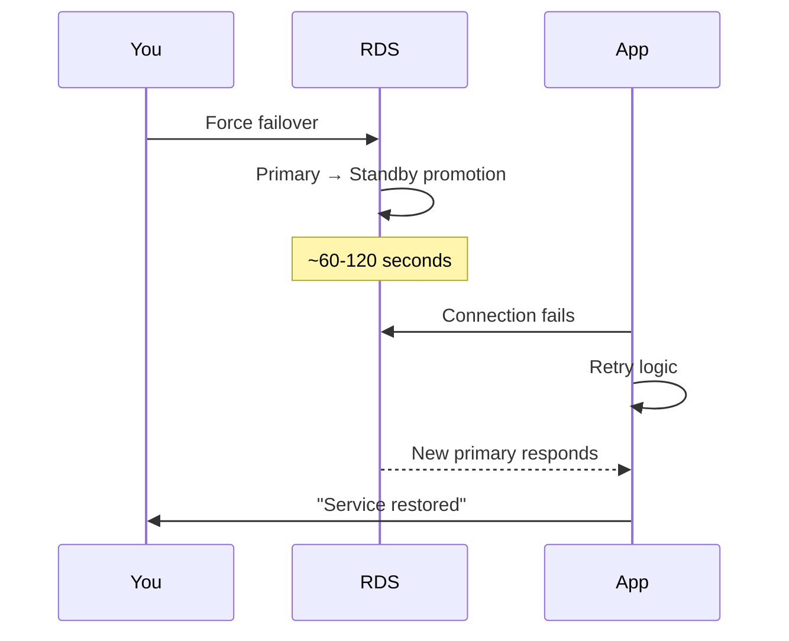

> **SAA Exam Tip:** You can test failover using "Reboot with failover" option. This is a valid way
> to verify your HA setup works.

---

## Phase 3 Complete Architecture

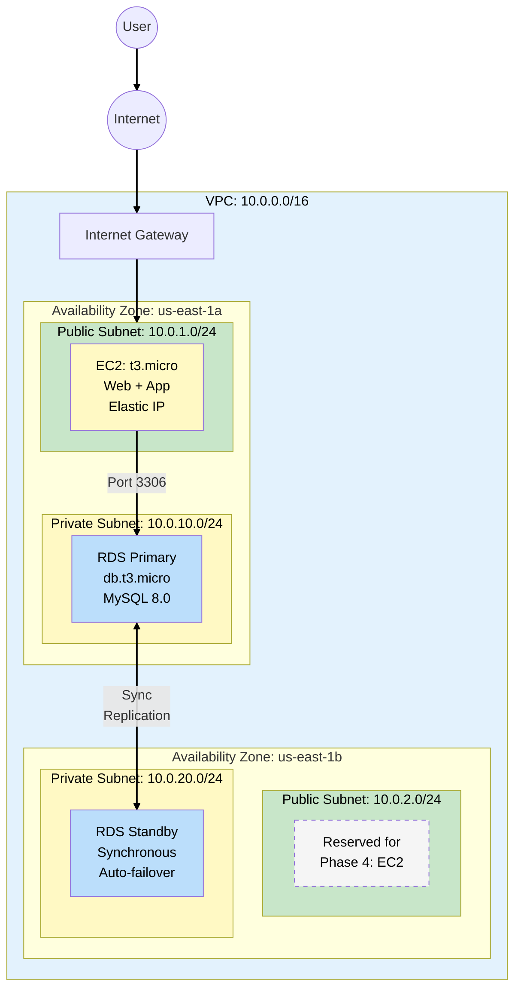

---

## Key SAA Exam Concepts from Phase 3

### Must-Know Topics

1. **Availability Zones**
   - Physically separate data centers within a region
   - Connected by high-speed, low-latency links
   - Foundation for high availability

2. **High Availability vs Fault Tolerance**
   - HA: Quick recovery (brief downtime acceptable)
   - FT: Zero downtime (continuous operation)

3. **RDS Multi-AZ**
   - Synchronous replication (zero data loss)
   - Automatic failover (60-120 seconds)
   - Same endpoint after failover
   - Standby is NOT readable

4. **Multi-AZ vs Read Replicas**
   - Multi-AZ: HA, synchronous, auto-failover
   - Read Replicas: Scalability, async, manual promote

5. **The Nines**
   - 99.9% = 8.76 hours downtime/year
   - 99.99% = 52.6 minutes downtime/year
   - Multi-AZ RDS SLA: 99.95%

---

## Cost Analysis

| Component          | Phase 2 Cost | Phase 3 Cost | Change |
| ------------------ | ------------ | ------------ | ------ |
| EC2 (t3.micro)     | ~$8/month    | ~$8/month    | -      |
| RDS (db.t3.micro)  | ~$12/month   | ~$24/month   | +$12   |
| Storage (20GB gp3) | ~$2/month    | ~$4/month    | +$2    |
| **Total**          | ~$22/month   | ~$36/month   | +$14   |

**WHY it's worth it:**

- Zero data loss guarantee
- Automatic recovery from AZ failures
- 99.95% availability SLA
- Peace of mind: $14/month is cheap insurance for a business

---

## What's Coming in Phase 4?

**Business trigger:** TechBooks traffic is now 10,000 visitors/day! Your single EC2 is struggling.
During a deployment, the site went down for 5 minutes and customers complained.

**Current weakness:** Web tier is still a single point of failure.

**Next decisions:**

- Add Application Load Balancer (ALB)
- Deploy EC2 instances in multiple AZs
- Implement Auto Scaling
- Achieve true fault tolerance for the web tier

---

## Hands-On Challenge

Before moving to Phase 4:

1. Modify your existing RDS instance to enable Multi-AZ
2. Wait for the standby to be created and synced
3. Force a failover using AWS CLI or Console
4. Verify your application reconnects automatically
5. Check CloudWatch for failover events

**Verification:**

- RDS console shows "Multi-AZ: Yes"
- Forced failover completes in ~60-120 seconds
- Application recovers without manual intervention
