# Phase 4: Auto Scaling & Load Balancing

## Business Context

**Situation:** TechBooks is booming! Traffic has reached 10,000 visitors/day. But problems are
mounting.

**Recent incidents:**

- Site slowed to a crawl during a flash sale
- Deployment caused 5-minute outage (customers complained on Twitter)
- CPU hits 100% during peak hours
- You manually upgraded to t3.small, but it's still not enough

**The founder asks:** "Why can't the site just... handle more traffic automatically? Netflix does
it!"

**Your decision:** Implement Auto Scaling with a Load Balancer for true fault tolerance and
elasticity.

---

## Step 1: Vertical vs Horizontal Scaling

### The Two Approaches

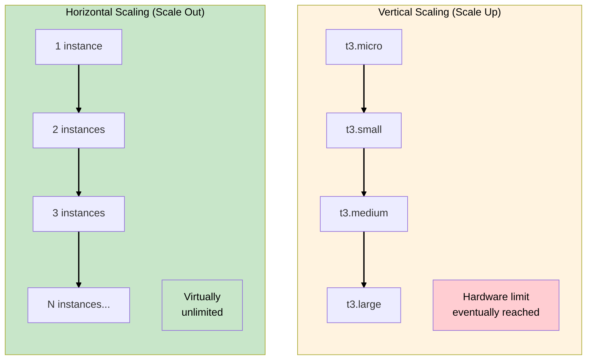

### Comparison

Understanding these two scaling approaches is fundamental - the exam frequently tests when to use
each:

| Aspect              | Vertical (Scale Up)        | Horizontal (Scale Out)             |
| ------------------- | -------------------------- | ---------------------------------- |
| **How**             | Bigger instance            | More instances                     |
| **Downtime**        | Yes (stop, resize, start)  | No (add instances live)            |
| **Cost efficiency** | Linear (2x size ≈ 2x cost) | Better (smaller instances cheaper) |
| **Limit**           | Max instance size          | Virtually unlimited                |
| **Fault tolerance** | No (still single point)    | Yes (instances can fail)           |
| **Complexity**      | Simple                     | Requires load balancer             |

### WHY Horizontal Scaling for TechBooks

| Problem          | Vertical Solution            | Horizontal Solution            |
| ---------------- | ---------------------------- | ------------------------------ |
| Peak traffic     | Buy biggest instance 24/7    | Add instances during peak      |
| Deployment       | Downtime while restarting    | Rolling update, zero downtime  |
| Instance failure | Site down                    | Other instances handle traffic |
| Cost             | Pay for peak capacity always | Pay for what you need          |

> **SAA Exam Tip:** "Scalable and highly available" almost always means horizontal scaling with Auto
> Scaling and Load Balancer. Vertical scaling has hard limits and causes downtime.

---

## Step 2: Elastic Load Balancing (ELB) Types

### AWS Load Balancer Options

AWS offers four types of load balancers:

| Type                  | Layer     | Use Case                   | Protocol          |
| --------------------- | --------- | -------------------------- | ----------------- |
| **ALB** (Application) | Layer 7   | HTTP/HTTPS, microservices  | HTTP, HTTPS, gRPC |
| **NLB** (Network)     | Layer 4   | Ultra-low latency, TCP/UDP | TCP, UDP, TLS     |
| **GLB** (Gateway)     | Layer 3   | Third-party appliances     | IP                |
| **CLB** (Classic)     | Layer 4/7 | Legacy (don't use for new) | HTTP, HTTPS, TCP  |

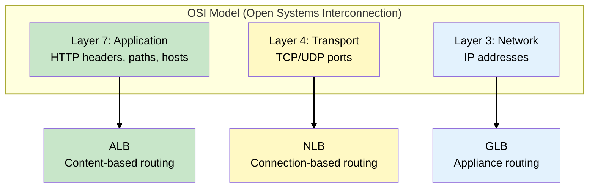

### WHY ALB for TechBooks

| Requirement                             | ALB Feature                  |
| --------------------------------------- | ---------------------------- |
| Web application (HTTP/HTTPS)            | Layer 7 - understands HTTP   |
| Route `/api/*` to API servers           | Path-based routing           |
| Route `admin.techbooks.com` differently | Host-based routing           |
| Health check on `/health` endpoint      | HTTP health checks           |
| SSL termination                         | HTTPS listener with ACM cert |
| WebSocket support (future chat)         | Native WebSocket support     |

> **SAA Exam Tip:** ALB for HTTP/HTTPS applications. NLB for extreme performance, static IPs, or
> non-HTTP protocols. CLB is legacy - don't choose for new architectures.

---

## Step 3: Application Load Balancer Deep Dive

### ALB Components

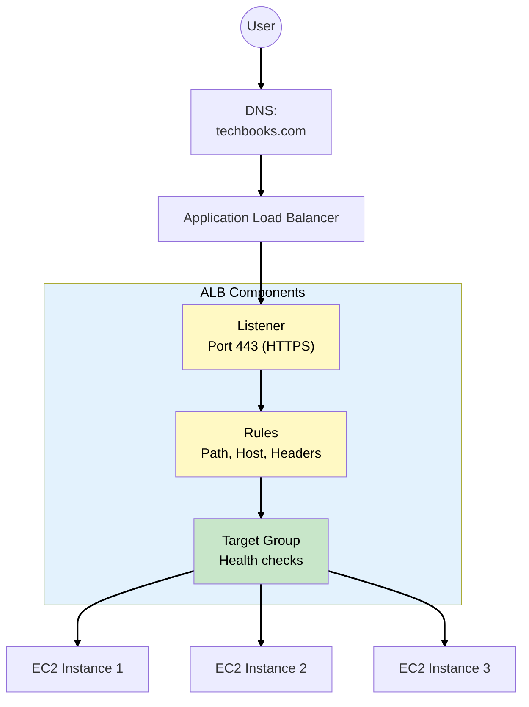

### Component Breakdown

**1. Listener**

- Checks for connection requests on a port/protocol
- Example: HTTPS on port 443

**2. Rules**

- Determine how to route requests
- Conditions: path, host header, HTTP headers, query strings
- Actions: forward, redirect, fixed response

**3. Target Group**

- Group of targets (EC2, Lambda, IP)
- Health check configuration
- Load balancing algorithm

### Path-Based Routing Example

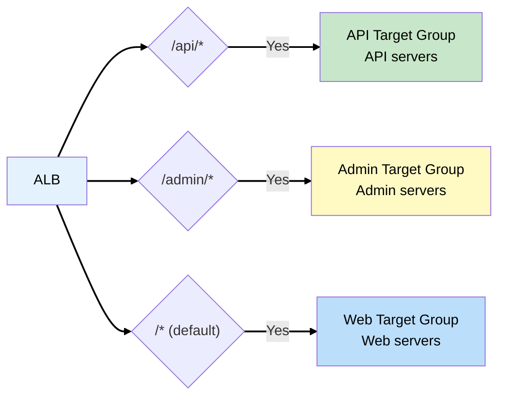

### WHY This Matters for TechBooks

For now, we route everything to one target group. But this architecture allows us to:

- Add separate API servers later
- Route admin traffic to specific instances
- A/B test with weighted routing
- Implement blue-green deployments

> **SAA Exam Tip:** ALB can route based on path (`/api/*`), host (`api.example.com`), HTTP headers,
> query strings, and source IP. Know these routing options!

---

## Step 4: Health Checks

### WHY Health Checks Matter

Without health checks, the load balancer might send traffic to a dead instance:

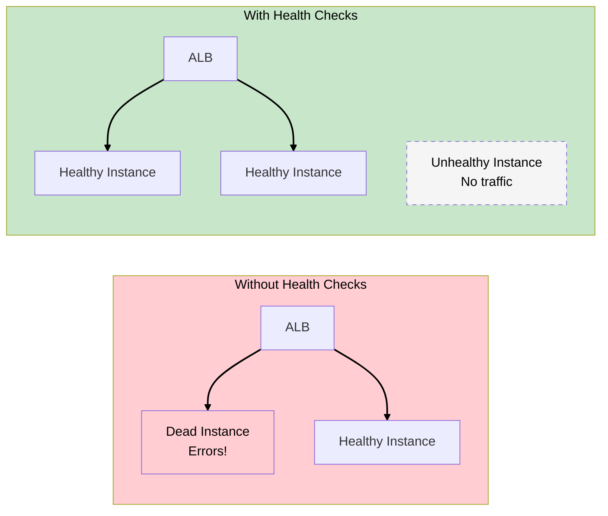

### Health Check Types

Multiple health check mechanisms work together. Understanding which one does what is important for
troubleshooting:

| Type                    | Performed By  | Checks                    | Action on Failure      |
| ----------------------- | ------------- | ------------------------- | ---------------------- |
| **ELB Health Check**    | Load Balancer | HTTP request to `/health` | Stop sending traffic   |
| **EC2 Health Check**    | Auto Scaling  | Instance status           | Terminate and replace  |
| **Custom Health Check** | Your code     | Application logic         | Report to Auto Scaling |

### ELB Health Check Configuration

| Setting                 | Our Value  | WHY                                |
| ----------------------- | ---------- | ---------------------------------- |
| **Protocol**            | HTTP       | App serves HTTP                    |
| **Path**                | `/health`  | Dedicated health endpoint          |
| **Port**                | 80         | Application port                   |
| **Healthy threshold**   | 2          | 2 consecutive successes = healthy  |
| **Unhealthy threshold** | 3          | 3 consecutive failures = unhealthy |
| **Timeout**             | 5 seconds  | Max wait for response              |
| **Interval**            | 30 seconds | Time between checks                |

### What Should `/health` Return?

```javascript
// Good health check endpoint
app.get("/health", async (req, res) => {
  try {
    // Check database connection
    await db.query("SELECT 1");

    // Check critical dependencies
    // await redis.ping();

    res.status(200).json({ status: "healthy" });
  } catch (error) {
    res.status(500).json({ status: "unhealthy", error: error.message });
  }
});
```

**WHY check dependencies:**

- Instance might be running but database connection lost
- Deep health check catches more failures
- ALB routes away from instances with dependency issues

> **SAA Exam Tip:** ELB health checks determine traffic routing. Auto Scaling uses health checks to
> replace instances. Both should be configured for robust HA.

---

## Step 5: Auto Scaling Groups (ASG)

### What is an Auto Scaling Group?

An **Auto Scaling Group** automatically adjusts the number of EC2 instances based on demand or
schedule.

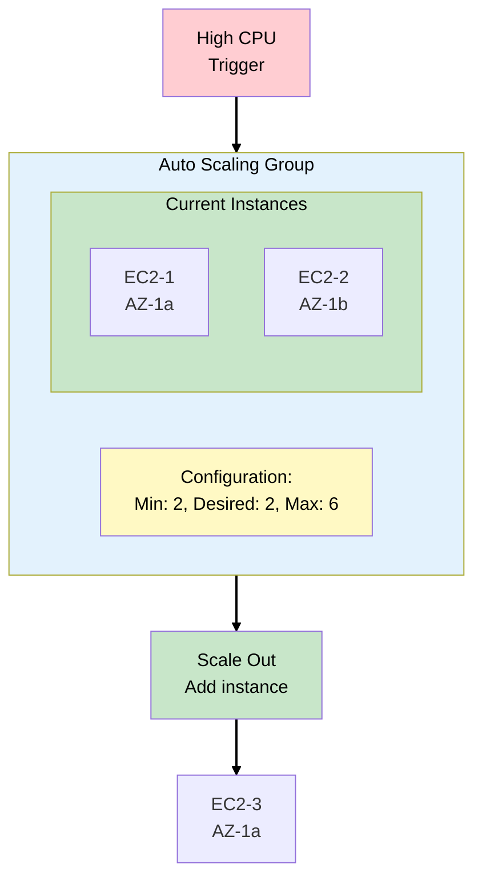

### ASG Components

**1. Launch Template**

- Blueprint for new instances
- AMI, instance type, security groups, user data
- Replaces older "Launch Configuration"

**2. Capacity Settings**

| Setting     | Description               | Our Value          |
| ----------- | ------------------------- | ------------------ |
| **Minimum** | Never go below this       | 2 (HA requirement) |
| **Desired** | Target number to maintain | 2 (normal traffic) |
| **Maximum** | Never exceed this         | 6 (cost control)   |

**3. Scaling Policies**

- When and how to scale
- Target tracking, step scaling, scheduled

### WHY Minimum of 2?

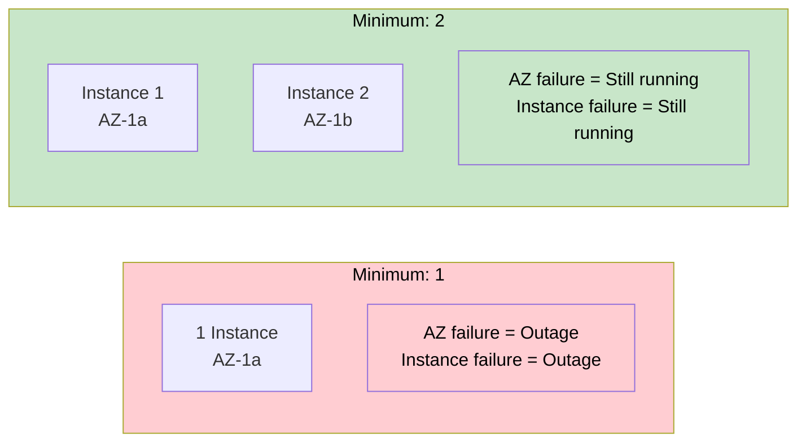

**Rule:** For high availability, minimum should be at least 2, spread across AZs.

> **SAA Exam Tip:** ASG spreads instances across AZs in the subnet configuration. With 2 AZs and
> min=2, you get one instance per AZ automatically.

---

## Step 6: Launch Template

### What Goes in a Launch Template?

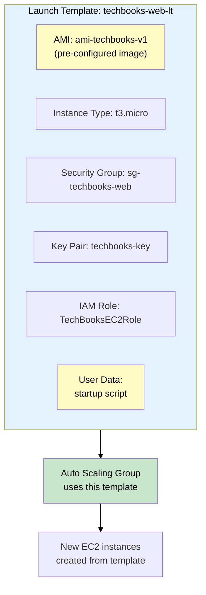

### User Data Script

The user data script runs on first boot:

```bash
#!/bin/bash
# Update and install dependencies
yum update -y
yum install -y nodejs nginx

# Pull latest application code
aws s3 cp s3://techbooks-deploy/app.zip /opt/app/
unzip /opt/app/app.zip -d /opt/app/

# Configure and start services
systemctl start nginx
cd /opt/app && npm start
```

### AMI Strategy: Golden AMI vs User Data

| Approach       | Pros                  | Cons                            |
| -------------- | --------------------- | ------------------------------- |
| **Golden AMI** | Fast boot, consistent | Must rebuild for updates        |
| **User Data**  | Always latest code    | Slower boot, potential failures |
| **Hybrid**     | Best of both          | More complex                    |

**TechBooks approach:** Golden AMI with base software, User Data pulls latest code.

> **SAA Exam Tip:** Launch Templates are the modern replacement for Launch Configurations. Templates
> support versioning and can be updated without recreating the ASG.

---

## Step 7: Scaling Policies

### Types of Scaling Policies

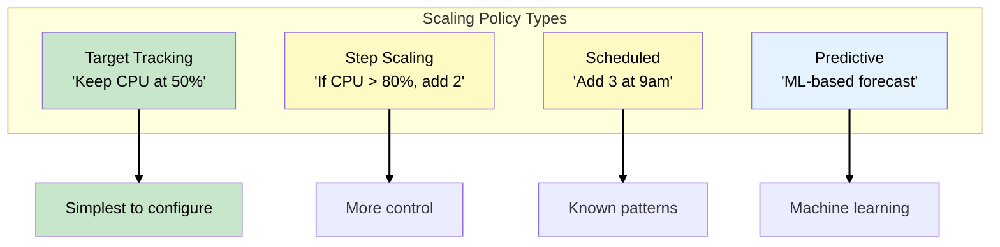

### Target Tracking (Recommended for Most Cases)

"Maintain average CPU at 50%"

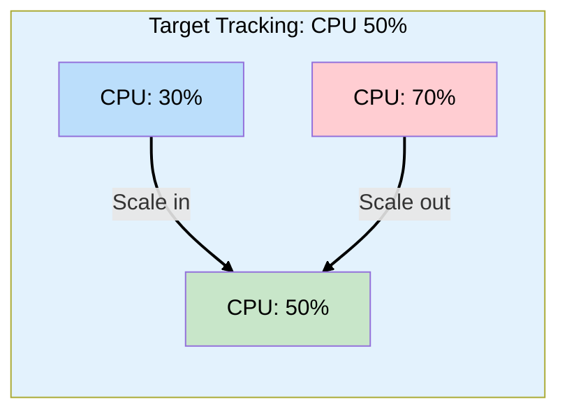

**Available target metrics:**

- `ASGAverageCPUUtilization` - Average CPU
- `ASGAverageNetworkIn` - Network bytes in
- `ASGAverageNetworkOut` - Network bytes out
- `ALBRequestCountPerTarget` - Requests per instance

### Step Scaling (More Control)

Define exact actions for specific thresholds:

| CPU Range | Action            |
| --------- | ----------------- |
| 0-40%     | Remove 1 instance |
| 40-60%    | Do nothing        |
| 60-80%    | Add 1 instance    |
| 80-100%   | Add 2 instances   |

### Scheduled Scaling (Known Patterns)

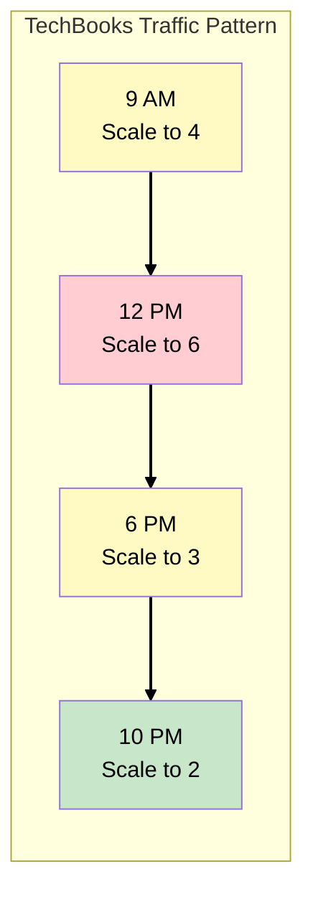

### TechBooks Scaling Configuration

For TechBooks, we combine multiple policies for comprehensive coverage:

| Policy       | Type            | Configuration                  |
| ------------ | --------------- | ------------------------------ |
| **Primary**  | Target Tracking | CPU at 50%                     |
| **Backup**   | Scheduled       | Min 4 during business hours    |
| **Cooldown** | -               | 300 seconds (prevent flapping) |

> **SAA Exam Tip:** Target tracking is the simplest and recommended for most cases. Step scaling
> provides more control. Scheduled scaling is for predictable patterns. You can combine multiple
> policies.

---

## Step 8: Removing the Elastic IP

### WHY We No Longer Need Elastic IP

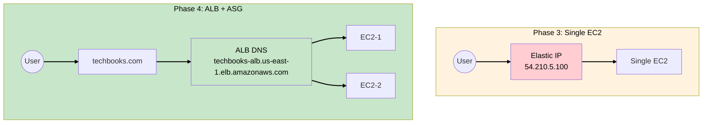

**Changes:**

| Aspect                   | Before (EIP)      | After (ALB)                                    |
| ------------------------ | ----------------- | ---------------------------------------------- |
| **DNS points to**        | Elastic IP        | ALB DNS name                                   |
| **SSL termination**      | EC2 instance      | ALB                                            |
| **Instance replacement** | Must reassign EIP | Automatic                                      |
| **Cost**                 | Free if attached  | ALB hourly + LCU (Load Balancer Capacity Unit) |

### Updating DNS

```
techbooks.com → techbooks-alb-123456.us-east-1.elb.amazonaws.com
```

Use a CNAME or Route 53 Alias record (Alias is better - no charge for queries).

> **SAA Exam Tip:** Route 53 Alias records to ALB are free and support zone apex (naked domain).
> CNAME records don't work for zone apex and incur query charges.

---

## Step 9: Cross-Zone Load Balancing

### The Problem Without Cross-Zone

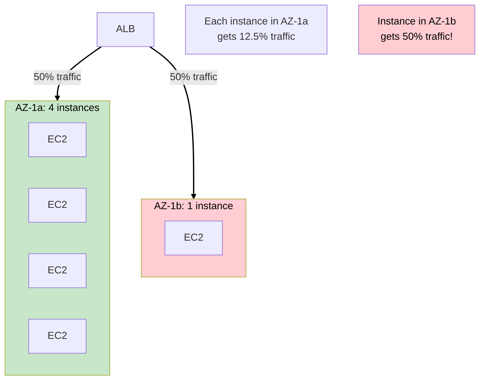

### With Cross-Zone Load Balancing

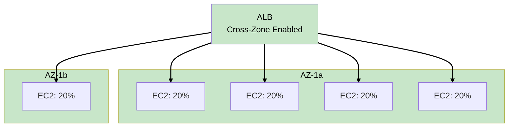

**Cross-zone load balancing:** Distributes traffic evenly across ALL instances in ALL AZs.

| Load Balancer | Cross-Zone Default | Data Transfer Cost |
| ------------- | ------------------ | ------------------ |
| ALB           | Always enabled     | No charge          |
| NLB           | Disabled           | Charged if enabled |
| CLB           | Disabled           | No charge          |

> **SAA Exam Tip:** ALB always has cross-zone load balancing enabled and doesn't charge for cross-AZ
> data transfer. NLB charges for cross-AZ if enabled.

---

## Step 10: Connection Draining (Deregistration Delay)

### WHY It Matters

When an instance is removed (scale in or unhealthy), what happens to in-flight requests?

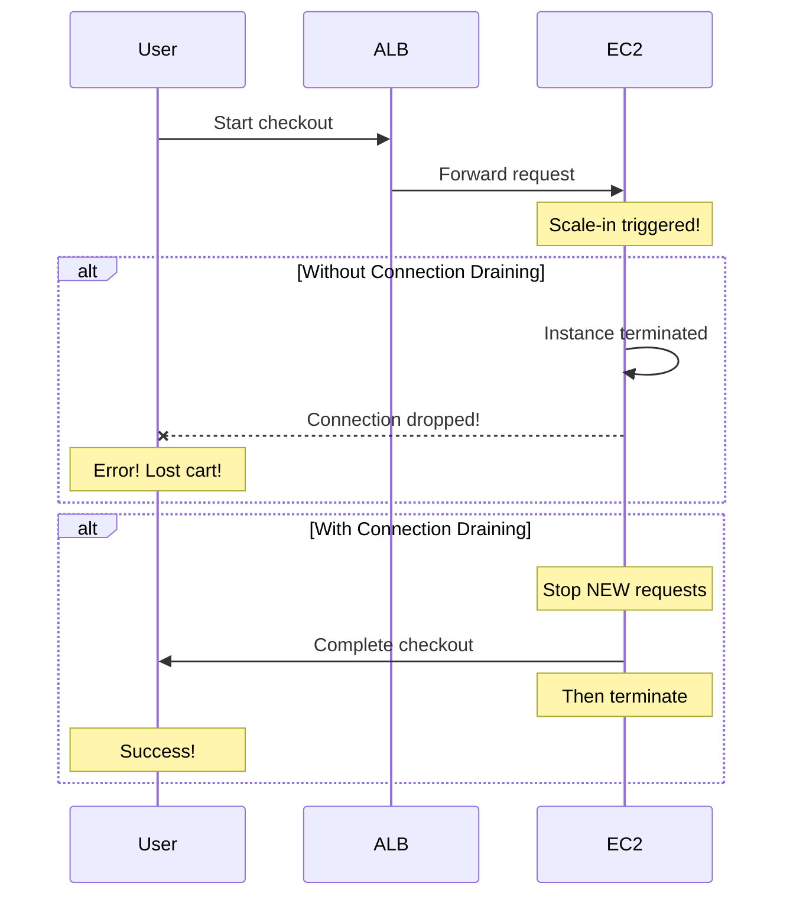

### Configuration

| Setting                  | Value       | WHY                          |
| ------------------------ | ----------- | ---------------------------- |
| **Deregistration delay** | 300 seconds | Allow requests to complete   |
| **For TechBooks**        | 60 seconds  | Most requests finish quickly |

**Trade-off:** Longer delay = safer but slower scaling.

> **SAA Exam Tip:** Connection draining / deregistration delay ensures in-flight requests complete
> before an instance is removed. Default is 300 seconds.

---

## Step 11: Security Group Updates

### New Security Group Architecture

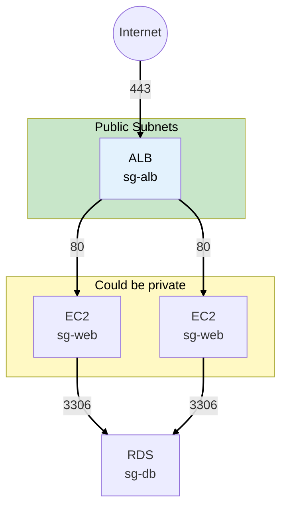

### Security Group Rules

**ALB Security Group (sg-techbooks-alb):**

```
Inbound:
- HTTPS (443) from 0.0.0.0/0    # Public traffic

Outbound:
- HTTP (80) to sg-techbooks-web  # To EC2 instances
```

**EC2 Security Group (sg-techbooks-web):**

```
Inbound:
- HTTP (80) from sg-techbooks-alb  # Only from ALB!
- SSH (22) from your-ip/32         # Admin access

Outbound:
- MySQL (3306) to sg-techbooks-db  # To RDS
- HTTPS (443) to 0.0.0.0/0         # For updates, APIs
```

**Key change:** EC2 no longer accepts traffic from internet directly - only from ALB.

> **SAA Exam Tip:** Reference security groups instead of IPs. EC2 instances should only accept
> traffic from ALB, not directly from the internet.

---

## Phase 4 Complete Architecture

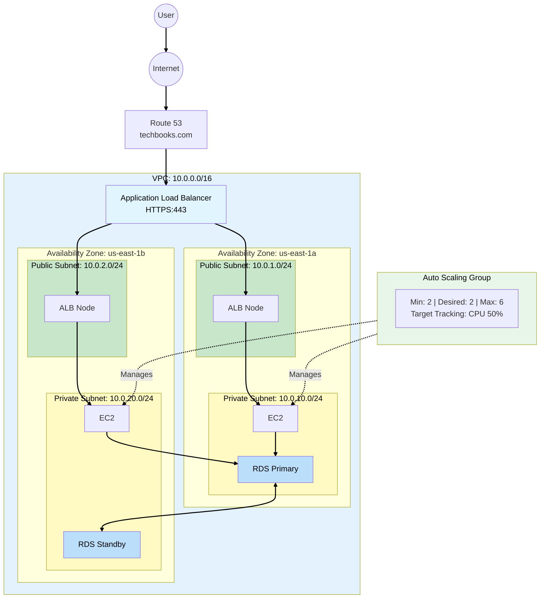

---

## See Also

> **Related Learning:** For a deep dive into IAM roles and how EC2 instances assume roles securely,
> see
> [MedVault Phase 1: Identity Foundation](/scenarios/medvault/phases/phase-1-identity-foundation.md).

---

## Key SAA Exam Concepts from Phase 4

### Must-Know Topics

1. **Load Balancer Types**
   - ALB: Layer 7, HTTP/HTTPS, content-based routing
   - NLB: Layer 4, ultra-low latency, static IP
   - CLB: Legacy, don't use for new projects

2. **ALB Features**
   - Path-based routing (`/api/*`)
   - Host-based routing (`api.example.com`)
   - Health checks on target groups
   - SSL termination

3. **Auto Scaling**
   - Launch Template (not Launch Configuration)
   - Min/Desired/Max capacity
   - Target Tracking is simplest policy
   - Spreads across AZs automatically

4. **Health Checks**
   - ELB health checks: routing decisions
   - EC2 health checks: instance replacement
   - Both should be configured

5. **Cross-Zone Load Balancing**
   - ALB: Always on, free
   - NLB: Optional, costs for cross-AZ

6. **Connection Draining**
   - Allows in-flight requests to complete
   - Default 300 seconds

---

## Cost Analysis

| Component         | Phase 3 Cost | Phase 4 Cost | Notes           |
| ----------------- | ------------ | ------------ | --------------- |
| EC2 (t3.micro x2) | ~$8/month    | ~$16/month   | Min 2 instances |
| RDS Multi-AZ      | ~$24/month   | ~$24/month   | No change       |
| ALB               | $0           | ~$20/month   | Hourly + LCU    |
| Data Transfer     | ~$2/month    | ~$5/month    | More traffic    |
| Elastic IP        | ~$0          | $0           | Removed!        |
| **Total**         | ~$36/month   | ~$65/month   | +$29            |

**WHY it's worth it:**

- Zero-downtime deployments
- Automatic scaling for traffic spikes
- Fault tolerance (instance failures don't cause outage)
- Foundation for 99.99% availability

---

## What's Coming in Phase 5?

**Business trigger:** TechBooks is going international! Customers in Europe and Asia complain about
slow load times. The founder wants to expand globally.

**Next decisions:**

- CloudFront CDN for static assets and caching
- Route 53 for DNS and geo-routing
- Multi-region considerations
- S3 for static content

---

## Hands-On Challenge

Before moving to Phase 5:

1. Create an Application Load Balancer in your public subnets
2. Create a Target Group with health check on `/health`
3. Create a Launch Template with your EC2 configuration
4. Create an Auto Scaling Group (min: 2, max: 4)
5. Configure Target Tracking policy for 50% CPU
6. Update Route 53 to point to ALB
7. Release the Elastic IP

**Verification:**

- ALB DNS resolves and shows your site
- Terminate one EC2 instance - another should launch automatically
- Run a load test - watch instances scale out

---

## References

Official AWS documentation used to validate this content:

### Elastic Load Balancing

- [How ELB Works](https://docs.aws.amazon.com/elasticloadbalancing/latest/userguide/how-elastic-load-balancing-works.html) -
  Cross-zone load balancing and load balancer nodes
- [What is an Application Load Balancer?](https://docs.aws.amazon.com/elasticloadbalancing/latest/application/introduction.html) -
  ALB Layer 7, path/host-based routing
- [Edit Target Group Attributes](https://docs.aws.amazon.com/elasticloadbalancing/latest/application/edit-target-group-attributes.html) -
  Deregistration delay (default 300 seconds)

### Auto Scaling

- [Auto Scaling Launch Templates](https://docs.aws.amazon.com/autoscaling/ec2/userguide/launch-templates.html) -
  Launch Templates vs Launch Configurations
- [Auto Scaling Group Availability Zone Distribution](https://docs.aws.amazon.com/autoscaling/ec2/userguide/ec2-auto-scaling-availability-zone-balanced.html) -
  Instance distribution across AZs

### Route 53

- [Choosing Between Alias and Non-Alias Records](https://docs.aws.amazon.com/Route53/latest/DeveloperGuide/resource-record-sets-choosing-alias-non-alias.html) -
  Zone apex support for Alias records, CNAME limitations
