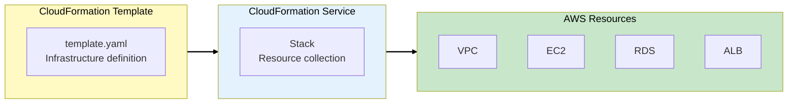
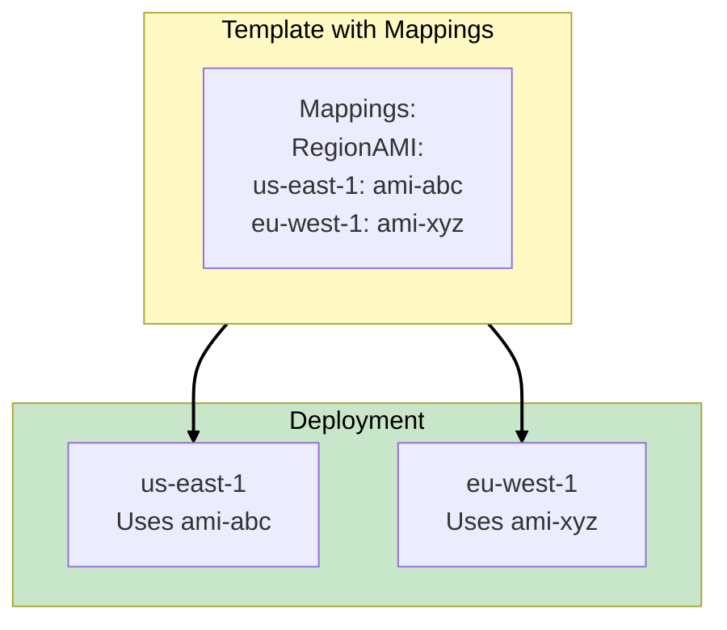
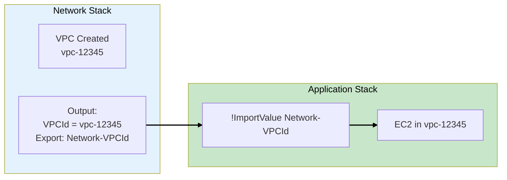
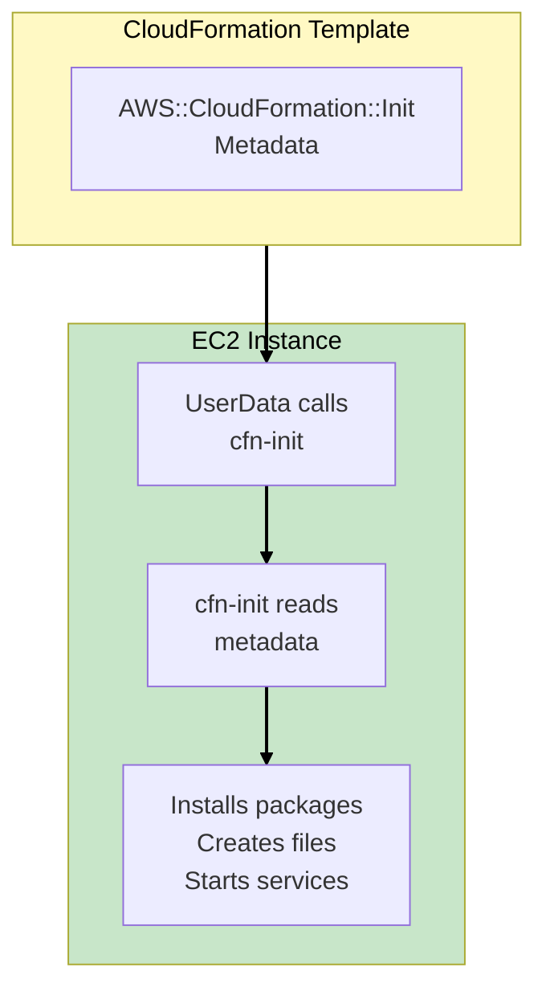
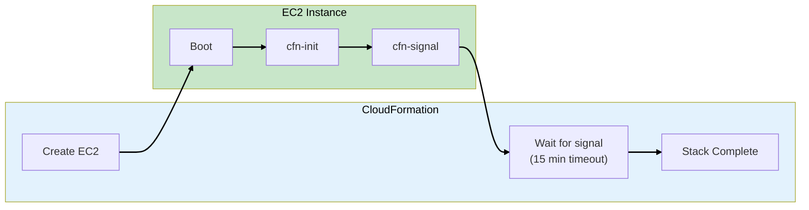
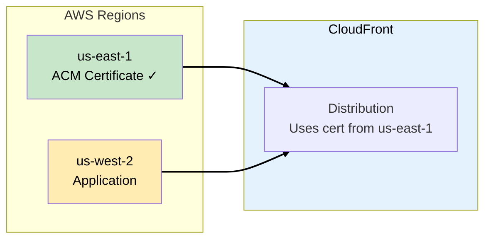
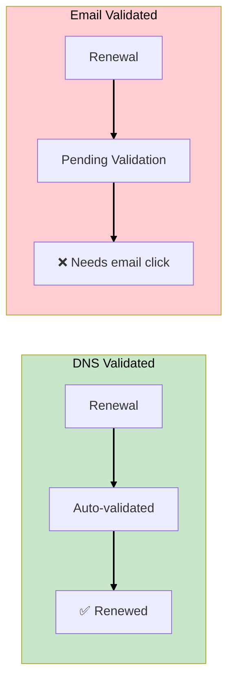
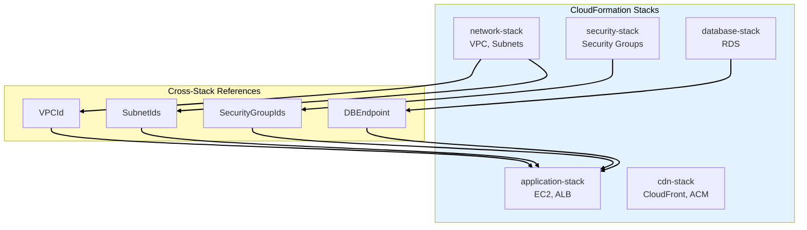

# Phase 7: Infrastructure as Code

## Business Context

**Situation:** TechBooks has grown to 50+ EC2 instances, multiple RDS databases, and complex
networking. The ops team is struggling:

- Manual deployments take 4 hours and often fail
- "It works on my machine" problems when replicating environments
- No way to track infrastructure changes
- Disaster recovery requires rebuilding everything manually

**The CTO's mandate:** "I want to rebuild our entire infrastructure from scratch in under 30
minutes. No clicking in consoles."

**Requirements:**

- Define all infrastructure as code
- Support multiple environments (dev, staging, prod)
- Enable cross-stack references
- Automate EC2 bootstrapping

---

## Step 1: CloudFormation Fundamentals

### What is CloudFormation?

**AWS CloudFormation** lets you define your infrastructure as code using JSON or YAML templates:



### Template Structure

```yaml
AWSTemplateFormatVersion: "2010-09-09"
Description: TechBooks Infrastructure

Parameters:
  Environment:
    Type: String
    AllowedValues: [dev, staging, prod]

Mappings:
  RegionAMI:
    us-east-1:
      HVM64: ami-0123456789abcdef0
    eu-west-1:
      HVM64: ami-0987654321fedcba0

Conditions:
  IsProd: !Equals [!Ref Environment, prod]

Resources:
  WebServer:
    Type: AWS::EC2::Instance
    Properties:
      ImageId: !FindInMap [RegionAMI, !Ref "AWS::Region", HVM64]

Outputs:
  WebServerIP:
    Value: !GetAtt WebServer.PublicIp
    Export:
      Name: !Sub "${AWS::StackName}-WebServerIP"
```

---

## Step 2: CloudFormation Mappings

### Region-Specific AMIs

**Mappings** define static values that vary by key (like region). This solves the problem of AMI IDs
being different in each region:



### TechBooks AMI Mapping

```yaml
Mappings:
  RegionAMI:
    us-east-1:
      HVM64: ami-0abc123def456789a
      HVM32: ami-0def456abc789012b
    us-west-2:
      HVM64: ami-0fed987cba654321c
      HVM32: ami-0123abc456def7890
    eu-west-1:
      HVM64: ami-0456def789abc0123
      HVM32: ami-0789abc012def3456

  EnvironmentConfig:
    dev:
      InstanceType: t3.micro
      MinSize: 1
      MaxSize: 2
    staging:
      InstanceType: t3.small
      MinSize: 2
      MaxSize: 4
    prod:
      InstanceType: t3.medium
      MinSize: 4
      MaxSize: 20

Resources:
  WebServer:
    Type: AWS::EC2::Instance
    Properties:
      ImageId: !FindInMap
        - RegionAMI
        - !Ref "AWS::Region"
        - HVM64
      InstanceType: !FindInMap
        - EnvironmentConfig
        - !Ref Environment
        - InstanceType
```

### Fn::FindInMap Function

```yaml
# Syntax
!FindInMap [MapName, TopLevelKey, SecondLevelKey]

# Example
!FindInMap [RegionAMI, us-east-1, HVM64]
# Returns: ami-0abc123def456789a
```

> **SAA Exam Tip:** "Region-specific AMI IDs in CloudFormation" = **Mappings** with `Fn::FindInMap`.
> This is a classic exam question.

---

## Step 3: CloudFormation Outputs and Cross-Stack References

### The Problem

TechBooks has multiple stacks:

- **Network Stack** - VPC, subnets
- **Security Stack** - Security groups
- **Application Stack** - EC2, ALB

The Application Stack needs the VPC ID from the Network Stack.



### Exporting Values

```yaml
# network-stack.yaml
Resources:
  VPC:
    Type: AWS::EC2::VPC
    Properties:
      CidrBlock: 10.0.0.0/16

  PublicSubnet:
    Type: AWS::EC2::Subnet
    Properties:
      VpcId: !Ref VPC
      CidrBlock: 10.0.1.0/24

Outputs:
  VPCId:
    Description: VPC ID for cross-stack reference
    Value: !Ref VPC
    Export:
      Name: !Sub "${AWS::StackName}-VPCId"

  PublicSubnetId:
    Description: Public Subnet ID
    Value: !Ref PublicSubnet
    Export:
      Name: !Sub "${AWS::StackName}-PublicSubnetId"
```

### Importing Values

```yaml
# application-stack.yaml
Resources:
  WebServer:
    Type: AWS::EC2::Instance
    Properties:
      SubnetId: !ImportValue NetworkStack-PublicSubnetId
      SecurityGroupIds:
        - !ImportValue SecurityStack-WebServerSG
```

### Fn::ImportValue Function

```yaml
# Import a value exported from another stack
!ImportValue ExportName

# With Sub for dynamic names
!ImportValue
  Fn::Sub: '${NetworkStackName}-VPCId'
```

> **SAA Exam Tip:** "Share resources between CloudFormation stacks" = **Outputs with Export** +
> **Fn::ImportValue**. This enables modular template design.

---

## Step 4: CloudFormation Helper Scripts

### EC2 Bootstrapping Challenge

TechBooks needs EC2 instances to:

1. Install Apache and PHP
2. Configure the application
3. Download code from S3
4. Start services

### The cfn-init Helper Script

**cfn-init** reads metadata from the template and performs configuration:



### cfn-init Configuration

```yaml
Resources:
  WebServer:
    Type: AWS::EC2::Instance
    Metadata:
      AWS::CloudFormation::Init:
        configSets:
          default:
            - install
            - configure
            - start

        install:
          packages:
            yum:
              httpd: []
              php: []
              php-mysql: []

        configure:
          files:
            /var/www/html/index.php:
              content: |
                <?php
                echo "TechBooks - Environment: ${Environment}";
                ?>
              mode: "000644"
              owner: apache
              group: apache

            /etc/cfn/cfn-hup.conf:
              content: !Sub |
                [main]
                stack=${AWS::StackId}
                region=${AWS::Region}
                interval=5

        start:
          services:
            sysvinit:
              httpd:
                enabled: true
                ensureRunning: true

    Properties:
      ImageId: !FindInMap [RegionAMI, !Ref "AWS::Region", HVM64]
      InstanceType: t3.micro
      UserData:
        Fn::Base64: !Sub |
          #!/bin/bash -xe
          yum update -y aws-cfn-bootstrap
          /opt/aws/bin/cfn-init -v \
            --stack ${AWS::StackName} \
            --resource WebServer \
            --region ${AWS::Region}
          /opt/aws/bin/cfn-signal -e $? \
            --stack ${AWS::StackName} \
            --resource WebServer \
            --region ${AWS::Region}
```

### CloudFormation Helper Scripts Comparison

| Script               | Purpose                                       | Use Case                        |
| -------------------- | --------------------------------------------- | ------------------------------- |
| **cfn-init**         | Read metadata, install packages, create files | Initial EC2 setup               |
| **cfn-signal**       | Signal success/failure to CloudFormation      | Wait conditions, CreationPolicy |
| **cfn-get-metadata** | Retrieve metadata from template               | Custom scripts                  |
| **cfn-hup**          | Detect metadata changes, run hooks            | Update running instances        |

> **SAA Exam Tip:** "Read CloudFormation metadata and install packages" = **cfn-init**. "Signal
> completion to CloudFormation" = **cfn-signal**.

---

## Step 5: CreationPolicy and WaitConditions

### Ensuring Successful Bootstrapping

CloudFormation should wait for EC2 to finish configuring before marking the stack as complete:

```yaml
Resources:
  WebServer:
    Type: AWS::EC2::Instance
    CreationPolicy:
      ResourceSignal:
        Count: 1
        Timeout: PT15M # 15 minutes
    Properties:
      UserData:
        Fn::Base64: !Sub |
          #!/bin/bash -xe
          /opt/aws/bin/cfn-init -v --stack ${AWS::StackName} --resource WebServer
          /opt/aws/bin/cfn-signal -e $? --stack ${AWS::StackName} --resource WebServer
```



---

## Step 6: cfn-hup for Updates

### Updating Running Instances

**cfn-hup** detects metadata changes and applies updates to running instances:

```yaml
Metadata:
  AWS::CloudFormation::Init:
    configSets:
      default: [install, configure]

    configure:
      files:
        /etc/cfn/cfn-hup.conf:
          content: !Sub |
            [main]
            stack=${AWS::StackId}
            region=${AWS::Region}
            interval=5
          mode: "000400"
          owner: root
          group: root

        /etc/cfn/hooks.d/cfn-auto-reloader.conf:
          content: !Sub |
            [cfn-auto-reloader-hook]
            triggers=post.update
            path=Resources.WebServer.Metadata.AWS::CloudFormation::Init
            action=/opt/aws/bin/cfn-init -v --stack ${AWS::StackName} --resource WebServer
            runas=root

      services:
        sysvinit:
          cfn-hup:
            enabled: true
            ensureRunning: true
            files:
              - /etc/cfn/cfn-hup.conf
              - /etc/cfn/hooks.d/cfn-auto-reloader.conf
```

> **SAA Exam Tip:** "Apply CloudFormation changes to running EC2 instances" = **cfn-hup** with hooks
> configuration.

---

## Step 7: ACM Certificate Management

### Certificate for CloudFront

TechBooks uses CloudFront with HTTPS. The SSL certificate must be in **us-east-1** for CloudFront:



### Certificate Validation Methods

| Method               | Auto-Renewal                   | Use Case                  |
| -------------------- | ------------------------------ | ------------------------- |
| **DNS Validation**   | ✅ Yes                         | Recommended, automated    |
| **Email Validation** | ❌ No (requires manual action) | Legacy, avoid if possible |

### DNS Validation (Recommended)

```yaml
Resources:
  Certificate:
    Type: AWS::CertificateManager::Certificate
    Properties:
      DomainName: techbooks.example.com
      SubjectAlternativeNames:
        - "*.techbooks.example.com"
      ValidationMethod: DNS
      DomainValidationOptions:
        - DomainName: techbooks.example.com
          HostedZoneId: !Ref HostedZone
```

### Email Validation Renewal Issue

> **SAA Exam Tip:** "ACM certificate shows Pending Validation during renewal" + "Email validated
> certificate" = **Manual email confirmation required**. AWS cannot auto-renew email-validated
> certificates.



---

## Step 8: TechBooks IaC Architecture

### Complete Stack Structure



---

## Exam Tips Summary

| Topic                       | Key Point                                     |
| --------------------------- | --------------------------------------------- |
| **Mappings**                | Static values by key (region → AMI)           |
| **Fn::FindInMap**           | Retrieve values from Mappings                 |
| **Outputs + Export**        | Share values with other stacks                |
| **Fn::ImportValue**         | Import values from other stacks               |
| **cfn-init**                | Read metadata, install packages, configure    |
| **cfn-signal**              | Signal success/failure to CloudFormation      |
| **cfn-hup**                 | Apply updates to running instances            |
| **cfn-get-metadata**        | Retrieve metadata for custom scripts          |
| **CreationPolicy**          | Wait for cfn-signal before completing         |
| **ACM + CloudFront**        | Certificate must be in us-east-1              |
| **DNS vs Email validation** | DNS auto-renews, Email requires manual action |

---

**[← Back to TechBooks Overview](../00-overview.md)**
