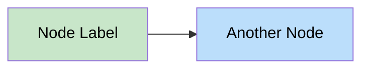
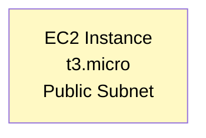
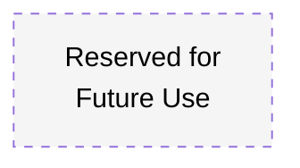
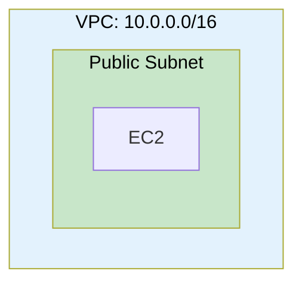
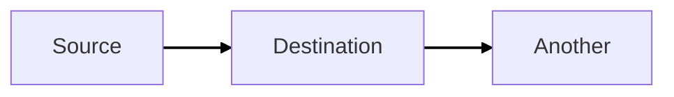
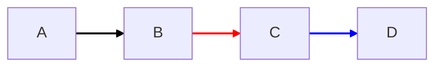
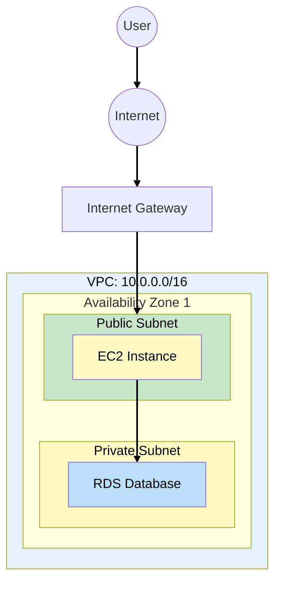

# Mermaid Diagram Style Guide

Reference for consistent diagram styling across all TechBooks architecture documents.

## Key Rules

1. **Line breaks:** Use ` ` instead of `\n`
2. **Text contrast:** Always add `color:#000` for black text on light backgrounds
3. **Quotes:** Wrap node labels in quotes when using ` `: `["Label SubLabel"]`
4. **Arrow color:** Use `linkStyle default stroke:#000,stroke-width:2px` for black arrows

## Color Palette

| Purpose               | Fill Color | With Text                 | Example          |
| --------------------- | ---------- | ------------------------- | ---------------- |
| **VPC / Container**   | `#e3f2fd`  | `fill:#e3f2fd,color:#000` | Light blue       |
| **Public Subnet**     | `#c8e6c9`  | `fill:#c8e6c9,color:#000` | Light green      |
| **Private Subnet**    | `#fff9c4`  | `fill:#fff9c4,color:#000` | Light yellow     |
| **Database / RDS**    | `#bbdefb`  | `fill:#bbdefb,color:#000` | Blue             |
| **Warning / Problem** | `#ffcdd2`  | `fill:#ffcdd2,color:#000` | Light red        |
| **Success / Good**    | `#c8e6c9`  | `fill:#c8e6c9,color:#000` | Light green      |
| **Neutral / Future**  | `#f5f5f5`  | `fill:#f5f5f5,color:#000` | Light gray       |
| **Highlight**         | `#fff3e0`  | `fill:#fff3e0,color:#000` | Light orange     |
| **Info**              | `#e8f5e9`  | `fill:#e8f5e9,color:#000` | Very light green |

## Style Syntax Examples

### Basic node with color

### Multi-line labels

### Dashed border (for future/placeholder items)

### Subgraph styling

### Arrow/Link styling

**Styling specific links (by index):**

**Link style options:** | Property | Example | Description | |----------|---------|-------------| |
`stroke` | `stroke:#000` | Line color | | `stroke-width` | `stroke-width:2px` | Line thickness | |
`stroke-dasharray` | `stroke-dasharray:5,5` | Dashed line |

## AWS Component Colors

| Component      | Recommended Style         |
| -------------- | ------------------------- |
| VPC            | `fill:#e3f2fd,color:#000` |
| Public Subnet  | `fill:#c8e6c9,color:#000` |
| Private Subnet | `fill:#fff9c4,color:#000` |
| EC2            | `fill:#fff9c4,color:#000` |
| RDS            | `fill:#bbdefb,color:#000` |
| S3             | `fill:#c8e6c9,color:#000` |
| Load Balancer  | `fill:#e1f5fe,color:#000` |
| Security Group | `fill:#e8f5e9,color:#000` |
| Error/Problem  | `fill:#ffcdd2,color:#000` |

## Template

Copy this template for new diagrams:

