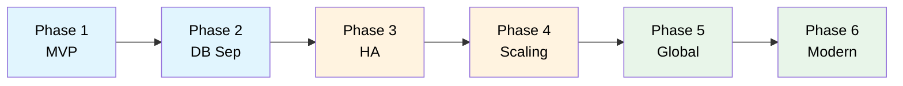

# AWS Architecture Learning Scenarios

A collection of hands-on learning scenarios for AWS Solutions Architect certification preparation.

## Available Scenarios

### [TechBooks: Scale or Fail](scenarios/techbooks/00-overview.md)

Learn AWS architecture through the journey of an online bookstore that evolves from a simple MVP to
a modern, globally-distributed application.

**Covers**: VPC, EC2, RDS, Multi-AZ, Auto Scaling, ALB, CloudFront, Route 53, Lambda, SQS,
ElastiCache

---

_More scenarios coming soon..._
