# Phase 2: Database Separation

## Business Context

**Situation:** TechBooks is growing! You're now seeing 500 visitors/day. The founder is thrilled, but you're worried.

**Problems emerging:**
- MySQL on the EC2 instance is consuming more CPU/memory
- Application performance degrades during database-heavy operations
- **You wake up at 3 AM thinking:** "What if the EC2 instance dies? We lose ALL customer orders!"
- No automated backups - you've been manually taking snapshots (when you remember)

**The founder asks:** "Can we handle Black Friday traffic? What if we lose customer data?"

**Your decision:** Separate the database to a managed service and implement proper backups.

---

## Step 1: WHY Separate the Database?

### The Monolith Problem

In Phase 1, everything runs on one EC2:

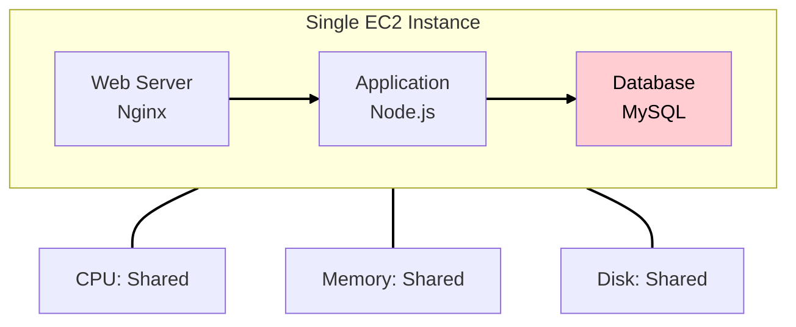

**Problems:**
| Issue | Impact |
|-------|--------|
| Resource contention | DB queries slow down web responses |
| Single point of failure | EC2 crash = everything down |
| Scaling impossible | Can't scale web and DB independently |
| Backup complexity | Must snapshot entire instance |
| Maintenance windows | Patching EC2 affects database |

### The Separated Architecture

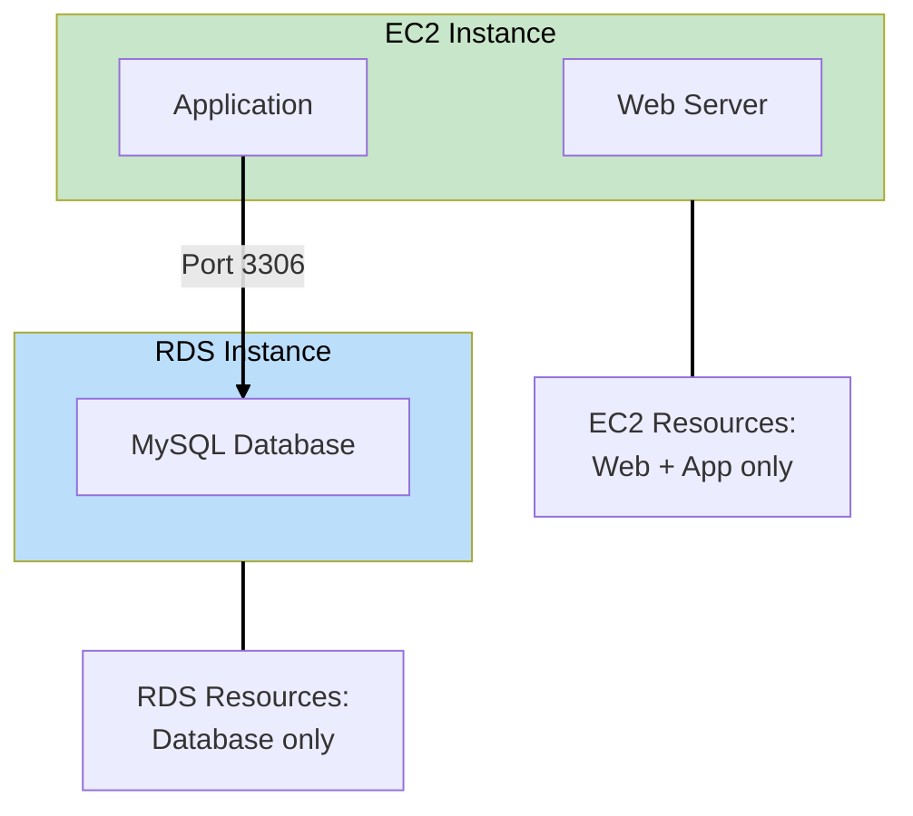

**Benefits:**
| Benefit | WHY It Matters |
|---------|---------------|
| Independent scaling | Scale web tier without touching DB |
| Managed backups | AWS handles automated backups |
| High availability options | Multi-AZ with one click |
| Security isolation | DB in private subnet, no public access |
| Maintenance flexibility | Patch EC2 without DB downtime |

---

## Step 2: WHY RDS Over Self-Managed MySQL?

### What is RDS?

**Amazon RDS (Relational Database Service)** is a managed database service. AWS handles the undifferentiated heavy lifting.

**Critical clarification:** RDS is **NOT a different database**. It runs the actual database engine you choose:

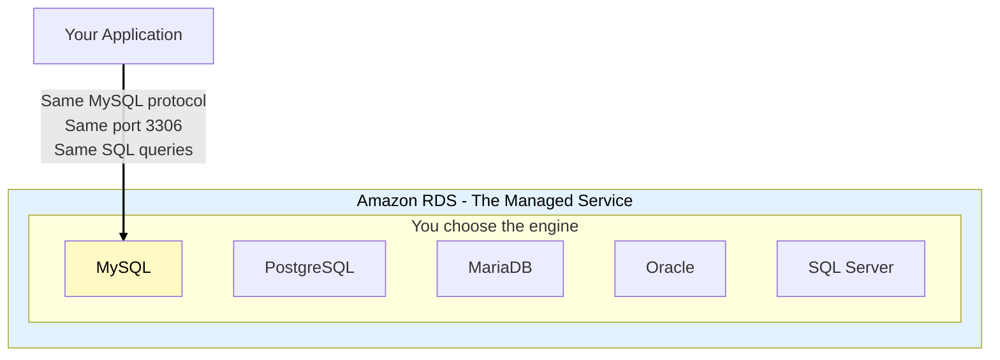

**What this means:**
- RDS MySQL **IS** MySQL - same engine, same port (3306), same SQL
- Your app connects to RDS MySQL exactly like it connected to MySQL on EC2
- Only the connection string changes: `localhost` → `techbooks-db.abc123.us-east-1.rds.amazonaws.com`
- All your MySQL knowledge, queries, and tools work exactly the same

### Self-Managed vs RDS Comparison

| Task | Self-Managed (EC2) | RDS |
|------|-------------------|-----|
| **Installation** | You do it | AWS handles |
| **Patching** | You schedule, you do | AWS handles (maintenance window) |
| **Backups** | You script, you monitor | Automated daily + transaction logs |
| **Replication** | You configure | One checkbox for Multi-AZ |
| **Failover** | You build it | Automatic (Multi-AZ) |
| **Monitoring** | You set up | CloudWatch integrated |
| **Scaling** | Stop, resize, restart | Few clicks, minimal downtime |
| **Encryption** | You configure | One checkbox |

### The Trade-off

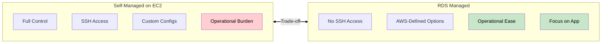

**WHY RDS for TechBooks:**
- Small team (just you!) - no time for DB operations
- Standard MySQL workload - no exotic requirements
- Need reliable backups - customer orders are critical
- Future HA needs - Multi-AZ will be easy to enable

> **SAA Exam Tip:** RDS questions often ask "which option reduces operational overhead?" RDS is almost always the answer for relational databases unless you need OS-level access or unsupported database engines.

---

## Step 3: Private Subnet for Database

### WHY Put the Database in a Private Subnet?

**Security principle:** Minimize attack surface. The database doesn't need to talk to the internet - only your application needs to reach it.

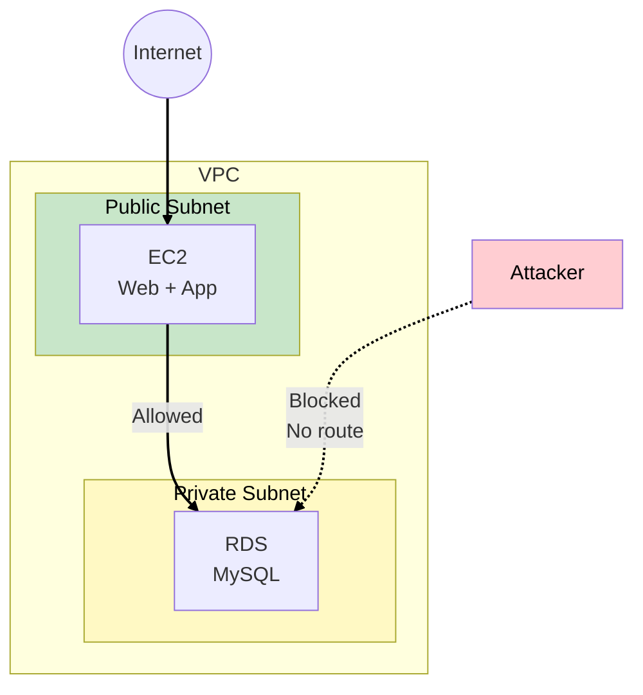

**What makes it private:**
1. No route to Internet Gateway in the route table
2. No public IP assigned
3. Only accessible from within the VPC

### Defense in Depth

Even within the private subnet, we add more protection:

| Layer | Protection |
|-------|-----------|
| **Network** | Private subnet - no internet route |
| **Security Group** | Only allow port 3306 from EC2's security group |
| **RDS Settings** | "Publicly Accessible" = No |
| **Encryption** | Encryption at rest + in transit |

> **SAA Exam Tip:** "Defense in depth" is a common theme. Multiple layers of security is always better than relying on one.

---

## Step 4: NAT Gateway - Internet Access for Private Subnets

### The Problem

Your RDS instance is in a private subnet (good for security), but what if it needs to reach the internet?

**Use cases:**
- RDS doesn't need internet, but other private resources might
- Lambda functions in private subnets
- EC2 instances that shouldn't be publicly accessible but need to download updates

### What is a NAT Gateway?

**NAT (Network Address Translation) Gateway** allows resources in private subnets to initiate outbound connections to the internet while preventing inbound connections.

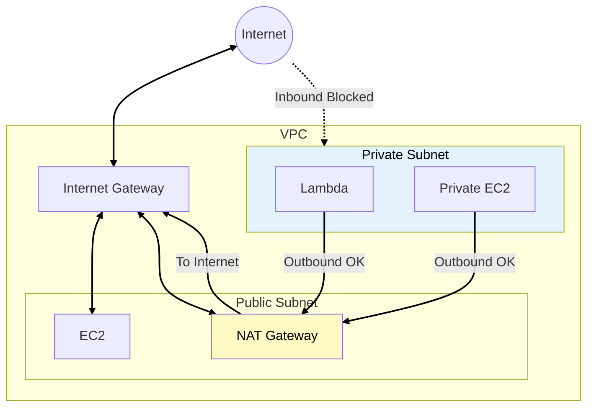

### NAT Gateway vs NAT Instance

| Feature | NAT Gateway | NAT Instance |
|---------|-------------|--------------|
| **Managed by** | AWS | You |
| **Availability** | Highly available in AZ | You manage failover |
| **Bandwidth** | Up to 100 Gbps | Depends on instance type |
| **Maintenance** | None | Patching, monitoring |
| **Cost** | ~$32/month + data | Instance cost + data |
| **Security Groups** | Not supported | Supported |

**WHY NAT Gateway:**
- AWS manages everything
- Automatically scales bandwidth
- Highly available within an AZ

> **SAA Exam Tip:** NAT Gateway is the recommended approach. NAT Instance is legacy but may appear in exam questions about cost optimization (NAT Instance can be cheaper for very low traffic).

### Cost Consideration

NAT Gateway is one of the more expensive networking components:
- **Hourly charge:** ~$0.045/hour (~$32/month)
- **Data processing:** $0.045/GB

**For Phase 2:** We'll create the private subnet but won't deploy NAT Gateway yet since RDS doesn't need internet access. We'll add it in a later phase when we have Lambda or other private resources that need outbound internet.

---

## Step 5: DB Subnet Group

### WHY Does RDS Need Multiple Subnets?

RDS requires a **DB Subnet Group** - a collection of subnets in at least 2 Availability Zones.

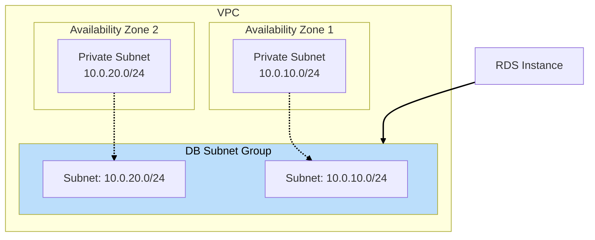

**WHY this requirement:**
- Even for Single-AZ deployments, AWS wants the option to fail over
- Future Multi-AZ enablement requires subnets in multiple AZs
- AWS places your DB in one of the subnets you specify

> **SAA Exam Tip:** You cannot create an RDS instance without a DB Subnet Group spanning at least 2 AZs. This is a common "why did my deployment fail?" troubleshooting question.

---

## Step 6: Security Group for RDS

### Referencing Security Groups

Instead of allowing specific IP addresses, we reference the EC2's security group. This is more maintainable and secure.

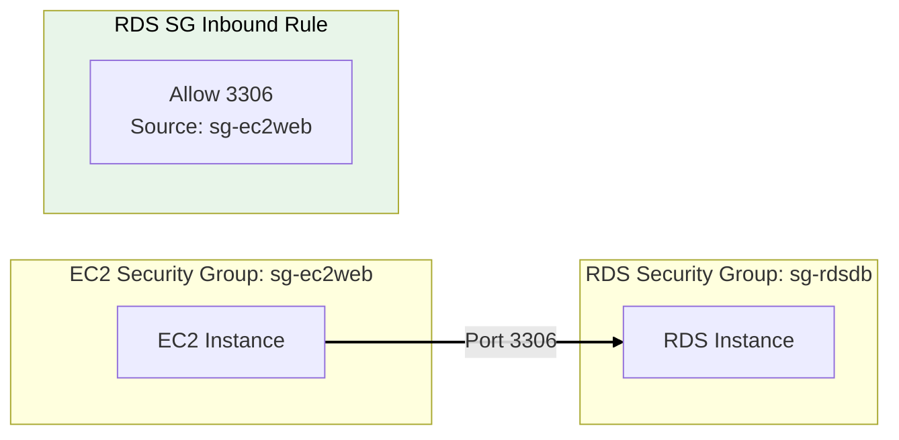

**WHY reference security groups instead of IPs:**

| Approach | Problem |
|----------|---------|
| Allow specific IP (10.0.1.10) | IP changes if EC2 is replaced |
| Allow subnet CIDR (10.0.1.0/24) | Too broad - any instance in subnet can connect |
| Allow security group (sg-ec2web) | Only instances with that SG can connect |

### Security Group Rules for TechBooks

**EC2 Security Group (sg-techbooks-web):**
```
Inbound:
- HTTP (80) from 0.0.0.0/0
- HTTPS (443) from 0.0.0.0/0
- SSH (22) from YOUR_IP/32

Outbound:
- All traffic to 0.0.0.0/0
```

**RDS Security Group (sg-techbooks-db):**
```
Inbound:
- MySQL (3306) from sg-techbooks-web

Outbound:
- None needed (stateful - responses auto-allowed)
```

### WHY Port 3306?

Each database engine has its standard port. RDS uses the same ports because it runs the actual engine:

| RDS Engine | Default Port | WHY This Port |
|------------|--------------|---------------|
| **MySQL** | 3306 | MySQL's standard port since 1995 |
| **PostgreSQL** | 5432 | PostgreSQL's standard port |
| **MariaDB** | 3306 | MySQL-compatible, same port |
| **Oracle** | 1521 | Oracle's standard port |
| **SQL Server** | 1433 | Microsoft's standard port |

**The connection flow:**

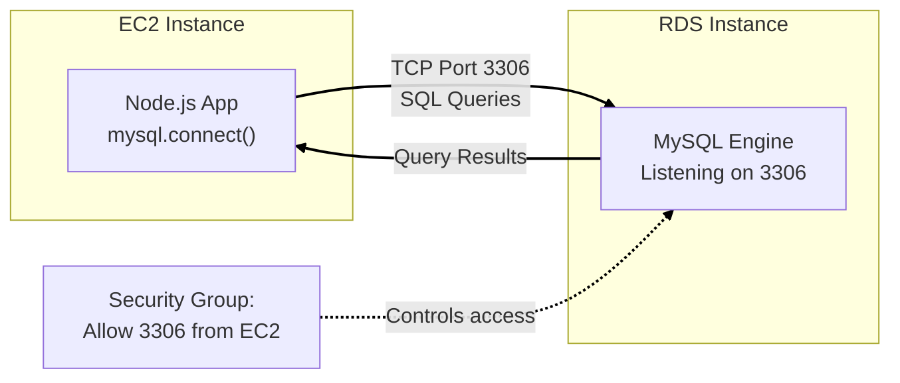

**Before (Phase 1):**
```javascript
// Connecting to MySQL on same EC2
const db = mysql.createConnection({
  host: 'localhost',      // Same machine
  port: 3306,
  user: 'techbooks',
  password: '***',
  database: 'techbooks'
});
```

**After (Phase 2):**
```javascript
// Connecting to RDS MySQL - only host changes!
const db = mysql.createConnection({
  host: 'techbooks-db.abc123.us-east-1.rds.amazonaws.com',  // RDS endpoint
  port: 3306,             // Same port!
  user: 'techbooks',      // Same credentials
  password: '***',
  database: 'techbooks'   // Same database
});
```

The application code barely changes - you're still talking to MySQL, just running on AWS-managed infrastructure instead of your EC2.

> **SAA Exam Tip:** Security groups are stateful. If you allow inbound traffic, the response is automatically allowed outbound. This is different from NACLs which are stateless.

---

## Step 7: RDS Configuration Choices

### Instance Class

Similar to EC2, RDS has instance classes:

```
db.t3.micro
│  │   │
│  │   └── Size: micro
│  └────── Generation: 3rd gen
└───────── Family: T = burstable
```

**Common RDS families:**
| Family | Use Case |
|--------|----------|
| **db.t3/t4g** | Burstable, dev/test, small production |
| **db.m5/m6g** | General purpose production |
| **db.r5/r6g** | Memory optimized (large datasets) |
| **db.x1/x2** | Extreme memory |

**For TechBooks Phase 2:** `db.t3.micro` (Free Tier eligible)

### Storage

| Type | IOPS | Use Case | Cost |
|------|------|----------|------|
| **gp2** | Burstable, 3 IOPS/GB | General purpose | $ |
| **gp3** | Configurable baseline | General purpose (newer) | $ |
| **io1/io2** | Provisioned, up to 256K | High performance | $$$ |
| **magnetic** | Legacy | Don't use | $ |

**WHY gp3 over gp2:**
- gp3: 3,000 IOPS baseline regardless of size
- gp2: 100 IOPS for 33GB, need 1TB for 3,000 IOPS
- gp3 is cheaper and more predictable

> **SAA Exam Tip:** gp3 is the recommended default for new deployments. Questions about "cost-effective storage with consistent performance" → gp3.

---

## Step 8: Automated Backups

### RDS Backup Strategy

RDS provides two backup mechanisms:

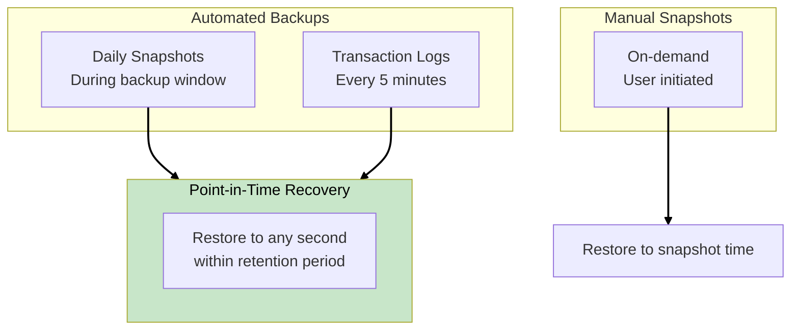

### Backup Configuration

| Setting | Our Choice | WHY |
|---------|-----------|-----|
| **Retention Period** | 7 days | Balance cost vs recovery options |
| **Backup Window** | 03:00-04:00 UTC | Low traffic period |
| **Multi-AZ** | No (Phase 2) | Cost savings for now |

### Recovery Concepts (Exam Important!)

| Term | Definition | Example |
|------|------------|---------|
| **RPO** (Recovery Point Objective) | Max acceptable data loss | "We can lose up to 5 minutes of data" |
| **RTO** (Recovery Time Objective) | Max acceptable downtime | "We need to be back up in 1 hour" |

**TechBooks RPO/RTO:**
- RPO: 5 minutes (transaction log frequency)
- RTO: ~30 minutes (time to restore from snapshot)

> **SAA Exam Tip:** Automated backups allow point-in-time recovery. Manual snapshots only restore to the exact snapshot time. Know the difference!

---

## Phase 2 Complete Architecture

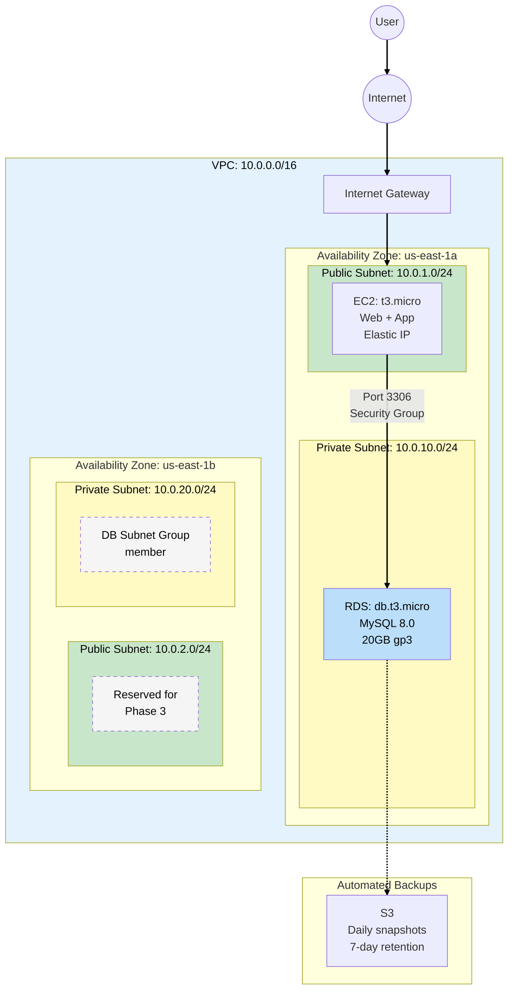

---

## Key SAA Exam Concepts from Phase 2

### Must-Know Topics

1. **RDS Fundamentals**
   - Managed service reduces operational overhead
   - Cannot SSH into RDS instances
   - DB Subnet Group requires 2+ AZs

2. **Private Subnets**
   - No route to IGW = private
   - Use for databases, internal services
   - NAT Gateway for outbound internet (if needed)

3. **Security Groups**
   - Reference other security groups (not just IPs)
   - Stateful - return traffic auto-allowed
   - RDS SG should only allow app tier

4. **Storage**
   - gp3 > gp2 for most cases
   - io1/io2 for high-performance needs

5. **Backups**
   - Automated: daily + transaction logs
   - Point-in-time recovery up to retention period
   - Know RPO and RTO concepts

---

## What's Coming in Phase 3?

**Business trigger:** TechBooks is featured on a tech podcast! Traffic spikes to 5,000 visitors/day. Your single EC2 can't keep up, and you're terrified of downtime.

**Next decisions:**
- Enable RDS Multi-AZ for database high availability
- Prepare for EC2 redundancy
- Understand Availability Zones deeply

---

## Hands-On Challenge

Before moving to Phase 3:

1. Create private subnets in both AZs (10.0.10.0/24 and 10.0.20.0/24)
2. Create a DB Subnet Group with both private subnets
3. Create an RDS security group allowing MySQL from your EC2's security group
4. Launch an RDS MySQL instance (db.t3.micro, 20GB gp3)
5. Update your application to connect to RDS instead of local MySQL
6. Verify automated backups are enabled

**Verification:** Connect to your EC2 and run `mysql -h <rds-endpoint> -u admin -p` to verify connectivity.
