# Phase 6: Modernization

## Business Context

**Situation:** TechBooks is now profitable! Monthly revenue has grown 5x since launch. The founder wants to reduce AWS costs and add new features. The development team has grown from 1 to 5 engineers.

**New feature requests:**
- User book reviews with image uploads
- Email notifications (order confirmation, shipping updates)
- "Customers also bought" recommendations
- Search autocomplete

**Problems identified:**
- EC2 instances run 24/7 but traffic is spiky (80% idle at night)
- Database queries are slow during traffic spikes
- Session data lost when instances scale down
- Monolithic app is hard to deploy quickly

**The founder asks:** "Can we reduce costs AND ship features faster?"

**Your decision:** Adopt serverless components, add caching, and decouple the architecture.

---

## Step 1: Why Modernize?

### The Current Architecture's Limitations

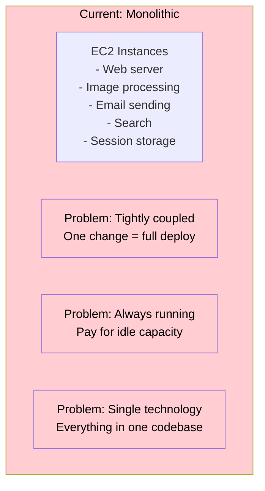

### The Modernization Approach

We won't rewrite everything. We'll **extract specific functions** to serverless while keeping the core application on EC2.

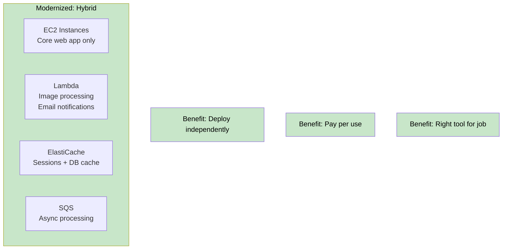

> **SAA Exam Tip:** Modernization doesn't mean "rewrite in serverless." It means using the right service for each workload. Keep steady-state workloads on EC2, move event-driven workloads to Lambda.

---

## Step 2: AWS Lambda Fundamentals

### What is Lambda?

**AWS Lambda** runs code without provisioning servers. You pay only when code executes.

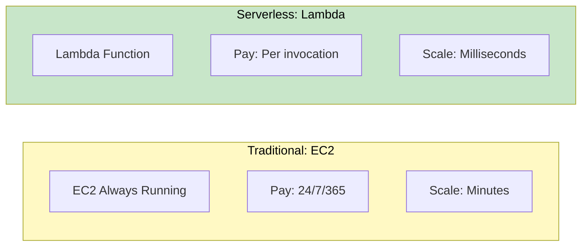

### Lambda Key Concepts

| Concept | Description | Limit |
|---------|-------------|-------|
| **Function** | Your code + configuration | N/A |
| **Runtime** | Language (Python, Node.js, etc.) | 12+ supported |
| **Handler** | Entry point function | N/A |
| **Memory** | Allocated RAM (CPU scales with it) | 128 MB - 10 GB |
| **Timeout** | Maximum execution time | 15 minutes |
| **Concurrency** | Parallel executions | 1000 default (soft) |

### Lambda Execution Model

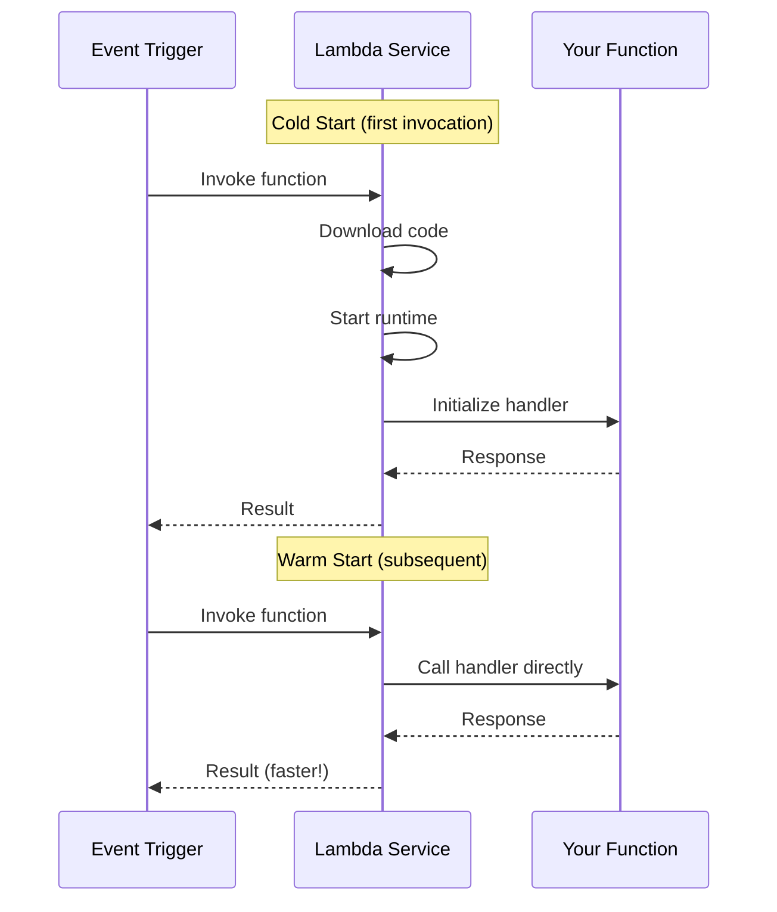

### Cold Starts

| Factor | Impact on Cold Start |
|--------|---------------------|
| **Memory size** | More memory = faster init |
| **Code size** | Smaller = faster download |
| **Runtime** | Python/Node.js faster than Java |
| **VPC** | VPC adds 1-2 seconds (improved but still slower) |

> **SAA Exam Tip:** Lambda in VPC used to have significant cold start penalties. AWS improved this with Hyperplane ENIs, but there's still some overhead. Only put Lambda in VPC if it needs to access VPC resources.

---

## Step 3: Lambda Use Cases for TechBooks

### 1. Image Processing for Book Reviews

Users upload review images. We need to resize them for display.

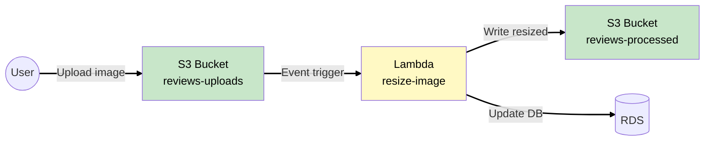

**WHY Lambda for this?**
- Event-driven (triggered by upload)
- Variable traffic (depends on reviews)
- Stateless (each image is independent)
- Short-lived (seconds to process)

### 2. Email Notifications

Send order confirmations and shipping updates.

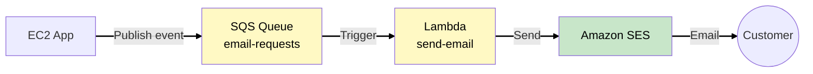

**WHY Lambda + SQS?**
- Decoupled (app doesn't wait for email to send)
- Retries built-in (SQS retries on failure)
- Scalable (handles Black Friday spike)
- Cost-effective (no idle servers)

### 3. Search Index Updates

When product data changes, update search index.

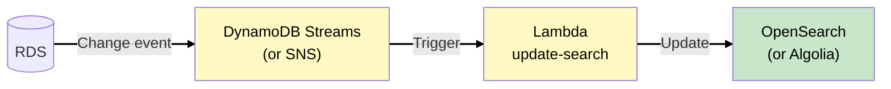

### Lambda vs EC2 Decision Framework

| Characteristic | Use Lambda | Use EC2 |
|----------------|-----------|---------|
| Execution time | < 15 minutes | > 15 minutes |
| Traffic pattern | Spiky, unpredictable | Steady, predictable |
| State | Stateless | Stateful |
| Startup time | Tolerant of cold starts | Needs instant response |
| Cost at high volume | Expensive | Cheaper |

> **SAA Exam Tip:** Lambda is cost-effective for variable workloads. For steady, high-volume workloads (millions of requests/hour), EC2 or Fargate may be cheaper.

---

## Step 4: Lambda in VPC

### WHY Put Lambda in VPC?

Some Lambdas need to access VPC resources:

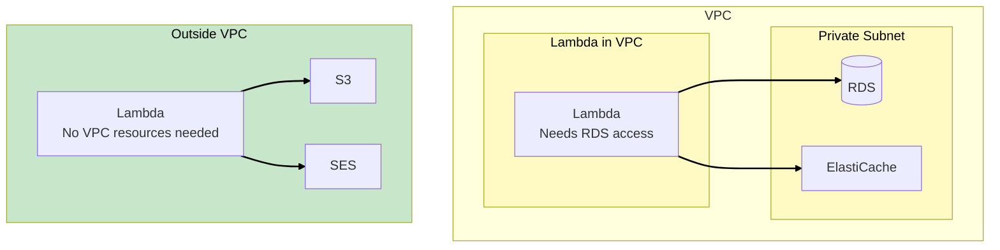

### Lambda VPC Configuration

| Setting | Purpose |
|---------|---------|
| **Subnets** | Lambda runs ENIs in these subnets |
| **Security Groups** | Controls Lambda's network access |
| **NAT Gateway** | Required for internet access from private subnet |

### Internet Access from VPC Lambda

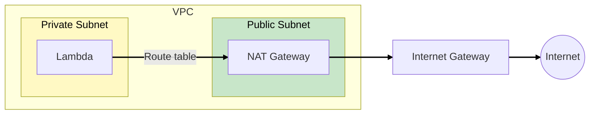

> **SAA Exam Tip:** Lambda in VPC needs NAT Gateway for internet access. This adds cost (~$32/month per NAT Gateway). Consider VPC endpoints for AWS services instead.

---

## Step 5: Amazon SQS for Decoupling

### What is SQS?

**Simple Queue Service (SQS)** is a fully managed message queue. It decouples components so they can fail independently.

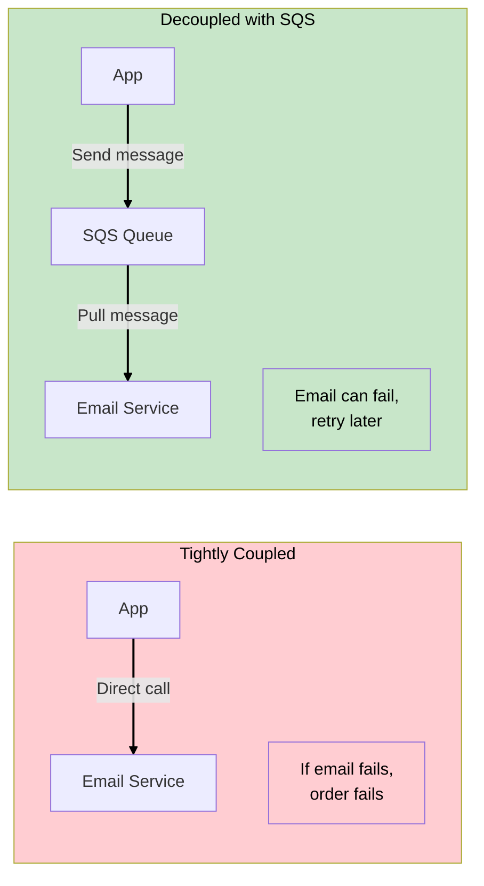

### SQS Queue Types

| Type | Use Case | Ordering | Throughput |
|------|----------|----------|------------|
| **Standard** | High throughput, at-least-once | Best effort | Unlimited |
| **FIFO** | Strict order required | Guaranteed | 3000 msg/sec (with batching) |

### SQS Key Concepts

| Concept | Description | Default |
|---------|-------------|---------|
| **Visibility Timeout** | Time message is hidden after read | 30 seconds |
| **Retention Period** | How long messages are kept | 4 days (max 14) |
| **Dead Letter Queue** | Queue for failed messages | Optional |
| **Long Polling** | Wait for messages (reduces API calls) | 0 seconds |

### TechBooks Email Flow with SQS

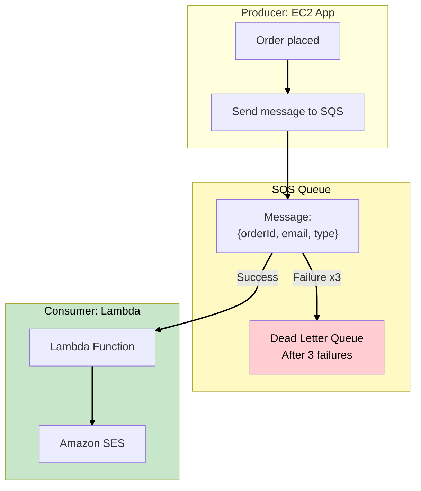

> **SAA Exam Tip:** Always configure Dead Letter Queues for SQS. They capture failed messages for debugging. Set `maxReceiveCount` to define retry attempts before moving to DLQ.

---

## Step 6: Amazon ElastiCache

### What is ElastiCache?

**ElastiCache** is a managed in-memory cache. It supports Redis and Memcached.

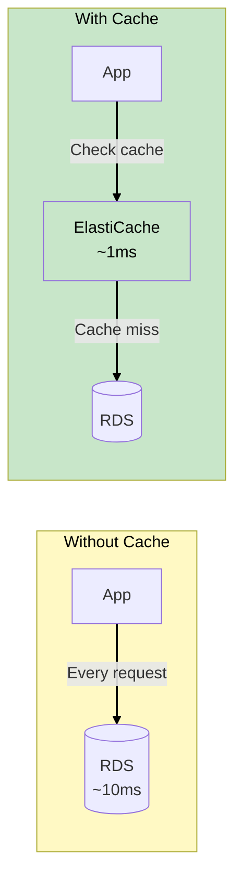

### Redis vs Memcached

| Feature | Redis | Memcached |
|---------|-------|-----------|
| **Data structures** | Strings, lists, sets, hashes | Strings only |
| **Persistence** | Yes (snapshots, AOF) | No |
| **Replication** | Yes (read replicas) | No |
| **Multi-AZ** | Yes (automatic failover) | No |
| **Pub/Sub** | Yes | No |
| **Use case** | Complex caching, sessions | Simple caching |

### TechBooks Caching Strategy

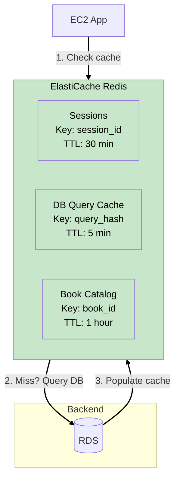

### Caching Patterns

#### Cache-Aside (Lazy Loading)

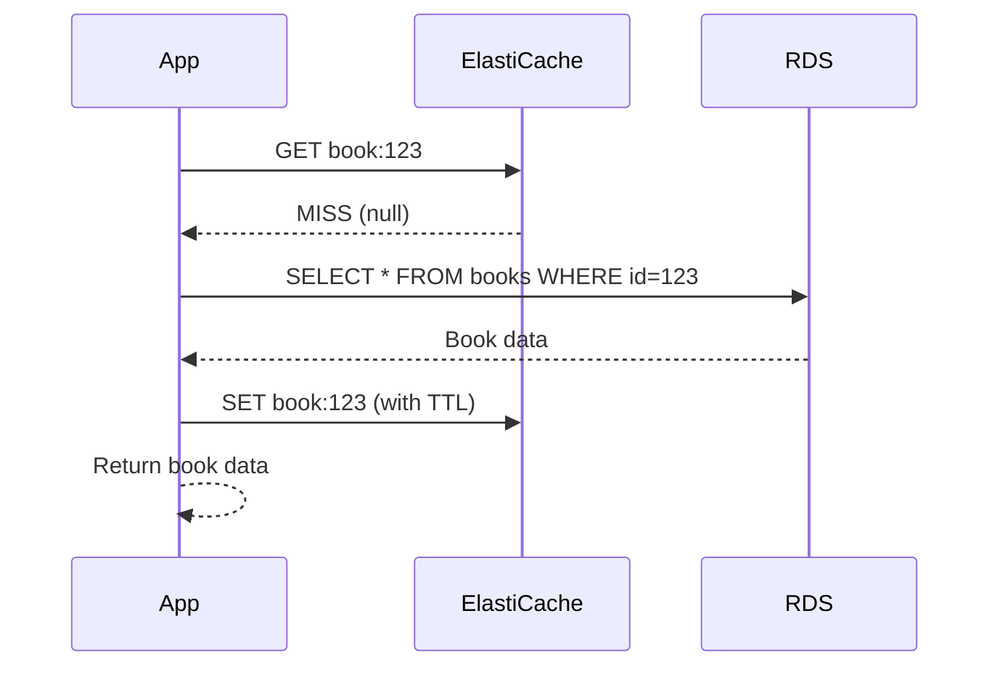

#### Write-Through

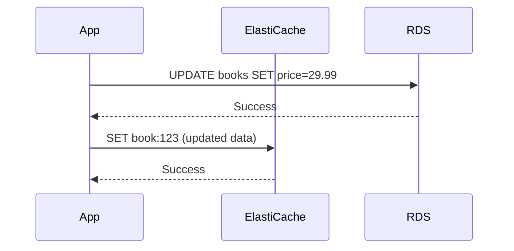

### Session Storage with ElastiCache

**Problem:** When ASG scales down, sessions on terminated instances are lost.

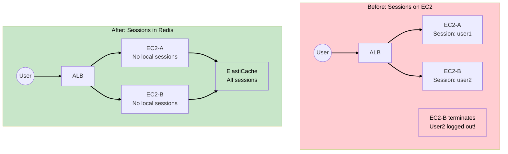

> **SAA Exam Tip:** For stateless applications with Auto Scaling, externalize session storage to ElastiCache Redis or DynamoDB. This enables seamless scale-in/out.

---

## Step 7: ElastiCache Architecture

### ElastiCache in VPC

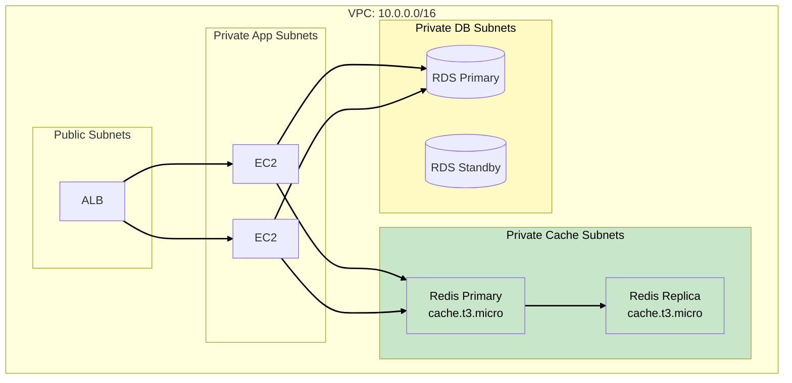

### ElastiCache Security Group

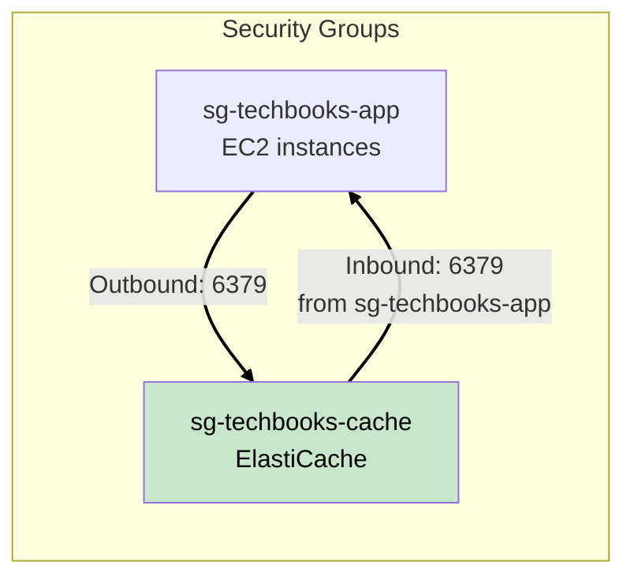

| Security Group | Direction | Port | Source/Dest | Purpose |
|----------------|-----------|------|-------------|---------|
| sg-techbooks-cache | Inbound | 6379 | sg-techbooks-app | Redis from EC2 |

> **SAA Exam Tip:** ElastiCache is VPC-only. It has no public endpoints. Always reference Security Groups instead of IP addresses for dynamic environments.

---

## Step 8: S3 for User Uploads

### Upload Flow Design

Users upload book review images. We need secure, scalable uploads.

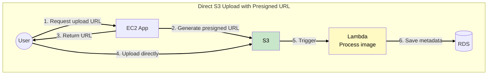

### WHY Presigned URLs?

| Direct to EC2 | Presigned URL to S3 |
|---------------|---------------------|
| EC2 handles upload | S3 handles upload |
| Limited bandwidth | Unlimited bandwidth |
| Pay for EC2 time | Pay only S3 storage |
| Complex to scale | Auto-scales |

### Presigned URL Flow

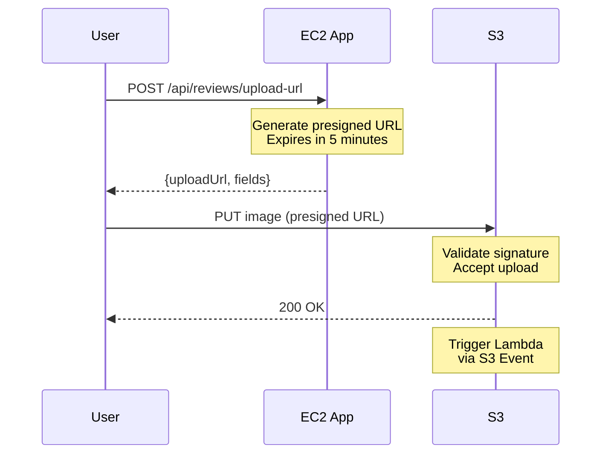

### S3 Bucket Configuration

| Setting | Value | Purpose |
|---------|-------|---------|
| **Bucket name** | techbooks-user-uploads | User-uploaded content |
| **Versioning** | Enabled | Recovery from accidental deletes |
| **Encryption** | SSE-S3 | Encrypt at rest |
| **Lifecycle** | Move to IA after 90 days | Cost optimization |
| **CORS** | Allow *.techbooks.com | Browser uploads |

> **SAA Exam Tip:** Presigned URLs allow secure, temporary access to private S3 objects. They can be for upload (PUT) or download (GET). Expiration time is configurable.

---

## Step 9: Event-Driven Architecture

### Putting It Together

```mermaid
flowchart TB
    User((User))

    subgraph Sync["Synchronous: User-Facing"]
        CloudFront["CloudFront"]
        ALB["ALB"]
        EC2["EC2 App"]
        ElastiCache["ElastiCache"]
        RDS[("RDS")]
    end

    subgraph Async["Asynchronous: Background"]
        S3["S3 Uploads"]
        SQS["SQS Queues"]
        Lambda1["Lambda<br>Image Resize"]
        Lambda2["Lambda<br>Send Email"]
        SES["SES"]
    end

    User --> CloudFront --> ALB --> EC2
    EC2 <--> ElastiCache
    EC2 <--> RDS
    EC2 -->|"Presigned URL"| S3
    S3 -->|"S3 Event"| Lambda1
    EC2 -->|"Send message"| SQS
    SQS -->|"Trigger"| Lambda2
    Lambda2 --> SES

    style Sync fill:#e3f2fd,color:#000
    style Async fill:#fff9c4,color:#000
    linkStyle default stroke:#000,stroke-width:2px
```

### Benefits of Event-Driven

| Benefit | How |
|---------|-----|
| **Resilience** | Failed email doesn't break checkout |
| **Scalability** | Lambda auto-scales with queue depth |
| **Cost** | Pay only when processing |
| **Speed** | User doesn't wait for background tasks |

---

## Step 10: Cost Optimization

### Current Spending Analysis

After Phase 5, TechBooks spends approximately:

| Component | Monthly Cost | Usage Pattern |
|-----------|--------------|---------------|
| EC2 (t3.small x2) | ~$30 | On-Demand, 24/7 |
| RDS Multi-AZ | ~$50 | On-Demand, 24/7 |
| ALB | ~$20 | 24/7 |
| CloudFront | ~$15 | Variable |
| S3 | ~$5 | Variable |
| NAT Gateway | ~$35 | 24/7 |
| **Total** | ~$155 | |

### Savings Opportunities

```mermaid
flowchart TB
    subgraph Savings["Cost Optimization Options"]
        RI["Reserved Instances<br>1-3 year commitment<br>Up to 72% savings"]
        SP["Savings Plans<br>Flexible commitment<br>Up to 66% savings"]
        Spot["Spot Instances<br>For non-critical workloads<br>Up to 90% savings"]
        Right["Right-sizing<br>Match instance to workload<br>Variable savings"]
    end

    style RI fill:#c8e6c9,color:#000
    style SP fill:#c8e6c9,color:#000
    style Spot fill:#fff9c4,color:#000
    style Right fill:#fff9c4,color:#000
    linkStyle default stroke:#000,stroke-width:2px
```

### Reserved Instances vs Savings Plans

| Feature | Reserved Instances | Savings Plans |
|---------|-------------------|---------------|
| **Commitment** | Specific instance type | $/hour spend |
| **Flexibility** | Limited (RI exchange) | High (any instance) |
| **Services** | EC2, RDS, ElastiCache | EC2, Fargate, Lambda |
| **Discount** | Up to 72% | Up to 66% |
| **Best for** | Predictable workloads | Changing workloads |

### TechBooks Optimization Plan

| Component | Current | Optimized | Savings |
|-----------|---------|-----------|---------|
| EC2 | On-Demand $30 | 1yr RI $15 | 50% |
| RDS | On-Demand $50 | 1yr RI $30 | 40% |
| ElastiCache | On-Demand $25 | 1yr RI $15 | 40% |
| **Compute Total** | $105 | $60 | ~$45/month |

### Additional Optimizations

| Optimization | Potential Savings |
|--------------|-------------------|
| **S3 Intelligent-Tiering** | Auto-moves cold data |
| **S3 Lifecycle policies** | Delete old versions |
| **CloudFront caching** | Reduce origin requests |
| **Lambda right-sizing** | Match memory to needs |
| **NAT Gateway review** | Use VPC endpoints |

> **SAA Exam Tip:** For steady-state workloads, Reserved Instances provide the best savings. For flexible/changing workloads, use Savings Plans. Spot Instances are best for fault-tolerant, stateless workloads.

---

## Step 11: VPC Endpoints (Cost Optimization)

### The NAT Gateway Cost Problem

```mermaid
flowchart LR
    subgraph VPC["VPC"]
        subgraph Private["Private Subnet"]
            Lambda["Lambda"]
            EC2["EC2"]
        end
        NAT["NAT Gateway<br>$32/month + data"]
    end

    Lambda -->|"S3 API call"| NAT
    EC2 -->|"SQS API call"| NAT
    NAT --> Internet((Internet)) --> AWS["S3, SQS, etc."]

    style NAT fill:#ffcdd2,color:#000
    linkStyle default stroke:#000,stroke-width:2px
```

**Problem:** Traffic to AWS services goes through NAT Gateway, costing $0.045/GB.

### Solution: VPC Endpoints

```mermaid
flowchart LR
    subgraph VPC["VPC"]
        subgraph Private["Private Subnet"]
            Lambda["Lambda"]
            EC2["EC2"]
        end
        GWEndpoint["Gateway Endpoint<br>S3, DynamoDB<br>FREE"]
        IFEndpoint["Interface Endpoint<br>SQS, SES, etc.<br>~$7/month each"]
    end

    Lambda -->|"S3"| GWEndpoint --> S3["S3"]
    EC2 -->|"SQS"| IFEndpoint --> SQS["SQS"]

    style GWEndpoint fill:#c8e6c9,color:#000
    style IFEndpoint fill:#fff9c4,color:#000
    linkStyle default stroke:#000,stroke-width:2px
```

### Endpoint Types

| Type | Services | Cost | How It Works |
|------|----------|------|--------------|
| **Gateway** | S3, DynamoDB | Free | Route table entry |
| **Interface** | Most others | ~$7/month | ENI in subnet |

> **SAA Exam Tip:** Gateway endpoints are FREE for S3 and DynamoDB. Always create them to avoid NAT Gateway data charges. Interface endpoints cost money but may still be cheaper than NAT for high-traffic services.

---

## Phase 6 Complete Architecture

```mermaid
flowchart TB
    User((User))

    User --> R53["Route 53<br>techbooks.com"]
    R53 --> CloudFront["CloudFront"]

    CloudFront --> S3Static["S3 Static<br>Assets"]
    CloudFront --> ALB

    subgraph VPC["VPC: 10.0.0.0/16"]
        ALB["ALB"]

        subgraph AppLayer["Application Layer"]
            EC2a["EC2"]
            EC2b["EC2"]
        end

        subgraph CacheLayer["Cache Layer"]
            Redis["ElastiCache<br>Redis"]
        end

        subgraph DataLayer["Data Layer"]
            RDSPrimary[("RDS Primary")]
            RDSStandby[("RDS Standby")]
        end

        subgraph Endpoints["VPC Endpoints"]
            S3EP["S3 Endpoint"]
            SQSEP["SQS Endpoint"]
        end
    end

    ALB --> EC2a & EC2b
    EC2a & EC2b --> Redis
    EC2a & EC2b --> RDSPrimary
    RDSPrimary <--> RDSStandby

    subgraph Serverless["Serverless Components"]
        S3Uploads["S3 Uploads"]
        SQS["SQS Queue"]
        LambdaImg["Lambda<br>Image Processing"]
        LambdaEmail["Lambda<br>Email"]
        SES["SES"]
    end

    EC2a -->|"Presigned URL"| S3Uploads
    S3Uploads -->|"Event"| LambdaImg
    EC2a -->|"Message"| SQS
    SQS --> LambdaEmail
    LambdaEmail --> SES

    style VPC fill:#e3f2fd,color:#000
    style AppLayer fill:#c8e6c9,color:#000
    style CacheLayer fill:#c8e6c9,color:#000
    style DataLayer fill:#fff9c4,color:#000
    style Serverless fill:#fff9c4,color:#000
    style Endpoints fill:#e8f5e9,color:#000
    linkStyle default stroke:#000,stroke-width:2px
```

---

## Key SAA Exam Concepts from Phase 6

### Lambda

- Runs code without servers, pay per invocation
- 15-minute max timeout, 10GB max memory
- Cold starts affect latency (especially in VPC)
- Use for event-driven, unpredictable workloads
- VPC Lambda needs NAT Gateway for internet access

### SQS

- Managed message queue for decoupling
- Standard (best-effort order, unlimited throughput) vs FIFO (strict order, 3000 msg/sec)
- Dead Letter Queues capture failed messages
- Visibility Timeout hides messages during processing

### ElastiCache

- In-memory cache: Redis (feature-rich) vs Memcached (simple)
- Redis supports persistence, replication, Multi-AZ
- Cache-aside pattern: check cache → miss → query DB → populate cache
- Externalize sessions for stateless applications

### Cost Optimization

- Reserved Instances: up to 72% savings, commit to specific instance
- Savings Plans: up to 66% savings, flexible commitment
- Gateway Endpoints: FREE for S3/DynamoDB
- Interface Endpoints: ~$7/month per service, avoids NAT charges

---

## Final Cost Comparison

| Phase | Monthly Cost | What's Included |
|-------|--------------|-----------------|
| Phase 1 (MVP) | ~$15 | 1 EC2, EIP |
| Phase 2 (RDS) | ~$45 | + RDS, NAT Gateway |
| Phase 3 (HA) | ~$70 | + Multi-AZ RDS |
| Phase 4 (Scaling) | ~$85 | + ALB, ASG |
| Phase 5 (Global) | ~$105 | + CloudFront, S3 |
| Phase 6 (Modern) | ~$130 | + ElastiCache, Lambda, SQS |
| Phase 6 (Optimized) | ~$95 | With Reserved Instances |

---

## TechBooks Journey Complete

```mermaid
flowchart LR
    P1["Phase 1<br>Single EC2<br>MVP"] --> P2["Phase 2<br>EC2 + RDS<br>DB Separation"]
    P2 --> P3["Phase 3<br>Multi-AZ<br>HA Setup"]
    P3 --> P4["Phase 4<br>Auto Scaling<br>ALB"]
    P4 --> P5["Phase 5<br>CloudFront<br>Global"]
    P5 --> P6["Phase 6<br>Serverless<br>Modern"]

    style P1 fill:#e1f5fe,color:#000
    style P2 fill:#e1f5fe,color:#000
    style P3 fill:#fff3e0,color:#000
    style P4 fill:#fff3e0,color:#000
    style P5 fill:#e8f5e9,color:#000
    style P6 fill:#c8e6c9,color:#000
    linkStyle default stroke:#000,stroke-width:2px
```

### What We Learned

| Phase | Key Services | Key Concepts |
|-------|--------------|--------------|
| 1 | VPC, EC2, SG | Networking, compute basics |
| 2 | RDS, NAT GW | Managed services, private subnets |
| 3 | Multi-AZ | High availability, failover |
| 4 | ALB, ASG | Horizontal scaling, load balancing |
| 5 | CloudFront, Route 53 | CDN, DNS, global distribution |
| 6 | Lambda, SQS, ElastiCache | Serverless, decoupling, caching |

### SAA Exam Domains Covered

| Domain | Topics |
|--------|--------|
| **Secure Architectures** | VPC, Security Groups, OAC, private subnets |
| **Resilient Architectures** | Multi-AZ, Auto Scaling, SQS decoupling |
| **High-Performing** | CloudFront, ElastiCache, Lambda |
| **Cost-Optimized** | Reserved Instances, Savings Plans, VPC Endpoints |

---

## What's Next?

TechBooks is now a modern, scalable, globally distributed e-commerce platform. Future enhancements could include:

- **Multi-Region**: Active-active across regions (DynamoDB Global Tables, Route 53 failover)
- **Containers**: Migrate to ECS/EKS for better deployment consistency
- **Machine Learning**: Personalized recommendations with Amazon Personalize
- **Analytics**: Real-time analytics with Kinesis and QuickSight
- **Security**: AWS WAF, Shield Advanced, GuardDuty

But that's for another scenario!
