# Phase 5: Going Global

## Business Context

**Situation:** TechBooks is expanding internationally! The marketing team ran campaigns in Europe and Asia, and orders are coming in from around the world.

**Problems reported:**
- European customers: "Your site takes 4 seconds to load"
- Asian customers: "Images load slowly, checkout times out"
- US customers: "Site is fine for me" (origin is in us-east-1)

**Data you gathered:**
| Region | Latency to us-east-1 | User Experience |
|--------|---------------------|-----------------|
| US East | ~20ms | Great |
| US West | ~80ms | Good |
| Europe | ~120ms | Acceptable |
| Asia | ~250ms | Poor |

**The founder asks:** "Can we make the site fast for everyone, everywhere?"

**Your decision:** Implement CloudFront CDN and optimize DNS with Route 53.

---

## Step 1: Why Is It Slow?

### The Physics Problem

Every HTTP request travels to your origin in Virginia (us-east-1). The speed of light is fast, but not instant.

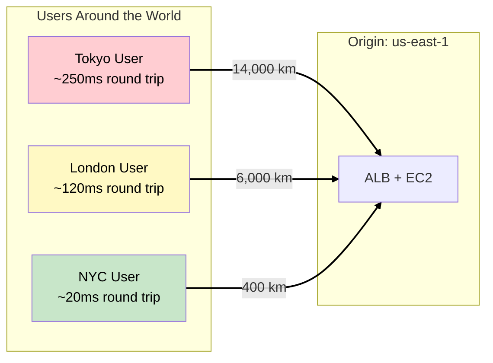

### The Real Impact

A typical page load:
- HTML document: 1 request
- CSS files: 3 requests
- JavaScript: 5 requests
- Images: 20 requests
- Fonts: 2 requests
- **Total: ~30 requests**

Each request from Tokyo = ~250ms. Even with parallel requests, this adds up to seconds of latency.

> **SAA Exam Tip:** Latency-sensitive applications need content served from locations close to users. This is the core problem CDNs solve.

---

## Step 2: Content Delivery Network (CDN) Concept

### What is a CDN?

A **Content Delivery Network** caches content at edge locations around the world, serving users from the nearest location.

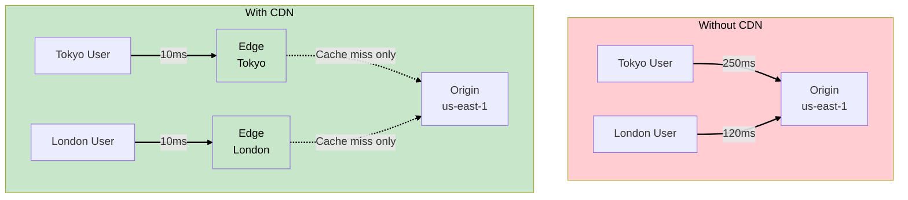

### How Caching Works

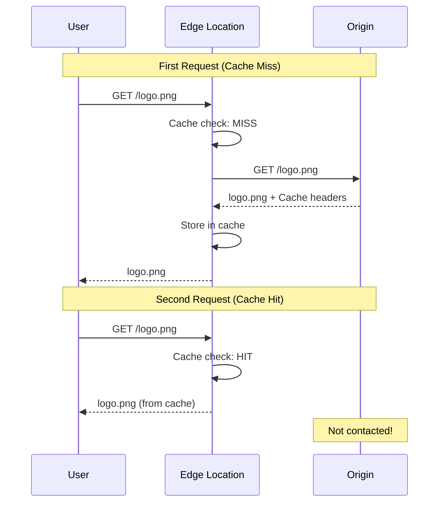

**Benefits:**
- Lower latency (content closer to users)
- Reduced origin load (cached content doesn't hit origin)
- Better availability (edge can serve cached content if origin is down)
- DDoS protection (distributed across edge locations)

---

## Step 3: Amazon CloudFront

### What is CloudFront?

**Amazon CloudFront** is AWS's CDN service with 450+ edge locations in 90+ cities across 49 countries.

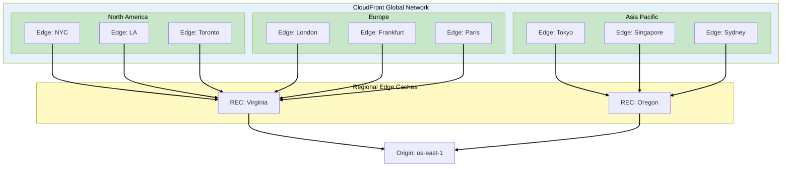

### Edge Locations vs Regional Edge Caches

| Component | Count | Purpose |
|-----------|-------|---------|
| **Edge Locations** | 450+ | Serve content to end users |
| **Regional Edge Caches** | 13 | Middle tier, larger cache |

**Flow:** User → Edge Location → Regional Edge Cache → Origin

> **SAA Exam Tip:** Regional Edge Caches have larger storage and sit between edge locations and origin. They reduce origin load for less popular content.

---

## Step 4: CloudFront Distribution

### What is a Distribution?

A **Distribution** is a CloudFront configuration that defines:
- Origins (where content comes from)
- Cache behaviors (how to handle different paths)
- Settings (SSL, logging, restrictions)

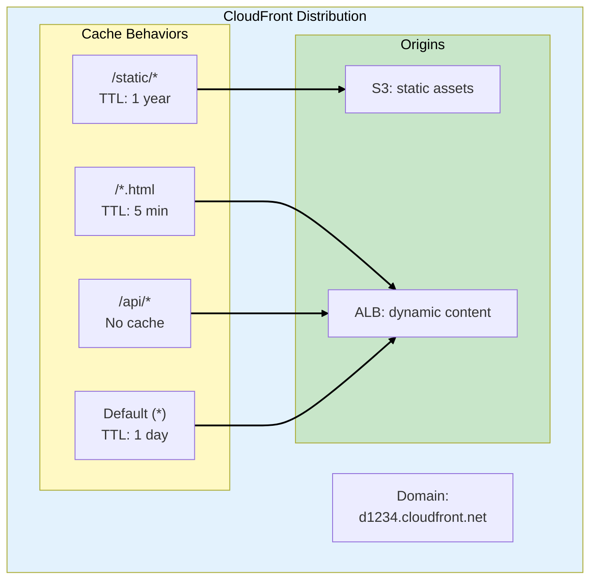

### Origin Types

| Origin Type | Use Case | Example |
|-------------|----------|---------|
| **S3 Bucket** | Static files | Images, CSS, JS |
| **ALB** | Dynamic content | API, HTML pages |
| **Custom Origin** | Any HTTP server | On-premises, other clouds |
| **MediaStore** | Video streaming | Live/on-demand video |

### TechBooks Distribution Design

| Path Pattern | Origin | Cache | WHY |
|--------------|--------|-------|-----|
| `/static/*` | S3 bucket | 1 year | Images, CSS, JS rarely change |
| `/api/*` | ALB | No cache | Dynamic, personalized |
| `/*.html` | ALB | 5 minutes | Semi-dynamic pages |
| `*` (default) | ALB | 1 hour | Fallback |

> **SAA Exam Tip:** Multiple origins and cache behaviors let you optimize caching per content type. Static content should have long TTLs, dynamic content should bypass cache.

---

## Step 5: S3 for Static Assets

### WHY Move Static Assets to S3?

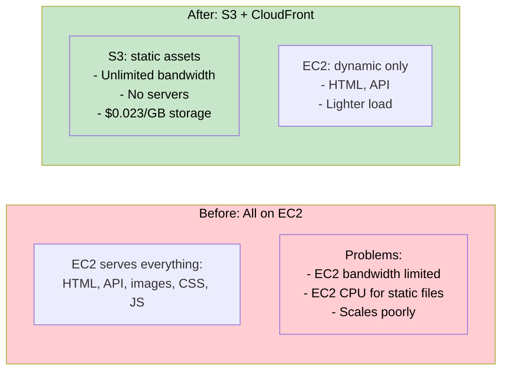

### S3 Bucket Structure

```
techbooks-static/
├── images/
│   ├── books/
│   │   ├── book-001.jpg
│   │   └── book-002.jpg
│   └── ui/
│       ├── logo.png
│       └── icons.svg
├── css/
│   ├── main.css
│   └── vendor.css
├── js/
│   ├── app.js
│   └── vendor.js
└── fonts/
    └── opensans.woff2
```

### S3 vs EC2 for Static Content

| Aspect | EC2 | S3 + CloudFront |
|--------|-----|-----------------|
| **Cost (storage)** | EBS: $0.10/GB | S3: $0.023/GB |
| **Cost (transfer)** | $0.09/GB | CloudFront: $0.085/GB |
| **Scalability** | Limited by instance | Unlimited |
| **Availability** | Depends on instance | 99.99% |
| **Management** | Server maintenance | None |

> **SAA Exam Tip:** S3 + CloudFront is the most cost-effective and scalable solution for static content. Don't serve static files from EC2.

---

## Step 6: Origin Access Control (OAC)

### The Problem: Direct S3 Access

If S3 bucket is public, users can bypass CloudFront:

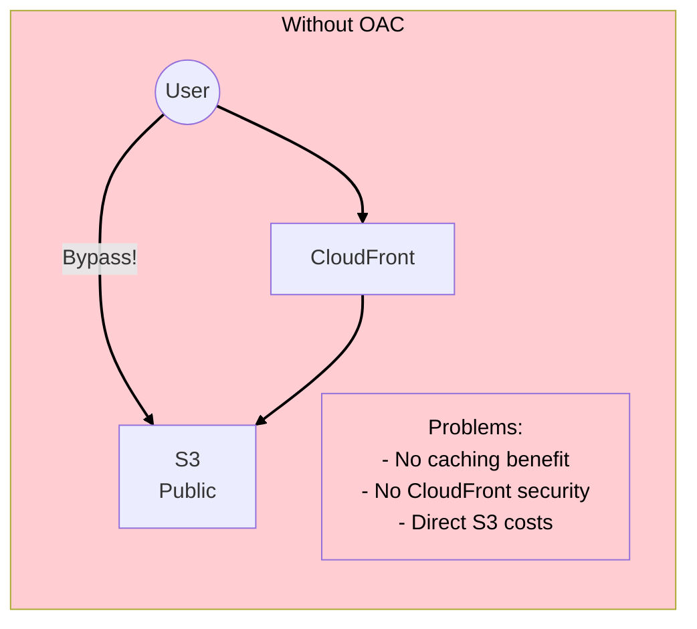

### The Solution: Origin Access Control

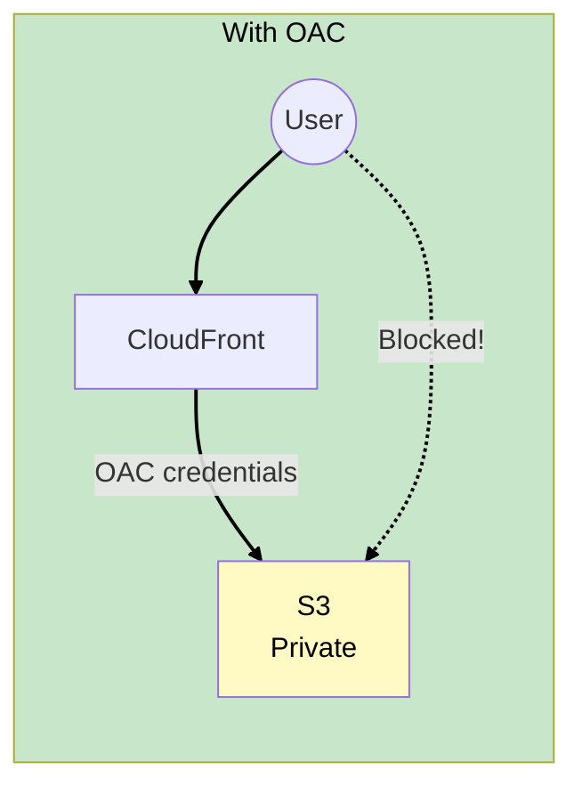

**How it works:**
1. S3 bucket is private (no public access)
2. CloudFront uses OAC to authenticate to S3
3. Users can only access through CloudFront

### S3 Bucket Policy with OAC

```json
{
  "Version": "2012-10-17",
  "Statement": [
    {
      "Effect": "Allow",
      "Principal": {
        "Service": "cloudfront.amazonaws.com"
      },
      "Action": "s3:GetObject",
      "Resource": "arn:aws:s3:::techbooks-static/*",
      "Condition": {
        "StringEquals": {
          "AWS:SourceArn": "arn:aws:cloudfront::123456789:distribution/EDFDVBD6EXAMPLE"
        }
      }
    }
  ]
}
```

> **SAA Exam Tip:** OAC (Origin Access Control) is the modern replacement for OAI (Origin Access Identity). OAC supports more features including SSE-KMS encryption. Always use OAC for new distributions.

---

## Step 7: Cache Behaviors and TTL

### Time To Live (TTL)

**TTL** determines how long CloudFront caches content before checking the origin.

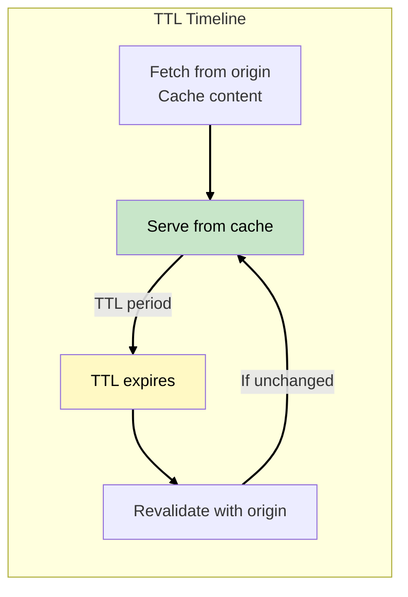

### TTL Settings

| Setting | Description | Default |
|---------|-------------|---------|
| **Minimum TTL** | CloudFront won't cache shorter | 0 seconds |
| **Maximum TTL** | CloudFront won't cache longer | 31536000 (1 year) |
| **Default TTL** | Used if origin doesn't specify | 86400 (1 day) |

### Origin Headers Override CloudFront

If origin sends `Cache-Control` header, it overrides default TTL:

| Origin Header | CloudFront Behavior |
|---------------|---------------------|
| `Cache-Control: max-age=3600` | Cache for 1 hour |
| `Cache-Control: no-cache` | Don't cache |
| `Cache-Control: no-store` | Don't cache |
| No header | Use CloudFront default TTL |

### TechBooks TTL Strategy

| Content | TTL | WHY |
|---------|-----|-----|
| `/static/js/app.v2.js` | 1 year | Versioned filename, immutable |
| `/static/images/*` | 1 year | Rarely change |
| `/products/*.html` | 5 minutes | Product data changes |
| `/api/*` | 0 (no cache) | Personalized, real-time |

**Versioning strategy:** Include hash in filename (`app.a1b2c3.js`). Change hash when content changes. Set TTL to 1 year.

> **SAA Exam Tip:** Long TTLs for static, versioned content. Short or no TTL for dynamic content. Use versioned filenames to force cache invalidation.

---

## Step 8: Cache Invalidation

### WHY Invalidation?

Sometimes you need to clear cached content immediately:
- Fixed a bug in JavaScript
- Updated product images
- Security issue in cached content

### Invalidation Methods

| Method | When to Use | Cost |
|--------|-------------|------|
| **Versioned URLs** | Best practice, avoid invalidation | Free |
| **Invalidation API** | Emergency, unversioned content | First 1000 free/month |
| **Low TTL** | Frequently changing content | Free, but less caching |

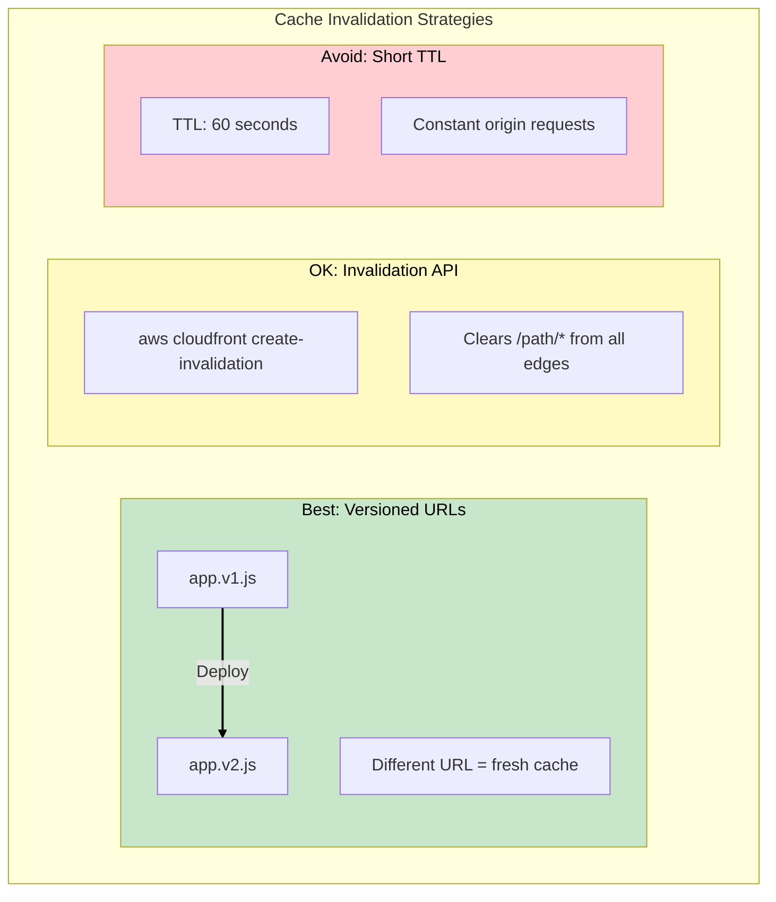

### Invalidation Example

```bash
# Invalidate specific files
aws cloudfront create-invalidation \
    --distribution-id E1234567890 \
    --paths "/static/css/main.css" "/static/js/app.js"

# Invalidate entire directory
aws cloudfront create-invalidation \
    --distribution-id E1234567890 \
    --paths "/static/*"

# Invalidate everything (expensive!)
aws cloudfront create-invalidation \
    --distribution-id E1234567890 \
    --paths "/*"
```

> **SAA Exam Tip:** Invalidation takes time to propagate to all edges (minutes). Versioned URLs provide instant "invalidation" without waiting or paying.

---

## Step 9: Route 53 DNS

### What is Route 53?

**Route 53** is AWS's DNS service with advanced routing capabilities.

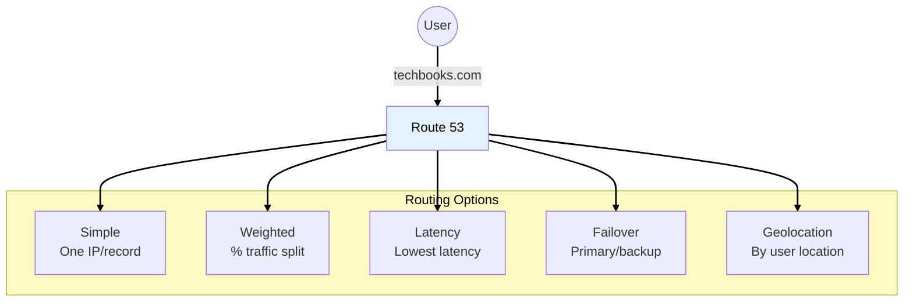

### Routing Policies

| Policy | Use Case | Example |
|--------|----------|---------|
| **Simple** | Single resource | One ALB |
| **Weighted** | A/B testing, migration | 90% v1, 10% v2 |
| **Latency** | Multi-region, lowest latency | Route to nearest region |
| **Failover** | Disaster recovery | Primary + backup |
| **Geolocation** | Compliance, localization | EU users → EU servers |
| **Geoproximity** | Fine-tuned geo control | Bias traffic to regions |
| **Multivalue** | Simple load balancing | Up to 8 healthy records |

### TechBooks DNS Configuration

For now (single region), we use **Simple routing** with an **Alias record**:

```
techbooks.com → CloudFront distribution (d1234.cloudfront.net)
```

**WHY Alias record?**
- Works with zone apex (naked domain: techbooks.com)
- No charge for DNS queries to AWS resources
- Automatically handles IP changes

> **SAA Exam Tip:** Alias records are Route 53-specific. They're free for queries to AWS resources and work with zone apex. Use Alias instead of CNAME for AWS resources.

---

## Step 10: SSL/TLS with ACM

### AWS Certificate Manager (ACM)

**ACM** provides free SSL/TLS certificates for AWS services.

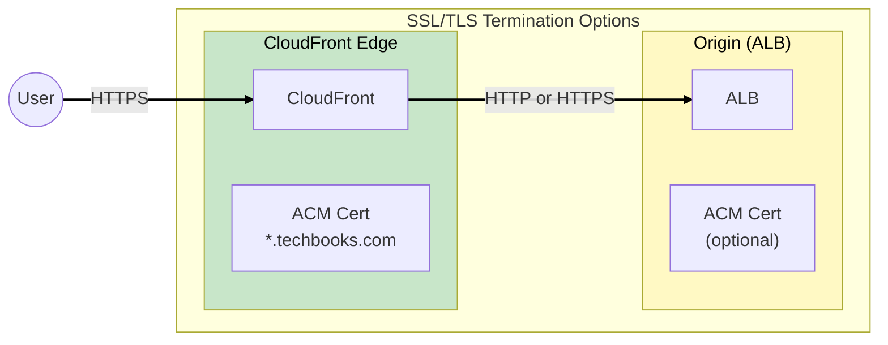

### SSL Configuration Options

| From User to CloudFront | From CloudFront to Origin | Use Case |
|-------------------------|---------------------------|----------|
| HTTPS (required) | HTTP | Common, simple |
| HTTPS | HTTPS (ACM cert) | End-to-end encryption |
| HTTPS | HTTPS (self-signed) | Custom requirements |

### ACM Key Points

| Feature | Detail |
|---------|--------|
| **Cost** | Free for AWS services |
| **Renewal** | Automatic |
| **Validation** | DNS or Email |
| **CloudFront region** | Must be **us-east-1** |
| **ALB region** | Same region as ALB |

> **SAA Exam Tip:** ACM certificates for CloudFront must be created in us-east-1 (N. Virginia). This is a common exam question!

---

## Step 11: CloudFront Security Features

### Additional Security Options

| Feature | What It Does | Use Case |
|---------|--------------|----------|
| **AWS WAF** | Web Application Firewall | Block SQL injection, XSS |
| **Geo Restriction** | Block/allow by country | Compliance, licensing |
| **Signed URLs** | Time-limited, secure URLs | Paid content, downloads |
| **Signed Cookies** | Multiple file access | Premium subscriptions |
| **Field-Level Encryption** | Encrypt specific fields | Credit cards, PII |

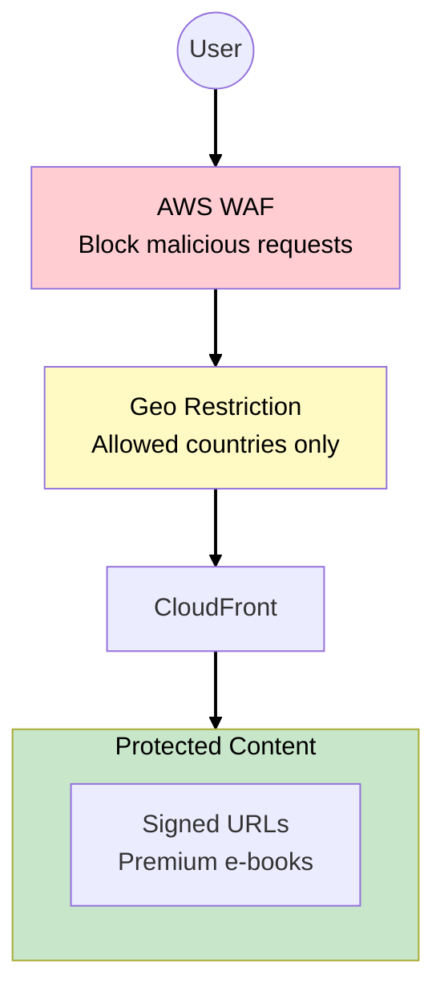

### TechBooks Security Configuration

| Feature | Status | WHY |
|---------|--------|-----|
| AWS WAF | Optional (later) | Cost vs threat level |
| Geo Restriction | None | Selling globally |
| Signed URLs | None (yet) | No premium content yet |
| HTTPS | Required | Security best practice |

> **SAA Exam Tip:** Signed URLs for single files, Signed Cookies for multiple files. WAF integrates with CloudFront for Layer 7 protection.

---

## Phase 5 Complete Architecture

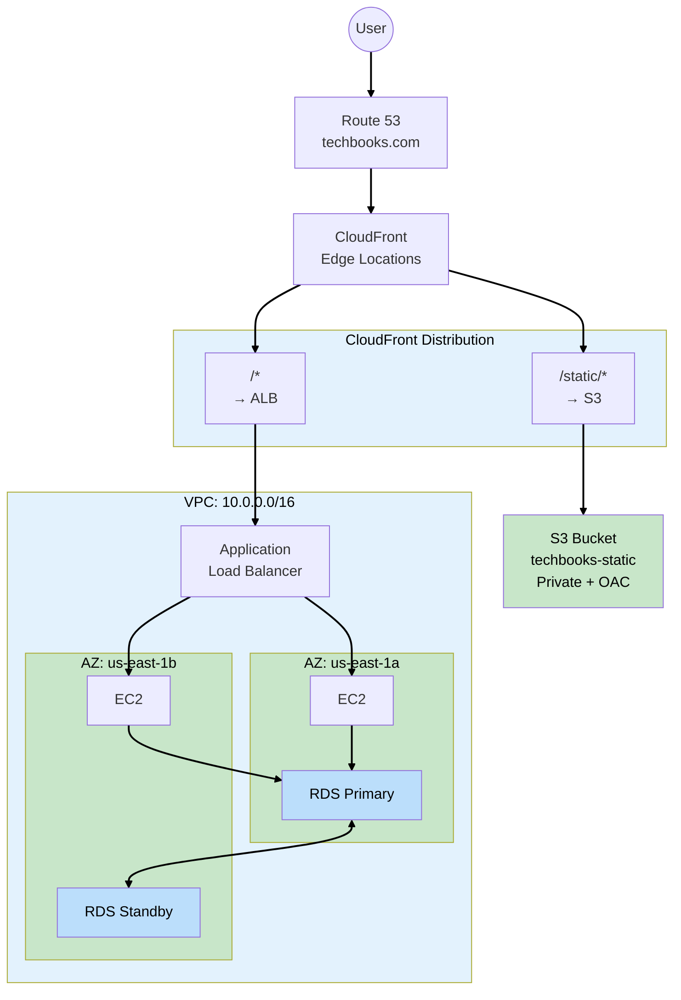

---

## Key SAA Exam Concepts from Phase 5

### Must-Know Topics

1. **CloudFront Basics**
   - 450+ edge locations globally
   - Regional Edge Caches between edges and origin
   - Distribution = configuration for CDN

2. **Origins**
   - S3 bucket (use OAC for private buckets)
   - ALB, EC2, custom HTTP servers
   - Multiple origins with cache behaviors

3. **Caching**
   - TTL controls cache duration
   - Origin headers can override TTL
   - Versioned URLs > invalidation

4. **Security**
   - OAC for private S3 access (not OAI)
   - ACM certificates (us-east-1 for CloudFront!)
   - Signed URLs/Cookies for private content

5. **Route 53**
   - Alias records for AWS resources (free, zone apex)
   - Routing policies: simple, weighted, latency, failover, geolocation

---

## Performance Impact

| Metric | Before (Phase 4) | After (Phase 5) | Improvement |
|--------|------------------|-----------------|-------------|
| Tokyo latency | ~250ms | ~30ms | 88% faster |
| London latency | ~120ms | ~20ms | 83% faster |
| NYC latency | ~20ms | ~10ms | 50% faster |
| Origin load | 100% | ~30% | 70% reduction |
| Static file cost | EC2 transfer | CloudFront | ~40% cheaper |

---

## Cost Analysis

| Component | Phase 4 Cost | Phase 5 Cost | Notes |
|-----------|--------------|--------------|-------|
| EC2 (t3.micro x2) | ~$16/month | ~$16/month | No change |
| RDS Multi-AZ | ~$24/month | ~$24/month | No change |
| ALB | ~$20/month | ~$20/month | No change |
| CloudFront | $0 | ~$15/month | Data transfer |
| S3 | $0 | ~$3/month | Static assets |
| Route 53 | ~$0.50 | ~$0.50 | Hosted zone |
| **Total** | ~$65/month | ~$83/month | +$18 |

**WHY it's worth it:**
- 80%+ latency reduction for global users
- Reduced origin load
- Better user experience globally
- DDoS protection included
- Foundation for global expansion

---

## What's Coming in Phase 6?

**Business trigger:** TechBooks is now profitable! The founder wants to reduce costs and add new features. The development team has grown and wants to ship features faster.

**Next decisions:**
- Serverless components (Lambda) for specific features
- ElastiCache for session/database caching
- Consider S3 for user uploads
- Optimize costs with Reserved Instances

---

## Hands-On Challenge

Before moving to Phase 6:

1. Create an S3 bucket for static assets (`techbooks-static`)
2. Upload your CSS, JS, and images to S3
3. Create a CloudFront distribution with:
   - S3 origin for `/static/*`
   - ALB origin for everything else
   - OAC for S3 access
4. Request an ACM certificate in us-east-1
5. Update Route 53 to point to CloudFront (Alias record)
6. Test from different geographic locations (use VPN or online tools)

**Verification:**
- `techbooks.com/static/logo.png` serves from S3 via CloudFront
- `techbooks.com/` serves from ALB via CloudFront
- Check CloudFront cache hit rate in CloudWatch
- Verify HTTPS works with your domain
